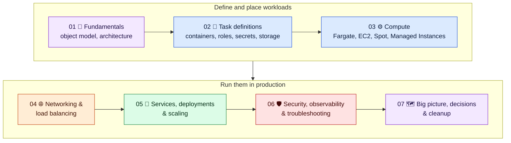
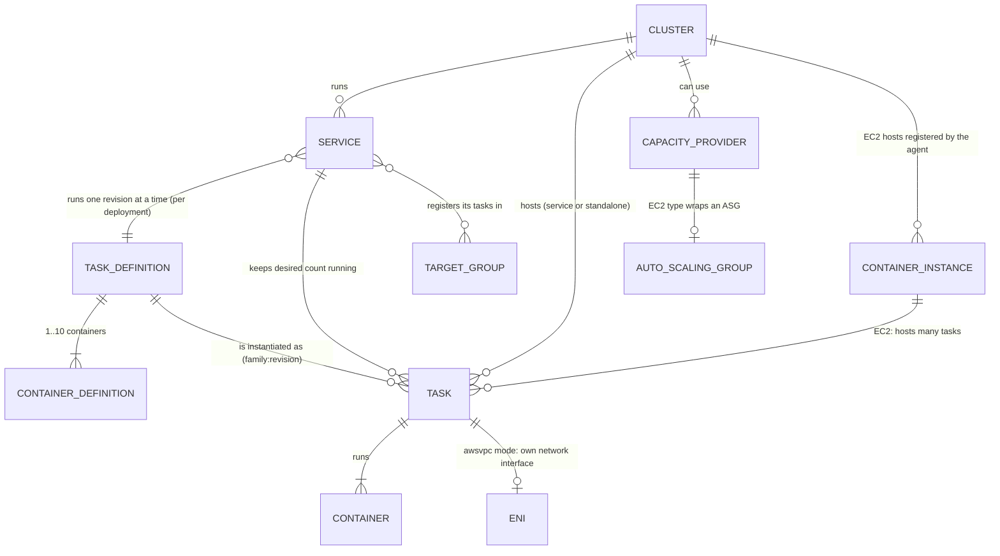
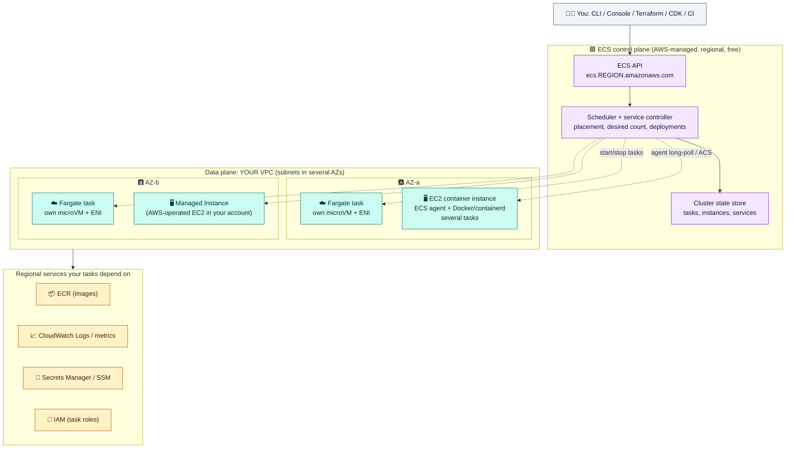
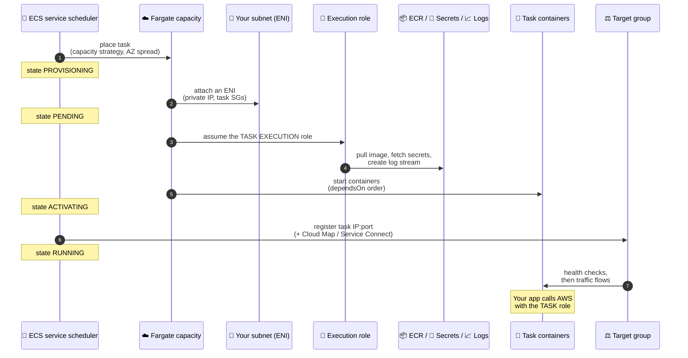

# Module 01 — ECS Fundamentals: Object Model & Architecture

← [All tutorials](../README.md) · **Amazon ECS tutorial**, module 1 of 7

## Tutorial overview

A compact, diagram-driven tutorial on **Amazon Elastic Container Service (ECS)**: how it works internally, how to choose between Fargate, EC2, Spot, and Managed Instances, and everything you need to run production services. That covers task definitions, networking, load balancing, service-to-service traffic, deployments, scaling, security, and troubleshooting. It has 7 modules, each ending with a hands-on AWS CLI lab that builds on the previous one.

**Prerequisites:** basic Docker knowledge, plus the [Networking tutorial](../networking/01-foundations.md) concepts (VPC, subnets, security groups, load balancers). AWS CLI v2 and an admin identity for the labs.

### Course map



| # | Module | You'll learn |
|---|---|---|
| 01 | [Fundamentals](01-ecs-fundamentals.md) | Clusters, task definitions, tasks, services, capacity; control plane vs data plane; how a task starts; ECS vs EKS vs Lambda |
| 02 | [Task definitions](02-task-definitions.md) | Container settings, CPU/memory sizing, **execution role vs task role**, secrets, logging, storage, health checks |
| 03 | [Compute options](03-compute-fargate-ec2-spot.md) | **Fargate, Fargate Spot, EC2 (On-Demand/Spot), ECS Managed Instances**, capacity provider strategies, cluster auto scaling, placement |
| 04 | [Networking & load balancing](04-networking-and-load-balancing.md) | awsvpc/bridge/host modes, private image pulls, **ELB internals (listeners, rules, target groups)**, Service Connect, Cloud Map, VPC Lattice |
| 05 | [Services, deployments & scaling](05-services-deployments-scaling.md) | Task lifecycle, graceful shutdown, rolling + circuit breaker, **blue/green, canary, linear**, service and cluster auto scaling, scheduled tasks |
| 06 | [Security, observability & troubleshooting](06-security-observability-troubleshooting.md) | IAM matrix, ECR, logs/metrics, ECS Exec, reading stopped reasons, cost optimization |
| 07 | [Big picture & decisions](07-big-picture-and-decisions.md) | Reference architecture, decision cheat sheet, production checklist, quick answers, **lab cleanup** |

### Key questions this tutorial answers

1. **Fargate, EC2, Spot, or Managed Instances: which one, and when?** → [Module 03](03-compute-fargate-ec2-spot.md#1-choosing-compute)
2. **What's the difference between the task execution role and the task role?** → [Module 02](02-task-definitions.md#3-iam-roles-the-most-common-confusion)
3. **How does a task get an IP, pull its image, and receive traffic from a load balancer?** → [Module 04](04-networking-and-load-balancing.md)
4. **How do deployments roll out and roll back safely?** → [Module 05](05-services-deployments-scaling.md#3-deployment-strategies)
5. **Why did my task stop, and how do I debug it?** → [Module 06](06-security-observability-troubleshooting.md#4-troubleshooting)

> [!WARNING]
> The labs create billable resources: Fargate tasks, an Application Load Balancer, public IPv4 addresses, and optionally EC2 Spot instances. Expect a few dollars if you finish within a few hours. **Run the cleanup in [Module 07](07-big-picture-and-decisions.md#5-lab-cleanup-run-all-of-it).**

*Reflects AWS as of 2025–2026: ECS Managed Instances (with Spot), built-in blue/green, linear and canary deployments, Express Mode, Fargate Spot on Graviton. Confirm quotas and prices for your Region.*

---

> What the ECS building blocks are, how they relate, where they run, and what happens when a task starts.

---

## 1. What ECS is

**Amazon ECS** is AWS's container orchestrator. You describe *what* to run (a **task definition**) and *how many* (a **service**), and ECS decides *where* to run it and keeps it running. The **control plane is regional, AWS-managed, and free**. You pay only for the compute that runs your containers: **Fargate**, **EC2**, **ECS Managed Instances**, or your own servers (**ECS Anywhere**).

## 2. The object model



| Object | What it is | Analogy |
|---|---|---|
| **Cluster** | A logical grouping of capacity, services, and tasks in one Region | A Kubernetes namespace + its node pools |
| **Task definition** | Versioned (`family:revision`), **immutable** JSON blueprint: images, CPU/memory, ports, roles, network mode, volumes | A Pod spec |
| **Task** | A running instance of a task definition: 1..N containers sharing a network and lifecycle | A Pod |
| **Service** | Keeps *N* tasks running, replaces failed ones, integrates with load balancers, handles deployments and scaling | A Deployment + Service |
| **Capacity provider** | Where tasks get compute: `FARGATE`, `FARGATE_SPOT`, an EC2 Auto Scaling group, or Managed Instances | A node pool |
| **Container instance** | An EC2 instance running the **ECS agent**, registered to a cluster | A node (kubelet) |
| **Standalone task** | A task started with `RunTask` (batch jobs, cron, one-offs). Not restarted if it stops | A Job |

## 3. Architecture: control plane vs data plane



- **The control plane decides; the data plane runs.** If the ECS API has trouble, running tasks keep running. You just can't change things for a while.
- On **Fargate**, every task gets its own isolated microVM and network interface, and there are no hosts for you to see.
- On **EC2**, the **ECS agent** on each instance registers with the cluster and starts and stops containers when the scheduler tells it to.
- Tasks need network paths to **ECR, CloudWatch Logs, and Secrets Manager**. If they can't reach them, tasks fail to start (Module 04).

## 4. What happens when a service starts a task (Fargate)



Task states: `PROVISIONING → PENDING → ACTIVATING → RUNNING → DEACTIVATING → STOPPING → DEPROVISIONING → STOPPED`. Module 05 covers the stopping half.

## 5. ECS vs the alternatives

| | **ECS** | **EKS** | **Lambda** |
|---|---|---|---|
| Model | AWS-native container orchestration | Managed Kubernetes | Functions, event-driven |
| Control plane cost | **Free** | Per cluster-hour | — |
| Learning curve | Low (AWS concepts only) | High (Kubernetes ecosystem) | Lowest |
| Runtime limits | None (long-running services) | None | 15 minutes per invocation |
| Choose when | You want containers on AWS with the least operational overhead | You need the Kubernetes API, its ecosystem, or portability | Short, spiky, event-driven work |

**Fastest path:** **ECS Express Mode** (Nov 2025). You give it a container image and ECS creates the service, an HTTPS load balancer (shared by up to 25 Express services), a URL, and auto scaling with best-practice defaults. All the resources are still visible and editable in your account.

---

## 6. Hands-on: lab setup and your first cluster

The labs use your account's **default VPC** to stay short. Its subnets are public, which is fine for learning. Production uses private subnets (Module 04). No default VPC? Run `aws ec2 create-default-vpc`.

```bash
bash
export AWS_REGION=us-east-1 AWS_DEFAULT_REGION=us-east-1
save() { echo "export $1=\"${!1}\"" >> ~/ecs-lab.env; }   # new shell later? run bash, re-run this line, then: source ~/ecs-lab.env
aws sts get-caller-identity

VPC_ID=$(aws ec2 describe-vpcs --filters Name=isDefault,Values=true --query 'Vpcs[0].VpcId' --output text); save VPC_ID
SUBNETS=$(aws ec2 describe-subnets --filters Name=vpc-id,Values=$VPC_ID Name=default-for-az,Values=true \
  --query 'Subnets[0:2].SubnetId' --output text | tr '\t' ','); save SUBNETS
echo "VPC $VPC_ID  subnets $SUBNETS"

# Cluster with Container Insights (enhanced observability)
aws ecs create-cluster --cluster-name lab-cluster --settings name=containerInsights,value=enhanced \
  --query 'cluster.[clusterName,status]' --output text
aws ecs describe-clusters --clusters lab-cluster --include SETTINGS \
  --query 'clusters[0].{Name:clusterName,Status:status,Providers:capacityProviders,Settings:settings}'
```

✅ The cluster exists, but it has no capacity providers, services, or tasks yet. **A cluster is just a namespace.** Capacity comes from Fargate (always available) or providers you attach in Module 03.

---

## Check yourself

<details><summary>What's the difference between a task definition and a task?</summary>The task definition is the immutable, versioned blueprint. A task is a running instance of one revision.</details>
<details><summary>What does a service add on top of tasks?</summary>It keeps the desired count running, replaces failed tasks, registers tasks with load balancers, and manages deployments and scaling.</details>
<details><summary>Does ECS charge for the control plane?</summary>No, for Fargate and EC2. You pay for compute. Managed Instances adds a management fee on top of EC2.</details>

---
**Next:** [Module 02 — Task Definitions](02-task-definitions.md)
