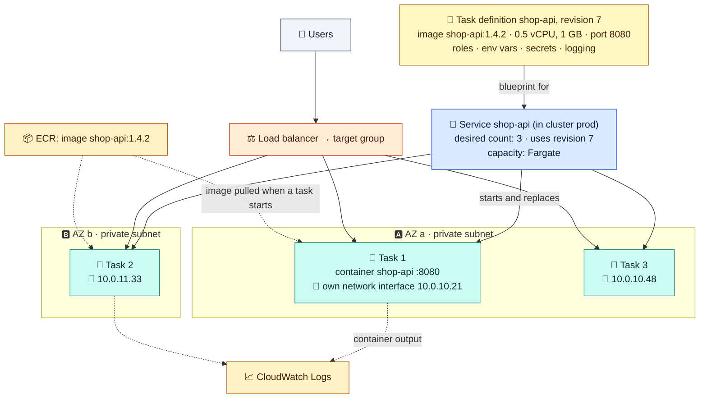

# Module 01 — What ECS Is & Your First Task

← [All tutorials](../README.md) · **ECS tutorial**, module 1 of 6

You've packaged your application as a **container image** (with Docker, for example). Running it in production takes more than `docker run`:

- start it on servers, and **restart it** when it crashes or a server dies;
- run **several copies** across Availability Zones;
- put a **load balancer** in front and register each copy with it;
- roll out **new versions** without downtime, and roll back bad ones;
- **add or remove copies** as traffic changes.

**Amazon ECS (Elastic Container Service)** does all of that. You tell ECS **what** to run and **how many**, and ECS decides **where** and keeps it that way. ECS itself is free. You pay for the compute your containers run on: **AWS Fargate** (AWS runs the servers, you pay per container) or **EC2 instances** in your account.

**What you'll do in this tutorial:**
- **01:** the ECS building blocks, and running your first container
- **02:** the task definition, read field by field
- **03:** running a service behind a load balancer, and how containers get networking
- **04:** choosing compute: Fargate, Fargate Spot, EC2, Managed Instances
- **05:** deployments, rollbacks, and auto scaling
- **06:** operating ECS: security, logs, debugging, costs, the full picture, and cleanup

**Before you start:** basic Docker knowledge, plus a few concepts from the other tutorials: subnets, security groups, and load balancers ([Networking 02–05](../networking/02-subnets-routing-and-internet-access.md)), and IAM roles ([IAM 02](../iam/02-how-services-use-iam.md)). The labs use your account's **default VPC** to keep things short. They cost a few dollars if you finish within a few hours and run the cleanup in Module 06.

---

## 1. The building blocks

You'll meet the objects in the order you use them:

| Object | What it is | Comparable to |
|---|---|---|
| **Container image** | Your packaged app, stored in a **registry**: Amazon **ECR** (AWS's registry), Docker Hub, or ECR Public | A Docker image |
| **Task definition** | The **recipe**: which image(s), how much CPU and memory, which ports, environment variables, IAM roles, logging. Every change creates a new **revision** (`shop-api:1`, `shop-api:2`…) | A `docker-compose.yml` |
| **Task** | One **running copy** of a task definition: one or more containers that start, stop, and share networking together | A running compose project / a Kubernetes pod |
| **Service** | Keeps **N tasks** running from a task definition, replaces failed ones, registers them with a load balancer, and rolls out new revisions | A Kubernetes Deployment |
| **Cluster** | A named group that services and tasks run in, with its capacity settings | A Kubernetes namespace and its nodes |
| **Capacity** | **Where** tasks run: **Fargate** (no servers to manage), **EC2 instances** you run, or **Managed Instances** (EC2 run by AWS) | Nodes |

Here's how they fit together for a typical web API:



**How to read it:** the **task definition** is the blueprint. The **service** uses it to keep 3 **tasks** running, spread across two AZs. Each task gets **its own network interface and private IP** in a subnet (Module 03), pulls its image from **ECR** when it starts, and sends its output to **CloudWatch Logs**. The **load balancer** sends user traffic to whichever tasks are healthy. If a task dies, the service starts a replacement and registers it with the load balancer automatically.

---

## 2. What happens when a task starts

Start one task and watch its states. (You'll run this yourself in Section 4.)

```console
$ aws ecs run-task --cluster lab-cluster --launch-type FARGATE --task-definition lab-web ...
$ aws ecs describe-tasks --cluster lab-cluster --tasks $TASK --query 'tasks[0].lastStatus'
"PROVISIONING"      # ECS found capacity and is creating the task's network interface in your subnet
"PENDING"           # pulling the image, fetching secrets, creating the log stream
"RUNNING"           # containers are up
```

When a task **stops**, it goes through `DEACTIVATING → STOPPING → DEPROVISIONING → STOPPED` (Module 05 explains graceful shutdown). A stopped task records **why** it stopped (`stoppedReason`), which is your first stop when debugging (Module 06).

Behind these states, two different identities are at work. Module 02 explains both:
- **ECS itself** needs permission to pull your image and write logs: the **task execution role**.
- **Your code** inside the container needs its own permissions to call AWS (S3, DynamoDB…): the **task role**.

---

## 3. ECS compared with the alternatives

| | **ECS** | **EKS** (managed Kubernetes) | **Lambda** |
|---|---|---|---|
| You run | Containers | Containers via Kubernetes | Functions |
| Control plane cost | **Free** | Per cluster per hour | — |
| Learning curve | Low: AWS concepts only | High: the Kubernetes ecosystem | Lowest |
| Long-running services | ✅ | ✅ | ❌ (max 15 minutes per run) |
| Choose it when | You want containers on AWS with the least operational work | You need Kubernetes itself (tooling, portability, existing skills) | Short, event-driven work |

**The quickest start:** **ECS Express Mode** (since November 2025) takes just an image and creates the service, an HTTPS load balancer, a public URL, and auto scaling with sensible defaults. You still own and can edit every resource it creates. This tutorial builds those pieces by hand so you understand them.

---

## 4. Try it: your first cluster and task

**4.1 Setup.** Use a bash shell. The lab stores IDs in `~/ecs-lab.env` so you can resume later:

```bash
bash
export AWS_REGION=eu-central-1 AWS_DEFAULT_REGION=eu-central-1
save() { echo "export $1=\"${!1}\"" >> ~/ecs-lab.env; }   # new shell later? run bash, re-run these two lines, then: source ~/ecs-lab.env

VPC_ID=$(aws ec2 describe-vpcs --filters Name=isDefault,Values=true --query 'Vpcs[0].VpcId' --output text); save VPC_ID
SUBNETS=$(aws ec2 describe-subnets --filters Name=vpc-id,Values=$VPC_ID Name=default-for-az,Values=true \
  --query 'Subnets[0:2].SubnetId' --output text | tr '\t' ','); save SUBNETS
echo "default VPC: $VPC_ID   subnets: $SUBNETS"     # no default VPC? run: aws ec2 create-default-vpc
```

**4.2 A cluster.** It's just a named container for now. Container Insights adds detailed metrics (Module 06).

```bash
aws ecs create-cluster --cluster-name lab-cluster --settings name=containerInsights,value=enhanced \
  --query 'cluster.[clusterName,status]' --output text
```

**4.3 The task execution role, plus a log group.** ECS needs permission to pull images and write logs on your behalf:

```bash
cat > /tmp/ecs-tasks-trust.json <<'EOF'
{"Version":"2012-10-17","Statement":[{"Effect":"Allow","Principal":{"Service":"ecs-tasks.amazonaws.com"},"Action":"sts:AssumeRole"}]}
EOF
aws iam create-role --role-name lab-ecsTaskExecutionRole --assume-role-policy-document file:///tmp/ecs-tasks-trust.json >/dev/null
aws iam attach-role-policy --role-name lab-ecsTaskExecutionRole \
  --policy-arn arn:aws:iam::aws:policy/service-role/AmazonECSTaskExecutionRolePolicy
EXEC_ROLE_ARN=$(aws iam get-role --role-name lab-ecsTaskExecutionRole --query Role.Arn --output text); save EXEC_ROLE_ARN
aws logs create-log-group --log-group-name /ecs/lab-web
```

**4.4 A minimal task definition:** one nginx container, the smallest Fargate size (0.25 vCPU, 512 MB):

```bash
cat > /tmp/taskdef-v1.json <<EOF
{
  "family": "lab-web",
  "requiresCompatibilities": ["FARGATE"],
  "networkMode": "awsvpc",
  "cpu": "256", "memory": "512",
  "executionRoleArn": "$EXEC_ROLE_ARN",
  "containerDefinitions": [{
    "name": "web",
    "image": "public.ecr.aws/docker/library/nginx:stable",
    "portMappings": [{ "containerPort": 80 }],
    "logConfiguration": { "logDriver": "awslogs",
      "options": { "awslogs-group": "/ecs/lab-web", "awslogs-region": "$AWS_REGION", "awslogs-stream-prefix": "web" } }
  }]
}
EOF
aws ecs register-task-definition --cli-input-json file:///tmp/taskdef-v1.json --query 'taskDefinition.taskDefinitionArn' --output text
#   ...:task-definition/lab-web:1   <- revision 1
```

**4.5 Run it** as a one-off task with a public IP, reachable only from your own IP address:

```bash
MY_IP=$(curl -s https://checkip.amazonaws.com); save MY_IP
SG_TASK=$(aws ec2 create-security-group --vpc-id $VPC_ID --group-name lab-ecs-task --description "ecs tasks" --query GroupId --output text); save SG_TASK
aws ec2 authorize-security-group-ingress --group-id $SG_TASK --protocol tcp --port 80 --cidr $MY_IP/32

TASK_ARN=$(aws ecs run-task --cluster lab-cluster --launch-type FARGATE --task-definition lab-web \
  --network-configuration "awsvpcConfiguration={subnets=[$SUBNETS],securityGroups=[$SG_TASK],assignPublicIp=ENABLED}" \
  --query 'tasks[0].taskArn' --output text)
for i in 1 2 3 4 5 6; do aws ecs describe-tasks --cluster lab-cluster --tasks $TASK_ARN --query 'tasks[0].lastStatus' --output text; sleep 5; done
aws ecs wait tasks-running --cluster lab-cluster --tasks $TASK_ARN
```

**4.6 Reach it, read its logs, stop it:**

```bash
ENI=$(aws ecs describe-tasks --cluster lab-cluster --tasks $TASK_ARN \
  --query "tasks[0].attachments[0].details[?name=='networkInterfaceId'].value" --output text)
PUB_IP=$(aws ec2 describe-network-interfaces --network-interface-ids $ENI --query 'NetworkInterfaces[0].Association.PublicIp' --output text)
curl -s http://$PUB_IP | grep -i "<title>"       # <title>Welcome to nginx!</title>
aws logs tail /ecs/lab-web --since 5m             # your request appears in nginx's access log
aws ecs stop-task --cluster lab-cluster --task $TASK_ARN --reason "lab done" >/dev/null
```

Notice that the task got **its own network interface** (`ENI`) in a subnet of your VPC, with your security group on it. Module 03 explains why that matters.

---

## Check yourself

<details><summary>What's the difference between a task definition, a task, and a service?</summary>The task definition is the versioned recipe. A task is one running copy of it. A service keeps a chosen number of tasks running and handles load balancing, replacement, and deployments.</details>
<details><summary>Who pays for what in ECS?</summary>The ECS control plane is free. You pay for Fargate (per task) or for the EC2 instances (or Managed Instances) your tasks run on.</details>
<details><summary>A task stopped unexpectedly. Where do you look first?</summary>Its stoppedReason (`aws ecs describe-tasks`), then its logs in CloudWatch Logs.</details>

---
**Next:** [Module 02 — The Task Definition, Field by Field](02-task-definition-field-by-field.md)
