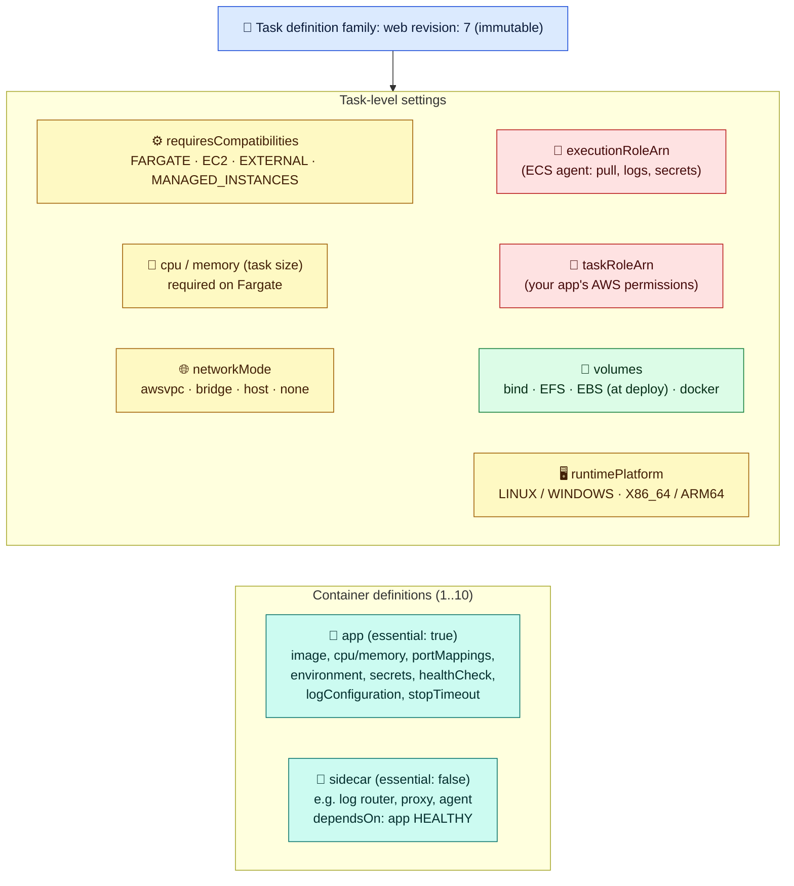
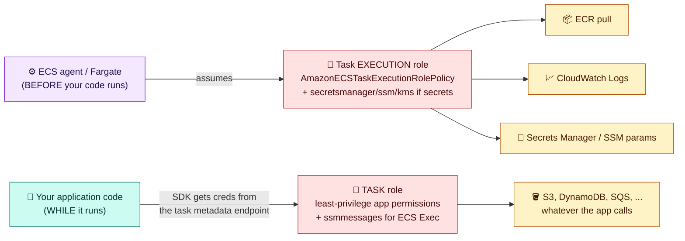

# Module 02 — Task Definitions: Containers, Roles, Secrets, Storage

> The task definition is where most ECS mistakes happen: wrong sizing, the wrong IAM role, secrets that can't be fetched, missing logs. This module covers every field that matters.

---

## 1. Anatomy



## 2. Sizing CPU and memory

- **Task-level** `cpu`/`memory` is the hard envelope for the whole task. It's **required on Fargate** and must be one of the valid combinations below.
- **Container-level** `cpu` is a relative share. `memory` is a **hard limit**: exceed it and the container is killed (`OutOfMemoryError`, exit code 137). `memoryReservation` is a **soft** reservation (EC2 placement).
- `1024` CPU units = 1 vCPU.

| Fargate task CPU | Allowed memory |
|---|---|
| 256 (.25 vCPU) | 512 MiB, 1 GB, 2 GB |
| 512 (.5 vCPU) | 1–4 GB |
| 1024 (1 vCPU) | 2–8 GB |
| 2048 (2 vCPU) | 4–16 GB |
| 4096 (4 vCPU) | 8–30 GB |
| 8192 (8 vCPU) | 16–60 GB (4 GB steps) |
| 16384 (16 vCPU) | 32–120 GB (8 GB steps) |

**Tip:** start small, watch Container Insights, then right-size. **ARM64 (Graviton)** is about 20% cheaper on Fargate if your image is multi-arch.

## 3. IAM roles: the most common confusion



| Role | Assumed by | Used for | If it's wrong |
|---|---|---|---|
| **Task execution role** | ECS agent / Fargate | Pulling images, writing logs, injecting secrets | Task never starts: `CannotPullContainerError`, `ResourceInitializationError` |
| **Task role** | Your containers | Your app's AWS API calls, ECS Exec | App gets `AccessDenied` at runtime |
| **Container instance role** (EC2 only) | The EC2 host's ECS agent | Registering with the cluster | Instance never joins the cluster |
| **Infrastructure role** | ECS | Managing EBS volumes, LB listeners (blue/green), VPC Lattice, Service Connect TLS on your behalf | Those features fail to provision |
| **Service-linked role** `AWSServiceRoleForECS` | ECS | ENIs, load balancer registration | Created automatically |

New to roles and trust policies? See the [IAM tutorial](../iam/01-identities-and-access.md).

> [!IMPORTANT]
> Never give the app permissions through the **execution** role, and never use the **EC2 instance role** for app permissions. Every container on that host could use it. On EC2, block containers from IMDS (`ECS_AWSVPC_BLOCK_IMDS=true`, or IMDS hop limit 1 for bridge mode).

## 4. Configuration and secrets

| Mechanism | Field | Notes |
|---|---|---|
| Plain env vars | `environment` | Visible in the task definition. Never put secrets here |
| Env file from S3 | `environmentFiles` | Bulk config |
| **Secrets** | `secrets: [{name, valueFrom: <Secrets Manager or SSM ARN>}]` | Injected as env vars **at task start** by the execution role. To pick up a rotated secret, you need a new task (redeploy) |
| Specific JSON key | `valueFrom: arn:…:secret:db-creds:password::` | Pulls one key from a JSON secret |

## 5. Logging, health checks, startup order

- **Logs:** `logDriver: awslogs` sends output to CloudWatch Logs (group + stream prefix). Use `mode: non-blocking` so a slow log path can't freeze the app. **FireLens** (a Fluent Bit sidecar) routes logs to S3, OpenSearch, Datadog, and so on.
- **Container `healthCheck`:** `CMD-SHELL` command, `interval` 30 s, `timeout` 5 s, `retries` 3, `startPeriod` for slow boots. An unhealthy **essential** container makes the task stop, and the service replaces it. The tool you call (`curl`, `wget`) must exist in the image.
- **`essential`:** if an essential container exits, the whole task stops. Sidecars are usually `essential: false`.
- **`dependsOn`:** order startup (`START`, `COMPLETE`, `SUCCESS`, `HEALTHY`), e.g. "app waits for the migration container to `SUCCESS`".
- **`stopTimeout`:** time between SIGTERM and SIGKILL (default 30 s, max 120 s on Fargate).
- **Hardening:** `readonlyRootFilesystem: true`, a non-root `user`, `linuxParameters.initProcessEnabled: true` (reaps zombies, helps ECS Exec).

## 6. Storage

| Volume type | Lifetime | Shared between tasks | Works on |
|---|---|---|---|
| Ephemeral task storage | Task | No | Fargate: 20 GiB default, up to 200 GiB |
| Bind mount (task-scoped) | Task | Between containers of one task | All |
| **Amazon EFS** | Persistent | **Yes** (multi-AZ, NFS) | Fargate + EC2 |
| **Amazon EBS** (attached at deployment) | Per task (or snapshot-based) | No (one volume per task) | Fargate + EC2 |
| Docker volume / host path | Host | Tasks on the same host | EC2 only |

Containers are disposable. Keep state in RDS, DynamoDB, S3, EFS, or EBS volumes, not in the container filesystem. See the [Storage tutorial](../storage/01-choosing-storage.md) for choosing between them.

## 7. Revisions

- Every `RegisterTaskDefinition` creates a **new revision** (`web:8`). Revisions are immutable.
- Services point to a specific revision. Deploying means updating the service to a new revision.
- **Deregister** old revisions (they become `INACTIVE`), then **delete** them. Running tasks aren't affected.
- Pin images by **tag + immutable tags in ECR**, or by **digest**. Avoid deploying `:latest`.

---

## 8. Hands-on: roles, a task definition, and a standalone Fargate task

```bash
# Roles
cat > /tmp/ecs-tasks-trust.json <<'EOF'
{"Version":"2012-10-17","Statement":[{"Effect":"Allow","Principal":{"Service":"ecs-tasks.amazonaws.com"},"Action":"sts:AssumeRole"}]}
EOF
aws iam create-role --role-name lab-ecsTaskExecutionRole --assume-role-policy-document file:///tmp/ecs-tasks-trust.json >/dev/null
aws iam attach-role-policy --role-name lab-ecsTaskExecutionRole --policy-arn arn:aws:iam::aws:policy/service-role/AmazonECSTaskExecutionRolePolicy
EXEC_ROLE_ARN=$(aws iam get-role --role-name lab-ecsTaskExecutionRole --query Role.Arn --output text); save EXEC_ROLE_ARN

aws iam create-role --role-name lab-ecsTaskRole --assume-role-policy-document file:///tmp/ecs-tasks-trust.json >/dev/null
cat > /tmp/ecs-exec-policy.json <<'EOF'
{"Version":"2012-10-17","Statement":[{"Effect":"Allow","Action":["ssmmessages:CreateControlChannel","ssmmessages:CreateDataChannel","ssmmessages:OpenControlChannel","ssmmessages:OpenDataChannel"],"Resource":"*"}]}
EOF
aws iam put-role-policy --role-name lab-ecsTaskRole --policy-name ecs-exec --policy-document file:///tmp/ecs-exec-policy.json
TASK_ROLE_ARN=$(aws iam get-role --role-name lab-ecsTaskRole --query Role.Arn --output text); save TASK_ROLE_ARN

aws logs create-log-group --log-group-name /ecs/lab-web

# Task definition (unquoted heredoc, so $VARS expand)
cat > /tmp/taskdef.json <<EOF
{
  "family": "lab-web",
  "requiresCompatibilities": ["FARGATE", "EC2"],
  "networkMode": "awsvpc",
  "cpu": "256",
  "memory": "512",
  "runtimePlatform": { "cpuArchitecture": "X86_64", "operatingSystemFamily": "LINUX" },
  "executionRoleArn": "$EXEC_ROLE_ARN",
  "taskRoleArn": "$TASK_ROLE_ARN",
  "containerDefinitions": [{
    "name": "web",
    "image": "public.ecr.aws/docker/library/nginx:stable",
    "essential": true,
    "portMappings": [{ "containerPort": 80, "protocol": "tcp" }],
    "linuxParameters": { "initProcessEnabled": true },
    "stopTimeout": 20,
    "logConfiguration": {
      "logDriver": "awslogs",
      "options": { "awslogs-group": "/ecs/lab-web", "awslogs-region": "$AWS_REGION",
                   "awslogs-stream-prefix": "web", "mode": "non-blocking" }
    }
  }]
}
EOF
aws ecs register-task-definition --cli-input-json file:///tmp/taskdef.json --query 'taskDefinition.taskDefinitionArn' --output text
```

Run it once as a **standalone Fargate task** with a public IP, and reach it from your laptop:

```bash
MY_IP=$(curl -s https://checkip.amazonaws.com); save MY_IP
SG_TASK=$(aws ec2 create-security-group --vpc-id $VPC_ID --group-name lab-ecs-task --description "ecs tasks" --query GroupId --output text); save SG_TASK
aws ec2 authorize-security-group-ingress --group-id $SG_TASK --protocol tcp --port 80 --cidr $MY_IP/32

TASK_ARN=$(aws ecs run-task --cluster lab-cluster --launch-type FARGATE --task-definition lab-web \
  --network-configuration "awsvpcConfiguration={subnets=[$SUBNETS],securityGroups=[$SG_TASK],assignPublicIp=ENABLED}" \
  --query 'tasks[0].taskArn' --output text)
aws ecs wait tasks-running --cluster lab-cluster --tasks $TASK_ARN

ENI=$(aws ecs describe-tasks --cluster lab-cluster --tasks $TASK_ARN \
  --query "tasks[0].attachments[0].details[?name=='networkInterfaceId'].value" --output text)
PUB_IP=$(aws ec2 describe-network-interfaces --network-interface-ids $ENI --query 'NetworkInterfaces[0].Association.PublicIp' --output text)
curl -s http://$PUB_IP | grep -i title          # "Welcome to nginx!"
aws logs tail /ecs/lab-web --since 5m            # your request in the access log
aws ecs stop-task --cluster lab-cluster --task $TASK_ARN --reason "lab done" >/dev/null
```

✅ Notice that the task got **its own ENI** in your subnet, with the task's security group on it. That's `awsvpc` mode (Module 04).

---

## Check yourself

<details><summary>Your task fails with "ResourceInitializationError: unable to pull secrets". Which role do you fix?</summary>The task execution role (secretsmanager:GetSecretValue / ssm:GetParameters, plus kms:Decrypt). Also check the network path to Secrets Manager.</details>
<details><summary>Your app gets AccessDenied calling S3. Which role?</summary>The task role.</details>
<details><summary>You rotated a secret. Do running tasks see the new value?</summary>No. Secrets are injected at start. Force a new deployment.</details>
<details><summary>A container hits its memory limit. What happens?</summary>It's killed (exit 137, OutOfMemoryError). If it's essential, the task stops and the service replaces it.</details>

---
**Previous:** [Module 01](01-ecs-fundamentals.md) · **Next:** [Module 03 — Compute: Fargate, EC2, Spot](03-compute-fargate-ec2-spot.md)
