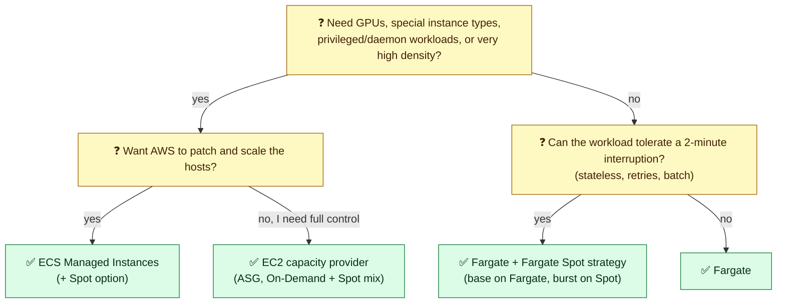
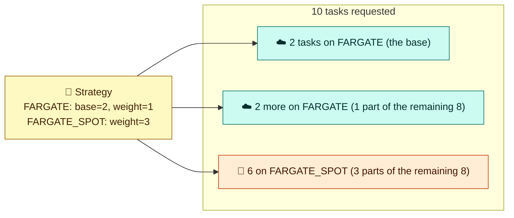
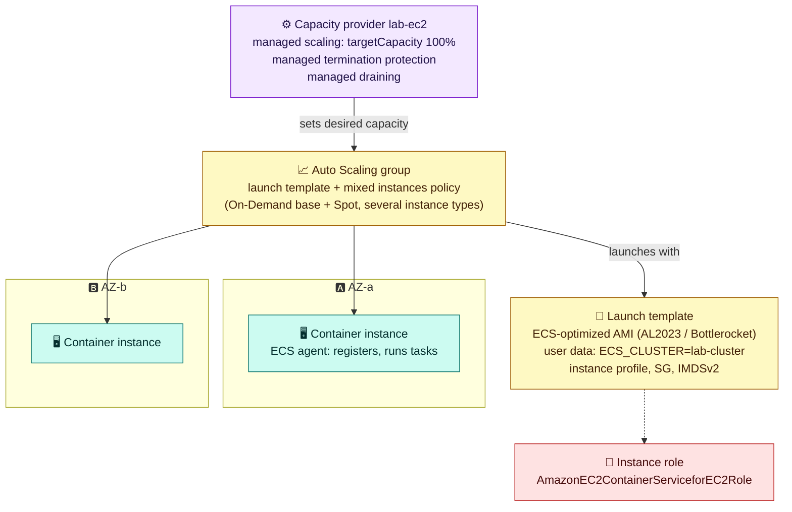

# Module 03 — Compute: Fargate, EC2, Spot & Managed Instances

> Where your tasks actually run, how ECS picks capacity (capacity providers and strategies), how clusters scale, and how to use Spot safely.

---

## 1. Choosing compute

| | **Fargate** | **Fargate Spot** | **EC2 capacity provider** (your ASG) | **ECS Managed Instances** | **ECS Anywhere** |
|---|---|---|---|---|---|
| Who manages hosts | AWS (serverless) | AWS | **You**: AMI, patching, scaling | AWS operates EC2 **in your account** | You (on-prem/other clouds) |
| Isolation | One microVM per task | Same | Shared host (many tasks) | Shared host | Shared host |
| Pricing | Per vCPU-second + GB-second (1-minute minimum) | **Up to ~70% off**, can be interrupted | EC2 price (On-Demand, Savings Plans, **Spot**) | EC2 price + management fee (On-Demand, **Spot**, reservations) | Per instance-hour |
| GPUs, special instance types | ❌ | ❌ | ✅ | ✅ (you pick types/attributes) | ✅ |
| Privileged containers, daemons, host access | ❌ | ❌ | ✅ | Limited (privileged capabilities, no SSH) | ✅ |
| Startup speed | Tens of seconds | Same | Fast if capacity exists. Minutes if the ASG must scale | Like EC2 | — |
| Network modes | awsvpc only | awsvpc | awsvpc, bridge, host | awsvpc, host | bridge, host |
| Ops effort | **Lowest** | Lowest | **Highest** | Low | High |



**Default for most teams:** Fargate for services, Fargate Spot for stateless and batch work, Graviton (ARM64) wherever images allow. Move to EC2 or Managed Instances for GPUs, very large steady fleets (cost), or host-level needs.

---

## 2. Launch type vs capacity provider strategy

There are two ways to say "where":

- **`launchType`** (`FARGATE`, `EC2`, `EXTERNAL`): the legacy, simple way. It has no Spot mixing and no managed scaling.
- **Capacity provider strategy** (recommended): a list of providers with **`base`** and **`weight`**.
  - `base`: the minimum number of tasks placed on that provider first (only one provider can have a base).
  - `weight`: the ratio for the rest.
  - One strategy can mix **either** Fargate providers (`FARGATE` + `FARGATE_SPOT`) **or** EC2 Auto Scaling group providers, not both kinds.
  - A cluster can have a **default strategy**, used when a service or task doesn't set one.



---

## 3. Fargate in depth

- **Isolation:** each task runs in its own Firecracker microVM with its own kernel, ENI, and ephemeral storage. No noisy neighbours share your kernel.
- **Platform version:** Linux `1.4.0` (LATEST). Windows is supported separately. Up to **16 vCPU / 120 GB** per task, and 20–200 GiB ephemeral storage.
- **Not supported:** privileged containers, GPUs, `bridge`/`host` networking, daemon services, SSH to hosts.
- **Faster starts:** smaller images, regional ECR, and **SOCI** indexes (lazy-loading large images).
- Fargate spreads a service's tasks across the AZs of the subnets you provide.

### Fargate Spot
- Spare capacity at a large discount. It can be **reclaimed with a 2-minute warning**: the task gets **SIGTERM**, and an EventBridge task-state event says the Spot task was interrupted.
- Linux only (x86_64 and ARM64), not Windows.
- **Safe pattern:** keep a `base` on `FARGATE` for minimum availability, handle SIGTERM (stop accepting work, drain within `stopTimeout` ≤ 120 s), and keep the ALB deregistration delay shorter than that.
- If Spot capacity is unavailable, tasks stay pending on Spot. They don't fall back automatically, which is another reason for the base on regular Fargate.

---

## 4. EC2 capacity providers in depth



**How managed scaling works:** ECS publishes a metric, **`CapacityProviderReservation`** = capacity needed ÷ capacity running × 100. It scales the ASG to keep that at your `targetCapacity`:
- `100%` = no spare instances (cheapest, slower to start new tasks).
- `< 100%` keeps headroom so new tasks start immediately.

Tasks that don't fit wait in `PROVISIONING` while the ASG scales out, so it can **scale from zero**.

| Setting | Why |
|---|---|
| **Managed termination protection** (+ ASG scale-in protection on) | The ASG never terminates an instance that still runs tasks |
| **Managed draining** | On scale-in or instance refresh, ECS drains tasks off the instance first |
| `ECS_ENABLE_SPOT_INSTANCE_DRAINING=true` (agent config) | On an EC2 Spot interruption notice, the instance goes to `DRAINING`, so services move tasks away |
| **Mixed instances policy** | Several instance types + `price-capacity-optimized` Spot allocation gives fewer interruptions |
| **ENI trunking** (`awsvpcTrunking` account setting) | Raises how many `awsvpc` tasks fit per instance (each task needs an ENI) |

### Task placement (EC2 / Managed Instances)

| Strategy | Effect | Typical use |
|---|---|---|
| `spread` on `attribute:ecs.availability-zone` | Even across AZs | **Always first**, for HA |
| `binpack` on `memory` or `cpu` | Fill instances tightly | Cost |
| `random` | Random | Rarely |

| Constraint | Example |
|---|---|
| `distinctInstance` | One task of this service per instance |
| `memberOf` | `attribute:ecs.instance-type =~ g5.*` (GPU tasks only on GPU nodes) |

A **daemon** service (scheduling strategy `DAEMON`) runs exactly one task per container instance, e.g. log or monitoring agents. It's EC2 only.

## 5. ECS Managed Instances (2025+)

The middle ground. You define **requirements** (vCPU, memory, CPU architecture, optionally instance types or families, GPUs) in a Managed Instances capacity provider. ECS then **provisions, patches, scales, and right-sizes EC2 instances in your account**:
- AWS-managed OS (Bottlerocket-based), **no SSH or SSM access**. Security patching is initiated about **every 14 days**, and you can align it to maintenance windows.
- awsvpc and host networking, GPUs, **Spot** (`capacityOptionType: spot`), and EC2 capacity reservations.
- Price = EC2 instance cost + a management fee. You get EC2 economics and instance choice without running the fleet.

---

## 6. Hands-on: Fargate Spot strategy and an EC2 Spot capacity provider

**A. Mix Fargate and Fargate Spot:**

```bash
aws ecs put-cluster-capacity-providers --cluster lab-cluster \
  --capacity-providers FARGATE FARGATE_SPOT \
  --default-capacity-provider-strategy capacityProvider=FARGATE,base=1,weight=1 capacityProvider=FARGATE_SPOT,weight=3 >/dev/null

# No --launch-type: the cluster's default strategy decides
aws ecs run-task --cluster lab-cluster --task-definition lab-web --count 4 \
  --network-configuration "awsvpcConfiguration={subnets=[$SUBNETS],securityGroups=[$SG_TASK],assignPublicIp=ENABLED}" >/dev/null
sleep 20
aws ecs describe-tasks --cluster lab-cluster --tasks $(aws ecs list-tasks --cluster lab-cluster --query taskArns --output text) \
  --query 'tasks[].[capacityProviderName,availabilityZone,lastStatus]' --output table
#   expect 1 FARGATE (the base), then about 1:3 FARGATE:FARGATE_SPOT for the rest

for t in $(aws ecs list-tasks --cluster lab-cluster --query taskArns --output text); do
  aws ecs stop-task --cluster lab-cluster --task $t >/dev/null; done
```

**B. (Optional, about 15 minutes) EC2 Spot capacity provider that scales from zero:**

```bash
cat > /tmp/ec2-trust.json <<'EOF'
{"Version":"2012-10-17","Statement":[{"Effect":"Allow","Principal":{"Service":"ec2.amazonaws.com"},"Action":"sts:AssumeRole"}]}
EOF
aws iam create-role --role-name lab-ecsInstanceRole --assume-role-policy-document file:///tmp/ec2-trust.json >/dev/null
aws iam attach-role-policy --role-name lab-ecsInstanceRole --policy-arn arn:aws:iam::aws:policy/service-role/AmazonEC2ContainerServiceforEC2Role
aws iam create-instance-profile --instance-profile-name lab-ecsInstanceProfile >/dev/null
aws iam add-role-to-instance-profile --instance-profile-name lab-ecsInstanceProfile --role-name lab-ecsInstanceRole
sleep 15   # IAM propagation

ECS_AMI=$(aws ssm get-parameter --name /aws/service/ecs/optimized-ami/amazon-linux-2023/recommended/image_id --query Parameter.Value --output text)
USERDATA=$(printf '#!/bin/bash\necho ECS_CLUSTER=lab-cluster >> /etc/ecs/ecs.config\necho ECS_ENABLE_SPOT_INSTANCE_DRAINING=true >> /etc/ecs/ecs.config\n' | base64 | tr -d '\n')

aws ec2 create-launch-template --launch-template-name lab-ecs-lt --launch-template-data "{
  \"ImageId\":\"$ECS_AMI\", \"InstanceType\":\"t3.small\",
  \"IamInstanceProfile\":{\"Name\":\"lab-ecsInstanceProfile\"},
  \"SecurityGroupIds\":[\"$SG_TASK\"],
  \"MetadataOptions\":{\"HttpTokens\":\"required\",\"HttpPutResponseHopLimit\":2},
  \"UserData\":\"$USERDATA\"}" >/dev/null

aws autoscaling create-auto-scaling-group --auto-scaling-group-name lab-ecs-asg \
  --min-size 0 --max-size 2 --desired-capacity 0 --vpc-zone-identifier "$SUBNETS" \
  --new-instances-protected-from-scale-in \
  --mixed-instances-policy "{\"LaunchTemplate\":{\"LaunchTemplateSpecification\":{\"LaunchTemplateName\":\"lab-ecs-lt\",\"Version\":\"\$Latest\"},
     \"Overrides\":[{\"InstanceType\":\"t3.small\"},{\"InstanceType\":\"t3a.small\"}]},
     \"InstancesDistribution\":{\"OnDemandBaseCapacity\":0,\"OnDemandPercentageAboveBaseCapacity\":0,\"SpotAllocationStrategy\":\"price-capacity-optimized\"}}"
ASG_ARN=$(aws autoscaling describe-auto-scaling-groups --auto-scaling-group-names lab-ecs-asg \
  --query 'AutoScalingGroups[0].AutoScalingGroupARN' --output text); save ASG_ARN

aws ecs create-capacity-provider --name lab-ec2-spot \
  --auto-scaling-group-provider "autoScalingGroupArn=$ASG_ARN,managedScaling={status=ENABLED,targetCapacity=100},managedTerminationProtection=ENABLED,managedDraining=ENABLED" >/dev/null
aws ecs put-cluster-capacity-providers --cluster lab-cluster --capacity-providers FARGATE FARGATE_SPOT lab-ec2-spot \
  --default-capacity-provider-strategy capacityProvider=FARGATE,base=1,weight=1 capacityProvider=FARGATE_SPOT,weight=3 >/dev/null

# Ask for a task on EC2. Nothing runs yet, so the task waits in PROVISIONING while the ASG scales 0 -> 1
EC2_TASK=$(aws ecs run-task --cluster lab-cluster --task-definition lab-web \
  --capacity-provider-strategy capacityProvider=lab-ec2-spot,weight=1 \
  --network-configuration "awsvpcConfiguration={subnets=[$SUBNETS],securityGroups=[$SG_TASK]}" \
  --query 'tasks[0].taskArn' --output text)
watch_task() { aws ecs describe-tasks --cluster lab-cluster --tasks $EC2_TASK --query 'tasks[0].lastStatus' --output text; }
for i in $(seq 1 20); do echo "$(date +%T) task=$(watch_task) asg=$(aws autoscaling describe-auto-scaling-groups --auto-scaling-group-names lab-ecs-asg --query 'AutoScalingGroups[0].DesiredCapacity' --output text)"; [ "$(watch_task)" = RUNNING ] && break; sleep 30; done
aws ecs list-container-instances --cluster lab-cluster --query containerInstanceArns
aws ecs stop-task --cluster lab-cluster --task $EC2_TASK >/dev/null   # afterwards the ASG scales back toward 0
```

✅ You've seen **cluster auto scaling from zero**: a pending task led to `CapacityProviderReservation` > 100%, which raised the ASG desired capacity. The instance's agent then registered, and the task was placed on it.

---

## Check yourself

<details><summary>You need GPUs but don't want to manage AMIs and patching. Which compute?</summary>ECS Managed Instances (GPU instance types in its capacity provider).</details>
<details><summary>Strategy FARGATE base=2 weight=1, FARGATE_SPOT weight=1. How are 6 tasks placed?</summary>2 on FARGATE (the base), then the remaining 4 split 1:1, so 4 FARGATE and 2 FARGATE_SPOT in total.</details>
<details><summary>Why keep a base on FARGATE when using FARGATE_SPOT?</summary>Spot can be reclaimed, or be unavailable with no automatic fallback. The base guarantees minimum capacity.</details>
<details><summary>What prevents the ASG from terminating an instance that still runs tasks?</summary>Managed termination protection (with ASG scale-in protection) plus managed draining.</details>

---
**Previous:** [Module 02](02-task-definitions.md) · **Next:** [Module 04 — Networking & Load Balancing](04-networking-and-load-balancing.md)
