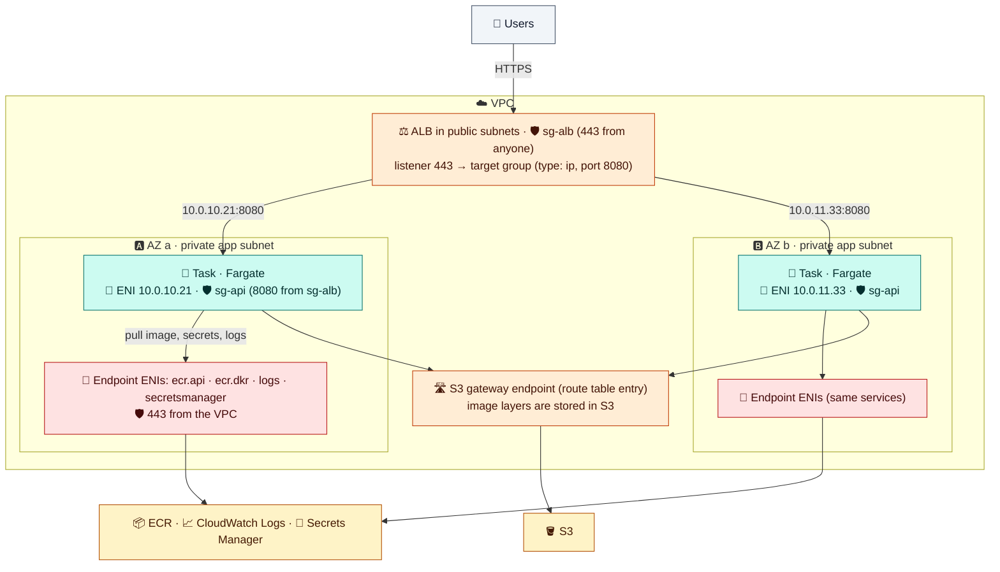

# Module 03 — Services, Networking & Load Balancing

← [All tutorials](../README.md) · **ECS tutorial**, module 3 of 6

A single task (Module 01) runs until it stops, and nobody restarts it. Real applications run as a **service**: ECS keeps a chosen number of tasks running, spreads them across AZs, replaces any that fail, and registers them with a load balancer. This module explains services, how tasks get their network, and how traffic reaches them.

---

## 1. What a service does

```bash
aws ecs create-service --cluster lab-cluster --service-name web \
  --task-definition lab-web \
  --desired-count 2 \
  --launch-type FARGATE \
  --network-configuration "awsvpcConfiguration={subnets=[subnet-a,subnet-b],securityGroups=[sg-web],assignPublicIp=DISABLED}" \
  --load-balancers targetGroupArn=arn:…,containerName=web,containerPort=80 \
  --health-check-grace-period-seconds 30 \
  --deployment-configuration "deploymentCircuitBreaker={enable=true,rollback=true}"
```

| Option | Meaning |
|---|---|
| `--task-definition` | A family (uses its latest revision) or a specific `family:revision` |
| `--desired-count` | How many tasks to keep running |
| `--launch-type` | Where tasks run. Module 04 replaces this with a *capacity provider strategy* |
| `--network-configuration` | The subnets (one per AZ) and security groups each task's network interface gets, and whether it gets a public IP |
| `--load-balancers` | The target group to register tasks in, and which container and port receive traffic (Section 3) |
| `--health-check-grace-period-seconds` | How long to ignore failing load balancer health checks while a new task boots (Section 3) |
| `--deployment-configuration` | How new versions roll out, and automatic rollback (Module 05) |

Once created, the service's **scheduler** keeps doing three things:
- **Keep the desired count.** If a task stops (crash, failed health check, lost capacity), it starts a replacement.
- **Spread across AZs.** Tasks are balanced across the subnets (AZs) you gave it, and rebalanced if an AZ recovers from a problem.
- **Keep the load balancer in sync.** New tasks are registered in the target group, and stopping tasks are drained and removed first.

You change a service with `update-service`: a new revision, a new desired count, new settings. ECS performs the change as a **deployment** (Module 05).

---

## 2. How tasks get networking

With `networkMode: awsvpc` (always on Fargate), **each task gets its own network interface (ENI)** in one of the service's subnets. It's the same kind of network interface an EC2 instance has ([Networking 04](../networking/04-ec2-instances-in-your-vpc.md)). So every task:
- has **its own private IP** (there are no port conflicts, and every task can listen on 8080);
- has **its own security groups**, which come from the service's network configuration (one security group per service is a good habit);
- is reached by the load balancer **at its IP**, so the target group's **target type must be `ip`**;
- uses **one IP from the subnet**. Size subnets for your peak task count plus the extra tasks that run during deployments.

On EC2 capacity (Module 04), two older modes also exist: **`bridge`** (containers behind the host's IP, with random host ports mapped by the load balancer) and **`host`** (containers use the host's network directly). With both, all tasks on a host share the **instance's** security group. Prefer `awsvpc` unless you need very high task density.

### Reaching ECR and AWS services from private subnets

Before your code even starts, the task must **pull its image**, **fetch its secrets**, and **open its log stream**. In production, tasks run in **private subnets**, so they need a path to those AWS services:

| Path | How | Trade-off |
|---|---|---|
| Public subnet + `assignPublicIp=ENABLED` (Fargate) | The task gets a public IP | Simplest, used in these labs. Tasks are directly addressable, and public IPv4 costs money |
| Private subnet + **NAT gateway** | Route `0.0.0.0/0 → nat` | Any destination works, but **every image pull pays NAT per-GB** |
| Private subnet + **VPC endpoints** | Interface endpoints `ecr.api`, `ecr.dkr`, `logs`, `secretsmanager` (plus `ssmmessages` for ECS Exec) and the **S3 gateway endpoint** | No internet path at all, and cheaper at volume. Images from Docker Hub still need NAT or an ECR pull-through cache |

([How endpoints work: Networking 06](../networking/06-private-access-and-dns.md).) The production layout looks like this:



**How to read it:** users reach only the load balancer. The load balancer sends requests to each task's **own IP**. The tasks reach ECR, Logs, and Secrets Manager through **endpoint network interfaces in their own subnet**, and image layers through the **S3 gateway endpoint**. No task has a public IP, and nothing goes through the internet.

---

## 3. Connecting a service to a load balancer

You already know the parts of a load balancer: listener, rules, target group, health checks ([Networking 05](../networking/05-load-balancers.md)). With ECS, a few things work differently:

- **ECS manages the targets.** You never register tasks yourself. The service adds each new task's `IP:port` to the target group and removes stopping tasks.
- **`containerName` + `containerPort`** in the service tell ECS which container and port in the task receive traffic.
- **`healthCheckGracePeriodSeconds`**: for this many seconds after a task starts, ECS ignores failing load balancer health checks. Set it longer than your app takes to boot, or ECS kills tasks that are still starting.
- **Deregistration delay** (a target group setting): how long a stopping task keeps serving requests already in flight. Keep it **shorter than the task's `stopTimeout`** (Module 05).
- **Security group chain:** the load balancer's security group allows clients, and the task security group allows the app port **only from the load balancer's security group**.
- One service can feed **several target groups**, for example a public ALB and an internal NLB.

## 4. Services calling each other

| Option | How it works | Choose it when |
|---|---|---|
| **Service Connect** | ECS adds a small proxy container to each task. Clients call short names like `http://orders:8080`, and the proxy load-balances, retries, applies timeouts, and publishes per-service metrics. Uses an AWS Cloud Map namespace | **Default for ECS-to-ECS calls** |
| **Service discovery** (Cloud Map DNS) | Each task is registered as a DNS record in a private namespace, e.g. `orders.shop.local` | Simple DNS lookups, or clients outside ECS |
| **Internal load balancer** | An ALB with scheme *internal* | You need HTTP routing rules, or callers on EC2 or Lambda |
| **VPC Lattice** | Services register with Lattice, which handles routing and IAM-based authorization across VPCs and accounts | Many VPCs or accounts |

---

## 5. Try it: a service behind a load balancer

```bash
SG_ALB=$(aws ec2 create-security-group --vpc-id $VPC_ID --group-name lab-ecs-alb --description "ecs alb" --query GroupId --output text); save SG_ALB
aws ec2 authorize-security-group-ingress --group-id $SG_ALB  --protocol tcp --port 80 --cidr 0.0.0.0/0
aws ec2 authorize-security-group-ingress --group-id $SG_TASK --protocol tcp --port 80 --source-group $SG_ALB    # tasks: only from the ALB

ALB_ARN=$(aws elbv2 create-load-balancer --name lab-ecs-alb --subnets $(echo $SUBNETS | tr ',' ' ') \
  --security-groups $SG_ALB --query 'LoadBalancers[0].LoadBalancerArn' --output text); save ALB_ARN
TG_ARN=$(aws elbv2 create-target-group --name lab-ecs-tg --protocol HTTP --port 80 --vpc-id $VPC_ID \
  --target-type ip --health-check-path / --query 'TargetGroups[0].TargetGroupArn' --output text); save TG_ARN
aws elbv2 modify-target-group-attributes --target-group-arn $TG_ARN --attributes Key=deregistration_delay.timeout_seconds,Value=15 >/dev/null
LISTENER_ARN=$(aws elbv2 create-listener --load-balancer-arn $ALB_ARN --protocol HTTP --port 80 \
  --default-actions Type=forward,TargetGroupArn=$TG_ARN --query 'Listeners[0].ListenerArn' --output text); save LISTENER_ARN

aws ecs create-service --cluster lab-cluster --service-name web --task-definition lab-web --desired-count 2 \
  --launch-type FARGATE \
  --network-configuration "awsvpcConfiguration={subnets=[$SUBNETS],securityGroups=[$SG_TASK],assignPublicIp=ENABLED}" \
  --load-balancers targetGroupArn=$TG_ARN,containerName=web,containerPort=80 \
  --health-check-grace-period-seconds 30 \
  --deployment-configuration "deploymentCircuitBreaker={enable=true,rollback=true},maximumPercent=200,minimumHealthyPercent=100" \
  --enable-execute-command >/dev/null
aws ecs wait services-stable --cluster lab-cluster --services web

ALB_DNS=$(aws elbv2 describe-load-balancers --load-balancer-arns $ALB_ARN --query 'LoadBalancers[0].DNSName' --output text); save ALB_DNS
curl -s http://$ALB_DNS | grep -i "<title>"
aws elbv2 describe-target-health --target-group-arn $TG_ARN \
  --query 'TargetHealthDescriptions[].[Target.Id,Target.AvailabilityZone,TargetHealth.State]' --output table
#   the targets are task IP addresses, one per AZ
```

**Watch self-healing.** Stop one task, and the service replaces it and updates the load balancer:

```bash
aws ecs stop-task --cluster lab-cluster --reason "chaos test" \
  --task $(aws ecs list-tasks --cluster lab-cluster --service-name web --query 'taskArns[0]' --output text) >/dev/null
sleep 60
aws ecs describe-services --cluster lab-cluster --services web --query 'services[0].events[0:4].message'
#   "...has stopped 1 running tasks..."  "...has started 1 tasks..."  "...registered 1 targets in target-group..."
```

---

## Check yourself

<details><summary>Which target type does a load balancer need for Fargate tasks, and why?</summary>`ip`. In awsvpc mode, each task has its own IP address, and that's what gets registered.</details>
<details><summary>Tasks in a private subnet with no NAT fail with CannotPullContainerError. What's missing?</summary>The ecr.api and ecr.dkr interface endpoints plus the S3 gateway endpoint (and logs). Or a NAT gateway.</details>
<details><summary>New tasks keep getting killed by the service before they finish starting. Which setting?</summary>healthCheckGracePeriodSeconds is too short for the app's boot time (or the health check path or port is wrong).</details>
<details><summary>What's the default choice for one ECS service calling another?</summary>Service Connect.</details>

---
**Previous:** [Module 02](02-task-definition-field-by-field.md) · **Next:** [Module 04 — Compute: Fargate, EC2, Spot & Managed Instances](04-compute-fargate-ec2-spot.md)
