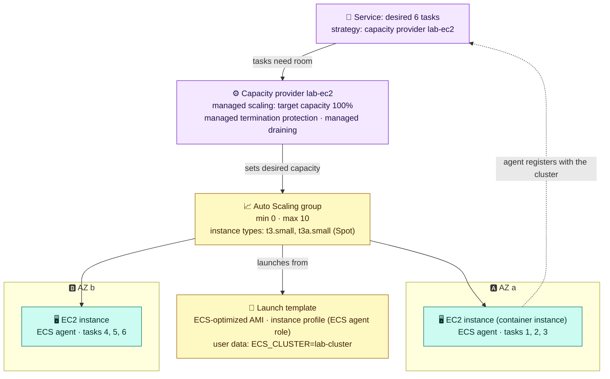

# Module 04 — Compute: Fargate, Fargate Spot, EC2 & Managed Instances

← [All tutorials](../README.md) · **ECS tutorial**, module 4 of 6

So far your tasks ran on **Fargate**: you never saw a server. That's the simplest option, but not the only one. Where tasks run affects **cost**, **what you can do** (GPUs, privileged containers), and **how much you manage**. This module explains the options, how ECS chooses between them (**capacity providers**), and how to use cheap **Spot** capacity safely.

---

## 1. The options

| | **Fargate** | **Fargate Spot** | **EC2 capacity provider** | **ECS Managed Instances** |
|---|---|---|---|---|
| Who runs the servers | AWS. You never see them | AWS | **You**: an Auto Scaling group of EC2 instances with the ECS agent | **AWS**, but the EC2 instances are in your account |
| Isolation | Each task runs in its own small virtual machine | Same | Many tasks share an instance | Many tasks share an instance |
| Price | Per vCPU and GB per second (1-minute minimum) | **Up to ~70% cheaper**, but AWS can reclaim it with **2 minutes' warning** | EC2 prices (On-Demand, Savings Plans, or **Spot**) | EC2 prices + a management fee (On-Demand, **Spot**, or reservations) |
| GPUs, specific instance types | ❌ | ❌ | ✅ | ✅ |
| Privileged containers, one-task-per-host agents | ❌ | ❌ | ✅ | Partly |
| You manage | Nothing | Nothing | AMIs, patching, scaling settings | Instance requirements only |
| Best for | **Most services** | Stateless services and batch jobs that tolerate restarts | GPU or special hardware, very large steady fleets, full host control | GPU or EC2 economics without running the fleet |

**A good default:** Fargate for services, with part of their tasks on **Fargate Spot**, and **ARM64 (Graviton)** images wherever possible. Reach for EC2 or Managed Instances when you need GPUs, specific hardware, or host-level access, or when a large steady fleet makes EC2 pricing worth the extra work. (**ECS Anywhere** also exists, for running tasks on your own servers.)

---

## 2. Capacity providers and strategies

A **capacity provider** is a named source of capacity: the built-in `FARGATE` and `FARGATE_SPOT`, or one you create for an EC2 Auto Scaling group or for Managed Instances. A **capacity provider strategy** tells ECS how to split a service's tasks between providers, using two numbers:

- **`base`**: this many tasks go to the provider **first** (only one provider in a strategy can have a base);
- **`weight`**: the **ratio** for all tasks beyond the base.

**Worked example.** Strategy `FARGATE base=2 weight=1` + `FARGATE_SPOT weight=3`, for a service with 10 tasks:
1. The first **2** go to `FARGATE` (the base).
2. The remaining **8** are split 1:3: **2** more on `FARGATE`, **6** on `FARGATE_SPOT`.

Result: 4 regular and 6 Spot tasks. If all Spot capacity disappeared, the service would still have 4 tasks.

Rules:
- Use a strategy **instead of** `--launch-type`. A cluster can have a **default strategy** for services and tasks that don't set one.
- A strategy mixes either Fargate providers **or** EC2 Auto Scaling group providers, **not both**.

---

## 3. Fargate and Fargate Spot

**Fargate** runs each task in its own small, isolated virtual machine sized to the task definition (up to 16 vCPU and 120 GB). There's no host to patch or scale. Its limits: `awsvpc` networking only, no GPUs, no privileged containers, and no "one per host" daemon tasks. Large images start slower, so keep images small and in the same Region.

**Fargate Spot** runs on spare AWS capacity. When AWS needs it back:
1. The task gets **SIGTERM**, and an EventBridge event announces the interruption. **Two minutes later** the task is stopped.
2. The service starts a replacement, on whatever capacity its strategy allows.

To use it safely:
- Keep a **base on `FARGATE`**. Spot can also be unavailable for a while, and tasks waiting for Spot don't automatically fall back.
- Handle **SIGTERM** in your app: stop accepting new work, finish what's in flight, exit. Keep `stopTimeout` (≤ 120 s) and the load balancer's deregistration delay within the two-minute window.
- Use it for **stateless** services and **retryable** batch work. Fargate Spot supports Linux on x86 and ARM, not Windows.

---

## 4. EC2 capacity providers

Here **you** provide the servers: an **Auto Scaling group (ASG)** of EC2 instances that run the **ECS agent**, a small program that registers the instance with your cluster and starts the containers ECS assigns to it. The capacity provider connects the ASG to ECS, so ECS can scale it.



**How to read it.** The service asks for 6 tasks on the `lab-ec2` provider. The capacity provider compares the capacity those tasks need with the instances that exist, and changes the ASG's desired count. The ASG launches instances from the launch template. Their user data names the cluster, so each instance's ECS agent **registers** with it, and ECS places tasks on it. Tasks that don't fit anywhere wait in `PROVISIONING` until new instances arrive, so the group can even **scale up from zero**.

| Setting | What it does |
|---|---|
| **Managed scaling**, `targetCapacity` | ECS keeps the ASG at a size where this percentage of it is used. `100` = no spare instances (cheapest). `80` = keep headroom so new tasks start instantly |
| **Managed termination protection** | The ASG never terminates an instance that still runs tasks |
| **Managed draining** | Before an instance is removed, ECS moves its tasks elsewhere |
| `ECS_ENABLE_SPOT_INSTANCE_DRAINING=true` (agent setting) | When an EC2 Spot instance receives its interruption notice, ECS drains it right away |
| Several instance types + `price-capacity-optimized` Spot allocation | Fewer Spot interruptions |
| **ENI trunking** (account setting) | Raises how many `awsvpc` tasks fit on one instance (each task needs a network interface) |

**Placing tasks on instances** (EC2 and Managed Instances only):

| You want | Setting |
|---|---|
| Spread across AZs (do this first, for availability) | Strategy `spread` on `attribute:ecs.availability-zone` |
| Pack tasks tightly to use fewer instances (cost) | Strategy `binpack` on `memory` |
| At most one task of this service per instance | Constraint `distinctInstance` |
| Only on certain instances (e.g. GPU) | Constraint `memberOf` with an expression like `attribute:ecs.instance-type =~ g5.*` |
| Exactly one task on **every** instance (log or monitoring agents) | A **daemon** service |

## 5. ECS Managed Instances

**Managed Instances** (since September 2025) sit between Fargate and EC2. In a Managed Instances capacity provider you describe **requirements**: vCPU, memory, architecture, and optionally instance families or GPUs. ECS then **launches, patches, scales, and right-sizes** EC2 instances in your account. Security patches roll out about every 14 days, within maintenance windows you can set. The instances run an AWS-managed OS with **no SSH access**. You get EC2 choice and pricing (including **Spot** and reservations) plus a management fee, without operating the fleet yourself.

---

## 6. Try it

**A. Split tasks between Fargate and Fargate Spot:**

```bash
aws ecs put-cluster-capacity-providers --cluster lab-cluster --capacity-providers FARGATE FARGATE_SPOT \
  --default-capacity-provider-strategy capacityProvider=FARGATE,base=1,weight=1 capacityProvider=FARGATE_SPOT,weight=3 >/dev/null

aws ecs run-task --cluster lab-cluster --task-definition lab-web --count 4 \
  --network-configuration "awsvpcConfiguration={subnets=[$SUBNETS],securityGroups=[$SG_TASK],assignPublicIp=ENABLED}" >/dev/null
sleep 20
aws ecs describe-tasks --cluster lab-cluster --tasks $(aws ecs list-tasks --cluster lab-cluster --query taskArns --output text) \
  --query 'tasks[?group==`family:lab-web`].[capacityProviderName,availabilityZone,lastStatus]' --output table
#   expect: 1 FARGATE (the base), and about 1:3 FARGATE:FARGATE_SPOT for the remaining 3

for t in $(aws ecs list-tasks --cluster lab-cluster --query 'taskArns' --output text); do
  g=$(aws ecs describe-tasks --cluster lab-cluster --tasks $t --query 'tasks[0].group' --output text)
  [ "$g" = "family:lab-web" ] && aws ecs stop-task --cluster lab-cluster --task $t >/dev/null; done
```

(The `group` filter skips the tasks of the `web` service from Module 03, whose group is `service:web`.)

**B. (Optional, about 15 minutes) An EC2 Spot capacity provider that scales from zero:**

```bash
cat > /tmp/ec2-trust.json <<'EOF'
{"Version":"2012-10-17","Statement":[{"Effect":"Allow","Principal":{"Service":"ec2.amazonaws.com"},"Action":"sts:AssumeRole"}]}
EOF
aws iam create-role --role-name lab-ecsInstanceRole --assume-role-policy-document file:///tmp/ec2-trust.json >/dev/null
aws iam attach-role-policy --role-name lab-ecsInstanceRole --policy-arn arn:aws:iam::aws:policy/service-role/AmazonEC2ContainerServiceforEC2Role
aws iam create-instance-profile --instance-profile-name lab-ecsInstanceProfile >/dev/null
aws iam add-role-to-instance-profile --instance-profile-name lab-ecsInstanceProfile --role-name lab-ecsInstanceRole
sleep 15

ECS_AMI=$(aws ssm get-parameter --name /aws/service/ecs/optimized-ami/amazon-linux-2023/recommended/image_id --query Parameter.Value --output text)
USERDATA=$(printf '#!/bin/bash\necho ECS_CLUSTER=lab-cluster >> /etc/ecs/ecs.config\necho ECS_ENABLE_SPOT_INSTANCE_DRAINING=true >> /etc/ecs/ecs.config\n' | base64 | tr -d '\n')
aws ec2 create-launch-template --launch-template-name lab-ecs-lt --launch-template-data "{
  \"ImageId\":\"$ECS_AMI\", \"InstanceType\":\"t3.small\",
  \"IamInstanceProfile\":{\"Name\":\"lab-ecsInstanceProfile\"}, \"SecurityGroupIds\":[\"$SG_TASK\"],
  \"MetadataOptions\":{\"HttpTokens\":\"required\",\"HttpPutResponseHopLimit\":2}, \"UserData\":\"$USERDATA\"}" >/dev/null

aws autoscaling create-auto-scaling-group --auto-scaling-group-name lab-ecs-asg \
  --min-size 0 --max-size 2 --desired-capacity 0 --vpc-zone-identifier "$SUBNETS" --new-instances-protected-from-scale-in \
  --mixed-instances-policy "{\"LaunchTemplate\":{\"LaunchTemplateSpecification\":{\"LaunchTemplateName\":\"lab-ecs-lt\",\"Version\":\"\$Latest\"},
     \"Overrides\":[{\"InstanceType\":\"t3.small\"},{\"InstanceType\":\"t3a.small\"}]},
     \"InstancesDistribution\":{\"OnDemandBaseCapacity\":0,\"OnDemandPercentageAboveBaseCapacity\":0,\"SpotAllocationStrategy\":\"price-capacity-optimized\"}}"
ASG_ARN=$(aws autoscaling describe-auto-scaling-groups --auto-scaling-group-names lab-ecs-asg --query 'AutoScalingGroups[0].AutoScalingGroupARN' --output text); save ASG_ARN

aws ecs create-capacity-provider --name lab-ec2-spot \
  --auto-scaling-group-provider "autoScalingGroupArn=$ASG_ARN,managedScaling={status=ENABLED,targetCapacity=100},managedTerminationProtection=ENABLED,managedDraining=ENABLED" >/dev/null
aws ecs put-cluster-capacity-providers --cluster lab-cluster --capacity-providers FARGATE FARGATE_SPOT lab-ec2-spot \
  --default-capacity-provider-strategy capacityProvider=FARGATE,base=1,weight=1 capacityProvider=FARGATE_SPOT,weight=3 >/dev/null

# Ask for a task on EC2. No instance exists yet, so watch the task wait while the ASG scales from 0 to 1
EC2_TASK=$(aws ecs run-task --cluster lab-cluster --task-definition lab-web --capacity-provider-strategy capacityProvider=lab-ec2-spot,weight=1 \
  --network-configuration "awsvpcConfiguration={subnets=[$SUBNETS],securityGroups=[$SG_TASK]}" --query 'tasks[0].taskArn' --output text)
for i in $(seq 1 20); do
  st=$(aws ecs describe-tasks --cluster lab-cluster --tasks $EC2_TASK --query 'tasks[0].lastStatus' --output text)
  dc=$(aws autoscaling describe-auto-scaling-groups --auto-scaling-group-names lab-ecs-asg --query 'AutoScalingGroups[0].DesiredCapacity' --output text)
  echo "$(date +%T)  task=$st  asg-desired=$dc"; [ "$st" = RUNNING ] && break; sleep 30
done
aws ecs stop-task --cluster lab-cluster --task $EC2_TASK >/dev/null     # the ASG scales back toward 0 afterwards
```

---

## Check yourself

<details><summary>Strategy FARGATE base=2 weight=1 and FARGATE_SPOT weight=1. How are 6 tasks placed?</summary>2 on FARGATE (the base), then the remaining 4 split 1:1. That's 4 FARGATE and 2 FARGATE_SPOT in total.</details>
<details><summary>Why keep a base on FARGATE when you use FARGATE_SPOT?</summary>Spot can be reclaimed, or be unavailable, and tasks don't fall back automatically. The base guarantees a minimum.</details>
<details><summary>You need GPUs but don't want to manage AMIs and patching. Which option?</summary>ECS Managed Instances, with GPU instance types in its capacity provider.</details>
<details><summary>What stops the Auto Scaling group from terminating an instance that still runs tasks?</summary>Managed termination protection (with scale-in protection on the ASG), plus managed draining.</details>

---
**Previous:** [Module 03](03-services-networking-and-load-balancing.md) · **Next:** [Module 05 — Deployments & Scaling](05-deployments-and-scaling.md)
