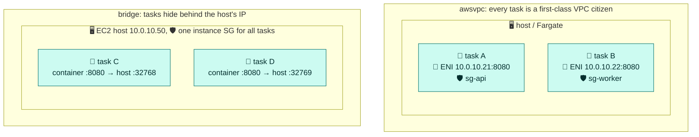
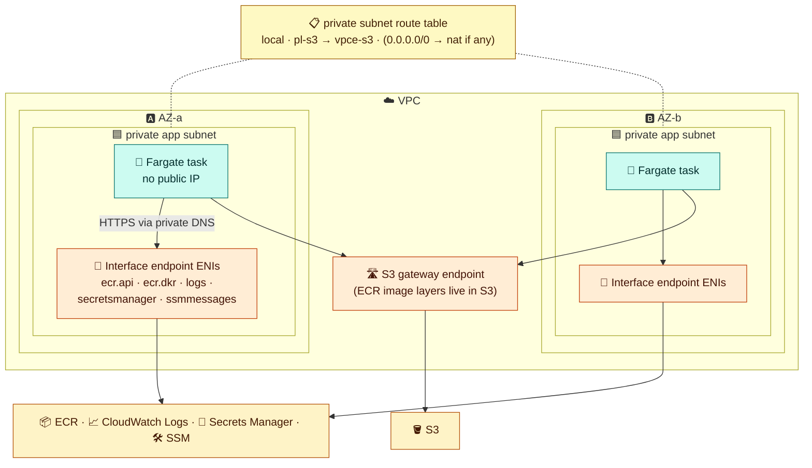
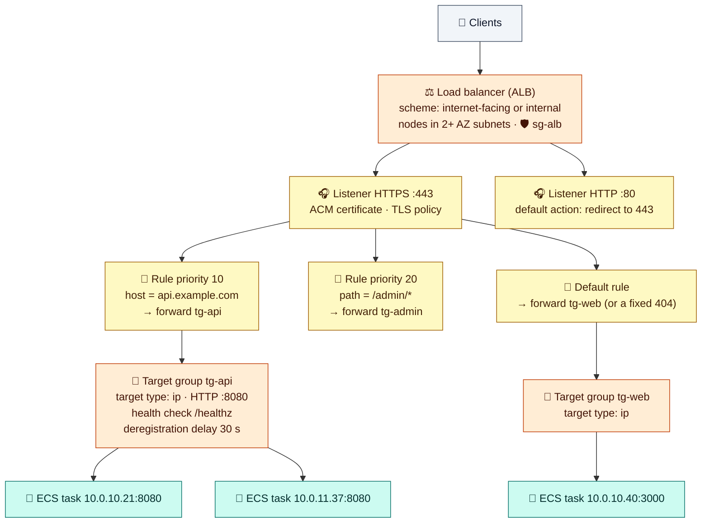
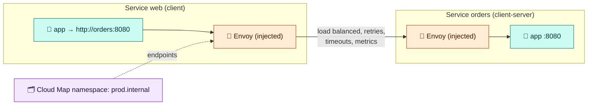

# Module 04 — Networking & Load Balancing for ECS

> How tasks get IPs, how they reach ECR and AWS APIs from private subnets, how Elastic Load Balancing works internally, and how services talk to each other.

---

## 1. Network modes

| Mode | What the task gets | Port conflicts | Security group applies to | Works on |
|---|---|---|---|---|
| **awsvpc** (recommended) | **Its own ENI and private IP** in your subnet | None (each task has its own IP) | **The task** | Fargate (only option), EC2, Managed Instances |
| **bridge** | Docker bridge network, ports mapped to the host (**dynamic host ports** with an ALB) | Host ports must be unique | The **instance** (shared by all tasks) | EC2 |
| **host** | The host's network stack directly | Only one task per port per host | The instance | EC2, Managed Instances |
| **none** | No external networking | — | — | EC2 |



**awsvpc consequences:**
- Each task consumes **one IP** from the subnet. Size your subnets for peak task count, and add 100% headroom for deployments.
- On EC2, each task consumes an **ENI**, and instances have ENI limits. Enable **ENI trunking** for density.
- Fargate tasks can get a **public IP** (`assignPublicIp=ENABLED`) in public subnets. EC2-hosted awsvpc tasks can't.
- Load balancer target type must be **`ip`**.

## 2. Reaching ECR and AWS APIs from private subnets

A task must pull its image, fetch secrets, and ship logs **before** your code runs. With no path to those endpoints, the task fails with `CannotPullContainerError` or `ResourceInitializationError`.



| Option | Pros | Cons |
|---|---|---|
| Public subnet + public IP (Fargate) | Simplest, used in these labs | Tasks are directly addressable. Every public IPv4 is billed |
| Private subnet + **NAT gateway** | Simple, and allows any internet egress | NAT per-GB charges for **every image pull** |
| Private subnet + **VPC endpoints** | No internet path, cheaper at volume, most secure | Per-endpoint per-AZ hourly cost. Third-party registries still need NAT (or an ECR pull-through cache) |

**Required endpoints for Fargate:** `ecr.api`, `ecr.dkr`, **S3 gateway**, `logs`. Add `secretsmanager` / `ssm` if you use secrets and `ssmmessages` for ECS Exec. Everything else depends on what your app calls.

---

## 3. Elastic Load Balancing internals

**Elastic Load Balancing (ELB)** is the service. It has four load balancer types: **ALB** (L7 HTTP/gRPC), **NLB** (L4 TCP/UDP/TLS, static IPs), **GWLB** (L3 appliance insertion), and the legacy **Classic LB** (don't use it for new work). ALB and NLB share the same object model:



| Object | What it holds | ECS-specific notes |
|---|---|---|
| **Load balancer** | Scheme, subnets (nodes per AZ), SGs | Internet-facing in public subnets, targets in private subnets |
| **Listener** | Port + protocol (+ certificate for HTTPS/TLS) | Terminate TLS here with **ACM** certificates |
| **Rule** (ALB) | Conditions (host, path, header, method, source IP) → actions (forward, redirect, fixed response, authenticate) | Route many services through one ALB: cheaper |
| **Target group** | Target type, protocol/port, **health check**, deregistration delay, stickiness, algorithm | **ECS registers and deregisters tasks automatically.** Use type `ip` for awsvpc, `instance` for bridge/host |
| **Target** | IP:port or instance:port | In bridge mode the port is the dynamic host port |

**Wiring a service to a load balancer:**
- The service sets `loadBalancers: [{targetGroupArn, containerName, containerPort}]`. A service can feed **several target groups** (e.g. an internal and an external LB).
- **`healthCheckGracePeriodSeconds`**: ECS ignores LB health checks for this long after a task starts. Set it longer than your app's boot time.
- SG chain: `sg-alb` (443 from clients) → task SG (app port **from sg-alb**).
- **Deregistration delay** (connection draining) should be shorter than the task's `stopTimeout`, so in-flight requests finish before SIGKILL.
- ALB vs NLB for ECS: ALB for HTTP routing, auth, and WAF. NLB for TCP/UDP, static IPs, or extreme throughput, or as a PrivateLink provider.

---

## 4. Service-to-service communication

| Option | How it works | Best for |
|---|---|---|
| **Service Connect** | ECS injects an **Envoy proxy** sidecar. Clients call a short name like `http://orders:8080`. Includes load balancing, retries, timeouts, outlier detection, per-service metrics, optional TLS. Uses an AWS Cloud Map namespace | **Default choice** for ECS-to-ECS traffic |
| **Service discovery** (Cloud Map DNS) | Tasks registered as DNS A (awsvpc) or SRV (bridge) records in a private namespace | Simple DNS-based discovery, non-ECS clients |
| **Internal ALB** | A normal internal load balancer | HTTP routing rules, mixed compute (EC2 + ECS + Lambda) |
| **VPC Lattice** | ECS services register directly with Lattice target groups. Cross-VPC/account with IAM auth policies | Many VPCs/accounts, zero-trust service networks |



---

## 5. Hands-on: an ALB in front of an ECS service

```bash
SG_ALB=$(aws ec2 create-security-group --vpc-id $VPC_ID --group-name lab-ecs-alb --description "ecs alb" --query GroupId --output text); save SG_ALB
aws ec2 authorize-security-group-ingress --group-id $SG_ALB  --protocol tcp --port 80 --cidr 0.0.0.0/0
aws ec2 authorize-security-group-ingress --group-id $SG_TASK --protocol tcp --port 80 --source-group $SG_ALB   # tasks only from the ALB

ALB_ARN=$(aws elbv2 create-load-balancer --name lab-ecs-alb --subnets $(echo $SUBNETS | tr ',' ' ') \
  --security-groups $SG_ALB --query 'LoadBalancers[0].LoadBalancerArn' --output text); save ALB_ARN
TG_ARN=$(aws elbv2 create-target-group --name lab-ecs-tg --protocol HTTP --port 80 --vpc-id $VPC_ID \
  --target-type ip --health-check-path / --query 'TargetGroups[0].TargetGroupArn' --output text); save TG_ARN
aws elbv2 modify-target-group-attributes --target-group-arn $TG_ARN --attributes Key=deregistration_delay.timeout_seconds,Value=15 >/dev/null
LISTENER_ARN=$(aws elbv2 create-listener --load-balancer-arn $ALB_ARN --protocol HTTP --port 80 \
  --default-actions Type=forward,TargetGroupArn=$TG_ARN --query 'Listeners[0].ListenerArn' --output text); save LISTENER_ARN

aws ecs create-service --cluster lab-cluster --service-name web --task-definition lab-web --desired-count 2 \
  --capacity-provider-strategy capacityProvider=FARGATE,base=1,weight=1 capacityProvider=FARGATE_SPOT,weight=1 \
  --network-configuration "awsvpcConfiguration={subnets=[$SUBNETS],securityGroups=[$SG_TASK],assignPublicIp=ENABLED}" \
  --load-balancers targetGroupArn=$TG_ARN,containerName=web,containerPort=80 \
  --health-check-grace-period-seconds 30 \
  --deployment-configuration "deploymentCircuitBreaker={enable=true,rollback=true},maximumPercent=200,minimumHealthyPercent=100" \
  --enable-execute-command >/dev/null
aws ecs wait services-stable --cluster lab-cluster --services web

ALB_DNS=$(aws elbv2 describe-load-balancers --load-balancer-arns $ALB_ARN --query 'LoadBalancers[0].DNSName' --output text); save ALB_DNS
curl -s http://$ALB_DNS | grep -i title
aws elbv2 describe-target-health --target-group-arn $TG_ARN \
  --query 'TargetHealthDescriptions[].[Target.Id,Target.AvailabilityZone,TargetHealth.State]' --output table
```

✅ The target IDs are **task IPs** (target type `ip`). Stop one task and watch ECS deregister it, start a replacement, and register the new IP:

```bash
aws ecs stop-task --cluster lab-cluster --task $(aws ecs list-tasks --cluster lab-cluster --service-name web --query 'taskArns[0]' --output text) >/dev/null
sleep 60; aws ecs describe-services --cluster lab-cluster --services web --query 'services[0].events[0:4].message'
```

---

## Check yourself

<details><summary>Fargate task in a private subnet, no NAT: CannotPullContainerError. What's missing?</summary>The ecr.api and ecr.dkr interface endpoints, plus the S3 gateway endpoint (and logs). Also check private DNS and that the endpoint SG allows 443.</details>
<details><summary>Which target type for awsvpc tasks?</summary>ip.</details>
<details><summary>Listener vs rule vs target group?</summary>The listener accepts port+protocol (and TLS). Rules match conditions and choose actions. The target group holds the targets plus health check and draining settings.</details>
<details><summary>How should ECS services call each other?</summary>Service Connect by default. Use Cloud Map DNS, an internal ALB, or VPC Lattice for the cases in the table.</details>

---
**Previous:** [Module 03](03-compute-fargate-ec2-spot.md) · **Next:** [Module 05 — Services, Deployments & Scaling](05-services-deployments-scaling.md)
