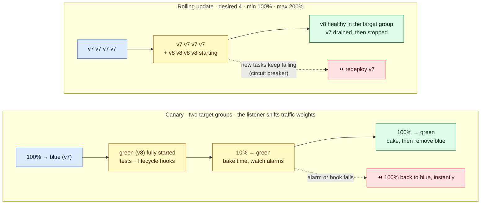

# Module 05 — Deployments & Scaling

← [All tutorials](../README.md) · **ECS tutorial**, module 5 of 6

Your service runs. Now you need to **ship new versions** without dropping requests, **roll back automatically** when a version is broken, and **scale** with traffic. This module covers all three, starting with the one thing every deployment depends on: how a task stops.

---

## 1. How a task stops gracefully

Every deployment, scale-in, or Spot interruption stops tasks. When ECS stops a task behind a load balancer:

1. **Deregister.** ECS removes the task from the target group. The load balancer stops sending **new** requests but lets requests in flight finish, for up to the **deregistration delay** (a target group setting, e.g. 30 s).
2. **SIGTERM.** Every container receives the SIGTERM signal. Your app should stop accepting work, finish what it's doing, close connections, and exit.
3. **SIGKILL.** Any container still running after **`stopTimeout`** seconds (task definition, default 30, max 120 on Fargate) is killed.

Keep **deregistration delay < stopTimeout**, and make sure your app actually receives SIGTERM. A shell script as PID 1 often swallows it. Use the exec form of `CMD`, or `initProcessEnabled` (Module 02).

---

## 2. Deployments

You trigger a deployment by changing the service, usually by pointing it at a new task definition revision:

```bash
aws ecs register-task-definition --cli-input-json file://taskdef-v8.json      # creates shop-api:8
aws ecs update-service --cluster prod --service shop-api --task-definition shop-api:8
```

How ECS replaces the old tasks with new ones depends on the service's **deployment strategy**.

### Rolling update (the default)

ECS starts new tasks and stops old ones, within two limits:
- **`minimumHealthyPercent`**: never fewer than this many healthy tasks (as % of desired);
- **`maximumPercent`**: never more than this many tasks in total.

With `desired = 4`, `min = 100%`, `max = 200%`:

| Step | Old tasks (v7) | New tasks (v8) | What happens |
|---|---|---|---|
| 1 | 4 running | — | Deployment starts |
| 2 | 4 running | 4 starting | Up to 8 tasks allowed, and never below 4 healthy |
| 3 | 4 running | 4 healthy in the target group | New tasks pass the health checks |
| 4 | 4 draining → stopped | 4 running | Old tasks deregistered, SIGTERM, stopped |

Other settings trade speed for capacity: `50% / 100%` needs no extra capacity but halves it during the deploy, and `100% / 125%` replaces one task at a time.

**Deployment circuit breaker: always turn it on.** If new tasks keep failing to start or failing health checks, ECS marks the deployment **FAILED** and, with `rollback=true`, **automatically redeploys the last working revision**. Without it, a broken image retries forever. You can also attach **CloudWatch alarms** (e.g. HTTP 5xx rate) so that a deployment rolls back when the alarm fires.

### Blue/green, canary, and linear (built in since 2025)

A rolling update mixes old and new tasks, and rolling back means starting the old ones again. With the built-in **blue/green** family of strategies, ECS starts the **complete** new version ("green") **next to** the old one ("blue"), behind a second target group, and moves **traffic** rather than tasks:

| Strategy | Traffic shift | Rollback |
|---|---|---|
| **Blue/green** | 0% → **100%** at once, after optional tests on a test listener | Instant: traffic goes back to blue, which is still running during the **bake time** |
| **Canary** | A small share first (e.g. **10%**), wait, then the rest | Same |
| **Linear** | Equal steps (e.g. **+20% every 3 minutes**) | Same |

All three support **lifecycle hooks** (a Lambda function that runs checks at each stage and can fail the deployment) and **alarm-based rollback**. They need an ALB (or NLB for blue/green), or Service Connect, with **two target groups**.



**How to read it:** in the **rolling** row, *tasks* are replaced, so a rollback means starting old tasks again. In the **canary** row, both versions run side by side and only the *traffic split* changes, so a rollback is a traffic switch that takes seconds. Blue/green is the same picture with a single 0% → 100% step. Linear uses several equal steps.

---

## 3. Auto scaling: two layers

**Layer 1: how many tasks.** **Service auto scaling** changes the service's desired count between a **minimum** and a **maximum**:

| Policy | How it works | Example |
|---|---|---|
| **Target tracking** (start here) | Keep a metric near a target value | Average CPU at 60%, or **requests per task** at 500 |
| Step scaling | Add or remove a set number of tasks when an alarm fires | Queue length > 1,000 → +5 tasks |
| Scheduled | Change min/max at set times | Scale dev to 0 at night |
| Predictive | Learns daily or weekly patterns and scales ahead of them | Morning traffic peaks |

For web APIs, **requests per target** (`ALBRequestCountPerTarget`) usually reacts better than CPU. For queue workers, scale on backlog per task.

**Layer 2: room for the tasks.** On Fargate there's nothing to do: AWS provides the capacity. On EC2, the capacity provider's managed scaling grows the Auto Scaling group (Module 04). If tasks scale out but sit in `PROVISIONING`, it's layer 2 that's stuck (for example, the ASG reached its maximum size).

**Jobs that aren't services:** for cron jobs and batch work, use **EventBridge Scheduler** to call `RunTask` on a schedule, ideally on Fargate Spot.

---

## 4. Try it: deploy, break, roll back, scale

**4.1 A good deployment.** Change the image tag, register a new revision, and update the service:

```bash
sed 's|nginx:stable|nginx:mainline|' /tmp/taskdef.json > /tmp/taskdef-v3.json
aws ecs register-task-definition --cli-input-json file:///tmp/taskdef-v3.json --query 'taskDefinition.revision'
aws ecs update-service --cluster lab-cluster --service web --task-definition lab-web >/dev/null   # family = latest revision
aws ecs describe-services --cluster lab-cluster --services web \
  --query 'services[0].deployments[].[status,taskDefinition,desiredCount,runningCount,rolloutState]' --output table
aws ecs wait services-stable --cluster lab-cluster --services web
```

**4.2 A broken deployment.** The image tag doesn't exist. Watch the circuit breaker roll it back while the site keeps serving:

```bash
sed 's|nginx:stable|nginx:this-tag-does-not-exist|' /tmp/taskdef.json > /tmp/taskdef-bad.json
aws ecs register-task-definition --cli-input-json file:///tmp/taskdef-bad.json >/dev/null
aws ecs update-service --cluster lab-cluster --service web --task-definition lab-web >/dev/null
for i in $(seq 1 16); do
  aws ecs describe-services --cluster lab-cluster --services web \
    --query 'services[0].deployments[].[status,taskDefinition,rolloutState]' --output text; echo ---
  curl -s -o /dev/null -w "site: HTTP %{http_code}\n" http://$ALB_DNS
  sleep 30
done
#   the new deployment ends FAILED, ECS redeploys the last working revision, and the site answers 200 throughout
```

**4.3 Target-tracking auto scaling** (2–6 tasks, keeping average CPU at 60%):

```bash
aws application-autoscaling register-scalable-target --service-namespace ecs \
  --resource-id service/lab-cluster/web --scalable-dimension ecs:service:DesiredCount --min-capacity 2 --max-capacity 6
aws application-autoscaling put-scaling-policy --service-namespace ecs --resource-id service/lab-cluster/web \
  --scalable-dimension ecs:service:DesiredCount --policy-name cpu60 --policy-type TargetTrackingScaling \
  --target-tracking-scaling-policy-configuration \
  '{"TargetValue":60,"PredefinedMetricSpecification":{"PredefinedMetricType":"ECSServiceAverageCPUUtilization"},"ScaleOutCooldown":60,"ScaleInCooldown":120}' >/dev/null
aws cloudwatch describe-alarms --alarm-name-prefix TargetTracking-service/lab-cluster/web \
  --query 'MetricAlarms[].[AlarmName,StateValue]' --output table      # the scale-out and scale-in alarms AWS created for you
```

---

## Check yourself

<details><summary>Put these in order: SIGTERM, SIGKILL, deregistration from the load balancer.</summary>Deregistration (in-flight requests drain for the deregistration delay) → SIGTERM → SIGKILL after stopTimeout.</details>
<details><summary>A new image crashes on start. What prevents an endless loop of failing deployments?</summary>The deployment circuit breaker, with rollback enabled.</details>
<details><summary>Why can blue/green or canary roll back faster than a rolling update?</summary>The old version keeps running behind the other target group during the bake time, so a rollback only moves traffic.</details>
<details><summary>The service scaled to 9 tasks, but they stay PROVISIONING on EC2. Which layer is stuck?</summary>Capacity: the capacity provider's scaling, or the Auto Scaling group's maximum size.</details>

---
**Previous:** [Module 04](04-compute-fargate-ec2-spot.md) · **Next:** [Module 06 — Operating ECS](06-operating-ecs.md)
