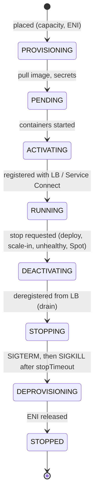
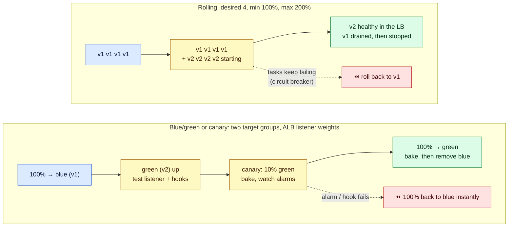
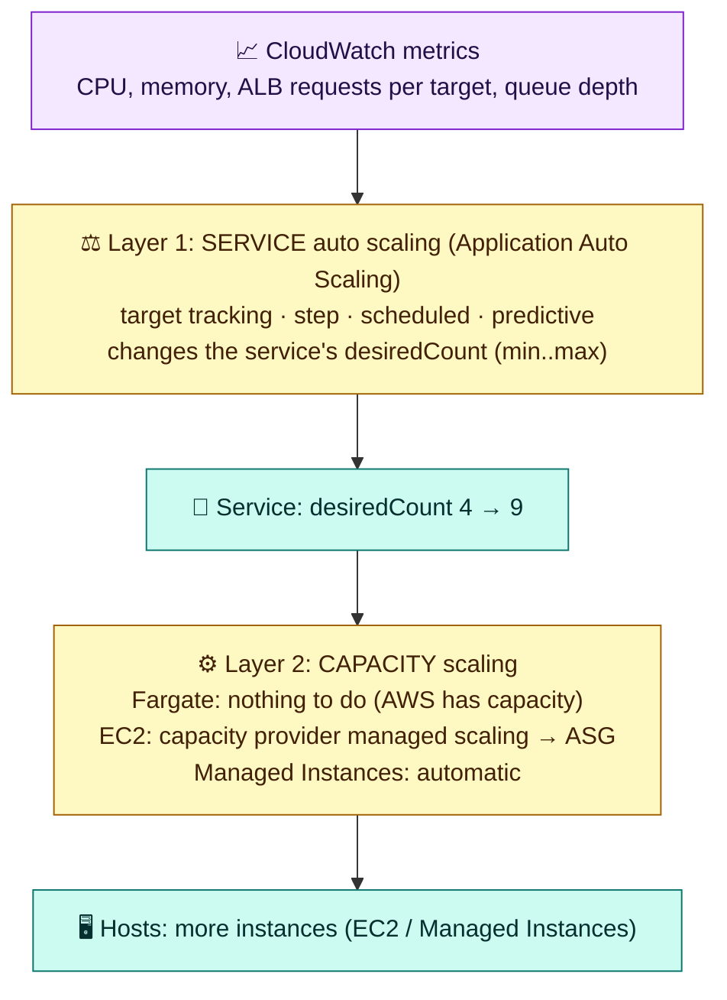

# Module 05 — Services, Deployments & Scaling

> How services keep tasks healthy, how tasks shut down gracefully, how to roll out (and roll back) new versions, and how to scale tasks and the capacity underneath them.

---

## 1. The service scheduler

- **REPLICA** (default): keep *desired count* tasks running, spread across AZs. Failed or unhealthy tasks are replaced, and ECS can **rebalance tasks across AZs** after an AZ issue.
- **DAEMON** (EC2/Managed Instances): exactly one task per container instance (agents, log shippers).
- A task is replaced when an **essential container exits**, the **container health check** fails, the **load balancer health check** fails (after the grace period), or the Spot capacity is reclaimed.
- **Standalone and scheduled tasks** use `RunTask`, **EventBridge Scheduler** (cron), or Step Functions for batch, migrations, and one-off jobs.

## 2. Task lifecycle and graceful shutdown



**What graceful shutdown requires:**
1. ECS deregisters the task from the target group, and the ALB stops sending **new** requests. In-flight requests drain for the **deregistration delay**.
2. Containers receive **SIGTERM**. Your app must stop accepting work, finish in-flight work, and exit. Make sure PID 1 forwards signals (`initProcessEnabled: true`, or exec-form `CMD`).
3. After **`stopTimeout`** (default 30 s, max 120 s on Fargate), **SIGKILL**.
4. Rule of thumb: **deregistration delay < stopTimeout ≤ 120 s** (Fargate Spot gives you a 2-minute warning).

---

## 3. Deployment strategies

| Strategy | How it works | Rollback | Needs |
|---|---|---|---|
| **Rolling update** (default) | Replace tasks gradually within `minimumHealthyPercent` / `maximumPercent` | **Deployment circuit breaker** (+ optional CloudWatch alarms) rolls back automatically | Nothing extra |
| **Blue/green** (built-in, 2025) | Start the full new revision ("green") beside the old, optionally test it via a test listener, shift **all** traffic, wait a **bake time**, then remove blue | Instant: traffic flips back during the bake time. Lifecycle hooks (Lambda) and alarms can fail it | ALB, NLB, or Service Connect. Two target groups. An infrastructure role |
| **Canary** (built-in) | Shift a small % (e.g. 10%), bake, then shift the rest | Same as blue/green | ALB or Service Connect |
| **Linear** (built-in) | Shift in equal steps (e.g. 20% every 3 minutes) | Same | ALB or Service Connect |
| CodeDeploy / external | Legacy blue/green or third-party controllers | Controller-specific | Superseded by built-in strategies for most teams |



**Rolling settings explained (desired = 4):**

| min% / max% | Behavior |
|---|---|
| 100 / 200 | Starts 4 new tasks before stopping old ones. Safest, needs double capacity briefly |
| 50 / 100 | Stops 2 old, then starts 2 new. No extra capacity, but reduced capacity during the deploy |
| 100 / 125 | One extra task at a time. Slow but cheap |

**Always enable** the **deployment circuit breaker with rollback**. Without it, a broken image retries forever.

---

## 4. Scaling: two layers



| Policy | Use when | Example |
|---|---|---|
| **Target tracking** | Most services | Keep `ECSServiceAverageCPUUtilization` at 60%, or `ALBRequestCountPerTarget` at 500 |
| **Step scaling** | Custom alarms, aggressive bursts | Queue depth > 1,000 → +5 tasks |
| **Scheduled** | Known patterns | Scale to 10 at 08:00 on weekdays, and to 0 at night for dev |
| **Predictive** | Recurring daily or weekly cycles | Forecasts and pre-scales ahead of the load |

Request-based scaling (`ALBRequestCountPerTarget`) usually reacts better than CPU for web APIs. For queue workers, scale on backlog per task.

---

## 5. Hands-on: deploy, break, roll back, and scale

```bash
# 1. A good deployment: new revision with a different image tag
sed 's|nginx:stable|nginx:mainline|' /tmp/taskdef.json > /tmp/taskdef-v2.json
aws ecs register-task-definition --cli-input-json file:///tmp/taskdef-v2.json --query 'taskDefinition.revision'
aws ecs update-service --cluster lab-cluster --service web --task-definition lab-web >/dev/null   # family only = latest ACTIVE revision
aws ecs describe-services --cluster lab-cluster --services web \
  --query 'services[0].deployments[].[status,taskDefinition,desiredCount,runningCount,rolloutState]' --output table
aws ecs wait services-stable --cluster lab-cluster --services web

# 2. A broken deployment: the image tag doesn't exist, so the circuit breaker rolls back
sed 's|nginx:stable|nginx:this-tag-does-not-exist|' /tmp/taskdef.json > /tmp/taskdef-bad.json
aws ecs register-task-definition --cli-input-json file:///tmp/taskdef-bad.json >/dev/null
aws ecs update-service --cluster lab-cluster --service web --task-definition lab-web >/dev/null
for i in $(seq 1 20); do
  aws ecs describe-services --cluster lab-cluster --services web \
    --query 'services[0].deployments[].[status,taskDefinition,rolloutState,rolloutStateReason]' --output text; echo ---
  sleep 30
done
#  -> the PRIMARY deployment turns FAILED, and ECS starts a rollback to the last good revision.
#     The site keeps serving the whole time: old tasks were never stopped (min 100%).
curl -s http://$ALB_DNS | grep -i title

# 3. Target-tracking auto scaling on CPU
aws application-autoscaling register-scalable-target --service-namespace ecs \
  --resource-id service/lab-cluster/web --scalable-dimension ecs:service:DesiredCount --min-capacity 2 --max-capacity 6
aws application-autoscaling put-scaling-policy --service-namespace ecs --resource-id service/lab-cluster/web \
  --scalable-dimension ecs:service:DesiredCount --policy-name cpu60 --policy-type TargetTrackingScaling \
  --target-tracking-scaling-policy-configuration \
  '{"TargetValue":60,"PredefinedMetricSpecification":{"PredefinedMetricType":"ECSServiceAverageCPUUtilization"},"ScaleOutCooldown":60,"ScaleInCooldown":120}' >/dev/null
aws cloudwatch describe-alarms --alarm-name-prefix TargetTracking-service/lab-cluster/web \
  --query 'MetricAlarms[].[AlarmName,StateValue]' --output table     # the high/low alarms created for you
```

---

## Check yourself

<details><summary>Order these: deregistration delay, stopTimeout, SIGTERM, SIGKILL.</summary>Deregister (drain for the delay) → SIGTERM → wait up to stopTimeout → SIGKILL. Keep the delay below stopTimeout.</details>
<details><summary>A new image crashes on start. What stops an endless redeploy loop?</summary>The deployment circuit breaker with rollback enabled.</details>
<details><summary>Rolling vs blue/green: which gives instant rollback after traffic has shifted?</summary>Blue/green (or canary/linear) during the bake time. The old revision is still running behind the other target group.</details>
<details><summary>Your service scaled to 9 tasks but they stay PROVISIONING on EC2. Which layer is missing?</summary>Capacity scaling: the capacity provider's managed scaling, or ASG max size, is too low.</details>

---
**Previous:** [Module 04](04-networking-and-load-balancing.md) · **Next:** [Module 06 — Security, Observability & Troubleshooting](06-security-observability-troubleshooting.md)
