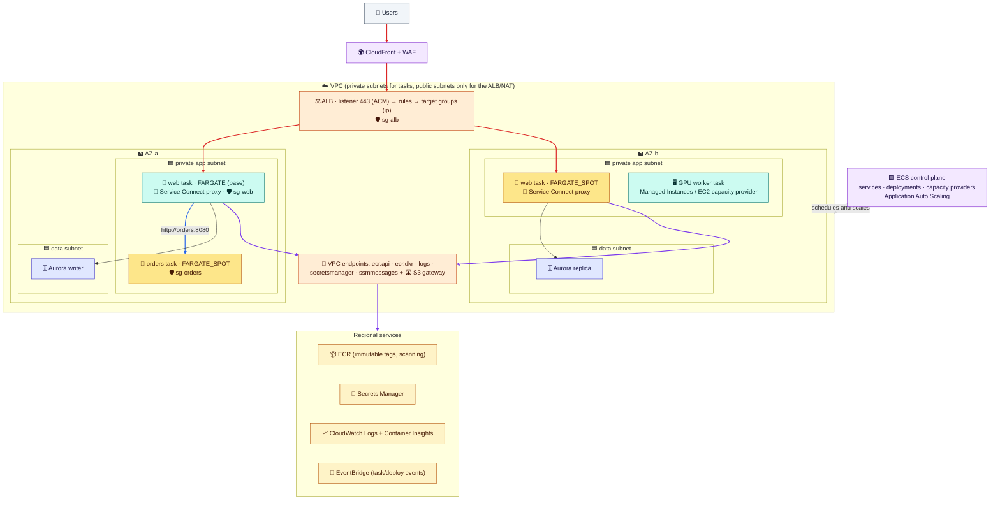

# Module 06 — Operating ECS: Security, Debugging, Costs & the Full Picture

← [All tutorials](../README.md) · **ECS tutorial**, module 6 of 6

The last module covers running ECS day to day: securing it, seeing what it does, getting a shell inside a container, finding out why a task died, keeping costs down. It ends with a reference architecture, a decision cheat sheet, and the lab cleanup.

---

## 1. Security checklist

| Area | Do this |
|---|---|
| **Permissions** | One **task role per service**, with least privilege. The execution role gets only image pull, logs, and its secrets ([Module 02](02-task-definition-field-by-field.md), [IAM tutorial](../iam/03-policies-in-detail.md)) |
| **Network** | Tasks in **private subnets**. One security group per service, allowing the app port **only from the load balancer's security group**. VPC endpoints instead of internet access where possible ([Module 03](03-services-networking-and-load-balancing.md)) |
| **Secrets** | Secrets Manager or Parameter Store through `secrets`, never in `environment`, images, or git |
| **Images** | In **ECR** with **tag immutability** (a tag can't be overwritten), **scan on push** for vulnerabilities, and lifecycle rules to delete old images. Deploy pinned tags |
| **Containers** | Non-root user, read-only filesystem, no privileged mode |
| **EC2 hosts** (if used) | Current ECS-optimized AMIs, and block containers from the instance's own role (`ECS_AWSVPC_BLOCK_IMDS=true`) |
| **Detection** | GuardDuty Runtime Monitoring for ECS. CloudTrail records every ECS API call |

**About ECR:** a private image registry per Region, with image URIs like `111122223333.dkr.ecr.eu-central-1.amazonaws.com/shop-api:1.4.2`. A **pull-through cache** mirrors Docker Hub and other registries into ECR, which avoids rate limits and lets private subnets pull through endpoints. **Replication** copies images to other Regions or accounts.

---

## 2. Seeing what's happening

| What | Where | Notes |
|---|---|---|
| **Application logs** | CloudWatch Logs, through the `awslogs` driver (Module 02) | Set a **retention period** on every log group. The default keeps logs forever, and you pay for them forever |
| **Metrics** | CPU and memory per service (built in). **Container Insights** adds per-task and per-container metrics and dashboards | Turned on per cluster (Module 01) |
| **ECS events** | Service events (`describe-services … events`), plus EventBridge events for task state changes and deployments | Alert on failed deployments and Spot interruptions |
| **Traces** | AWS X-Ray or OpenTelemetry, through a collector sidecar (Module 02's example) | Follow one request across services |

The [Observability tutorial](../observability/01-metrics.md) covers metrics, logs, and alarms in general.

### ECS Exec: a shell inside a running container

ECS Exec opens an interactive session in a running container, even on Fargate, with no SSH and no open ports. It uses the same mechanism as SSM Session Manager. It needs:
1. the service or task started with **`--enable-execute-command`**;
2. a **task role** allowing the `ssmmessages:*` actions (you added this in Module 02);
3. a network path to Systems Manager (public IP, NAT, or the `ssmmessages` endpoint);
4. the **Session Manager plugin** installed on your machine.

```bash
aws ecs execute-command --cluster lab-cluster --task <task-id> --container web --interactive --command "/bin/sh"
```

Who may run it is controlled with IAM (`ecs:ExecuteCommand`), and every session is recorded in CloudTrail.

---

## 3. Why did my task stop?

Every stopped task records a **`stoppedReason`**. Start there.

| You see | Usual cause | Fix |
|---|---|---|
| Task stuck in **`PROVISIONING`** | No capacity: EC2 instances full (CPU, memory, network interfaces), Auto Scaling group at max, or no Fargate Spot capacity | Raise the ASG max, check managed scaling, add a base on `FARGATE` |
| **`CannotPullContainerError`** | Wrong image name or tag, execution role can't read ECR, or **no network path to ECR** (private subnet without NAT or endpoints, or a public subnet without a public IP) | Check the image URI, the execution role, and the endpoints/NAT/public IP |
| **`ResourceInitializationError`** | Can't fetch secrets or create the log stream: execution role permissions, or no network path to Secrets Manager or Logs | Add the permissions (including `kms:Decrypt`) and the endpoints |
| **`Essential container in task exited`** with exit code **137** | Killed: **out of memory**, or didn't stop within `stopTimeout` | Raise memory, or fix the leak or the SIGTERM handling |
| `Essential container in task exited` with exit code **1** or another value | The app crashed | Read the logs: missing environment variables or secrets, failed connection |
| **`Task failed ELB health checks`** | Wrong health check path or port, app too slow to start, task security group doesn't allow the load balancer's, or the app listens on `127.0.0.1` only | Fix the check, raise the grace period, fix the security group, bind to `0.0.0.0` |
| `Your Spot Task was interrupted` | Fargate Spot capacity reclaimed | Expected. Keep a base on `FARGATE` |

```bash
# The service's recent events (placement problems, health check failures, deployments)
aws ecs describe-services --cluster lab-cluster --services web --query 'services[0].events[0:8].[createdAt,message]' --output table

# Why recently stopped tasks stopped (ECS keeps them visible for about an hour)
for t in $(aws ecs list-tasks --cluster lab-cluster --desired-status STOPPED --query 'taskArns[0:5]' --output text); do
  aws ecs describe-tasks --cluster lab-cluster --tasks $t \
    --query 'tasks[0].[taskDefinitionArn,stoppedReason,containers[0].exitCode,containers[0].reason]' --output text
done

# The application's own output
aws logs tail /ecs/lab-web --since 30m
```

---

## 4. Keeping costs down

| Lever | Typical saving |
|---|---|
| **ARM64 (Graviton)** images on Fargate | ~20% |
| **Fargate Spot** for stateless services and batch | Up to ~70% on those tasks |
| **Compute Savings Plans** (they cover Fargate, EC2, and Lambda) | Up to ~50% on steady usage |
| **Right-sizing** CPU and memory from Container Insights | Often 30–50% on oversized tasks |
| **Scaling dev and test to zero** at night (scheduled scaling) | Most of their cost |
| **VPC endpoints instead of NAT** for image pulls, and ECR in the same Region | Removes NAT per-GB charges |
| **Log retention** and sensible log levels | CloudWatch Logs ingestion is often a surprise line item |

---

## 5. The full picture



**How to read it:**
- **🔴 Ingress:** users → CloudFront and WAF → ALB in public subnets → tasks in **private** subnets, allowed by security group reference.
- **Compute:** the `web` service keeps a **base on Fargate** and bursts onto **Fargate Spot**. `orders` runs on Spot. A GPU worker runs on **Managed Instances** (or an EC2 capacity provider).
- **🔵 Service-to-service:** `web` calls `orders` through **Service Connect** (`http://orders:8080`). The data lives in Aurora: a writer in AZ a and a replica in AZ b.
- **🟣 AWS access:** **VPC endpoints** for ECR, Logs, Secrets Manager, and Exec, plus the S3 gateway endpoint. No NAT bill for image pulls.
- **Control:** the ECS control plane schedules and replaces tasks, auto scaling changes desired counts, and EventBridge carries deployment and task events.

### Decision cheat sheet

| I need… | Use |
|---|---|
| A web app online as fast as possible | **ECS Express Mode** |
| Containers with no servers to manage | **Fargate** |
| Cheap, interruption-tolerant capacity | **Fargate Spot** (with a base on `FARGATE`), or EC2 Spot capacity providers |
| GPUs or special instance types, without running hosts | **ECS Managed Instances** |
| Full control over hosts | An **EC2 capacity provider** (Auto Scaling group + managed scaling) |
| HTTP routing, TLS, WAF in front of a service | **ALB** with target type `ip` |
| TCP/UDP, or fixed IP addresses | **NLB** |
| Services calling each other | **Service Connect** |
| Safe releases | A rolling update with the **circuit breaker** at minimum. **Canary or blue/green** for instant rollback |
| Scale on load | Target tracking on **requests per target** or CPU. Queue backlog for workers |
| Cron and batch jobs | **EventBridge Scheduler → RunTask**, on Fargate Spot |
| App permissions / secrets | **Task role** / **`secrets`** read by the execution role |
| A shell inside a container | **ECS Exec** |

---

## 6. Try it: debug, then clean up

**6.1 Read why the broken deployment's tasks stopped** (do this within an hour of Module 05):

```bash
for t in $(aws ecs list-tasks --cluster lab-cluster --desired-status STOPPED --query 'taskArns[0:3]' --output text); do
  aws ecs describe-tasks --cluster lab-cluster --tasks $t --query 'tasks[0].[stopCode,stoppedReason]' --output text; done
#   CannotPullContainerError ... this-tag-does-not-exist ... not found
```

**6.2 Open a shell inside a running task** (install the Session Manager plugin first: AWS docs, *Install the Session Manager plugin for the AWS CLI*):

```bash
TASK=$(aws ecs list-tasks --cluster lab-cluster --service-name web --query 'taskArns[0]' --output text)
aws ecs execute-command --cluster lab-cluster --task $TASK --container web --interactive --command "/bin/sh"
  env | grep -E 'APP_ENV|ECS_CONTAINER_METADATA_URI_V4'     # your env var, and the task metadata endpoint
  curl -s $ECS_CONTAINER_METADATA_URI_V4/task | head -c 300; echo
  exit
```

**6.3 Clean up everything from this tutorial:**

```bash
source ~/ecs-lab.env 2>/dev/null

# Service, auto scaling, remaining tasks
aws application-autoscaling deregister-scalable-target --service-namespace ecs \
  --resource-id service/lab-cluster/web --scalable-dimension ecs:service:DesiredCount 2>/dev/null
aws ecs delete-service --cluster lab-cluster --service web --force >/dev/null 2>&1
aws ecs wait services-inactive --cluster lab-cluster --services web 2>/dev/null
for t in $(aws ecs list-tasks --cluster lab-cluster --query taskArns --output text); do
  aws ecs stop-task --cluster lab-cluster --task $t >/dev/null; done

# Load balancer
aws elbv2 delete-listener --listener-arn $LISTENER_ARN 2>/dev/null
aws elbv2 delete-load-balancer --load-balancer-arn $ALB_ARN 2>/dev/null
aws elbv2 wait load-balancers-deleted --load-balancer-arns $ALB_ARN 2>/dev/null
aws elbv2 delete-target-group --target-group-arn $TG_ARN 2>/dev/null

# EC2 capacity provider (only if you did Module 04 part B)
aws ecs put-cluster-capacity-providers --cluster lab-cluster --capacity-providers FARGATE FARGATE_SPOT \
  --default-capacity-provider-strategy capacityProvider=FARGATE,weight=1 >/dev/null
for ci in $(aws ecs list-container-instances --cluster lab-cluster --query containerInstanceArns --output text); do
  aws ecs deregister-container-instance --cluster lab-cluster --container-instance $ci --force >/dev/null; done
aws ecs delete-capacity-provider --capacity-provider lab-ec2-spot >/dev/null 2>&1
aws autoscaling delete-auto-scaling-group --auto-scaling-group-name lab-ecs-asg --force-delete 2>/dev/null
aws ec2 delete-launch-template --launch-template-name lab-ecs-lt >/dev/null 2>&1
aws iam remove-role-from-instance-profile --instance-profile-name lab-ecsInstanceProfile --role-name lab-ecsInstanceRole 2>/dev/null
aws iam delete-instance-profile --instance-profile-name lab-ecsInstanceProfile 2>/dev/null
aws iam detach-role-policy --role-name lab-ecsInstanceRole --policy-arn arn:aws:iam::aws:policy/service-role/AmazonEC2ContainerServiceforEC2Role 2>/dev/null
aws iam delete-role --role-name lab-ecsInstanceRole 2>/dev/null

# Cluster and task definitions
aws ecs delete-cluster --cluster lab-cluster >/dev/null
for td in $(aws ecs list-task-definitions --family-prefix lab-web --query taskDefinitionArns --output text); do
  aws ecs deregister-task-definition --task-definition $td >/dev/null; done
aws ecs delete-task-definitions --task-definitions $(aws ecs list-task-definitions --family-prefix lab-web --status INACTIVE \
  --query taskDefinitionArns --output text) >/dev/null 2>&1

# Roles and logs
aws iam detach-role-policy --role-name lab-ecsTaskExecutionRole --policy-arn arn:aws:iam::aws:policy/service-role/AmazonECSTaskExecutionRolePolicy
aws iam delete-role --role-name lab-ecsTaskExecutionRole
aws iam delete-role-policy --role-name lab-ecsTaskRole --policy-name ecs-exec
aws iam delete-role --role-name lab-ecsTaskRole
aws logs delete-log-group --log-group-name /ecs/lab-web

# Security groups (task network interfaces take a minute to disappear). sg-task first, because it references sg-alb
sleep 60
for i in 1 2 3 4 5; do aws ec2 delete-security-group --group-id $SG_TASK 2>/dev/null && break; sleep 30; done
aws ec2 delete-security-group --group-id $SG_ALB

rm -f ~/ecs-lab.env /tmp/taskdef*.json /tmp/ecs-*.json /tmp/ec2-trust.json
aws ecs list-clusters --query clusterArns                                        # lab-cluster should be gone
aws elbv2 describe-load-balancers --query 'LoadBalancers[].LoadBalancerName'     # no lab-ecs-alb
```

---

## Check yourself

<details><summary>Exit code 137 with OutOfMemoryError. What's the fix?</summary>Give the container or task more memory, or fix the memory leak. Exit code 137 means the container was killed (SIGKILL).</details>
<details><summary>What do you need for ECS Exec on Fargate?</summary>enableExecuteCommand on the service or task, ssmmessages permissions on the task role, a network path to SSM, and the Session Manager plugin locally.</details>
<details><summary>Which commitment discount covers Fargate?</summary>Compute Savings Plans.</details>

---
**Previous:** [Module 05](05-deployments-and-scaling.md) · **Next tutorial:** [Observability](../observability/01-metrics.md)
