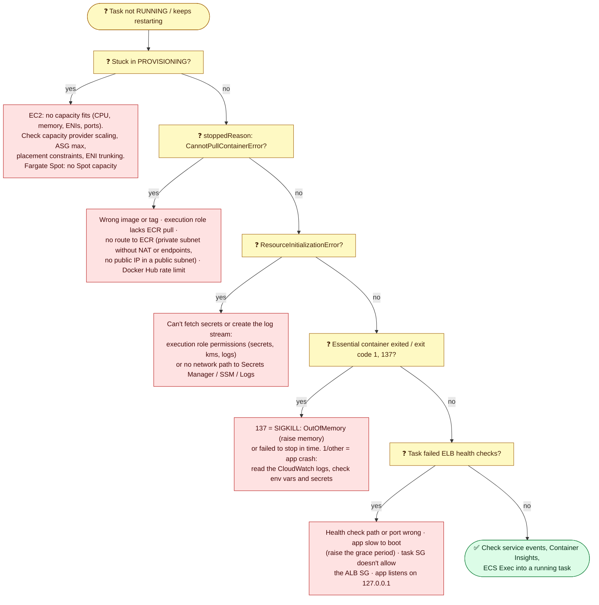

# Module 06 — Security, Observability & Troubleshooting

> Lock tasks down, see what they're doing, get a shell inside them, and diagnose why a task won't start or keeps dying. Also: where ECS money goes.

---

## 1. Security checklist

| Area | Do this |
|---|---|
| **IAM** | One **task role per service**, least privilege. The execution role only gets pull/logs/secrets. Never use the EC2 instance role for apps (Module 02) |
| **Network** | Tasks in **private subnets**. Task SG allows only the app port **from the ALB's SG**. VPC endpoints instead of the internet where possible |
| **Secrets** | Secrets Manager / SSM via `secrets`, never in `environment` or images. Encrypt with KMS |
| **Images** | ECR with **tag immutability**, **scan on push** (Inspector enhanced scanning), lifecycle policies, signed images. Pin tags or digests |
| **Containers** | Non-root `user`, `readonlyRootFilesystem`, drop Linux capabilities, no privileged mode |
| **Hosts (EC2)** | Bottlerocket or patched AL2023 ECS AMIs, IMDSv2, block task access to IMDS (`ECS_AWSVPC_BLOCK_IMDS=true`) |
| **Runtime** | **GuardDuty Runtime Monitoring** (Fargate + EC2). CloudTrail for every ECS API call |

### ECR essentials
- **Private repositories** are per Region. You get an image URI like `ACCOUNT.dkr.ecr.REGION.amazonaws.com/app:1.4.2`.
- **Lifecycle policies** expire old and untagged images, which saves storage cost.
- **Pull-through cache** mirrors Docker Hub, GHCR, Quay, and ECR Public into your account, which is good for private subnets and rate limits.
- **Cross-Region/account replication** keeps images close to the clusters that use them.

---

## 2. Observability

| Signal | Tool | Notes |
|---|---|---|
| **Logs** | `awslogs` → CloudWatch Logs, or **FireLens** (Fluent Bit sidecar) → anywhere | Set retention on log groups. The default "never expire" gets expensive |
| **Metrics** | CloudWatch: `CPUUtilization`/`MemoryUtilization` per service. **Container Insights (enhanced)** adds per-task and per-container metrics, a curated dashboard, and restarts | Enable it per cluster (`containerInsights=enhanced`) |
| **Events** | ECS → **EventBridge**: task state changes, service actions, deployment state changes | Alert on `SERVICE_TASK_START_IMPAIRED`, deployment `FAILED`, Spot interruptions |
| **Traces** | AWS X-Ray / OpenTelemetry via the ADOT collector sidecar | Distributed tracing across services |
| **Service mesh metrics** | Service Connect publishes per-service request, error, and latency metrics | No app changes |
| **Audit** | CloudTrail | Who changed the service or task definition |

For CloudWatch metrics, Logs Insights, alarms, and tracing in general, see the [Observability tutorial](../observability/01-overview-and-metrics.md).

### ECS Exec: a shell inside a running container

```bash
# Requirements: --enable-execute-command on the service or task, the task role has ssmmessages:*,
# a path to SSM (internet or the ssmmessages endpoint), and the Session Manager plugin on your laptop
aws ecs execute-command --cluster lab-cluster --task <task-id> --container web --interactive --command "/bin/sh"
```

Exec sessions are logged (CloudTrail, optionally S3/CloudWatch). Restrict who can call `ecs:ExecuteCommand` with IAM.

---

## 3. Cost optimization

| Lever | Typical saving |
|---|---|
| **Graviton (ARM64)** images | ~20% on Fargate, plus better price/performance |
| **Fargate Spot** for stateless and batch | Up to ~70% |
| **Compute Savings Plans** (covers Fargate, EC2, Lambda) | Up to ~50% for steady baseline usage |
| **Right-size** task CPU/memory from Container Insights | Often 30–50% on overprovisioned tasks |
| **Scale to zero** for dev/test (scheduled scaling) | Nights and weekends |
| EC2: **binpack** placement + Spot mixed instances + managed scaling | High density, cheap capacity |
| **VPC endpoints instead of NAT** for image pulls; ECR in the same Region | Removes NAT per-GB charges |
| **Log retention** + sensible log levels | CloudWatch Logs ingestion is often a surprise line item |

---

## 4. Troubleshooting

### Why won't my task start (or why does it keep stopping)?



**Where to look:**

```bash
# Last service events (placement failures, health check failures, deployments)
aws ecs describe-services --cluster lab-cluster --services web --query 'services[0].events[0:10].[createdAt,message]' --output table

# Why stopped tasks stopped (stopped tasks are kept for about an hour)
for t in $(aws ecs list-tasks --cluster lab-cluster --desired-status STOPPED --query 'taskArns[0:5]' --output text); do
  aws ecs describe-tasks --cluster lab-cluster --tasks $t \
    --query 'tasks[0].[taskDefinitionArn,stopCode,stoppedReason,containers[0].exitCode,containers[0].reason]' --output text
done

# Application logs
aws logs tail /ecs/lab-web --since 30m --follow
```

---

## 5. Hands-on: debug like an operator

```bash
# 1. Why did the broken deployment's tasks stop? (Run this within an hour of Module 05's lab)
for t in $(aws ecs list-tasks --cluster lab-cluster --desired-status STOPPED --query 'taskArns[0:3]' --output text); do
  aws ecs describe-tasks --cluster lab-cluster --tasks $t --query 'tasks[0].[stopCode,stoppedReason]' --output text; done
#   -> CannotPullContainerError ... this-tag-does-not-exist ... not found

# 2. Shell into a healthy task (install the Session Manager plugin first:
#    https://docs.aws.amazon.com/systems-manager/latest/userguide/session-manager-working-with-install-plugin.html)
TASK=$(aws ecs list-tasks --cluster lab-cluster --service-name web --query 'taskArns[0]' --output text)
aws ecs describe-tasks --cluster lab-cluster --tasks $TASK --query 'tasks[0].containers[0].managedAgents[0].lastStatus'   # RUNNING
aws ecs execute-command --cluster lab-cluster --task $TASK --container web --interactive --command "/bin/sh"
  cat /etc/os-release | head -2
  env | grep ECS_CONTAINER_METADATA_URI_V4                  # the task metadata endpoint
  (curl -s $ECS_CONTAINER_METADATA_URI_V4/task || wget -qO- $ECS_CONTAINER_METADATA_URI_V4/task) 2>/dev/null | head -c 400; echo
  exit

# 3. Container Insights metrics for the service
aws cloudwatch get-metric-statistics --namespace ECS/ContainerInsights --metric-name CpuUtilized \
  --dimensions Name=ClusterName,Value=lab-cluster Name=ServiceName,Value=web \
  --start-time $(date -u -v-30M +%Y-%m-%dT%H:%M:%SZ 2>/dev/null || date -u -d '-30 min' +%Y-%m-%dT%H:%M:%SZ) \
  --end-time $(date -u +%Y-%m-%dT%H:%M:%SZ) --period 300 --statistics Average --output table
```

---

## Check yourself

<details><summary>Exit code 137 and "OutOfMemoryError". What's the fix?</summary>Raise the container/task memory limit, or fix the leak. 137 means SIGKILL.</details>
<details><summary>Which tool gives you a shell in a Fargate task?</summary>ECS Exec (SSM-based). It needs enableExecuteCommand, ssmmessages permissions on the task role, and the Session Manager plugin.</details>
<details><summary>What covers Fargate in AWS commitment discounts?</summary>Compute Savings Plans.</details>

---
**Previous:** [Module 05](05-services-deployments-scaling.md) · **Next:** [Module 07 — Big Picture & Decisions](07-big-picture-and-decisions.md)
