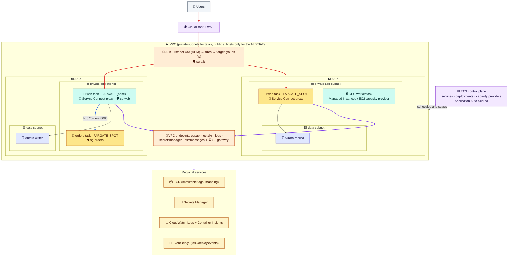

# Module 07 — Big Picture, Decisions & Cleanup

> Everything in one reference architecture, the decisions you'll make on every ECS project, a production checklist, and the lab cleanup.

---

## 1. Reference architecture



How to read it:
- **Ingress:** CloudFront/WAF → ALB in public subnets → tasks in **private** subnets, via SG reference.
- **Compute:** Fargate base + Fargate Spot burst for stateless services. A GPU worker on Managed Instances or EC2.
- **Service-to-service:** Service Connect short names. **AWS access:** VPC endpoints, no NAT bill for image pulls.
- **Control:** the ECS control plane schedules tasks, auto scaling adjusts desired counts, and EventBridge carries the events.

---

## 2. Decision cheat sheet

| I need… | Use |
|---|---|
| The fastest way to get a web app or API running | **ECS Express Mode** (image in, HTTPS URL out) |
| Containers with zero host management | **Fargate** |
| Cheap, interruption-tolerant capacity | **Fargate Spot** (with a `base` on FARGATE) or EC2 Spot capacity providers |
| GPUs, special instance types, without managing hosts | **ECS Managed Instances** |
| Full host control (custom AMI, daemons, privileged) | **EC2 capacity provider** (ASG + managed scaling) |
| Containers on-prem | **ECS Anywhere** |
| A task to reach the load balancer and VPC like a VM | **awsvpc** mode, target type `ip` |
| Private image pulls without NAT | `ecr.api` + `ecr.dkr` + `logs` endpoints + the **S3 gateway** endpoint |
| HTTP routing / TLS / auth / WAF | **ALB** (listener → rules → target groups) |
| TCP/UDP, static IPs, PrivateLink | **NLB** |
| Service-to-service calls | **Service Connect** (or VPC Lattice across VPCs/accounts) |
| Safe rollouts | Rolling + **circuit breaker** (minimum). **Blue/green / canary / linear** for instant rollback |
| Scale on load | Target tracking on **ALBRequestCountPerTarget** or CPU. Queue depth for workers |
| Cron jobs / batch | **EventBridge Scheduler → RunTask**, on Fargate Spot |
| AWS permissions for the app | **Task role**, one per service |
| Secrets | **Secrets Manager / SSM** in the `secrets` field (execution role reads them) |
| Debugging inside a container | **ECS Exec** |
| Persistent shared files / per-task block storage | **EFS** / **EBS volumes attached at deployment** |

## 3. Production checklist

- [ ] Tasks in **private subnets** across **≥ 2 AZs** (3 for critical services). Subnets sized for 2× peak tasks.
- [ ] **Task role** per service (least privilege). Execution role minimal. Secrets in Secrets Manager.
- [ ] Images in **ECR** with immutable tags, scanning, lifecycle policies. Multi-arch for Graviton.
- [ ] **Health checks**: container + target group. Grace period > boot time.
- [ ] **Graceful shutdown**: SIGTERM handled, deregistration delay < `stopTimeout`.
- [ ] **Circuit breaker with rollback** (or blue/green/canary with alarms).
- [ ] **Service auto scaling** with sensible min/max. Capacity scaling for EC2/Managed Instances.
- [ ] **Capacity strategy**: base on On-Demand, burst on Spot. Spread across AZs.
- [ ] **Logs** with retention, **Container Insights**, alarms on 5xx, latency, and deployment failures.
- [ ] Infrastructure as code (Terraform/CDK/CloudFormation). Task definitions generated in CI.

## 4. Quick answers

1. **Fargate vs EC2 vs Managed Instances vs Spot?** Fargate by default. Fargate Spot for interruption-tolerant work (keep a base on Fargate). Managed Instances when you need EC2 types or GPUs without managing hosts. EC2 capacity providers for full host control or maximum density and cost tuning.
2. **Execution role vs task role?** The **execution role** is used by ECS/Fargate *before* your app runs (pull image, logs, secrets). The **task role** is used by *your app* for AWS API calls.
3. **How does a task get traffic?** In awsvpc mode it gets its own ENI/IP. The service registers that IP in a target group. The ALB listener's rules forward to that target group, and health checks gate traffic.
4. **How do deployments roll back?** Rolling: the circuit breaker (and alarms) roll back to the last good revision. Blue/green, canary, linear: traffic shifts back to the still-running old revision during the bake time.
5. **Why did my task stop?** Read `stoppedReason`/`stopCode` and the service events: pull errors → network or execution role, init errors → secrets or logs, 137 → memory, ELB health checks → port, path, SG, or grace period.

---

## 5. Lab cleanup: run all of it

```bash
source ~/ecs-lab.env 2>/dev/null

# Service, auto scaling, standalone tasks
aws application-autoscaling deregister-scalable-target --service-namespace ecs \
  --resource-id service/lab-cluster/web --scalable-dimension ecs:service:DesiredCount 2>/dev/null
aws ecs delete-service --cluster lab-cluster --service web --force >/dev/null 2>&1
aws ecs wait services-inactive --cluster lab-cluster --services web 2>/dev/null
for t in $(aws ecs list-tasks --cluster lab-cluster --query taskArns --output text); do
  aws ecs stop-task --cluster lab-cluster --task $t >/dev/null; done

# Load balancer
aws elbv2 delete-listener --listener-arn $LISTENER_ARN 2>/dev/null
aws elbv2 delete-load-balancer --load-balancer-arn $ALB_ARN 2>/dev/null
aws elbv2 wait load-balancers-deleted --load-balancer-arns $ALB_ARN 2>/dev/null
aws elbv2 delete-target-group --target-group-arn $TG_ARN 2>/dev/null

# EC2 capacity provider (only if you did Module 03 part B)
aws ecs put-cluster-capacity-providers --cluster lab-cluster --capacity-providers FARGATE FARGATE_SPOT \
  --default-capacity-provider-strategy capacityProvider=FARGATE,weight=1 >/dev/null
for ci in $(aws ecs list-container-instances --cluster lab-cluster --query containerInstanceArns --output text); do
  aws ecs deregister-container-instance --cluster lab-cluster --container-instance $ci --force >/dev/null; done
aws ecs delete-capacity-provider --capacity-provider lab-ec2-spot >/dev/null 2>&1
aws autoscaling delete-auto-scaling-group --auto-scaling-group-name lab-ecs-asg --force-delete 2>/dev/null
aws ec2 delete-launch-template --launch-template-name lab-ecs-lt >/dev/null 2>&1
aws iam remove-role-from-instance-profile --instance-profile-name lab-ecsInstanceProfile --role-name lab-ecsInstanceRole 2>/dev/null
aws iam delete-instance-profile --instance-profile-name lab-ecsInstanceProfile 2>/dev/null
aws iam detach-role-policy --role-name lab-ecsInstanceRole --policy-arn arn:aws:iam::aws:policy/service-role/AmazonEC2ContainerServiceforEC2Role 2>/dev/null
aws iam delete-role --role-name lab-ecsInstanceRole 2>/dev/null

# Cluster and task definitions
aws ecs delete-cluster --cluster lab-cluster >/dev/null
for td in $(aws ecs list-task-definitions --family-prefix lab-web --query taskDefinitionArns --output text); do
  aws ecs deregister-task-definition --task-definition $td >/dev/null; done
aws ecs delete-task-definitions --task-definitions $(aws ecs list-task-definitions --family-prefix lab-web --status INACTIVE --query taskDefinitionArns --output text) >/dev/null 2>&1

# IAM roles, logs
aws iam detach-role-policy --role-name lab-ecsTaskExecutionRole --policy-arn arn:aws:iam::aws:policy/service-role/AmazonECSTaskExecutionRolePolicy
aws iam delete-role --role-name lab-ecsTaskExecutionRole
aws iam delete-role-policy --role-name lab-ecsTaskRole --policy-name ecs-exec
aws iam delete-role --role-name lab-ecsTaskRole
aws logs delete-log-group --log-group-name /ecs/lab-web

# Security groups (task ENIs need a minute to disappear). Delete the referencing SG first
sleep 60
for i in 1 2 3 4 5; do aws ec2 delete-security-group --group-id $SG_TASK 2>/dev/null && break; sleep 30; done
aws ec2 delete-security-group --group-id $SG_ALB

rm -f ~/ecs-lab.env /tmp/taskdef*.json /tmp/ecs-*.json /tmp/ec2-trust.json
aws ecs list-clusters --query clusterArns          # lab-cluster should be gone
aws elbv2 describe-load-balancers --query 'LoadBalancers[].LoadBalancerName'   # no lab-ecs-alb
```

---
**Previous:** [Module 06](06-security-observability-troubleshooting.md) · **Back to:** [All tutorials](../README.md)
