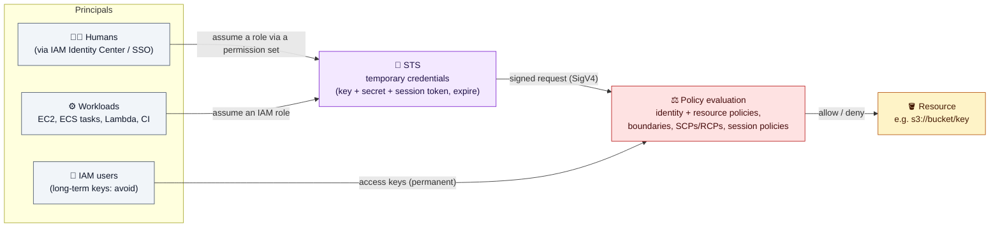
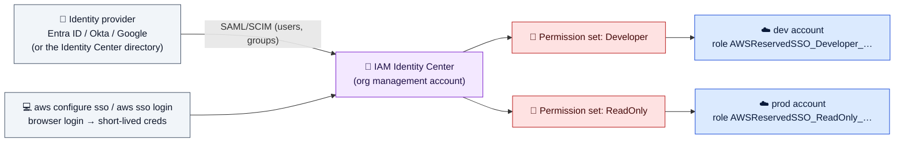

# Module 01 — Identities & Access

← [All tutorials](../README.md) · **IAM & User Management** (short tutorial), module 1 of 3

> Who can do what in AWS: identities (root, users, roles, SSO), policies, how AWS evaluates them, and the setup you should use.

*About a 20-minute read across 3 short modules, plus a 10-minute lab in Module 03.*

---

## 1. The mental model

Every AWS API call is **authenticated** (who are you?) and then **authorized** (are you allowed to do this to this resource?).

**Golden rule:** humans and workloads should use **roles with temporary credentials**. Long-lived access keys are the #1 cause of AWS account compromise.

## 2. Identities

| Identity | What it is | Use it for |
|---|---|---|
| **Root user** | The account's owner email. Unlimited power, can't be restricted by IAM | **Almost nothing.** Enable MFA, delete its access keys, lock it away (billing/account-level tasks only) |
| **IAM Identity Center** (SSO) users/groups | Workforce identities (built-in directory or your IdP: Entra ID, Okta, Google) | **All human access**, across all accounts in your AWS Organization |
| **Permission set** | A template of policies that Identity Center turns into a role in each assigned account | "Developers get PowerUser in dev, ReadOnly in prod" |
| **IAM role** | An identity **with no permanent credentials**. Whoever is trusted can assume it and gets temporary credentials | EC2 instance profiles, ECS task roles, Lambda, cross-account access, CI (OIDC) |
| **IAM user** | An identity with a password and/or **long-term access keys** | Only legacy tools or third parties that can't assume roles |
| **IAM group** | A set of IAM users. Attach policies to groups, not to users | Managing IAM users (if you must have them) |
| **Service-linked role** | A role owned by an AWS service (e.g. `AWSServiceRoleForECS`) | Created automatically, don't touch |

### Recommended human access setup

---
**Next:** [Module 02 — Policies & How AWS Evaluates Them](02-policies-and-evaluation.md)
