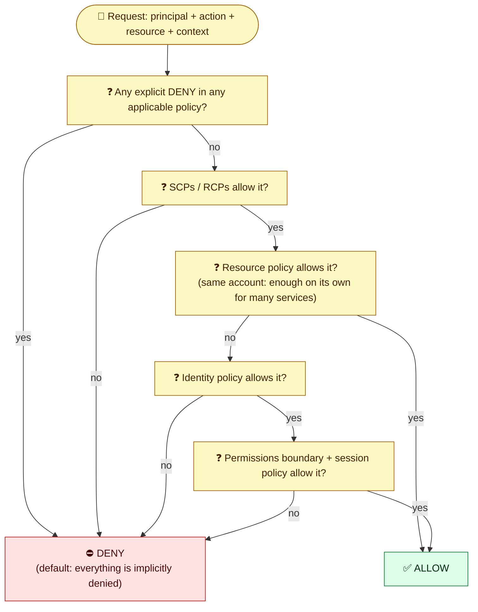

# Module 02 — Policies & How AWS Evaluates Them

← [All tutorials](../README.md) · **IAM & User Management** (short tutorial), module 2 of 3

---

## 1. Policies

```json
{
  "Version": "2012-10-17",
  "Statement": [{
    "Sid": "ReadAppBucket",
    "Effect": "Allow",
    "Action": ["s3:GetObject", "s3:ListBucket"],
    "Resource": ["arn:aws:s3:::my-app-bucket", "arn:aws:s3:::my-app-bucket/*"],
    "Condition": { "Bool": { "aws:SecureTransport": "true" } }
  }]
}
```

| Policy type | Attached to | Purpose |
|---|---|---|
| **Identity-based** (AWS-managed, customer-managed, inline) | Users, groups, roles | What this identity can do |
| **Resource-based** (S3 bucket, KMS key, SQS, Secrets Manager, Lambda…) | The resource; has a `Principal` | Who can access this resource, **including other accounts** |
| **Trust policy** | A role | **Who may assume** the role |
| **Permissions boundary** | A user or role | The *maximum* permissions it can ever get (for delegated admin) |
| **SCP / RCP** (AWS Organizations) | Accounts / OUs | Org-wide guardrails on principals (SCP) and resources (RCP). They never grant |
| **Session policy** | Passed at AssumeRole | Narrows one session |

### How AWS decides



Key rules:
- **An explicit deny always wins.** Without any allow, the answer is deny.
- **Cross-account access** needs **both** sides: the caller's identity policy allows it, **and** the resource policy (or the role trust policy) in the other account allows it.
- **Within one account**, an allow in **either** the identity policy **or** the resource policy is usually enough, unless a deny, SCP/RCP, or boundary blocks it. (The chart above is simplified. See the AWS docs "Policy evaluation logic" for the edge cases.)

---
**Previous:** [Module 01](01-identities-and-access.md) · **Next:** [Module 03 — Roles, Best Practices & Lab](03-roles-best-practices-and-lab.md)
