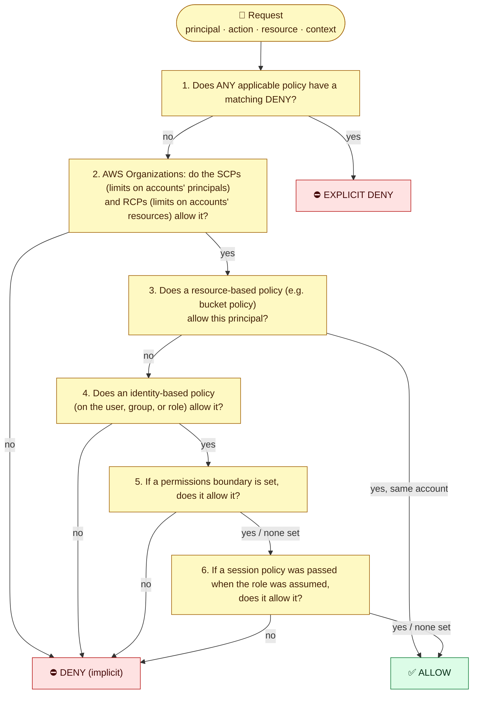

# Module 03 — Policies in Detail

← [All tutorials](../README.md) · **IAM tutorial**, module 3 of 4

Every "allowed" or "AccessDenied" you've seen so far came from **policies**: JSON documents that list what is allowed or denied. This module takes one realistic policy and explains **every line**. It then shows the two other policy shapes (trust and resource policies) and exactly how AWS combines them into a decision.

---

## 1. One policy, line by line

The `shop` app (Module 02) needs to list and upload files in the `uploads/` folder of the bucket `shop-uploads`, and read its settings from **Parameter Store** (an AWS service for storing configuration values). The bucket must never be used over plain HTTP. Here is the policy attached to the app's role:

```json
{
  "Version": "2012-10-17",
  "Statement": [
    {
      "Sid": "ListOnlyTheUploadsFolder",
      "Effect": "Allow",
      "Action": "s3:ListBucket",
      "Resource": "arn:aws:s3:::shop-uploads",
      "Condition": {
        "StringLike": { "s3:prefix": ["uploads/", "uploads/*"] }
      }
    },
    {
      "Sid": "ReadAndWriteUploads",
      "Effect": "Allow",
      "Action": ["s3:GetObject", "s3:PutObject"],
      "Resource": "arn:aws:s3:::shop-uploads/uploads/*"
    },
    {
      "Sid": "ReadAppSettings",
      "Effect": "Allow",
      "Action": "ssm:GetParameter*",
      "Resource": "arn:aws:ssm:eu-central-1:111122223333:parameter/shop/*"
    },
    {
      "Sid": "DenyPlainHttp",
      "Effect": "Deny",
      "Action": "s3:*",
      "Resource": ["arn:aws:s3:::shop-uploads", "arn:aws:s3:::shop-uploads/*"],
      "Condition": {
        "Bool": { "aws:SecureTransport": "false" }
      }
    }
  ]
}
```

### `"Version": "2012-10-17"`

The version of the **policy language**, not the date you wrote the policy. Always use exactly this value. The older `2008-10-17` doesn't support features like policy variables (Section 1.8).

### `"Statement": [ … ]`

A list of **rules**. Each statement is evaluated on its own, and **order doesn't matter**. AWS doesn't stop at the first match. It looks at all statements in all applicable policies and combines the results (Section 3). This policy has four statements.

### `"Sid": "ListOnlyTheUploadsFolder"`

An optional **statement ID**: a label for humans and error messages. Use it to say *why* the statement exists.

### `"Effect": "Allow"` or `"Deny"`

- **`Allow`** grants the listed actions on the listed resources.
- **`Deny`** forbids them, and **an explicit Deny beats any Allow, from any policy.**
- Anything not allowed by some statement is **implicitly denied**. You never need to write "deny everything else".

### `"Action"`: what may be done

```text
"s3:ListBucket"                     one action
["s3:GetObject", "s3:PutObject"]    a list (any of them)
"ssm:GetParameter*"                 wildcard: GetParameter, GetParameters, GetParametersByPath
"s3:*"                              every S3 action
```

- The format is `service-prefix:ActionName`: `s3`, `ec2`, `iam`, `dynamodb`, `sqs`, `ssm`… Action names are case-insensitive.
- Every action belongs to a **resource type**, and this matters. `s3:ListBucket` acts on a **bucket**, while `s3:GetObject` and `s3:PutObject` act on **objects**. That's why statements 1 and 2 are separate: they need different resources.
- The full list of actions, their resource types, and their condition keys for every service is in the AWS docs, *Service Authorization Reference*.
- `NotAction` (rarely needed) means "every action **except** these". Be careful: in an Allow statement it grants far more than you'd expect.

### `"Resource"`: on what

```text
arn:aws:s3:::shop-uploads                      the bucket itself (for ListBucket)
arn:aws:s3:::shop-uploads/uploads/*            every object whose key starts with "uploads/"
arn:aws:ssm:eu-central-1:111122223333:parameter/shop/*   parameters named /shop/... in one Region and account
```

- Resources are **ARNs** (Module 01 §2). `*` matches any characters, `?` matches one character.
- **The #1 S3 mistake:** writing the bucket ARN for object actions, or the object ARN for bucket actions. `s3:GetObject` on `arn:aws:s3:::shop-uploads` matches **nothing**, so every GetObject is denied.
- Some actions **can't be limited to specific resources**. "List/describe everything" actions like `ec2:DescribeInstances` and `s3:ListAllMyBuckets` require `"Resource": "*"`. The Service Authorization Reference shows which actions support resource-level permissions.

### `"Condition"`: only when…

A condition narrows a statement to requests whose **context** matches. Its structure is always:

```text
"Condition": {
  "<operator>": {
    "<condition key>": "<value>"  or  ["<value1>", "<value2>"]
  }
}
```

- **Statement 1** uses the operator `StringLike` (string match with wildcards) on the key `s3:prefix` (the folder being listed). It allows listing only when the prefix is `uploads/` or starts with `uploads/`.
- **Statement 4** uses `Bool` on the global key `aws:SecureTransport`. It **denies** any S3 request on this bucket made over plain HTTP.

**Logic rules:**
- Several operators, or several keys inside one condition block: **all** must match (AND).
- Several values for one key: **any** may match (OR). Statement 1's `["uploads/", "uploads/*"]` means "either".

| Common operators | Meaning |
|---|---|
| `StringEquals` / `StringNotEquals` / `StringLike` | Exact match / not equal / wildcard match |
| `ArnLike` / `ArnEquals` | Compare ARNs |
| `NumericLessThan`, `DateGreaterThan`, … | Numbers and timestamps |
| `Bool` | `"true"` / `"false"` keys |
| `IpAddress` / `NotIpAddress` | Source IP ranges (CIDR) |
| `…IfExists` (e.g. `StringEqualsIfExists`) | Apply only if the key is present in the request |
| `ForAnyValue:` / `ForAllValues:` prefixes | For keys with several values (e.g. tag keys in a request) |

| Useful condition keys | Meaning |
|---|---|
| `aws:SourceIp` | The caller's public IP |
| `aws:SecureTransport` | Was HTTPS used? |
| `aws:MultiFactorAuthPresent` | Did the caller sign in with MFA? |
| `aws:RequestedRegion` | Which Region the request targets |
| `aws:PrincipalTag/<key>` / `aws:ResourceTag/<key>` | Tags on the caller / on the resource (used for **ABAC**, Section 4) |
| `aws:PrincipalOrgID` | The caller belongs to your AWS Organization |
| `aws:SourceVpce` | The request came through a specific VPC endpoint |
| Service keys such as `s3:prefix`, `ec2:InstanceType`, `iam:PassedToService` | Details specific to one service |

### `"Principal"`: who (only in some policies)

This policy has **no `Principal`**, and it doesn't need one. It's an **identity-based policy**, attached to a role, so the principal is whoever uses that role. `Principal` appears only in **trust policies** and **resource-based policies** (Section 2).

### Policy variables

Policies can contain placeholders that AWS fills in per request. For example, give every IAM user their own folder:

```json
"Resource": "arn:aws:s3:::team-home/${aws:username}/*"
```

`${aws:PrincipalTag/team}` is common too: "you can only touch resources tagged with your team".

---

## 2. Test the policy against real requests

Here's how AWS decides five requests from the `shop` app against the policy above:

| # | Request | Action, resource, context | Decision | Why |
|---|---|---|---|---|
| 1 | `aws s3 ls s3://shop-uploads/uploads/` | `s3:ListBucket` on the bucket, prefix `uploads/` | ✅ Allow | Statement 1 matches (bucket ARN + prefix condition) |
| 2 | `aws s3 ls s3://shop-uploads/private/` | `s3:ListBucket`, prefix `private/` | ❌ Implicit deny | Statement 1's condition doesn't match, and nothing else allows it |
| 3 | `aws s3 cp a.png s3://shop-uploads/uploads/a.png` | `s3:PutObject` on `…/uploads/a.png`, HTTPS | ✅ Allow | Statement 2 matches. Statement 4 doesn't apply (it's HTTPS) |
| 4 | `aws s3 rm s3://shop-uploads/uploads/a.png` | `s3:DeleteObject` | ❌ Implicit deny | `DeleteObject` isn't listed anywhere |
| 5 | An old client downloads via `http://` | `s3:GetObject`, `SecureTransport=false` | ❌ **Explicit deny** | Statement 2 allows it, but statement 4's Deny wins |

You'll reproduce this table yourself in Section 5, without creating anything.

---

## 3. The two other policy shapes

### Trust policy (who may assume a role)

```json
{
  "Version": "2012-10-17",
  "Statement": [{
    "Effect": "Allow",
    "Principal": { "AWS": "arn:aws:iam::999988887777:root" },
    "Action": "sts:AssumeRole",
    "Condition": { "StringEquals": { "sts:ExternalId": "vendor-7f3a" } }
  }]
}
```

- **`Principal`** names who may assume the role:
  - `{"Service": "ec2.amazonaws.com"}`: an AWS service (Module 02).
  - `{"AWS": "arn:aws:iam::ACCOUNT:root"}`: another account. Its admins then decide which of their identities may use it.
  - `{"AWS": "arn:aws:iam::ACCOUNT:role/ci"}`: one specific role.
  - `{"Federated": "…oidc-provider/…"}`: an external identity provider, such as GitHub Actions (Module 04).
- **`Action`** is `sts:AssumeRole`, or `sts:AssumeRoleWithWebIdentity` for OIDC.
- **This example** lets a monitoring vendor's account assume the role, but only with the agreed **external ID**. That stops other customers of the same vendor from tricking it into accessing your account.
- The trust policy only says who may **enter**. What they can do inside is defined by the role's permission policies.

### Resource-based policy (S3 bucket policy)

```json
{
  "Version": "2012-10-17",
  "Statement": [{
    "Sid": "AnalyticsAccountCanRead",
    "Effect": "Allow",
    "Principal": { "AWS": "arn:aws:iam::444455556666:role/analytics-reader" },
    "Action": ["s3:GetObject", "s3:ListBucket"],
    "Resource": ["arn:aws:s3:::shop-uploads", "arn:aws:s3:::shop-uploads/*"]
  }]
}
```

- It's attached **to the bucket**, so it says **who** (`Principal`) may do what to *this* bucket.
- **Cross-account rule:** for the role in account `444455556666` to actually read, **both sides** must allow it. This bucket policy grants access, **and** the role's own identity policy in its account must also allow `s3:GetObject` on this bucket.
- **`"Principal": "*"`** means *anyone, even anonymous internet users*. Only use it with strong conditions (for example `aws:PrincipalOrgID`), and keep **S3 Block Public Access** on.

### Where policies live

| Kind | What it is | When to use it |
|---|---|---|
| **AWS managed** policy | Written and updated by AWS (`ReadOnlyAccess`, `AmazonS3ReadOnlyAccess`, `PowerUserAccess`…) | Quick starts, job-function access, Identity Center permission sets |
| **Customer managed** policy | Written by you, reusable, versioned (up to 5 versions) | **Your default** for application permissions |
| **Inline** policy | Embedded in exactly one user, group, or role. Deleted with it | Strict one-to-one permissions |

---

## 4. How AWS makes the decision

AWS gathers **every** policy that applies to a request and evaluates them together:



**How to read it, in plain words:**
1. **Default deny.** Nothing is allowed unless something allows it.
2. **Explicit deny wins.** One matching `Deny` anywhere ends the evaluation.
3. **Guardrails only limit.** SCPs, RCPs, permissions boundaries, and session policies **never grant** permissions. They only cap what the other policies can grant. If they're absent, they don't restrict anything.
4. **One allow is enough within an account.** A matching Allow in the identity policy **or** the resource policy is enough, if no guardrail blocks it. (This chart simplifies a few edge cases. The AWS docs page *Policy evaluation logic* has every detail.)
5. **Across accounts, both sides must allow it:** the caller's identity policy **and** the resource's policy (or the role's trust policy).

### The guardrails in one sentence each

- **Permissions boundary:** a maximum-permissions policy you attach to a user or role. It lets you delegate "create roles for your app" to a team without letting them create an admin role.
- **SCP (Service Control Policy):** set in AWS Organizations on accounts or organizational units, e.g. "nobody in these accounts may use Regions outside the EU" or "nobody may disable CloudTrail". It applies even to admins (not to the management account).
- **RCP (Resource Control Policy):** like an SCP, but it limits who can access your **resources**, e.g. "our S3 buckets can only be accessed by principals in our organization".
- **Session policy:** an extra policy passed when assuming a role, which narrows that one session.

---

## 5. Try it: evaluate the policy without creating anything

`simulate-custom-policy` runs AWS's real evaluation engine against a policy you pass in. The bucket doesn't even need to exist.

```bash
cat > /tmp/shop-policy.json <<'EOF'
{"Version":"2012-10-17","Statement":[
 {"Sid":"ListOnlyTheUploadsFolder","Effect":"Allow","Action":"s3:ListBucket","Resource":"arn:aws:s3:::shop-uploads",
  "Condition":{"StringLike":{"s3:prefix":["uploads/","uploads/*"]}}},
 {"Sid":"ReadAndWriteUploads","Effect":"Allow","Action":["s3:GetObject","s3:PutObject"],"Resource":"arn:aws:s3:::shop-uploads/uploads/*"},
 {"Sid":"ReadAppSettings","Effect":"Allow","Action":"ssm:GetParameter*","Resource":"arn:aws:ssm:eu-central-1:111122223333:parameter/shop/*"},
 {"Sid":"DenyPlainHttp","Effect":"Deny","Action":"s3:*","Resource":["arn:aws:s3:::shop-uploads","arn:aws:s3:::shop-uploads/*"],
  "Condition":{"Bool":{"aws:SecureTransport":"false"}}}]}
EOF

sim() {  # action  resource  [context entries...]
  aws iam simulate-custom-policy --policy-input-list file:///tmp/shop-policy.json \
    --action-names "$1" --resource-arns "$2" --context-entries "${@:3}" \
    --query 'EvaluationResults[0].[EvalActionName,EvalDecision]' --output text
}
HTTPS="ContextKeyName=aws:SecureTransport,ContextKeyValues=true,ContextKeyType=boolean"
HTTP="ContextKeyName=aws:SecureTransport,ContextKeyValues=false,ContextKeyType=boolean"

sim s3:ListBucket   arn:aws:s3:::shop-uploads                "$HTTPS" "ContextKeyName=s3:prefix,ContextKeyValues=uploads/,ContextKeyType=string"   # 1 allowed
sim s3:ListBucket   arn:aws:s3:::shop-uploads                "$HTTPS" "ContextKeyName=s3:prefix,ContextKeyValues=private/,ContextKeyType=string"   # 2 implicitDeny
sim s3:PutObject    arn:aws:s3:::shop-uploads/uploads/a.png  "$HTTPS"                                                                              # 3 allowed
sim s3:DeleteObject arn:aws:s3:::shop-uploads/uploads/a.png  "$HTTPS"                                                                              # 4 implicitDeny
sim s3:GetObject    arn:aws:s3:::shop-uploads/uploads/a.png  "$HTTP"                                                                               # 5 explicitDeny
```

Now break it on purpose. Change statement 2's resource to the **bucket** ARN (`arn:aws:s3:::shop-uploads`) and rerun request 3: it becomes `implicitDeny`. That's the #1 S3 mistake from Section 1.

Finally, let **IAM Access Analyzer** review the policy for errors and risky patterns:

```bash
aws accessanalyzer validate-policy --policy-type IDENTITY_POLICY --policy-document file:///tmp/shop-policy.json \
  --query 'findings[].[findingType,issueCode,findingDetails]' --output table
rm -f /tmp/shop-policy.json
```

---

## Check yourself

<details><summary>A statement allows `s3:GetObject` on `arn:aws:s3:::reports`. Why does every download fail?</summary>GetObject acts on objects. The resource must be `arn:aws:s3:::reports/*` (or a narrower object path).</details>
<details><summary>Two values for one condition key, and two keys in one condition: AND or OR?</summary>Values of one key: OR. Different keys or operators: AND.</details>
<details><summary>Policy A allows `s3:*`, policy B denies `s3:DeleteObject`. Can the user delete objects?</summary>No. An explicit deny always wins.</details>
<details><summary>Why doesn't an identity-based policy have a Principal element?</summary>Its principal is whoever the policy is attached to. Principal appears only in trust and resource-based policies.</details>
<details><summary>Can an SCP give someone permission to use EC2?</summary>No. SCPs, RCPs, boundaries, and session policies only limit. Permissions are granted by identity or resource policies.</details>

---
**Previous:** [Module 02](02-how-services-use-iam.md) · **Next:** [Module 04 — Setting Up an Account the Right Way](04-secure-account-setup.md)
