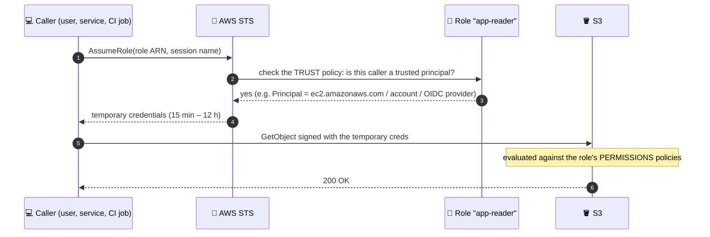

# Module 03 — Roles, Best Practices & Lab

← [All tutorials](../README.md) · **IAM & User Management** (short tutorial), module 3 of 3

---

## 1. Roles in depth

A role has **two** policies: the **trust policy** (who can assume it) and the **permissions policies** (what it can do once assumed).



| Pattern | Trust policy principal |
|---|---|
| EC2 instance profile | `"Service": "ec2.amazonaws.com"` |
| ECS task role / execution role | `"Service": "ecs-tasks.amazonaws.com"` |
| Lambda execution role | `"Service": "lambda.amazonaws.com"` |
| Cross-account access | `"AWS": "arn:aws:iam::<other-account>:root"` (+ `sts:ExternalId` for third parties) |
| **GitHub Actions / GitLab CI without keys** | `"Federated": "arn:aws:iam::<acct>:oidc-provider/token.actions.githubusercontent.com"` + `sub` condition on the repo/branch |

## 2. Best practices and tools

- [ ] Root: MFA, no access keys, alternate contacts set.
- [ ] Humans: **IAM Identity Center** + MFA. No IAM users for people.
- [ ] Workloads: **roles** only (instance profiles, task roles, OIDC for CI). **Zero long-lived keys.**
- [ ] **Least privilege:** start from AWS-managed job policies, then tighten with **IAM Access Analyzer** policy generation and **last-accessed** data.
- [ ] **Guardrails:** SCPs (e.g. deny leaving the org, deny disabling CloudTrail, region allow-list), plus permissions boundaries for teams that create roles.
- [ ] **ABAC:** use tag conditions (`aws:PrincipalTag/team` = `aws:ResourceTag/team`) to scale permissions.
- [ ] **Audit:** CloudTrail on in all Regions. Access Analyzer for external and unused access. Credential report.

---

## 3. Mini lab: create a role, assume it, hit a deny

```bash
ACCOUNT_ID=$(aws sts get-caller-identity --query Account --output text)
cat > /tmp/trust.json <<EOF
{"Version":"2012-10-17","Statement":[{"Effect":"Allow","Principal":{"AWS":"arn:aws:iam::$ACCOUNT_ID:root"},"Action":"sts:AssumeRole"}]}
EOF
aws iam create-role --role-name lab-s3-reader --assume-role-policy-document file:///tmp/trust.json --max-session-duration 3600 >/dev/null
aws iam attach-role-policy --role-name lab-s3-reader --policy-arn arn:aws:iam::aws:policy/AmazonS3ReadOnlyAccess
sleep 10

# Assume it and use the temporary credentials in a subshell
( CREDS=$(aws sts assume-role --role-arn arn:aws:iam::$ACCOUNT_ID:role/lab-s3-reader --role-session-name lab \
    --query 'Credentials.[AccessKeyId,SecretAccessKey,SessionToken]' --output text)
  export AWS_ACCESS_KEY_ID=$(echo $CREDS | cut -d' ' -f1) AWS_SECRET_ACCESS_KEY=$(echo $CREDS | cut -d' ' -f2) AWS_SESSION_TOKEN=$(echo $CREDS | cut -d' ' -f3)
  aws sts get-caller-identity --query Arn --output text      # ...:assumed-role/lab-s3-reader/lab
  aws s3 ls | head -3                                        # allowed
  aws ec2 describe-vpcs --max-items 1 2>&1 | tail -1         # UnauthorizedOperation (implicit deny)
)

# Ask IAM "would this be allowed?" without calling the API
aws iam simulate-principal-policy --policy-source-arn arn:aws:iam::$ACCOUNT_ID:role/lab-s3-reader \
  --action-names s3:GetObject s3:PutObject ec2:DescribeVpcs \
  --query 'EvaluationResults[].[EvalActionName,EvalDecision]' --output table

# Cleanup
aws iam detach-role-policy --role-name lab-s3-reader --policy-arn arn:aws:iam::aws:policy/AmazonS3ReadOnlyAccess
aws iam delete-role --role-name lab-s3-reader && rm -f /tmp/trust.json
```

---

## Check yourself

<details><summary>Should a developer get an IAM user with access keys?</summary>No. Give them Identity Center (SSO) access with a permission set. The CLI uses short-lived credentials via `aws sso login`.</details>
<details><summary>A role has S3 full access, but the request is denied. Name two possible causes.</summary>An explicit deny (bucket policy, SCP, boundary), or the resource is in another account whose bucket policy doesn't allow this role.</details>
<details><summary>What are the two policies on every role?</summary>The trust policy (who can assume it) and the permissions policies (what it can do).</details>
<details><summary>How does GitHub Actions deploy to AWS without stored keys?</summary>OIDC federation: an IAM OIDC provider plus a role whose trust policy matches the repo and branch claims.</details>

---
**Previous:** [Module 02](02-policies-and-evaluation.md) · **Back to:** [All tutorials](../README.md)
