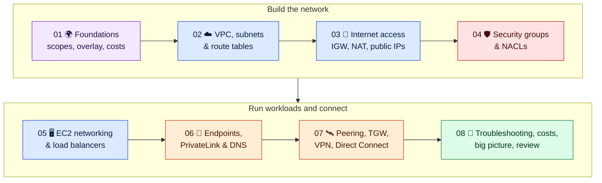
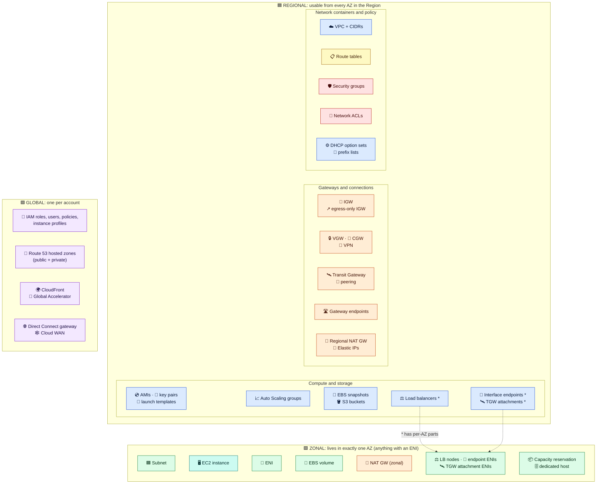
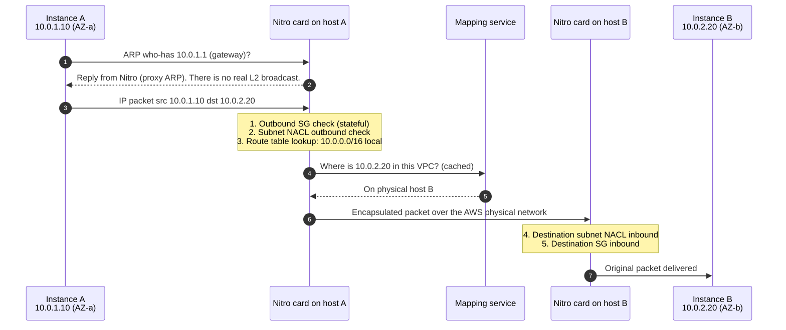

# Module 01 — Foundations: How AWS Networking Works

← [All tutorials](../README.md) · **AWS Networking tutorial**, module 1 of 8

## Tutorial overview

A compact, diagram-driven course for developers and network engineers who need to **understand how AWS networking works internally** and **make sound design decisions** about VPCs, subnets, route tables, gateways, security groups, EC2, endpoints, and hybrid connectivity. It has 8 modules, each ending with a short hands-on AWS CLI lab that builds on the previous one.

### Course map

| # | Module | You'll learn |
|---|---|---|
| 01 | [Foundations](01-foundations.md) | Network concepts mapped to AWS; global/regional/zonal scopes; how the VPC overlay works; cost basics |
| 02 | [VPC, subnets & route tables](02-vpc-subnets-and-route-tables.md) | What a VPC contains and accepts; the subnet's role; where route tables attach and how they're populated |
| 03 | [Internet access](03-internet-access.md) | IGW vs NAT gateway, public IP types, HA egress design |
| 04 | [Security groups & NACLs](04-security-groups-and-nacls.md) | Stateful vs stateless filtering, the evaluation pipeline, SG chaining |
| 05 | [EC2 networking & load balancers](05-ec2-networking-and-load-balancers.md) | Launch components, ENIs, IP lifecycle, IAM roles, safe access, ALB vs NLB |
| 06 | [Private access & DNS](06-private-access-and-dns.md) | Gateway vs interface endpoints, PrivateLink, Route 53 Resolver, hybrid DNS |
| 07 | [Connecting networks](07-connecting-networks.md) | Peering vs Transit Gateway vs PrivateLink, VPN, Direct Connect, route preference |
| 08 | [Operate & review](08-operate-and-review.md) | Troubleshooting, cleanup, cost traps, the full architecture, decision cheat sheet, quick answers |

### The five questions this tutorial answers

1. **Is a route table assigned to EC2, a subnet, or the VPC? What's its role, and how is it populated?** → [Module 02 §3](02-vpc-subnets-and-route-tables.md#3-route-tables)
2. **What does a VPC contain, and what can you attach to it?** → [Module 02 §1](02-vpc-subnets-and-route-tables.md#1-the-vpc)
3. **What's the role of a subnet, and is it required?** → [Module 02 §2](02-vpc-subnets-and-route-tables.md#2-subnets)
4. **What must you assign when launching EC2?** → [Module 05 §1](05-ec2-networking-and-load-balancers.md#1-what-you-assign-at-launch-course-question-4)
5. **What's a security group? Can you skip it? Is it attached to the instance, the subnet, or the VPC?** → [Module 04 §3](04-security-groups-and-nacls.md#3-security-groups-what-you-must-know)

All five answers are summarized together in [Module 08 §6](08-operate-and-review.md#6-the-five-questions-quick-answers).

> [!WARNING]
> The labs create billable resources (a NAT gateway, public IPv4 addresses, flow logs). Set a budget alert and run the cleanup in [Module 08](08-operate-and-review.md#2-hands-on-break-it-diagnose-it-then-clean-up).

*Reflects AWS as of 2025–2026 (Regional NAT gateway, 5 Gbps VPN tunnels, VPC Route Server, Block Public Access, hourly public IPv4 pricing). Confirm quotas and prices for your Region.*

---

> Know where every resource lives (global, regional, or zonal) and how the VPC network behaves under the hood. Everything later builds on this.

---

## 1. Your networking knowledge, translated

| On-prem concept | AWS equivalent | What's different |
|---|---|---|
| Routing domain / private network | **VPC** | Regional, defined by CIDRs, isolated by default |
| VLAN / L2 segment | **Subnet** | One AZ only. No broadcast, no multicast, ARP answered by the hypervisor |
| Default gateway / core router | **Implicit VPC router** (subnet `.1`) | Invisible and distributed. You only control its **route tables** |
| Routing table | **Route table** | Associated with **subnets**, not devices |
| VRF | **Transit Gateway route table** | VPC route tables aren't VRFs |
| Stateful host firewall | **Security group** | Per network interface (ENI), allow-only |
| Router ACL | **Network ACL** | Per subnet, stateless, ordered |
| Edge router + NAT | **Internet gateway** | Also does 1:1 NAT to public IPs |
| PAT / NAT overload | **NAT gateway** | Managed, outbound only |
| IPsec / MPLS / leased line | **Site-to-Site VPN / Direct Connect** | BGP over IPsec tunnels or 802.1Q VLANs |
| NIC | **ENI** (Elastic Network Interface) | Holds IPs, MAC, SGs. Can move between instances in the same AZ |
| NetFlow / SPAN | **VPC Flow Logs / Traffic Mirroring** | Flow metadata only / VXLAN packet copies |
| VRRP / HSRP | ❌ Not available | Fail over by moving an ENI or IP, changing a route, or using a load balancer |

---

## 2. Regions, AZs, and resource scopes

- A **Region** (`eu-central-1`) is fully independent, with its own APIs and resources. A **VPC never spans Regions.**
- An **Availability Zone** is one or more data centers with independent power and networking. **The AZ is your failure domain.**
- AZ **names** (`us-east-1a`) are shuffled per account. AZ **IDs** (`use1-az4`) are identical everywhere, so use IDs across accounts.
- Local Zones, Wavelength Zones, and Outposts extend a VPC by adding a **subnet** in that location.

**Rules of thumb**
- If it has an IP address on the wire, it's **zonal**. Policy and container objects are **regional**. Identity and DNS are **global**.
- Zonal things only combine **within the same AZ**: an EBS volume or ENI can only attach to an instance in its own AZ.
- Regional objects are usable from every AZ. One security group or route table can serve subnets in all AZs.

---

## 3. Under the hood: the VPC is an overlay

When you change the network, you call a **regional API** (control plane). The change is pushed to the **Nitro card** on every host, and the Nitro cards enforce routes, SGs, and NACLs and encapsulate packets (data plane). There is **no central router or firewall box**.

**Consequences you'll actually hit:**
- **No broadcast or multicast** (except via Transit Gateway multicast). **No promiscuous sniffing**: use Traffic Mirroring instead.
- **No VRRP or gratuitous-ARP failover.** For HA, use a load balancer, move a secondary IP or ENI, or update a route target.
- **Source/destination check** drops traffic that isn't to or from the ENI's own IPs. Disable it on NAT instances, firewalls, and routers.
- Changes are **eventually consistent**. In scripts, use `aws ec2 wait …` or poll, rather than assuming instant effect.
- Running traffic keeps flowing even if the control plane has issues (**static stability**).

---

## 4. Cost basics that drive design

| Traffic | Cost (check pricing for your Region) |
|---|---|
| Same AZ, private IPs | Free |
| Cross-AZ | ~$0.01/GB **each direction** |
| Via a NAT gateway | Hourly + per GB processed |
| Any public IPv4 (in use or idle) | ~$0.005/hour each |
| Internet egress | Per GB (ingress is free) |

**Design implication:** keep chatty traffic inside an AZ where that's safe, always use private IPs inside AWS, use one NAT per AZ, and use endpoints for AWS services.

---

## Check yourself

Is a subnet regional or zonal? A security group?
A subnet is zonal (one AZ). A security group is regional (VPC-scoped) and usable in every AZ.

Can an EBS volume in AZ-a attach to an instance in AZ-b?
No. Both are zonal. Snapshot the volume and restore it in AZ-b.

Where are security group rules enforced?
On the Nitro card of each instance's host. Enforcement is distributed, so there's no central firewall.

---
**Next:** [Module 02 — VPC, Subnets & Route Tables](02-vpc-subnets-and-route-tables.md)
