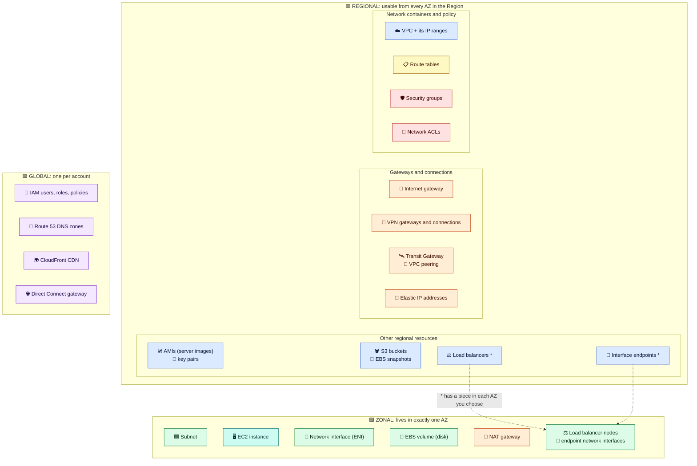

# Module 01 — Regions, Availability Zones & Your First VPC

← [All tutorials](../README.md) · **Networking tutorial**, module 1 of 8

Anything you run on AWS (a server, a database, a container) needs a network. It needs an IP address, a way to talk to the other parts of your application, and rules about who may reach it from the internet. In AWS, that network is a **VPC (Virtual Private Cloud)**.

In this tutorial you build the network for a typical web application, one piece per module:

- **01:** where things run (Regions, Availability Zones) and your first VPC
- **02:** subnets and routing, so some servers can reach the internet and others can't
- **03:** firewalls: security groups and network ACLs
- **04:** launching EC2 servers into the network and connecting to them safely
- **05:** a load balancer that receives customer traffic
- **06:** private access to AWS services (like S3) and how DNS works inside a VPC
- **07:** connecting to other VPCs and to an office or data center
- **08:** troubleshooting, costs, the full picture, and cleanup

By Module 05 you'll have this: customers reach a load balancer, the application servers have no public address, the database tier has no internet access at all, and the servers can still download updates and use S3.

> The labs use the AWS CLI and build that network step by step. Some parts cost money while they exist (mainly a NAT gateway and a load balancer). Module 08 removes everything.

---

## 1. Regions and Availability Zones

A **Region** is a geographic area where AWS runs data centers, for example `eu-central-1` (Frankfurt) or `us-east-1` (N. Virginia). Regions are independent of each other. When you create a resource, you create it **in one Region**, and it doesn't appear in any other. In the console, you choose the Region in the top-right menu. In the CLI, you set it with `--region` or the `AWS_REGION` environment variable.

Each Region contains three or more **Availability Zones (AZs)**. An AZ is one or more separate data centers with their own power, cooling, and network, connected to the other AZs of the Region by fast private links. AZs exist so that **a failure in one building doesn't take down your application**. The basic rule of AWS architecture is to run at least two copies of everything important, in two different AZs.

```console
$ aws ec2 describe-availability-zones --region eu-central-1 \
    --query 'AvailabilityZones[].[ZoneName,ZoneId]' --output table
-------------------------------------
|  eu-central-1a   |  euc1-az2      |
|  eu-central-1b   |  euc1-az3      |
|  eu-central-1c   |  euc1-az1      |
-------------------------------------
```

The **zone name** (`eu-central-1a`) is a per-account label: your `1a` may be a different physical AZ than a colleague's `1a`. The **zone ID** (`euc1-az2`) is the same in every account. Use zone IDs when you coordinate with other accounts.

## 2. Where AWS resources live

Every AWS resource has a **scope**. Knowing it tells you where you can use the resource and what it can be attached to:

- **Global**: one per account, usable everywhere (IAM roles, Route 53 DNS zones).
- **Regional**: lives in one Region, usable from all of its AZs (a VPC, a security group, an S3 bucket).
- **Zonal**: lives in exactly one AZ (a subnet, an EC2 instance, an EBS disk).



**How to read it:** the color of a box tells you its scope. The practical rules follow from it:
- **Zonal things combine only within the same AZ.** An EBS disk in `eu-central-1a` can only attach to an instance in `eu-central-1a`. To move it, you copy it (snapshot) and restore it in the other AZ.
- **Regional things work across AZs.** One security group or route table can serve subnets in every AZ of the VPC.
- **Nothing crosses Regions by itself.** To use a server image (AMI) in another Region, you copy it there.
- The items marked **\*** are regional resources that place a piece (a network interface) in each AZ you pick. Modules 05 and 06 explain them.

---

## 3. What a VPC is

A **VPC** is your own private, isolated network inside **one Region**. It spans **all the AZs** of that Region. When you create it, you choose its **IP address range**. Nothing can enter or leave a new VPC until you add a gateway, routes, and firewall rules: it's closed by default.

### IP ranges in one minute (CIDR)

AWS writes IP ranges in **CIDR notation**: a starting address plus a **prefix length**. The prefix length says how many leading bits are fixed. The fewer bits fixed, the bigger the range:

| CIDR | Addresses | Typical use |
|---|---|---|
| `10.0.0.0/16` | 65,536 (10.0.0.0 – 10.0.255.255) | A whole VPC (the largest allowed) |
| `10.0.16.0/20` | 4,096 | A large subnet (container platforms) |
| `10.0.1.0/24` | 256 (10.0.1.0 – 10.0.1.255) | A typical subnet |
| `10.0.1.0/28` | 16 | The smallest subnet allowed |

Use addresses from the **private ranges** reserved for internal networks: `10.0.0.0/8`, `172.16.0.0/12`, `192.168.0.0/16`. Choose a range that **won't overlap** with any network you might connect later: other VPCs, your office, a partner. Overlapping ranges can't be routed to each other, and you **can't change a VPC's main range** after creation (you can only add extra ranges). A common plan gives each environment its own `/16`: `10.0.0.0/16` for dev, `10.1.0.0/16` for prod, and so on.

### What comes with every VPC

Creating a VPC also creates a few things automatically. You'll meet each one when it matters:

| Created automatically | What it does | Explained in |
|---|---|---|
| A **router** (invisible) | Moves traffic between the VPC's subnets and its gateways | Module 02 |
| A **main route table** | Default routing rules for subnets | Module 02 |
| A **default security group** | Default firewall for servers | Module 03 |
| A **default network ACL** | Default subnet-level filter (allows everything) | Module 03 |
| A **DNS resolver** at the second address of the range (e.g. `10.0.0.2`) | Lets servers look up names | Module 06 |

### The default VPC

Every Region in your account already has a **default VPC** (`172.31.0.0/16`) with a public subnet in each AZ, so you can launch a server immediately. That's handy for experiments, but don't use it for production: every subnet in it is reachable from the internet, and its range is identical in every account and Region, so it can never be connected to other default VPCs.

<details><summary><b>If you know traditional networking</b>: how AWS maps to it</summary>

| On-premises | AWS | Difference |
|---|---|---|
| Routing domain | VPC | Regional, closed by default |
| VLAN / L2 segment | Subnet | One AZ only. No broadcast or multicast. ARP is answered by AWS |
| Default gateway | The VPC router at the subnet's `.1` address | Invisible, you can't log in to it. You control it only through route tables |
| Stateful firewall | Security group | Attached to each server's network interface |
| Router ACL | Network ACL | Attached to subnets, stateless |
| Edge router + NAT | Internet gateway / NAT gateway | Managed, no capacity planning |
| VRRP / HSRP virtual IP | Not available | Fail over with a load balancer, by moving an IP or network interface, or by changing a route |
| NetFlow / SPAN | VPC Flow Logs / Traffic Mirroring | |
</details>

---

## 4. Try it: set up the lab and create your VPC

**What you need:** the AWS CLI v2, signed in with administrator permissions (see the [IAM tutorial](../iam/01-how-access-works.md)), and a **bash** shell. The lab saves its IDs to a file, so you can stop and resume later.

```bash
bash
export AWS_REGION=eu-central-1 AWS_DEFAULT_REGION=eu-central-1     # pick your Region
save() { echo "export $1=\"${!1}\"" >> ~/aws-lab.env; }   # new shell later? run bash, re-run these two lines, then: source ~/aws-lab.env
aws sts get-caller-identity
```

Create the VPC with the range `10.0.0.0/16`, and turn on DNS hostnames (needed later for private DNS features):

```bash
VPC_ID=$(aws ec2 create-vpc --cidr-block 10.0.0.0/16 \
  --tag-specifications 'ResourceType=vpc,Tags=[{Key=Name,Value=lab-vpc}]' \
  --query Vpc.VpcId --output text); save VPC_ID
aws ec2 modify-vpc-attribute --vpc-id $VPC_ID --enable-dns-hostnames '{"Value":true}'
echo $VPC_ID
```

Now look at what AWS created with it:

```bash
aws ec2 describe-route-tables    --filters Name=vpc-id,Values=$VPC_ID --query 'RouteTables[].{Id:RouteTableId,Routes:Routes[].[DestinationCidrBlock,GatewayId]}'
aws ec2 describe-security-groups --filters Name=vpc-id,Values=$VPC_ID --query 'SecurityGroups[].[GroupId,GroupName]' --output table
aws ec2 describe-network-acls    --filters Name=vpc-id,Values=$VPC_ID --query 'NetworkAcls[].[NetworkAclId,IsDefault]' --output table
```

You'll see **one route table** with a single route (`10.0.0.0/16 → local`), **one security group** named `default`, and **one network ACL**. The VPC exists, but it has no subnets yet, so nothing can run in it. That's Module 02.

---

## Check yourself

<details><summary>Why should an application run in at least two AZs?</summary>An AZ is a failure domain (separate power, cooling, network). A second copy in another AZ keeps the app running if one AZ fails.</details>
<details><summary>Can an EBS disk created in eu-central-1a be attached to an instance in eu-central-1b?</summary>No. Both are zonal and in different AZs. Snapshot the disk and create a new one in 1b.</details>
<details><summary>Your company network uses 10.0.0.0/16. What VPC range would you choose, and why?</summary>Any private range that doesn't overlap, for example 10.20.0.0/16. Overlapping ranges can't be routed between when you connect them.</details>

---
**Next:** [Module 02 — Subnets, Routing & Internet Access](02-subnets-routing-and-internet-access.md)
