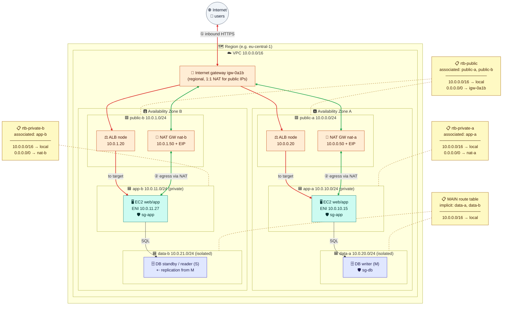

# Module 02 — Subnets, Routing & Internet Access

← [All tutorials](../README.md) · **Networking tutorial**, module 2 of 8

Your VPC from Module 01 is an empty address range. In this module you divide it into **subnets**, decide where each subnet's traffic goes with **route tables**, and give the network two kinds of internet access: **in and out** for the public tier, and **out only** for the application tier.

This is what you'll have at the end of the module. The rest of the module builds it piece by piece, then explains how to read it.



---

## 1. Subnets

A **subnet** is a part of the VPC's address range that lives in **exactly one Availability Zone**. Every server, database, or load balancer you create gets its network interface (and so its IP address) from a subnet. The subnet decides **which AZ it runs in** and **which IP it gets**.

We'll use three **tiers**, each in two AZs:

| Tier | Subnets | What runs there | Internet access |
|---|---|---|---|
| **Public** | `public-a` 10.0.0.0/24 · `public-b` 10.0.1.0/24 | Load balancer, NAT gateway | In and out |
| **App** (private) | `app-a` 10.0.10.0/24 · `app-b` 10.0.11.0/24 | Application servers | Out only |
| **Data** (isolated) | `data-a` 10.0.20.0/24 · `data-b` 10.0.21.0/24 | Databases | None |

Things to know about subnets:
- **AWS reserves 5 addresses in every subnet:** the first four (`.0` network, `.1` router, `.2` DNS, `.3` reserved) and the last one. A `/24` gives you 251 usable addresses, and the smallest subnet (`/28`) gives you 11.
- **A subnet can't be resized or moved to another AZ.** Make application subnets generously sized. Containers and load balancers consume addresses quickly.
- A VPC can exist without subnets, but **every EC2 instance must be launched into a subnet**.

**Try it (part A): create the six subnets.**

```bash
AZ1=$(aws ec2 describe-availability-zones --filters Name=zone-type,Values=availability-zone --query 'AvailabilityZones[0].ZoneName' --output text); save AZ1
AZ2=$(aws ec2 describe-availability-zones --filters Name=zone-type,Values=availability-zone --query 'AvailabilityZones[1].ZoneName' --output text); save AZ2

mk_subnet() { aws ec2 create-subnet --vpc-id $VPC_ID --cidr-block $2 --availability-zone $3 \
  --tag-specifications "ResourceType=subnet,Tags=[{Key=Name,Value=$1}]" --query Subnet.SubnetId --output text; }
PUB_A=$(mk_subnet public-a 10.0.0.0/24 $AZ1);   save PUB_A
PUB_B=$(mk_subnet public-b 10.0.1.0/24 $AZ2);   save PUB_B
APP_A=$(mk_subnet app-a 10.0.10.0/24 $AZ1);     save APP_A
APP_B=$(mk_subnet app-b 10.0.11.0/24 $AZ2);     save APP_B
DATA_A=$(mk_subnet data-a 10.0.20.0/24 $AZ1);   save DATA_A
DATA_B=$(mk_subnet data-b 10.0.21.0/24 $AZ2);   save DATA_B

aws ec2 describe-subnets --filters Name=vpc-id,Values=$VPC_ID \
  --query 'Subnets[].[Tags[?Key==`Name`]|[0].Value,CidrBlock,AvailabilityZone,AvailableIpAddressCount]' --output table
```

The last column shows 251 for each `/24`: the 5 reserved addresses are already gone.

---

## 2. Route tables: where traffic goes

Every VPC has a built-in **router**. You never see it or log in to it. Every subnet's first usable address (`.1`) is this router, and servers send all traffic for other subnets or the outside world to it.

What the router does with a packet is decided by a **route table**: a list of rules of the form *"traffic to this destination → send it to this target"*.

```console
$ aws ec2 describe-route-tables --route-table-ids rtb-0app0a --query 'RouteTables[0].Routes'
[
  { "DestinationCidrBlock": "10.0.0.0/16", "GatewayId": "local",          "State": "active" },
  { "DestinationCidrBlock": "0.0.0.0/0",   "NatGatewayId": "nat-0a1b2c3d", "State": "active" }
]
```

Read it as: *"Anything for `10.0.x.x` stays inside the VPC. Everything else (`0.0.0.0/0` means 'any address') goes to the NAT gateway."*

The rules that matter:
1. **Route tables are attached to subnets, not to servers.** Each subnet is associated with **exactly one** route table, and one table can serve many subnets. A server simply uses the route table of the subnet it's in. If you don't associate a subnet with a table, it uses the VPC's **main route table**.
2. **Every table has a `local` route, and you can't remove it.** It's explained in the next subsection.
3. **The most specific match wins.** For a packet to `10.0.20.5`, the route `10.0.0.0/16` beats `0.0.0.0/0`, because it matches more leading bits (`/16` vs `/0`).
4. **The source subnet's table decides.** Each packet is routed by the table of the subnet it **leaves from**. Replies are routed by the table of the subnet *they* leave from.
5. **If a route's target is deleted** (say, a NAT gateway), the route shows `blackhole` and its traffic is dropped.

### The `local` route: traffic that stays inside the VPC

Every route table in the VPC starts with this route, and AWS adds it automatically:

```text
10.0.0.0/16  →  local
```

- **Destination `10.0.0.0/16`** is the VPC's own address range: every subnet, in every AZ.
- **Target `local`** means *"don't send this to any gateway: deliver it directly inside the VPC."* The VPC router knows which network interface owns every IP address in the VPC, so it hands the packet straight to that interface, whatever subnet or AZ it's in.

**Example.** `app-1` (`10.0.10.37`, subnet `app-a`, AZ 1) connects to a database at `10.0.21.5` (subnet `data-b`, AZ 2):
1. `app-1` sends the packet to its default gateway, the router at `10.0.10.1`.
2. The router uses the route table of **`app-a`** (the source subnet). `10.0.21.5` matches `10.0.0.0/16 → local`, which is more specific than `0.0.0.0/0`.
3. The packet is delivered directly to the database's network interface in `data-b`, after the network ACL and security group checks (Module 03). No gateway is involved, even though it crossed AZs.

What follows from this:
- **There's one `local` route per address range of the VPC**: the main IPv4 range, any secondary range you add, and the IPv6 range. You don't add a route per subnet. One `local` route covers them all.
- **You can't delete or override it to isolate subnets.** All subnets of a VPC can always route to each other. To *block* traffic between subnets, use **security groups and network ACLs** (Module 03), not routing.
- **It also completes inbound internet traffic.** After the internet gateway translates a public IP into a private one (Section 3), it's the `local` route that carries the packet to the server.
- *If you know traditional routers:* `local` plays the role of the **connected routes**, the networks a router is directly attached to, except that one entry covers the whole VPC.
- *Advanced:* you can add a **more specific** route for a single subnet's range (e.g. `10.0.21.0/24 → a firewall appliance`) to force traffic between subnets through an inspection device. Longest match wins, so it beats `local` for that subnet.

Routes get into a table in a few ways: the automatic `local` route; **routes you add** (to an internet gateway, NAT gateway, peering connection…); routes **added automatically** by some features, such as S3 gateway endpoints (Module 06); and routes **learned from your office network** over VPN or Direct Connect (Module 07).

> **Best practice:** keep the VPC's **main** route table with only the `local` route, and explicitly associate every subnet with the table it needs. A subnet you forget to associate then stays private instead of becoming accidentally public.

---

## 3. Internet gateway: making subnets public

An **internet gateway (IGW)** is the VPC's door to the internet. A VPC can have one. It's highly available by design, and there's no capacity to plan or hourly fee to pay.

Attaching an internet gateway to the VPC isn't enough on its own. A subnet becomes **public** only when its route table sends internet traffic to the IGW:

```text
0.0.0.0/0  →  igw-0123456789abcdef0
```

So **"public subnet" isn't a setting. It's a subnet whose route table has a route to the internet gateway.**

### Public IP addresses

A server also needs a **public IP address** to talk to the internet. Two things here often surprise people:

- **The public IP isn't really on the server.** The server's network interface only has its **private IP** (say `10.0.0.25`), and `ip addr` inside the server shows only that. "Assigning a public IP" (auto-assigned or Elastic) means AWS records a **mapping**: public `54.10.20.30` ↔ private `10.0.0.25` of that network interface.
- **The internet gateway has no IP address at all.** It isn't a router you send packets *to*, and it never appears in `traceroute`. It's the point at the edge of the VPC where AWS **applies that mapping**, in both directions. You only reference it as a route target (`0.0.0.0/0 → igw-…`). In traditional networking terms, it's a **static 1:1 NAT** whose address table lives in AWS, not on an interface.

**How a packet from the internet reaches the server:**

```text
Client 198.51.100.7  ──►  destination 54.10.20.30

1. Internet routing   AWS announces its public IP ranges to the internet (BGP), so the packet
                      reaches AWS's network in the Region where 54.10.20.30 is in use.
2. AWS edge           AWS looks up 54.10.20.30: it's mapped to network interface eni-0abc
                      (private 10.0.0.25) in a VPC whose internet gateway is igw-0123.
3. Internet gateway   Rewrites the destination 54.10.20.30 → 10.0.0.25.
                      The source (198.51.100.7) is unchanged.
4. Inside the VPC     The local route delivers it to subnet public-a → network ACL (inbound)
                      → security group (inbound) → the server's network interface.
5. Server             Receives:  source 198.51.100.7 → destination 10.0.0.25
```

**How the reply goes back:**

```text
1. Server             Sends:  source 10.0.0.25 → destination 198.51.100.7
2. Firewalls          Security group: replies are allowed automatically.
                      Network ACL (outbound): must allow the client's port (1024–65535).
3. Route table        public-a's table: 198.51.100.7 matches 0.0.0.0/0 → igw-0123.
4. Internet gateway   Rewrites the source 10.0.0.25 → 54.10.20.30.
5. Client             Receives the reply from 54.10.20.30, the address it called.
```

**Why a public subnet needs both pieces:**

| Missing piece | What happens |
|---|---|
| **No public IP** on the server | The internet gateway has no mapping for it. Nothing on the internet can reach it, and its own outbound internet traffic is dropped too |
| **No `0.0.0.0/0 → igw` route** in the subnet's table | Inbound packets can arrive, but replies (and anything the server starts) have no way out of the VPC |

Two related cases:
- **IPv6 has no translation.** The public IPv6 address is configured on the network interface itself (`ip addr` shows it), and the internet gateway just forwards packets.
- **A NAT gateway (Section 4) relies on the same mechanism.** It has a private IP plus an Elastic IP, and the internet gateway maps between them. That's why a NAT gateway must sit in a public subnet.

| Kind of public IPv4 | How you get it | Survives stop/start? | Can move to another server? |
|---|---|---|---|
| **Auto-assigned public IP** | The subnet setting "auto-assign public IP", or a flag at launch | ❌ A new one after every start | ❌ |
| **Elastic IP** | You allocate it to your account, then attach it | ✅ Stays until you release it | ✅ Remap in seconds |

Every public IPv4 address costs about **$0.005 per hour**, attached or not. Release Elastic IPs you don't use. (IPv6 addresses are free and public by nature. With IPv6, a private subnet uses an **egress-only internet gateway** instead of NAT.)

**Try it (part B): internet gateway and the public route table.**

```bash
IGW_ID=$(aws ec2 create-internet-gateway --query InternetGateway.InternetGatewayId --output text); save IGW_ID
aws ec2 attach-internet-gateway --internet-gateway-id $IGW_ID --vpc-id $VPC_ID

RT_PUB=$(aws ec2 create-route-table --vpc-id $VPC_ID \
  --tag-specifications 'ResourceType=route-table,Tags=[{Key=Name,Value=rtb-public}]' --query RouteTable.RouteTableId --output text); save RT_PUB
aws ec2 create-route --route-table-id $RT_PUB --destination-cidr-block 0.0.0.0/0 --gateway-id $IGW_ID
aws ec2 associate-route-table --route-table-id $RT_PUB --subnet-id $PUB_A
aws ec2 associate-route-table --route-table-id $RT_PUB --subnet-id $PUB_B

# Servers launched in public subnets get a public IP automatically
aws ec2 modify-subnet-attribute --subnet-id $PUB_A --map-public-ip-on-launch
aws ec2 modify-subnet-attribute --subnet-id $PUB_B --map-public-ip-on-launch
```

---

## 4. NAT gateway: outbound-only internet for private subnets

The application servers must **not** be reachable from the internet, but they still need to download updates and call external APIs. A **NAT gateway** solves this:

1. It lives in a **public** subnet and has an **Elastic IP**.
2. The private subnets' route table sends internet traffic to it: `0.0.0.0/0 → nat-…`.
3. A server in `app-a` opens a connection to the internet. The NAT gateway replaces the server's private address with its own, sends the traffic out through the internet gateway, and passes the replies back.
4. To the outside world, every app server appears as the NAT's Elastic IP. **Nobody on the internet can start a connection to the servers.**

Things to know:
- **A NAT gateway lives in one AZ.** For high availability, create one **per AZ** and give each AZ's app subnet its own route table pointing to its local NAT. That's why the diagram has `rtb-private-a` and `rtb-private-b`. Since November 2025, a **Regional NAT gateway** can cover all AZs with one gateway and one shared route table.
- **Cost:** about $0.045/hour **plus** about $0.045 per GB of traffic it processes (us-east-1 prices). Heavy traffic to S3 through a NAT gateway is a classic surprise on the bill. Module 06 shows the free alternative.
- It handles roughly 55,000 simultaneous connections **to the same destination** per IP. If you hit that, add IPs to it.
- It has no security group, only the network ACL of its subnet applies (Module 03).

**Try it (part C): private route table and a NAT gateway.** The NAT costs money from now until you delete it in Module 06. For the lab, one NAT in AZ 1 serves both app subnets.

```bash
RT_PRIV=$(aws ec2 create-route-table --vpc-id $VPC_ID \
  --tag-specifications 'ResourceType=route-table,Tags=[{Key=Name,Value=rtb-private}]' --query RouteTable.RouteTableId --output text); save RT_PRIV
aws ec2 associate-route-table --route-table-id $RT_PRIV --subnet-id $APP_A
aws ec2 associate-route-table --route-table-id $RT_PRIV --subnet-id $APP_B

NAT_EIP=$(aws ec2 allocate-address --domain vpc --query AllocationId --output text); save NAT_EIP
NAT_ID=$(aws ec2 create-nat-gateway --subnet-id $PUB_A --allocation-id $NAT_EIP --query NatGateway.NatGatewayId --output text); save NAT_ID
aws ec2 wait nat-gateway-available --nat-gateway-ids $NAT_ID
aws ec2 create-route --route-table-id $RT_PRIV --destination-cidr-block 0.0.0.0/0 --nat-gateway-id $NAT_ID
# data-a / data-b stay on the MAIN route table: local route only, no internet at all
```

Check which table each subnet ended up with:

```bash
for s in $PUB_A $PUB_B $APP_A $APP_B $DATA_A $DATA_B; do
  rt=$(aws ec2 describe-route-tables --filters Name=association.subnet-id,Values=$s --query 'RouteTables[0].RouteTableId' --output text)
  echo "$s -> ${rt/None/MAIN (implicit)}"
done
```

---

## 5. Reading the reference diagram

Go back to the diagram at the top. It's the production version of what you just built (the lab simplifies to one NAT gateway):

- **Two AZ columns.** Each holds one subnet of each tier, so losing an AZ loses only half the capacity.
- **Route tables (📋) sit outside the subnets**, connected by dashed lines to the subnets they're **associated with**. No server is connected to a route table.
- **🔴 Red arrows** show inbound customer traffic: internet → internet gateway → load balancer in the public subnets → app servers.
- **🟢 Green arrows** show outbound traffic from app servers: app subnet → NAT gateway **in the same AZ** → internet gateway → internet.
- **The data subnets** use the main route table (local route only), so they can talk to the app tier but have no path to the internet in either direction.

---

## Check yourself

<details><summary>What makes a subnet "public"?</summary>Its route table has a route (usually 0.0.0.0/0) to an internet gateway. The auto-assign public IP setting alone doesn't make it public.</details>
<details><summary>Is a route table attached to an EC2 instance, a subnet, or the VPC?</summary>It belongs to the VPC and is associated with subnets (each subnet has exactly one, the main table by default). Instances use their subnet's table. It's never attached to an instance.</details>
<details><summary>Why one NAT gateway per AZ?</summary>A NAT gateway lives in one AZ. If that AZ fails, subnets in other AZs that depend on it lose internet access. Cross-AZ traffic also costs extra.</details>
<details><summary>What does the target `local` mean, and can you use route tables to stop two subnets of the same VPC from talking?</summary>`local` means "deliver directly inside the VPC" for the VPC's own address range. It's automatic and can't be removed, so routing can't isolate subnets. Use security groups and network ACLs for that.</details>
<details><summary>Does the internet gateway have a public IP that packets are sent to?</summary>No. It has no IP address. Packets are sent to the server's public IP, and the internet gateway translates that to the server's private IP (and back for replies).</details>
<details><summary>A server in app-a runs `ip addr`. Does it see the NAT's Elastic IP?</summary>No. It only sees its private IP. Address translation happens in the NAT gateway and the internet gateway.</details>

---
**Previous:** [Module 01](01-regions-azs-and-vpcs.md) · **Next:** [Module 03 — Security Groups & Network ACLs](03-security-groups-and-nacls.md)
