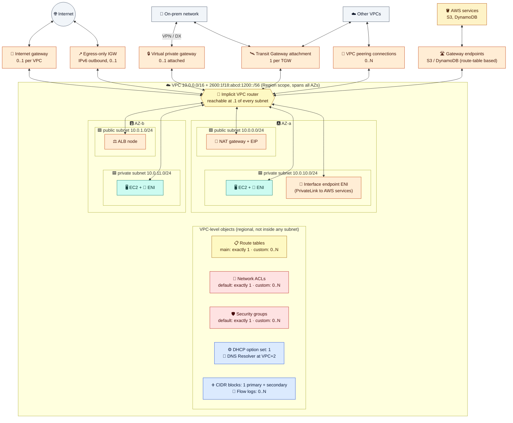
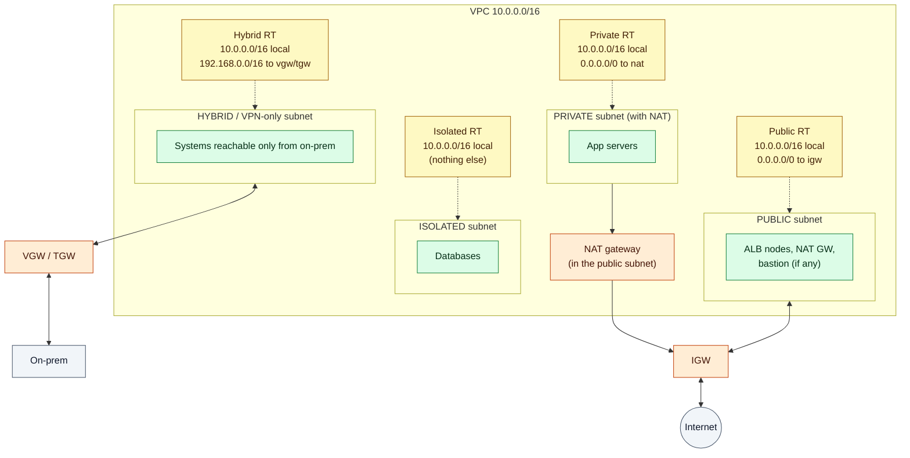
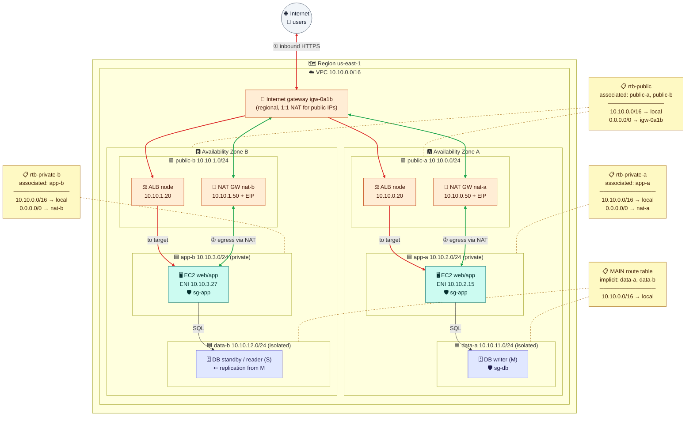

# Module 02 — VPC, Subnets & Route Tables

> The skeleton of every AWS network: what a VPC contains, what subnets are for, and exactly where route tables sit and how they get their routes.

---

## 1. The VPC

A **VPC** is an isolated layer-3 network in **one Region**, spanning **all its AZs**. It's defined by one primary IPv4 CIDR (`/16` to `/28`, plus optional secondary and IPv6 CIDRs) and has an **implicit router** that connects all its subnets. A new VPC has **no** path anywhere until you add gateways, routes, and security rules.



### What a VPC contains and what you can attach

| Comes with every VPC (exactly 1) | You create inside (0..N) | You attach | Lives **in subnets** (uses IPs) |
|---|---|---|---|
| Implicit router (subnet `.1`) | Subnets | Internet gateway (0–1) | EC2 instances / ENIs |
| Main route table | Custom route tables | Egress-only IGW for IPv6 (0–1) | NAT gateways (zonal) |
| Default NACL (allow all) | Custom NACLs (deny all by default) | Virtual private gateway (0–1) | Interface / GWLB endpoints |
| Default security group | Security groups | Transit Gateway attachment (1 per TGW) | ALB / NLB nodes |
| DHCP option set | Flow logs, extra CIDRs | Peering connections, gateway endpoints | RDS, Lambda, EKS, EFS, … |
| DNS resolver at VPC base + 2 | | Regional NAT gateway | EC2 Instance Connect Endpoint |

### CIDR planning
- Use RFC 1918 ranges. **Never overlap** with on-prem or other VPCs, because overlap breaks peering, TGW, and VPN routing. Use **VPC IPAM** at scale.
- The **primary CIDR can't be changed**, but you can add secondary CIDRs later. `100.64.0.0/10` is a common secondary range for Kubernetes pods.
- Give each AZ an aligned block (e.g. a `/18` per AZ inside a `/16`). Make app subnets large and public subnets small.
- Turn on **`enableDnsHostnames`** (it's off for VPCs created via the API). Private DNS features depend on it.
- **Default VPC** (`172.31.0.0/16`, every subnet public): fine for experiments, not for production.

---

## 2. Subnets

A **subnet** is a slice of the VPC CIDR **pinned to one AZ**. It has four jobs:

1. **Placement:** every ENI lives in a subnet, which decides its AZ and its IP.
2. **Routing:** it's associated with **exactly one route table**.
3. **Filtering:** it's associated with **exactly one network ACL**.
4. **Fault isolation:** one subnet = one AZ, so spreading subnets across AZs gives you HA.

**Is it required?** A VPC can exist without subnets, but **every EC2 instance requires one**, because its primary ENI must live in a subnet. Any service that places ENIs in your VPC (NAT gateway, endpoints, load balancers, RDS, Lambda) also needs subnets.

### Public, private, isolated: decided by the route table



| Type | Route table has | Reachable from internet | Can reach internet |
|---|---|---|---|
| **Public** | `0.0.0.0/0 → igw` | Yes, if the instance has a public IP and SG/NACL allow | Yes |
| **Private** | `0.0.0.0/0 → nat` | No | Outbound only |
| **Isolated** | `local` only | No | No |

"Auto-assign public IP" doesn't make a subnet public. Only the IGW route does.

**Sizing:** AWS reserves **5 IPs per subnet** (network, `.1` router, `.2` DNS, `.3`, broadcast), so a `/24` has 251 usable and a `/28` has 11. **Subnets can't be resized.** ALB subnets need `/27` or larger. EKS pods consume one IP each.

---

## 3. Route tables

### Where they sit (course question 1)

| Question | Answer |
|---|---|
| **Owned by** | A **VPC** (regional). One table can serve subnets in any AZ |
| **Associated with** | **Subnets**: each subnet has exactly one (explicit, or the VPC's **main** table implicitly). Optionally an **IGW/VGW** ("gateway route table", for inbound inspection) |
| **Assigned to EC2?** | **No, never.** Each ENI uses its subnet's table. Inside the OS, the route is just `default via <subnet>.1` |
| **Role** | The forwarding table of the VPC router for packets **leaving that subnet**. The **source** subnet's table decides the next hop |



### How a route table is populated

| Source | Example | Notes |
|---|---|---|
| ① **Automatic local route** | `10.10.0.0/16 → local` | One per VPC CIDR. Can't be deleted. All subnets can reach each other by default |
| ② **Static routes** (you) | `0.0.0.0/0 → igw/nat`, `10.1.0.0/16 → pcx`, `10.0.0.0/8 → tgw` | Most routes |
| ③ **Propagated** from a VGW | On-prem prefixes over VPN/Direct Connect BGP | Turn on route propagation per table |
| ④ **Gateway endpoints** | `pl-xxxx (S3) → vpce-xxxx` | Added automatically to the tables you select |
| ⑤ **VPC Route Server** | Prefixes advertised by appliances over BGP | For appliance failover |

Transit Gateway **never** writes into VPC route tables. You add `… → tgw-…` routes yourself.

### How a route is chosen
1. **Longest prefix match** wins (IPv4 and IPv6 are evaluated separately).
2. For the same prefix: **static beats propagated**. Among VGW-propagated routes: Direct Connect, then VPN static, then VPN BGP.
3. If the target was deleted, the route shows **blackhole** and its traffic is dropped.
4. There's no ECMP, no source-based routing, and **no transitive routing** through peering or a gateway endpoint.

**Common targets:** `local`, `igw-`, `eigw-` (IPv6 out), `nat-`, `vgw-`, `tgw-`, `pcx-`, `vpce-` (gateway or GWLB endpoint), `eni-` (appliance).

**Best practice:** keep the **main** table local-only, so a subnet you forget to associate stays private.

---

## 4. Hands-on: build the VPC

> These labs build one environment across Modules 02–08. They create billable resources (mostly the NAT gateway in Module 03 and public IPv4 addresses). Set a **budget alert**, and run the **cleanup in Module 08**.

**Setup (once):** you need AWS CLI v2 and an admin identity (not root). Run everything in **bash**, and save variables so you can resume later.

```bash
bash
aws sts get-caller-identity
export AWS_REGION=us-east-1 AWS_DEFAULT_REGION=us-east-1
save() { echo "export $1=\"${!1}\"" >> ~/aws-lab.env; }   # new shell later? run bash, re-run this line, then: source ~/aws-lab.env
```

**Build:** a VPC, 6 subnets (3 tiers × 2 AZs), an IGW, and route tables.

```bash
VPC_ID=$(aws ec2 create-vpc --cidr-block 10.0.0.0/16 \
  --tag-specifications 'ResourceType=vpc,Tags=[{Key=Name,Value=lab-vpc}]' --query Vpc.VpcId --output text); save VPC_ID
aws ec2 modify-vpc-attribute --vpc-id $VPC_ID --enable-dns-hostnames '{"Value":true}'

AZ1=$(aws ec2 describe-availability-zones --filters Name=zone-type,Values=availability-zone --query 'AvailabilityZones[0].ZoneName' --output text); save AZ1
AZ2=$(aws ec2 describe-availability-zones --filters Name=zone-type,Values=availability-zone --query 'AvailabilityZones[1].ZoneName' --output text); save AZ2

mk_subnet() { aws ec2 create-subnet --vpc-id $VPC_ID --cidr-block $2 --availability-zone $3 \
  --tag-specifications "ResourceType=subnet,Tags=[{Key=Name,Value=$1}]" --query Subnet.SubnetId --output text; }
PUB_A=$(mk_subnet public-a 10.0.0.0/24 $AZ1);   save PUB_A
PUB_B=$(mk_subnet public-b 10.0.1.0/24 $AZ2);   save PUB_B
APP_A=$(mk_subnet app-a 10.0.10.0/24 $AZ1);     save APP_A
APP_B=$(mk_subnet app-b 10.0.11.0/24 $AZ2);     save APP_B
DATA_A=$(mk_subnet data-a 10.0.20.0/24 $AZ1);   save DATA_A
DATA_B=$(mk_subnet data-b 10.0.21.0/24 $AZ2);   save DATA_B
aws ec2 modify-subnet-attribute --subnet-id $PUB_A --map-public-ip-on-launch
aws ec2 modify-subnet-attribute --subnet-id $PUB_B --map-public-ip-on-launch

IGW_ID=$(aws ec2 create-internet-gateway --query InternetGateway.InternetGatewayId --output text); save IGW_ID
aws ec2 attach-internet-gateway --internet-gateway-id $IGW_ID --vpc-id $VPC_ID

RT_PUB=$(aws ec2 create-route-table --vpc-id $VPC_ID --query RouteTable.RouteTableId --output text); save RT_PUB
aws ec2 create-route --route-table-id $RT_PUB --destination-cidr-block 0.0.0.0/0 --gateway-id $IGW_ID
aws ec2 associate-route-table --route-table-id $RT_PUB --subnet-id $PUB_A
aws ec2 associate-route-table --route-table-id $RT_PUB --subnet-id $PUB_B

RT_PRIV=$(aws ec2 create-route-table --vpc-id $VPC_ID --query RouteTable.RouteTableId --output text); save RT_PRIV
aws ec2 associate-route-table --route-table-id $RT_PRIV --subnet-id $APP_A
aws ec2 associate-route-table --route-table-id $RT_PRIV --subnet-id $APP_B
# data-a / data-b: no association, so they use the MAIN table
```

✅ **Check which route table each subnet uses:**

```bash
for s in $PUB_A $PUB_B $APP_A $APP_B $DATA_A $DATA_B; do
  rt=$(aws ec2 describe-route-tables --filters Name=association.subnet-id,Values=$s --query 'RouteTables[0].RouteTableId' --output text)
  echo "$s -> ${rt/None/MAIN (implicit)}"
done
```

---

## Check yourself

<details><summary>Route table: assigned to EC2, subnet, or VPC?</summary>Owned by the VPC, associated with subnets (the main table by default), optionally with an IGW/VGW. Never with EC2.</details>
<details><summary>What makes a subnet public?</summary>Its route table has a route to an internet gateway.</details>
<details><summary>A route to 0.0.0.0/0 via NAT and a gateway endpoint for S3. Which one carries S3 traffic?</summary>The endpoint. Its prefix-list routes are more specific than /0.</details>
<details><summary>VPC A peers with B, and B has a NAT gateway. Can A use it?</summary>No. Peering has no transitive or edge-to-edge routing.</details>

---
**Previous:** [Module 01](01-foundations.md) · **Next:** [Module 03 — Internet Access](03-internet-access.md)
