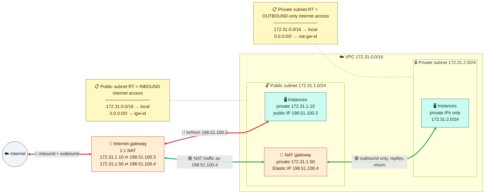
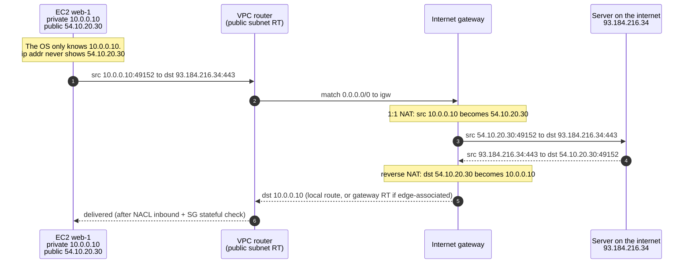
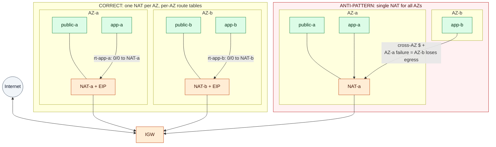

# Module 03 — Internet Access: IGW, NAT & Public IPs

> How packets get between a VPC and the internet, who translates addresses, and how to design egress that's highly available and doesn't blow up the bill.

---

## 1. What internet access requires

```mermaid
%%{init: {"flowchart": {"wrappingWidth": 240}}}%%
flowchart LR
    classDef gw fill:#ffedd5,stroke:#c2410c,color:#431407
    classDef rt fill:#fef9c3,stroke:#a16207,color:#422006
    classDef sec fill:#fee2e2,stroke:#b91c1c,color:#450a0a
    classDef compute fill:#ccfbf1,stroke:#0f766e,color:#042f2e
    classDef zonal fill:#dcfce7,stroke:#15803d,color:#052e16

    C1["1. IGW created and<br/>ATTACHED to the VPC"]:::gw
    C2["2. Subnet route table has<br/>0.0.0.0/0 to igw-…<br/>(::/0 for IPv6)"]:::rt
    C3["3. Instance ENI has a<br/>public IPv4 / Elastic IP<br/>(or an IPv6 GUA)"]:::compute
    C4["4. NACL on the subnet allows<br/>the traffic AND the ephemeral<br/>return ports"]:::sec
    C5["5. Security group allows it<br/>(+ OS firewall, and the app<br/>listening on 0.0.0.0)"]:::sec
    OK(["Internet reachable"]):::zonal

    C1 --> C2 --> C3 --> C4 --> C5 --> OK
```



If any one is missing, there's no connectivity. An account-level **VPC Block Public Access** setting overrides all of them.

## 2. Inbound vs outbound



| | Internet gateway (IGW) | NAT gateway |
|---|---|---|
| Direction | In **and** out | **Out only** (replies return, but nothing can initiate a connection in) |
| Translation | 1:1, private IP ↔ the instance's own public IP | Many-to-one PAT behind the NAT's Elastic IP |
| Placement | Attached to the VPC (one per VPC), regional, no bandwidth limit | **Zonal:** in a public subnet, one per AZ. **Regional mode** (Nov 2025): one per VPC, spans AZs, no public subnet needed |
| Security group | None | None (only its subnet's NACL applies) |
| Cost | Free (you pay for data + public IPs) | Hourly + **per GB processed** |

### How the IGW's 1:1 NAT works



The instance's OS only knows its private IP. If an app needs its public IP, it asks the instance metadata service.

---

## 3. Public addresses

| Type | Survives stop/start? | Can move between instances? | Notes |
|---|---|---|---|
| **Auto-assigned public IPv4** | ❌ New IP on every start | ❌ | Set by the subnet attribute or at launch |
| **Elastic IP** | ✅ | ✅ Remap in seconds | Regional. **Billed even when idle** |
| **IPv6** | ✅ | ❌ | Globally routable, no NAT, free. Use an **egress-only IGW** (`::/0 → eigw`) for outbound-only access |

Every public IPv4 costs about $0.005/hour. Prefer private subnets behind load balancers.

---

## 4. NAT gateway design



- **One NAT per AZ, with a private route table per AZ.** A single NAT is a cross-AZ cost and an AZ-failure risk. Or use one **Regional NAT gateway** with a single shared route table.
- **Limits:** ~55,000 simultaneous connections per destination per NAT IP. Add IPs if CloudWatch shows `ErrorPortAllocation`. The idle timeout is 350 s, so use TCP keepalives.
- **Cost control:** send S3/DynamoDB through a **gateway endpoint** (free) and other AWS APIs through **interface endpoints** instead of NAT (Module 06).
- **Variants:** a **private NAT gateway** (no EIP) translates traffic to other networks when CIDRs overlap. **NAT64 + DNS64** let IPv6-only workloads reach IPv4. A **NAT instance** (source/dest check off) is a cheap but self-managed option for labs.
- **Centralized egress:** many VPCs → Transit Gateway → one egress VPC with NAT and a firewall (Module 07).

### "My instance can't reach the internet" checklist
- **Public subnet:** route `0/0 → igw` → IGW attached → instance has a public IP/EIP → SG outbound → NACL both ways (ephemeral ports).
- **Private subnet:** route `0/0 → nat` (active, not blackhole) → NAT is *available*, sits in a **public** subnet, has an EIP → NAT's subnet NACL allows ports 1024–65535.
- Then check DNS (VPC+2) and Block Public Access.

---

## 5. Hands-on: add a NAT gateway

Continue in the same bash shell (or run `source ~/aws-lab.env`). We'll **test** it in Module 05, once instances exist. **The NAT costs money from now until Module 06**, where we delete it.

```bash
NAT_EIP=$(aws ec2 allocate-address --domain vpc --query AllocationId --output text); save NAT_EIP
NAT_ID=$(aws ec2 create-nat-gateway --subnet-id $PUB_A --allocation-id $NAT_EIP \
  --query NatGateway.NatGatewayId --output text); save NAT_ID
aws ec2 wait nat-gateway-available --nat-gateway-ids $NAT_ID
aws ec2 create-route --route-table-id $RT_PRIV --destination-cidr-block 0.0.0.0/0 --nat-gateway-id $NAT_ID
aws ec2 describe-addresses --allocation-ids $NAT_EIP --query 'Addresses[0].PublicIp' --output text   # note this IP
```

(A production setup would add a second NAT in AZ 2 with its own route table for `app-b`.)

---

## Check yourself

<details><summary>Why doesn't `ip addr` show the instance's public IP?</summary>The IGW does the 1:1 NAT. The ENI only holds the private IP.</details>
<details><summary>Can you put a security group on a NAT gateway?</summary>No. Control access with the source instances' SGs and the NAT subnet's NACL.</details>
<details><summary>Apps in AZ-b use AZ-a's NAT. What's wrong?</summary>Cross-AZ charges, and AZ-a failing kills AZ-b's egress. Use a NAT per AZ, or a Regional NAT gateway.</details>

---
**Previous:** [Module 02](02-vpc-subnets-and-route-tables.md) · **Next:** [Module 04 — Security Groups & NACLs](04-security-groups-and-nacls.md)
