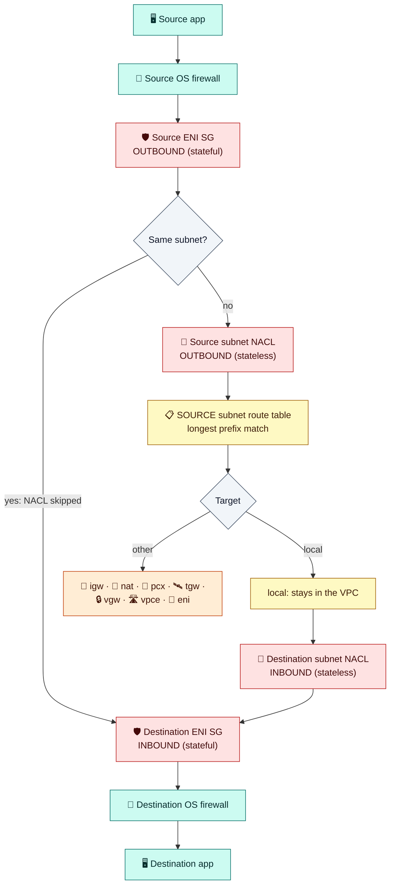

# Module 03 — Security Groups & Network ACLs

← [All tutorials](../README.md) · **Networking tutorial**, module 3 of 8

Routing (Module 02) decides **where** traffic can go. Firewalls decide **whether it's allowed**. Remember the `local` route: every subnet in your VPC can reach every other one. The firewalls are what stop the internet from reaching your database.

The goal for our application:

| Traffic | Allowed? |
|---|---|
| Internet → load balancer on port 443/80 | ✅ |
| Load balancer → app servers on port 8080 | ✅ |
| App servers → database on port 5432 | ✅ |
| Internet → app servers or database, directly | ❌ |
| Anyone → SSH (port 22) from the internet | ❌ (we'll use a safer way in Module 04) |

AWS gives you two firewalls for this: **security groups** (on every server) and **network ACLs** (on every subnet).

---

## 1. Security groups

Every server in AWS has a virtual network card called an **elastic network interface (ENI)**. Module 04 covers it. A **security group (SG)** is a firewall attached to that network interface. It checks every packet entering or leaving that specific server.

A security group is a list of **allow** rules. Each rule has a protocol, a port range, and a **source** (inbound) or **destination** (outbound). Here are the three security groups that implement our goal:

**`sg-alb`**: on the load balancer

| Direction | Protocol | Port | Source / destination | Why |
|---|---|---|---|---|
| Inbound | TCP | 443, 80 | `0.0.0.0/0` (anyone) | Customers |
| Outbound | TCP | 8080 | `sg-app` | Forward requests to app servers |

**`sg-app`**: on the application servers

| Direction | Protocol | Port | Source / destination | Why |
|---|---|---|---|---|
| Inbound | TCP | 8080 | **`sg-alb`** | Only the load balancer may call the app |
| Outbound | TCP | 5432 | `sg-db` | Talk to the database |
| Outbound | TCP | 443 | `0.0.0.0/0` | Updates and external APIs (via the NAT gateway) |

**`sg-db`**: on the database

| Direction | Protocol | Port | Source / destination | Why |
|---|---|---|---|---|
| Inbound | TCP | 5432 | **`sg-app`** | Only app servers may query the database |

### The four ideas that make security groups work

1. **Referencing another security group.** The source `sg-alb` means "any network interface that has `sg-alb` attached". You never write IP addresses for your own servers. When the load balancer or the app tier scales from 2 to 20 servers, the rules still work. This is the most useful feature of security groups.
2. **Stateful.** If a request is allowed in, its **reply is automatically allowed out**, and vice versa. You never write rules for return traffic. `sg-db` needs no outbound rule to answer queries.
3. **Allow-only, with a default deny.** There are no deny rules. Anything no rule allows is dropped. A **new** security group has **no inbound rules** (nothing can reach it) and one outbound rule allowing everything.
4. **Attached to network interfaces, not subnets.** A security group belongs to one VPC and can be attached to many servers in any of its AZs. A server can have up to 5 security groups, and their rules are combined. **Every network interface must have at least one**: if you don't choose, the VPC's **default security group** is used. Its rules allow traffic only between members of that same default group.

Changes to rules take effect **immediately** on all attached servers. One subtlety: removing a rule doesn't cut connections that are already open. They continue until they go idle.

**Try it: create the security groups** (`sg-alb` follows in Module 05). For the lab, we also have a public test server `web-1` and an **EC2 Instance Connect Endpoint** for SSH access (both in Module 04):

```bash
MY_IP=$(curl -s https://checkip.amazonaws.com); save MY_IP
SG_WEB=$(aws ec2 create-security-group --vpc-id $VPC_ID --group-name lab-sg-web --description "public test web server" --query GroupId --output text); save SG_WEB
SG_APP=$(aws ec2 create-security-group --vpc-id $VPC_ID --group-name lab-sg-app --description "app servers" --query GroupId --output text); save SG_APP
SG_EICE=$(aws ec2 create-security-group --vpc-id $VPC_ID --group-name lab-sg-eice --description "instance connect endpoint" --query GroupId --output text); save SG_EICE

aws ec2 authorize-security-group-ingress --group-id $SG_WEB --protocol tcp --port 80 --cidr 0.0.0.0/0          # HTTP from anyone
aws ec2 authorize-security-group-ingress --group-id $SG_WEB --protocol tcp --port 22 --cidr $MY_IP/32           # SSH only from you
aws ec2 authorize-security-group-ingress --group-id $SG_APP --protocol tcp --port 8080 --source-group $SG_WEB   # reference!
aws ec2 authorize-security-group-ingress --group-id $SG_APP --protocol tcp --port 22   --source-group $SG_EICE
aws ec2 authorize-security-group-ingress --group-id $SG_APP --ip-permissions 'IpProtocol=icmp,FromPort=-1,ToPort=-1,IpRanges=[{CidrIp=10.0.0.0/8}]'

aws ec2 describe-security-groups --group-ids $SG_APP --query 'SecurityGroups[0].IpPermissions'
```

---

## 2. Network ACLs

A **network ACL (NACL)** is a second, simpler filter at the **subnet boundary**. It checks packets entering or leaving the subnet, whatever server they belong to. It differs from a security group in three ways:

| | Security group | Network ACL |
|---|---|---|
| Attached to | Network interfaces (servers) | **Subnets** (exactly one per subnet) |
| Rules | Allow only | **Allow and deny**, numbered, **the first match wins** |
| Return traffic | Automatic (**stateful**) | Needs its own rule (**stateless**) |
| Traffic inside one subnet | Checked | **Not checked** |

### Stateless means: allow the return ports

When a browser connects to your server's port 443, the browser's computer picks a random high **source port** (say 51515) for that connection. The server's reply goes **back to port 51515**. A security group remembers the connection and lets the reply out. A network ACL doesn't remember anything, so its **outbound** rules must allow that random port range. Clients use ports between 1024 and 65535, so allow that whole range.

An example NACL for the public subnets:

| Rule # | Direction | Port | Source / destination | Action | Purpose |
|---|---|---|---|---|---|
| 50 | Inbound | all | `198.51.100.0/24` | **DENY** | Block a known bad network (security groups can't do this) |
| 100 | Inbound | 443, 80 | `0.0.0.0/0` | ALLOW | Customer requests |
| 110 | Inbound | 1024–65535 | `0.0.0.0/0` | ALLOW | Replies to connections the subnet opened |
| 100 | Outbound | 1024–65535 | `0.0.0.0/0` | ALLOW | Replies to customers |
| 110 | Outbound | 443 | `0.0.0.0/0` | ALLOW | Outgoing HTTPS |
| * | Both | all | all | DENY | Always last, can't be removed |

**In practice:** every VPC has a **default network ACL that allows everything**, and most teams leave it that way. They do all access control in security groups, which are easier to get right. Use network ACLs for **explicit blocks** (a bad IP range) or as a coarse extra guardrail ("data subnets accept traffic only from app subnets"). A **new** custom NACL denies everything until you add rules. Module 08's lab shows what goes wrong when the return ports are forgotten.

---

## 3. The order of checks

Every packet between two servers passes these checks, in this order:



**How to read it:**
- Going out, the packet is checked by the **sender's security group**, then the **sender's subnet NACL**, then routed by the **sender's subnet route table** (Module 02).
- Arriving, it's checked by the **receiver's subnet NACL**, then the **receiver's security group**.
- If both servers are in the **same subnet**, the NACL steps are skipped.
- The **reply** travels the same path backwards. Security groups let it through automatically. NACLs must allow it explicitly.

When something can't connect, walk this path and check each box. Module 08 turns this into a troubleshooting routine.

---

## 4. Good to know

- **Some traffic is never filtered** by security groups or NACLs: queries to the VPC's DNS resolver, the instance metadata service (`169.254.169.254`, Module 04), and time sync. Don't try to block them there.
- **Some resources have no security group:** NAT gateways, internet gateways, and S3 gateway endpoints. Only NACLs and routing apply to them.
- To **block a specific IP address**, use a NACL deny rule (or AWS WAF on a load balancer). Security groups can only allow.
- **Never open SSH or RDP (22/3389) to `0.0.0.0/0`.** Module 04 shows how to reach servers without opening those ports.

---

## Check yourself

<details><summary>Is a security group attached to the instance, the subnet, or the VPC?</summary>It's created in a VPC and attached to network interfaces (so effectively to instances). Subnets get network ACLs instead.</details>
<details><summary>Can a server run without any security group?</summary>No. Every network interface has at least one. If you don't pick one, the VPC's default security group is attached.</details>
<details><summary>A NACL allows inbound 443 but has no outbound rules. Does HTTPS work?</summary>No. The NACL is stateless, so the server's replies to the client's high port (1024–65535) are blocked on the way out.</details>
<details><summary>Why is "source: sg-app" better than "source: 10.0.10.0/24"?</summary>It allows exactly the servers that have sg-app attached, wherever they are, and keeps working as they scale. A CIDR allows anything in that range.</details>

---
**Previous:** [Module 02](02-subnets-routing-and-internet-access.md) · **Next:** [Module 04 — EC2 Instances in Your VPC](04-ec2-instances-in-your-vpc.md)
