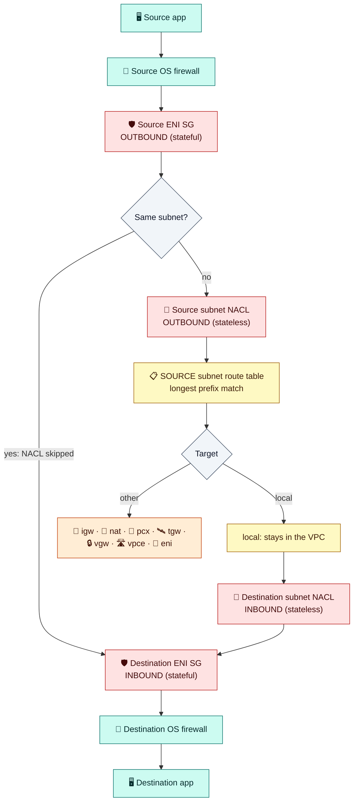
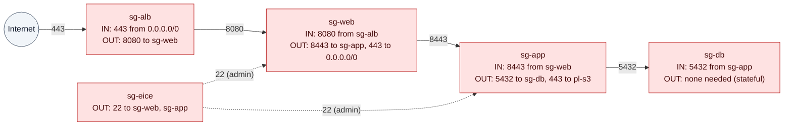

# Module 04 — Security Groups & Network ACLs

> The two packet filters in a VPC: where each one attaches, how it evaluates traffic, and which one to use for what.

---

## 1. Side by side

| | **Security group (SG)** | **Network ACL (NACL)** |
|---|---|---|
| Owned by | A VPC (regional) | A VPC (regional) |
| **Attached to** | **ENIs**, so instances, ALB, RDS, endpoints, Lambda… | **Subnets** |
| Cardinality | 1–5 per ENI (adjustable to 16). One SG can serve many ENIs | Exactly 1 per subnet. One NACL can serve many subnets |
| State | **Stateful**: replies are allowed automatically | **Stateless**: replies need their own rules |
| Rules | **Allow only**, all evaluated together | **Allow + deny**, numbered, **first match wins** |
| Sources | CIDR, prefix list, **another SG** | CIDR only |
| Defaults | Default SG: inbound from itself, all outbound. **A new SG has no inbound rules, all outbound** | Default NACL: **allow all**. **A new custom NACL denies all** |
| Traffic within the same subnet | Filtered | **Not** filtered |
| Use it for | All real access control | Coarse guardrails and explicit denies |

## 2. The evaluation pipeline (every packet)



The **reply** passes the SGs automatically, but the **NACLs must allow it explicitly**, on the client's ephemeral port range. Allow **1024–65535**.

---

## 3. Security groups: what you must know

**What is it?** A stateful, allow-only virtual firewall, **owned by a VPC** and **associated with network interfaces**. "Instance SGs" are really the SGs on the instance's primary ENI, and each extra ENI can have different ones. **It is not associated with subnets.**

**Can you proceed without one?** **No.** Every ENI must have at least one SG. If you don't specify one, the VPC's **default SG** is applied, and you can't remove an ENI's last SG.

**Design by reference.** Chain tiers by SG ID instead of CIDRs. This keeps working as instances scale in and out:



**Gotchas**
- An SG reference matches the **private IPs** of member ENIs only, not traffic arriving via public IPs or NAT. References work across same-Region peering and (inbound only) across Transit Gateway.
- Being in the same SG does **not** allow traffic between members. You need a self-referencing rule (the default SG has one, custom SGs don't).
- **Removing a rule doesn't cut existing tracked connections.** To kill a live connection, add a NACL deny.
- Traffic to DNS (VPC+2), DHCP, instance metadata (`169.254.169.254`), and Time Sync is **never filtered** by SGs or NACLs.
- **No SG at all on:** NAT gateways, IGWs, gateway endpoints, TGW attachments, GWLB. **An NLB SG can only be set at creation.**

## 4. NACLs: what you must know

- Rules are numbered 1–32766, evaluated lowest first, with a final `*` deny. Number them in steps of 100.
- Separate inbound and outbound lists. You **must allow ephemeral return ports**.
- Typical use: block a malicious CIDR (SGs can't deny), or enforce "data subnets accept only app subnets" as a guardrail. Otherwise **leave the default allow-all** and do the real control in SGs.

| Public web subnet NACL | # | Rule |
|---|---|---|
| Inbound | 50 | DENY all from `198.51.100.0/24` (known bad) |
| Inbound | 100 / 110 | ALLOW TCP 443 / 80 from `0.0.0.0/0` |
| Inbound | 120 | ALLOW TCP 1024–65535 from `0.0.0.0/0` (replies to outbound calls) |
| Outbound | 100 | ALLOW TCP 1024–65535 to `0.0.0.0/0` (replies to clients) |
| Outbound | 110 | ALLOW TCP 443 to `0.0.0.0/0` |

---

## 5. Hands-on: security groups

```bash
MY_IP=$(curl -s https://checkip.amazonaws.com); save MY_IP
SG_WEB=$(aws ec2 create-security-group --vpc-id $VPC_ID --group-name lab-sg-web --description web --query GroupId --output text); save SG_WEB
SG_APP=$(aws ec2 create-security-group --vpc-id $VPC_ID --group-name lab-sg-app --description app --query GroupId --output text); save SG_APP
SG_EICE=$(aws ec2 create-security-group --vpc-id $VPC_ID --group-name lab-sg-eice --description eice --query GroupId --output text); save SG_EICE

aws ec2 authorize-security-group-ingress --group-id $SG_WEB --protocol tcp --port 80 --cidr 0.0.0.0/0
aws ec2 authorize-security-group-ingress --group-id $SG_WEB --protocol tcp --port 22 --cidr $MY_IP/32
aws ec2 authorize-security-group-ingress --group-id $SG_APP --protocol tcp --port 8080 --source-group $SG_WEB   # reference!
aws ec2 authorize-security-group-ingress --group-id $SG_APP --protocol tcp --port 22   --source-group $SG_EICE
aws ec2 authorize-security-group-ingress --group-id $SG_APP --ip-permissions 'IpProtocol=icmp,FromPort=-1,ToPort=-1,IpRanges=[{CidrIp=10.0.0.0/8}]'
```

✅ The SGs exist but aren't attached to anything yet. They're VPC objects waiting to be associated with ENIs in Module 05.

---

## Check yourself

<details><summary>SG attached to instance, subnet, or VPC?</summary>Owned by the VPC, associated with ENIs (so with instances). Not with subnets: subnets get NACLs.</details>
<details><summary>SG allows 443 in, and the NACL allows 443 in but has no outbound rules. Does HTTPS work?</summary>No. The stateless NACL blocks the replies. Add outbound 1024–65535.</details>
<details><summary>How do you block one malicious IP?</summary>A NACL deny rule with a low number (SGs can't deny), or WAF for HTTP.</details>

---
**Previous:** [Module 03](03-internet-access.md) · **Next:** [Module 05 — EC2 Networking & Load Balancers](05-ec2-networking-and-load-balancers.md)
