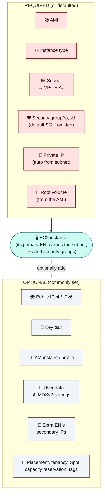
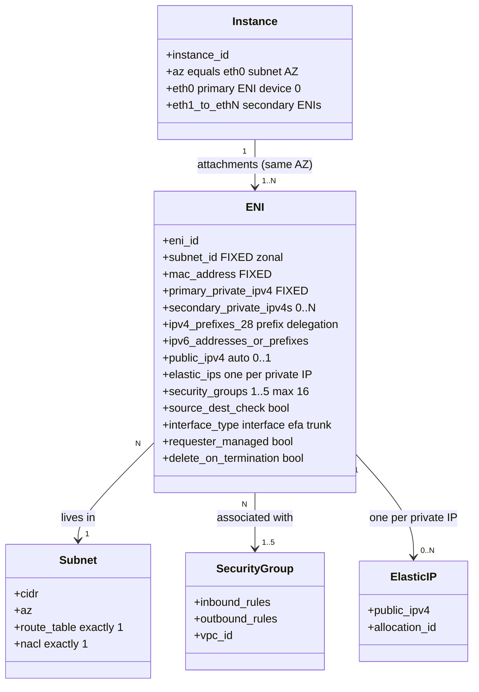
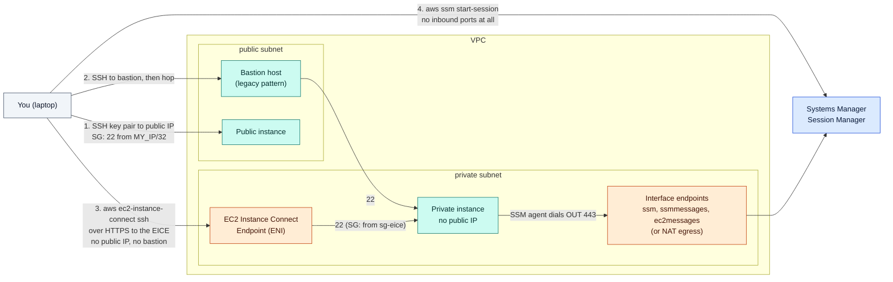
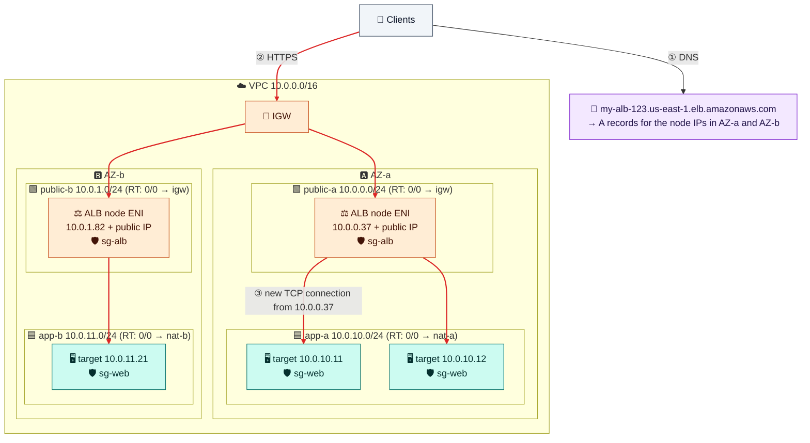

# Module 05 — EC2 Networking & Load Balancers

> What you assign when launching an instance, how its network interface works, what changes over its lifecycle, how to access it safely, and how load balancers sit in front of it.

---

## 1. What you assign at launch (course question 4)



| Component | Required? | Scope | Changeable later? |
|---|---|---|---|
| AMI | Yes | Regional | No (relaunch) |
| Instance type | Yes | — | Yes, while stopped |
| **Subnet** (and so the VPC + AZ) | **Yes** (a default subnet is picked only in the default VPC) | Zonal | **No** for the primary ENI |
| **Security group(s)** | **Yes, ≥1** (default SG if omitted) | VPC | Yes, anytime |
| Private IP | Auto from the subnet (or you choose) | — | Primary: no. Secondary IPs: yes |
| Public IPv4 | Optional (subnet setting or launch flag) | — | Use an Elastic IP after launch |
| Key pair | Optional | Regional | Not via the API |
| IAM role (instance profile) | Optional, **always use one** | Global | Yes |
| User data, IMDS options, placement | Optional | — | Mostly while stopped |

**Route tables and NACLs are not assigned to an instance.** They come from its subnet.

---

## 2. The ENI is the real network object



- `eth0` is created at launch and **can't be detached**. Secondary ENIs must be in the **same AZ** (they can use other subnets) and can **move** to another instance, keeping their IPs, MAC, and SGs. That makes them a failover tool.
- Each ENI uses **its own subnet's route table**. A multi-homed instance needs OS policy routing (Amazon Linux 2023 sets it up automatically).
- Services create **requester-managed ENIs** in your subnets: NAT gateway, load balancers, endpoints, Lambda, RDS.

### What survives what

| Action | Private IP | Auto public IP | Elastic IP | EBS data | Instance store |
|---|---|---|---|---|---|
| Reboot | kept | kept | kept | kept | kept |
| Stop → start | kept | **new** | kept | kept | **lost** |
| Terminate | released | released | stays in the account (billed) | root deleted (default) | lost |

---

## 3. Identity and access

- **Credentials:** attach an **IAM role** (instance profile). SDKs get rotating credentials from IMDS (`169.254.169.254`). **Require IMDSv2.** Hop limit 1 blocks containers, so set it to 2 only if they need IMDS. Never put access keys on instances.
- **Shell access without exposing SSH:**



| Method | Public IP? | Inbound rule? | Best for |
|---|---|---|---|
| SSH with a key pair | Yes | 22 from your IP | Quick labs |
| **EC2 Instance Connect Endpoint** | No | 22 from the endpoint's SG | Private instances, no bastion, free |
| **SSM Session Manager** | No | **None** | Production (audited, IAM-controlled). Needs the agent, an IAM role, and a path to SSM via NAT or endpoints |

## 4. Performance in one paragraph

About **5 Gbps per flow** (10 Gbps in a cluster placement group, 25 Gbps with ENA Express). Instance bandwidth depends on the type: "up to" means burstable. **MTU is 9001** inside the VPC, but 1500 via the IGW, 8500 via TGW or inter-Region peering, and about 1446 over VPN. Allow ICMP "fragmentation needed" (type 3 code 4) for path MTU discovery. Placement groups: **cluster** (one AZ, lowest latency), **spread** (separate hardware), **partition** (Kafka/Cassandra-style).

---

## 5. Load balancers

| | ALB | NLB | GWLB |
|---|---|---|---|
| Layer | 7: HTTP/gRPC, host/path rules, WAF, auth | 4: TCP/UDP/TLS, millions of RPS | 3: transparent firewall insertion |
| Static IPs | No (DNS name only) | **Yes, one per AZ** (can be EIPs) | — |
| Client IP at the target | `X-Forwarded-For` header | Preserved | Preserved |
| Security group | Yes | Optional, **only at creation** | No |
| Cross-zone balancing | On | Off (inter-AZ charges if on) | Off |



- A load balancer puts **nodes (ENIs) in each subnet you select**. An internet-facing LB needs **public** subnets, while its **targets stay private**.
- An ALB needs subnets in **2+ AZs**, each `/27` or larger.
- The ALB **proxies**: targets see the ALB node's IP. Health checks also come from the nodes, so allow the health-check port from the ALB's SG.
- For partner allow-listing (fixed inbound IPs), use an **NLB with EIPs**. It can sit in front of an ALB.

---

## 6. Hands-on: launch and connect

```bash
AMI_ID=$(aws ssm get-parameter --name /aws/service/ami-amazon-linux-latest/al2023-ami-kernel-default-x86_64 --query Parameter.Value --output text); save AMI_ID
aws ec2 create-key-pair --key-name lab-key --key-type ed25519 --query KeyMaterial --output text > ~/lab-key.pem && chmod 400 ~/lab-key.pem

cat > /tmp/web.sh <<'USERDATA'
#!/bin/bash
dnf install -y nginx
TOKEN=$(curl -sX PUT http://169.254.169.254/latest/api/token -H "X-aws-ec2-metadata-token-ttl-seconds: 300")
md() { curl -s -H "X-aws-ec2-metadata-token: $TOKEN" http://169.254.169.254/latest/meta-data/$1; }
echo "<h1>web-1 $(md local-ipv4) in $(md placement/availability-zone)</h1>" > /usr/share/nginx/html/index.html
systemctl enable --now nginx
USERDATA

cat > /tmp/app.sh <<'USERDATA'
#!/bin/bash
mkdir -p /srv/app && echo "hello from app-1" > /srv/app/index.html
cat > /etc/systemd/system/demo-app.service <<'UNIT'
[Service]
ExecStart=/usr/bin/python3 -m http.server 8080 --directory /srv/app
Restart=always
[Install]
WantedBy=multi-user.target
UNIT
systemctl daemon-reload && systemctl enable --now demo-app
USERDATA

WEB_ID=$(aws ec2 run-instances --image-id $AMI_ID --instance-type t3.micro --key-name lab-key \
  --subnet-id $PUB_A --security-group-ids $SG_WEB --metadata-options HttpTokens=required \
  --user-data file:///tmp/web.sh --tag-specifications 'ResourceType=instance,Tags=[{Key=Name,Value=web-1}]' \
  --query 'Instances[0].InstanceId' --output text); save WEB_ID
APP_ID=$(aws ec2 run-instances --image-id $AMI_ID --instance-type t3.micro \
  --subnet-id $APP_A --security-group-ids $SG_APP --metadata-options HttpTokens=required \
  --user-data file:///tmp/app.sh --tag-specifications 'ResourceType=instance,Tags=[{Key=Name,Value=app-1}]' \
  --query 'Instances[0].InstanceId' --output text); save APP_ID
aws ec2 wait instance-running --instance-ids $WEB_ID $APP_ID
WEB_IP=$(aws ec2 describe-instances --instance-ids $WEB_ID --query 'Reservations[0].Instances[0].PublicIpAddress' --output text); save WEB_IP
APP_PRIV=$(aws ec2 describe-instances --instance-ids $APP_ID --query 'Reservations[0].Instances[0].PrivateIpAddress' --output text); save APP_PRIV
echo "web: $WEB_IP   app: $APP_PRIV"
```

**Test the public path** (wait 1–2 minutes for user data to finish):

```bash
curl http://$WEB_IP                          # nginx page: private IP + AZ
ssh -i ~/lab-key.pem ec2-user@$WEB_IP
  ip addr show ens5 | grep inet              # only the PRIVATE IP (the IGW does the NAT)
  ip route                                   # default via 10.0.0.1 (the VPC router)
  curl http://<app private IP>:8080          # allowed by the sg-web reference
  exit
```

**Reach the private instance without a bastion, and test NAT egress:**

```bash
EICE_ID=$(aws ec2 create-instance-connect-endpoint --subnet-id $APP_A --security-group-ids $SG_EICE \
  --query InstanceConnectEndpoint.InstanceConnectEndpointId --output text); save EICE_ID
until [ "$(aws ec2 describe-instance-connect-endpoints --instance-connect-endpoint-ids $EICE_ID --query 'InstanceConnectEndpoints[0].State' --output text)" = "create-complete" ]; do sleep 15; done

aws ec2-instance-connect ssh --instance-id $APP_ID --connection-type eice
  curl -s https://checkip.amazonaws.com      # prints the NAT gateway's Elastic IP (from Module 03)
  exit
```

✅ **Course question 4 in practice:** see what the launch created. The SGs, subnet, and IPs all live on the ENI.

```bash
aws ec2 describe-network-interfaces --filters Name=attachment.instance-id,Values=$APP_ID \
  --query 'NetworkInterfaces[0].{ENI:NetworkInterfaceId,Subnet:SubnetId,IP:PrivateIpAddress,SGs:Groups[].GroupName,SrcDstCheck:SourceDestCheck}'
```

---

## Check yourself

<details><summary>Where do an instance's security groups and MAC address really live?</summary>On its ENI.</details>
<details><summary>Can an ENI from a subnet in AZ-b attach to an instance in AZ-a?</summary>No. ENIs are zonal and must be in the instance's AZ.</details>
<details><summary>Can an internet-facing ALB serve instances that have no public IP?</summary>Yes. Only the ALB nodes need public subnets.</details>
<details><summary>Which IPs change after a stop/start?</summary>Only the auto-assigned public IPv4. Private IPs and EIPs stay.</details>

---
**Previous:** [Module 04](04-security-groups-and-nacls.md) · **Next:** [Module 06 — Private Access & DNS](06-private-access-and-dns.md)
