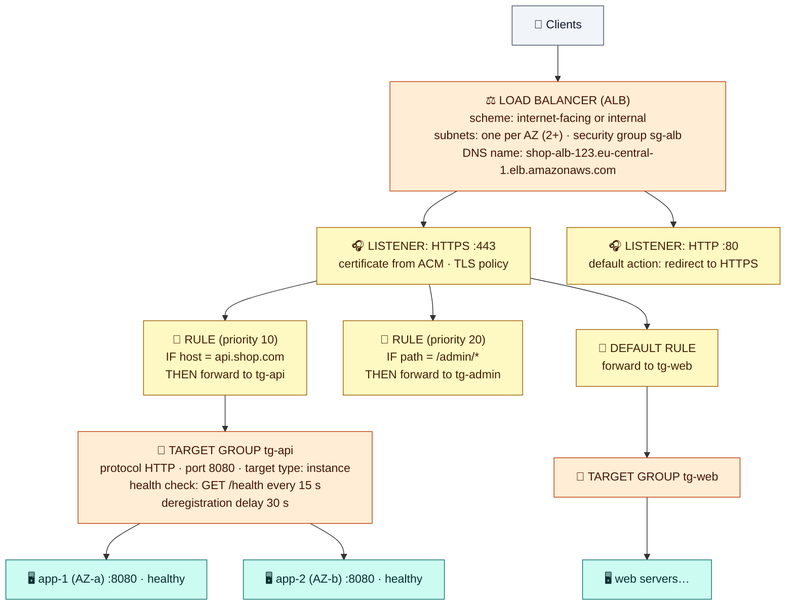

# Module 05 — Load Balancers

← [All tutorials](../README.md) · **Networking tutorial**, module 5 of 8

Customers shouldn't connect to `app-1` directly. It has no public IP, and even if it had one, a single server is a single point of failure. A **load balancer** gives your application one stable address and spreads requests across several servers in several AZs. It also stops sending traffic to servers that fail their **health checks**, and it can handle HTTPS for you. The servers themselves stay in private subnets.

AWS's load balancing service is **Elastic Load Balancing (ELB)**. In this module you put an **Application Load Balancer** in front of two app servers in two AZs.

---

## 1. Which load balancer?

| Type | Works with | Pick it when | Notable |
|---|---|---|---|
| **Application Load Balancer (ALB)** | HTTP, HTTPS, WebSocket, gRPC | Web apps and APIs. **The default choice** | Routes by host name, path, headers. HTTPS certificates, user login, WAF |
| **Network Load Balancer (NLB)** | TCP, UDP, TLS | Non-HTTP protocols, millions of requests/s, or **fixed IP addresses** (one per AZ, can be Elastic IPs) | Passes the client's IP through to servers |
| **Gateway Load Balancer (GWLB)** | Any IP traffic | Inserting third-party firewalls or inspection appliances | Specialized, rarely needed |
| Classic Load Balancer | — | Never for new work | Legacy |

ALB and NLB share the same building blocks, explained next with an ALB.

---

## 2. How a load balancer is put together



**How to read it**, from the top:

1. **Load balancer.** The resource itself. You choose:
   - **Scheme:** *internet-facing* (has public IPs, for customers) or *internal* (private IPs only, for traffic between your own services).
   - **Subnets**, one per AZ, at least two for an ALB. AWS places **load balancer nodes** (network interfaces) in each. Internet-facing load balancers go in **public** subnets. Each subnet needs some free IPs, so use `/27` or larger.
   - **Security group.** Customers reach the nodes through it.

   You get a **DNS name**. Always use it, never the IPs behind it, which change.
2. **Listener.** A port and protocol the load balancer accepts connections on. An HTTPS listener holds a **TLS certificate**. Free certificates come from **AWS Certificate Manager (ACM)**, and AWS renews them automatically. A common pattern is "port 80 just redirects to 443".
3. **Rules** (ALB only). Checked in priority order: *if* the host, path, header, method, or source IP matches, *then* forward, redirect, or return a fixed response. One ALB can serve many applications this way, which saves money. Every listener has a **default rule** for anything that matches nothing else.
4. **Target group.** A pool of servers that receive traffic, plus the settings for how to treat them:
   - **Target type:** `instance` (an EC2 instance ID + port), `ip` (any private IP + port, used by containers, see the ECS tutorial), or `lambda`.
   - **Health check:** the load balancer calls a path (say `/health`) on every target at a fixed interval. A target is marked **unhealthy** after a number of failures and gets **no traffic** until it passes again.
   - **Deregistration delay:** when a target is removed, it gets this long to finish its requests in flight before the load balancer forgets it.
   - Stickiness (keep a user on the same target) and the balancing algorithm are optional.
5. **Targets.** The actual servers, which can be in any AZ of the VPC.

---

## 3. How traffic flows

1. A customer's browser resolves `shop-alb-123…elb.amazonaws.com` and gets the public IPs of the nodes in each AZ.
2. It connects to a node over HTTPS. **The load balancer ends the customer's connection** and decrypts it.
3. The listener's rules pick a target group, and the node picks a **healthy** target, in any AZ by default (*cross-zone load balancing*, always on for ALB).
4. The node opens a **new connection** from its own private IP to the target, for example `10.0.10.37:8080`. That's why the app server's security group allows `sg-alb` and not the internet.
5. The target sees the node's IP as the source. The customer's real IP arrives in the **`X-Forwarded-For`** HTTP header. (An NLB, by contrast, passes the client IP through unchanged.)

The servers never need a public IP, and the load balancer is the only thing exposed to the internet.

---

## 4. Try it: an ALB in front of two app servers

**4.1** Create the load balancer's security group, and let it reach the app servers:

```bash
SG_ALB=$(aws ec2 create-security-group --vpc-id $VPC_ID --group-name lab-sg-alb --description "load balancer" --query GroupId --output text); save SG_ALB
aws ec2 authorize-security-group-ingress --group-id $SG_ALB --protocol tcp --port 80 --cidr 0.0.0.0/0
aws ec2 authorize-security-group-ingress --group-id $SG_APP --protocol tcp --port 8080 --source-group $SG_ALB
```

**4.2** Launch a second app server in the **other AZ** (`app-b`), so you can watch load balancing and failover:

```bash
sed 's/hello from app-1/hello from app-2/' /tmp/app.sh > /tmp/app2.sh
APP2_ID=$(aws ec2 run-instances --image-id $AMI_ID --instance-type t3.micro \
  --subnet-id $APP_B --security-group-ids $SG_APP --metadata-options HttpTokens=required \
  --user-data file:///tmp/app2.sh --tag-specifications 'ResourceType=instance,Tags=[{Key=Name,Value=app-2}]' \
  --query 'Instances[0].InstanceId' --output text); save APP2_ID
aws ec2 wait instance-running --instance-ids $APP2_ID
```

**4.3** Create the load balancer, a target group, and a listener:

```bash
ALB_ARN=$(aws elbv2 create-load-balancer --name lab-alb --subnets $PUB_A $PUB_B --security-groups $SG_ALB \
  --query 'LoadBalancers[0].LoadBalancerArn' --output text); save ALB_ARN
TG_ARN=$(aws elbv2 create-target-group --name lab-tg-app --protocol HTTP --port 8080 --vpc-id $VPC_ID \
  --target-type instance --health-check-path / --health-check-interval-seconds 10 --healthy-threshold-count 2 \
  --query 'TargetGroups[0].TargetGroupArn' --output text); save TG_ARN
aws elbv2 register-targets --target-group-arn $TG_ARN --targets Id=$APP_ID Id=$APP2_ID
LISTENER_ARN=$(aws elbv2 create-listener --load-balancer-arn $ALB_ARN --protocol HTTP --port 80 \
  --default-actions Type=forward,TargetGroupArn=$TG_ARN --query 'Listeners[0].ListenerArn' --output text); save LISTENER_ARN

ALB_DNS=$(aws elbv2 describe-load-balancers --load-balancer-arns $ALB_ARN --query 'LoadBalancers[0].DNSName' --output text); save ALB_DNS
aws elbv2 wait load-balancer-available --load-balancer-arns $ALB_ARN
```

**4.4** Watch it work:

```bash
aws elbv2 describe-target-health --target-group-arn $TG_ARN \
  --query 'TargetHealthDescriptions[].[Target.Id,TargetHealth.State]' --output table     # both "healthy" after ~30 s
for i in 1 2 3 4 5 6; do curl -s http://$ALB_DNS; done                                    # alternates app-1 / app-2
```

**4.5** Break one server and watch the health check react. Stop the service on `app-2`:

```bash
aws ec2-instance-connect ssh --instance-id $APP2_ID --connection-type eice
  sudo systemctl stop demo-app
  exit
sleep 40
aws elbv2 describe-target-health --target-group-arn $TG_ARN --query 'TargetHealthDescriptions[].[Target.Id,TargetHealth.State]' --output table
for i in 1 2 3 4; do curl -s http://$ALB_DNS; done        # only app-1 answers now. No errors for customers
aws ec2-instance-connect ssh --instance-id $APP2_ID --connection-type eice
  sudo systemctl start demo-app
  exit
```

Notice the security group chain doing its job: the internet reaches only `sg-alb` on port 80, and the app servers accept 8080 only from the load balancer (and from `web-1`).

---

## Check yourself

<details><summary>Listener vs rule vs target group?</summary>The listener accepts connections on a port and protocol (and holds the TLS certificate). Rules decide which target group a request goes to. The target group holds the targets plus the health check and draining settings.</details>
<details><summary>Do the app servers need public IPs for an internet-facing ALB?</summary>No. Only the load balancer nodes are in public subnets. Targets are reached through their private IPs.</details>
<details><summary>Your app logs show every request coming from 10.0.0.x or 10.0.1.x. Why, and where is the real client IP?</summary>The ALB opens its own connections from its nodes' private IPs. The client IP is in the X-Forwarded-For header.</details>
<details><summary>A partner needs fixed IP addresses to allow-list your service. ALB or NLB?</summary>NLB, which has one static IP per AZ and can use Elastic IPs. It can also forward to an ALB if you need HTTP routing.</details>

---
**Previous:** [Module 04](04-ec2-instances-in-your-vpc.md) · **Next:** [Module 06 — Private Access & DNS](06-private-access-and-dns.md)
