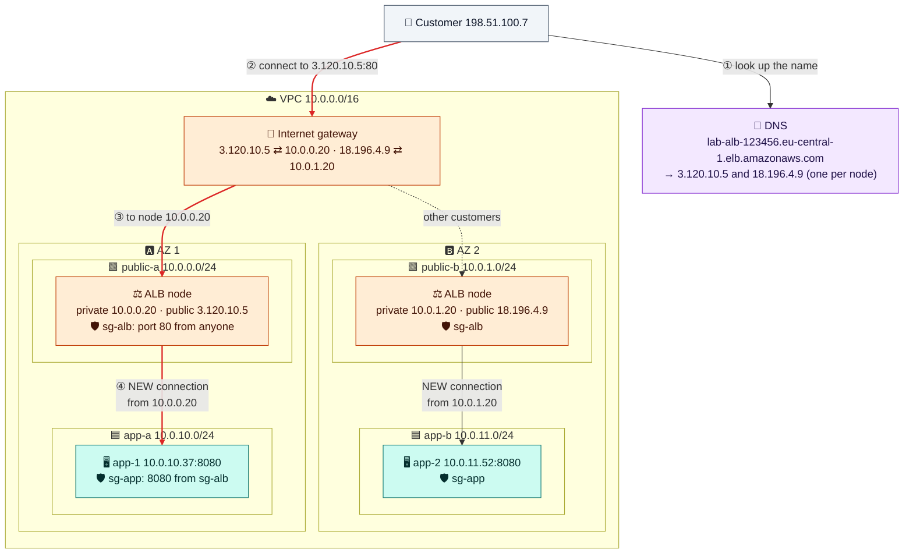

# Module 05 — Load Balancers

← [All tutorials](../README.md) · **Networking tutorial**, module 5 of 8

So far, customers would have to call one server directly. That's a problem:
- **`app-1` has no public IP.** It's in a private subnet on purpose.
- **One server is a single point of failure.** If it crashes, or its AZ has an outage, the site is down.
- **You can't add servers** without telling every customer a new address.

A **load balancer** fixes all three. Customers talk to **one name** (`shop.example.com`), and the load balancer passes each request to one of **several servers** in **several AZs**. It checks the servers constantly and **stops sending traffic to broken ones**. The servers stay private, with no public IPs.

AWS's load balancing service is **Elastic Load Balancing (ELB)**. In this module you put an **Application Load Balancer (ALB)** in front of `app-1` (AZ 1) and a new `app-2` (AZ 2).

---

## 1. The pieces, one question at a time

A load balancer is built from four parts. Each one answers one question. Here's the complete setup you'll build in the lab, written as a tree:

```text
Load balancer   lab-alb        internet-facing · subnets public-a + public-b · security group sg-alb
└── Listener    HTTP :80
    └── Rule    default        → forward to target group lab-tg-app
        └── Target group  lab-tg-app      HTTP :8080 · health check: GET / every 10 s
            ├── Target    app-1  (10.0.10.37:8080, AZ 1)   healthy
            └── Target    app-2  (10.0.11.52:8080, AZ 2)   healthy
```

Read it from the bottom up.

### Target group: *which servers may receive traffic?*

A **target group** is a list of servers (the **targets**) plus the port to send traffic to (`8080`). You **register** servers in it, here `app-1` and `app-2`.

The target group also runs the **health check**. Every 10 seconds, the load balancer sends `GET /` to each target on port 8080:
- After **2 successful** checks in a row, a target is marked **healthy** and starts receiving traffic.
- After **2 failed** checks in a row (an error, or no answer within the timeout), it's marked **unhealthy** and gets **no traffic**. Checking continues, and as soon as it passes again it's put back in rotation.

So a crashed server stops getting requests within about 20 seconds, with no human involved. You'll watch this happen in the lab.

Two more target group settings you'll meet:
- **Target type.** `instance` registers EC2 instances by ID, as in this lab. `ip` registers IP addresses, which is what containers use (see the ECS tutorial). `lambda` sends requests to a Lambda function.
- **Deregistration delay.** When you remove a target (or it's shutting down), the load balancer stops sending it **new** requests, but gives requests already in progress this long (default 300 s, often set to 30 s) to finish.

### Load balancer: *where does it live?*

The load balancer is a regional resource, but it physically runs **inside your VPC**. When you create it, you choose:
- **Subnets, one per AZ** (at least two for an ALB). AWS places a **load balancer node** in each: a network interface with a private IP, like a server's ([Module 04](04-ec2-instances-in-your-vpc.md)). The nodes are the machines that actually receive customer connections.
- **Scheme.** *Internet-facing*: each node also gets a **public IP**, so the nodes go in **public** subnets. *Internal*: private IPs only, for traffic between your own services.
- **A security group** on the nodes, `sg-alb`. It allows port 80/443 from the internet.

AWS gives the load balancer a **DNS name**, such as `lab-alb-123456.eu-central-1.elb.amazonaws.com`. Looking it up returns **the IPs of all nodes**, one per AZ. Those IPs can change as AWS scales the nodes, so **always use the DNS name**. For your own domain, point `shop.example.com` at it (Route 53 *alias* record or CNAME).

### Listener: *what does it accept?*

A **listener** is a port and protocol the load balancer accepts connections on, for example `HTTP :80` or `HTTPS :443`.
- An **HTTPS listener** holds a **TLS certificate**. Free certificates come from **AWS Certificate Manager (ACM)**, and AWS renews them automatically. The load balancer decrypts the traffic, so your servers don't have to deal with certificates at all.
- A common setup: an `HTTP :80` listener that only **redirects** to `HTTPS :443`.

### Rules: *which target group gets this request?*

Each listener has **rules**, checked in priority order. A rule says: **if** the request matches (host name, URL path, header, method, source IP), **then** forward it to a target group, redirect it, or return a fixed response. The **default rule** catches everything else.

The lab has only the default rule. Rules let **one** load balancer serve several applications, which saves money:

```text
Listener HTTPS :443
├── Rule 10   IF host is api.shop.com     → forward to tg-api
├── Rule 20   IF path is /admin/*         → forward to tg-admin
└── Default                               → forward to tg-web
```

(Rules are an ALB feature. A Network Load Balancer, Section 4, just forwards everything a listener receives to one target group.)

---

## 2. Where it all sits in your VPC



**How to read it:**
- The load balancer isn't one box. It's **one node per AZ**, each with a private IP in a **public** subnet, plus a public IP mapped by the internet gateway (exactly like a server's public IP in [Module 02](02-subnets-routing-and-internet-access.md)).
- The **DNS name returns every node's public IP**, so customers spread across both AZs. If an AZ fails, AWS removes its node from DNS.
- Each node opens **its own connection** to the app servers, from **its private IP**. That's why `sg-app` allows `sg-alb`, and why the app servers need **no public IP and no internet route**.
- The drawing shows each node sending to the server in its own AZ, to keep it readable. In reality an ALB node sends to **healthy targets in every AZ**. This is called **cross-zone load balancing**, and it's always on for ALBs.

---

## 3. Follow one request

**Going in:**

```text
1. DNS               The browser looks up lab-alb-123456…elb.amazonaws.com
                     → gets 3.120.10.5 and 18.196.4.9, and picks 3.120.10.5 (the node in AZ 1).

2. Connection #1     Customer 198.51.100.7 → 3.120.10.5:80
                     The internet gateway translates 3.120.10.5 → 10.0.0.20 (the node's private IP).
                     sg-alb allows port 80 from anyone. The NODE accepts the TCP connection.

3. Listener + rule   The node reads the HTTP request: "GET /products".
                     Listener HTTP :80 → default rule → target group lab-tg-app.

4. Choose a target   Healthy targets: app-1 and app-2. The node picks one, say app-2 (AZ 2).

5. Connection #2     Node 10.0.0.20 → app-2 10.0.11.52:8080 (a brand-new TCP connection)
                     The local route carries it across AZs. sg-app allows 8080 from sg-alb.
                     The node adds the header  X-Forwarded-For: 198.51.100.7

6. app-2             Sees a request FROM 10.0.0.20 (the node), not from the customer.
```

**Coming back:** `app-2` answers on connection #2. The node passes the response back on connection #1, and the internet gateway translates `10.0.0.20` back to `3.120.10.5`. The customer receives it from the address it called.

**The key idea: an ALB is a proxy, not a router.** It **ends** the customer's connection and **opens a new one** to the server. Everything follows from that:

| Because there are two separate connections… | …in practice |
|---|---|
| The server sees the **node's IP** as the source | Read the real customer IP from the **`X-Forwarded-For`** header (most web frameworks can do this for you) |
| Only the node needs to reach the server | The server's security group allows **only `sg-alb`**, and the server needs **no public IP** |
| The node fully reads each request | It can decrypt HTTPS, route by path or host, and add headers |
| Each request can go to a different server | The servers should be **stateless**: keep sessions in a database or cache, or turn on **stickiness** |

---

## 4. Which type of load balancer?

| Type | Works at | Pick it when | Notable |
|---|---|---|---|
| **Application Load Balancer (ALB)** | HTTP, HTTPS, WebSocket, gRPC | Web apps and APIs. **The default choice** | A proxy (Section 3): rules by host or path, HTTPS certificates, user login, a web application firewall (AWS WAF) |
| **Network Load Balancer (NLB)** | TCP, UDP, TLS | Non-HTTP protocols, extreme traffic, or **fixed IP addresses** (one per AZ, can be Elastic IPs, so partners can allow-list them) | **Passes the customer's IP through**, so the server sees the real client address |
| **Gateway Load Balancer (GWLB)** | Any IP traffic | Inserting third-party firewalls or inspection appliances | Specialized |
| Classic Load Balancer | — | Never for new work | Legacy |

---

## 5. Try it: an ALB in front of two app servers

**5.1** Create the load balancer's security group, and let it reach the app servers:

```bash
SG_ALB=$(aws ec2 create-security-group --vpc-id $VPC_ID --group-name lab-sg-alb --description "load balancer" --query GroupId --output text); save SG_ALB
aws ec2 authorize-security-group-ingress --group-id $SG_ALB --protocol tcp --port 80 --cidr 0.0.0.0/0
aws ec2 authorize-security-group-ingress --group-id $SG_APP --protocol tcp --port 8080 --source-group $SG_ALB
```

**5.2** Launch a second app server in the **other AZ** (`app-b`):

```bash
sed 's/hello from app-1/hello from app-2/' /tmp/app.sh > /tmp/app2.sh
APP2_ID=$(aws ec2 run-instances --image-id $AMI_ID --instance-type t3.micro \
  --subnet-id $APP_B --security-group-ids $SG_APP --metadata-options HttpTokens=required \
  --user-data file:///tmp/app2.sh --tag-specifications 'ResourceType=instance,Tags=[{Key=Name,Value=app-2}]' \
  --query 'Instances[0].InstanceId' --output text); save APP2_ID
aws ec2 wait instance-running --instance-ids $APP2_ID
```

**5.3** Build the tree from Section 1, bottom-up: target group → targets → load balancer → listener with its default rule.

```bash
# Target group + health check, then register both servers
TG_ARN=$(aws elbv2 create-target-group --name lab-tg-app --protocol HTTP --port 8080 --vpc-id $VPC_ID \
  --target-type instance --health-check-path / --health-check-interval-seconds 10 \
  --healthy-threshold-count 2 --unhealthy-threshold-count 2 \
  --query 'TargetGroups[0].TargetGroupArn' --output text); save TG_ARN
aws elbv2 register-targets --target-group-arn $TG_ARN --targets Id=$APP_ID Id=$APP2_ID

# The load balancer: one node in each public subnet
ALB_ARN=$(aws elbv2 create-load-balancer --name lab-alb --subnets $PUB_A $PUB_B --security-groups $SG_ALB \
  --query 'LoadBalancers[0].LoadBalancerArn' --output text); save ALB_ARN
aws elbv2 wait load-balancer-available --load-balancer-arns $ALB_ARN

# The listener on port 80. Its default rule forwards to the target group
LISTENER_ARN=$(aws elbv2 create-listener --load-balancer-arn $ALB_ARN --protocol HTTP --port 80 \
  --default-actions Type=forward,TargetGroupArn=$TG_ARN --query 'Listeners[0].ListenerArn' --output text); save LISTENER_ARN
ALB_DNS=$(aws elbv2 describe-load-balancers --load-balancer-arns $ALB_ARN --query 'LoadBalancers[0].DNSName' --output text); save ALB_DNS
```

**5.4** See the pieces from Section 2 for yourself:

```bash
# The nodes: one network interface per public subnet, created by AWS for the load balancer
aws ec2 describe-network-interfaces --filters "Name=description,Values=ELB app/lab-alb/*" \
  --query 'NetworkInterfaces[].[AvailabilityZone,SubnetId,PrivateIpAddress,Association.PublicIp]' --output table

# The DNS name returns the nodes' public IPs (one per AZ)
dig +short $ALB_DNS

# The targets: both healthy after ~20–30 s
aws elbv2 describe-target-health --target-group-arn $TG_ARN \
  --query 'TargetHealthDescriptions[].[Target.Id,TargetHealth.State]' --output table
```

**5.5** Send requests. They alternate between the two servers:

```bash
for i in 1 2 3 4 5 6; do curl -s http://$ALB_DNS; done        # hello from app-1 / hello from app-2 ...
```

**5.6** See the **two connections** (Section 3). What source address did `app-1` see?

```bash
aws ec2-instance-connect ssh --instance-id $APP_ID --connection-type eice
  sudo journalctl -u demo-app -n 5 --no-pager      # requests come FROM 10.0.0.x / 10.0.1.x: the load balancer nodes,
  exit                                              # not from your laptop's IP
```

**5.7** Break one server and watch the health check take it out of rotation:

```bash
aws ec2-instance-connect ssh --instance-id $APP2_ID --connection-type eice
  sudo systemctl stop demo-app
  exit
sleep 30
aws elbv2 describe-target-health --target-group-arn $TG_ARN \
  --query 'TargetHealthDescriptions[].[Target.Id,TargetHealth.State,TargetHealth.Reason]' --output table   # app-2: unhealthy
for i in 1 2 3 4; do curl -s http://$ALB_DNS; done            # only app-1 answers, and customers see no errors

aws ec2-instance-connect ssh --instance-id $APP2_ID --connection-type eice
  sudo systemctl start demo-app                              # about 20 s later app-2 is healthy again
  exit
```

---

## Check yourself

<details><summary>Put these in order from the customer to the server: target, listener, target group, load balancer node, rule.</summary>Load balancer node → listener → rule → target group → target.</details>
<details><summary>Do the app servers need public IPs behind an internet-facing ALB?</summary>No. Only the load balancer nodes are in public subnets. They reach the servers through the servers' private IPs.</details>
<details><summary>Your app logs show every request coming from 10.0.0.x or 10.0.1.x. Why, and where's the customer's IP?</summary>An ALB is a proxy: it opens its own connection to the server from its node's private IP. The customer's IP is in the X-Forwarded-For header.</details>
<details><summary>A server crashes. How long until customers stop being sent to it, in this lab?</summary>About 20 seconds: two failed health checks, 10 seconds apart.</details>
<details><summary>Why use the load balancer's DNS name rather than its IP addresses?</summary>There's one node IP per AZ, and those IPs change as AWS scales or replaces nodes. The DNS name always returns the current ones.</details>
<details><summary>A partner needs fixed IP addresses to allow-list your service. ALB or NLB?</summary>NLB: one static IP per AZ, which can be Elastic IPs.</details>

---
**Previous:** [Module 04](04-ec2-instances-in-your-vpc.md) · **Next:** [Module 06 — Private Access & DNS](06-private-access-and-dns.md)
