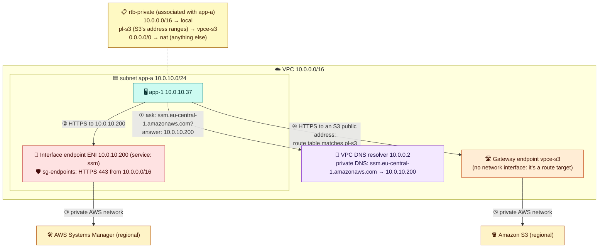

# Module 06 — Private Access to AWS Services & DNS

← [All tutorials](../README.md) · **Networking tutorial**, module 6 of 8

Your app servers call AWS services all the time: S3 for files, Systems Manager for sessions, Secrets Manager for passwords, ECR for container images. Those services have **public** addresses (`s3.eu-central-1.amazonaws.com`), so right now `app-1`'s calls leave through the **NAT gateway** and the internet gateway. That works, but it has three downsides:

- The NAT gateway charges **per GB**. Large S3 transfers get expensive quickly.
- The private servers need an internet path at all, which you may want to forbid (for example, in the data tier).
- If the NAT has a problem, your AWS calls fail too.

**VPC endpoints** let servers reach AWS services **privately**, without the internet or NAT. This module also explains **DNS** inside a VPC, because one kind of endpoint works by changing what names resolve to.

---

## 1. The two kinds of endpoints

| | **Gateway endpoint** | **Interface endpoint** |
|---|---|---|
| For | **S3 and DynamoDB only** | Most other AWS services (SSM, ECR, Secrets Manager, CloudWatch Logs, STS…), plus your own or partners' services |
| How it works | Adds a **route** to the route tables you choose: "S3's address ranges → this endpoint" | Puts a **network interface with a private IP** in each subnet you choose, and makes the service's normal name resolve to that IP |
| DNS changes? | No. The name still resolves to public S3 addresses, but the **route** sends the traffic privately | **Yes** (private DNS) |
| Security group | No (use an endpoint policy) | Yes |
| Usable from other VPCs or on-prem | No | Yes |
| Price | **Free** | About $0.01 per hour per AZ + per GB |

Here's what an app server does when it uses each kind:



**How to read it:**
- **Interface endpoint, ① to ③.** The app asks the VPC's DNS resolver for the normal service name. Because the endpoint has **private DNS** enabled, the resolver answers with the endpoint's **private** IP in the app's own subnet. The app connects there, and the endpoint carries the request to the service. Your code doesn't change at all.
- **Gateway endpoint, ④ to ⑤.** DNS still returns S3's public addresses, but the route table has a more specific entry for S3's address ranges (a **prefix list**, `pl-…`, an AWS-maintained list of S3's IP ranges in this Region). It sends that traffic to the endpoint instead of the NAT.
- **Anything else** still follows `0.0.0.0/0 → nat`.

**Common endpoint sets:**
- **Session Manager** without NAT: `ssm`, `ssmmessages`, `ec2messages`.
- **Pulling container images** from ECR without NAT: `ecr.api`, `ecr.dkr`, plus the **S3 gateway endpoint** (image layers are stored in S3).
- **Logs and secrets:** `logs`, `secretsmanager`, `kms`, `sts`.

**Always add the free S3 gateway endpoint** to private route tables. It removes S3 traffic from the NAT bill. Interface endpoints cost per AZ per hour, so in setups with many VPCs, teams share them from one central VPC.

---

## 2. DNS inside a VPC

Every VPC has a **DNS resolver** at its range's base address **+2** (`10.0.0.2` here; `169.254.169.253` also works from any VPC). Servers get it automatically. It answers:

| Kind of name | Example | Answer |
|---|---|---|
| Public internet names | `www.google.com` | Normal public DNS |
| AWS service names | `s3.eu-central-1.amazonaws.com` | Public addresses, or **endpoint private IPs** if an interface endpoint has private DNS on |
| EC2 instance names | `ip-10-0-10-37.eu-central-1.compute.internal` | The instance's private IP |
| **Your private DNS zones** | `db.shop.internal` | Whatever records you create (below) |

### Private hosted zones: your own internal names

Instead of hard-coding IPs or long AWS names in configuration, create a **private hosted zone** in **Route 53** (AWS's DNS service) and **associate it with your VPCs**. Its names resolve **only** inside those VPCs:

```text
db.shop.internal     CNAME  shop-db.cluster-abc123.eu-central-1.rds.amazonaws.com
cache.shop.internal  CNAME  shop-cache.xyz.cache.amazonaws.com
app.shop.internal    A      10.0.10.37
```

If the database moves, you change one record, not every server's configuration.

Requirements: the VPC settings **DNS resolution** and **DNS hostnames** must both be on (you enabled hostnames in Module 01).

### DNS between AWS and your office

Your office DNS servers can't query `10.0.0.2` over a VPN. That address only answers clients inside the VPC. **Route 53 Resolver endpoints** bridge the two:
- An **inbound endpoint** gives the office DNS servers IP addresses inside your VPC to forward queries to, for example for `shop.internal`.
- An **outbound endpoint** plus a **forwarding rule** lets VPC servers resolve office names: "send `corp.example.com` queries to the office DNS servers `192.168.0.53`".

### A DNS trap

You can change which DNS servers your instances use (with a **DHCP options set**). If you point them at your own DNS servers, those servers **must forward** AWS names to the VPC resolver. Otherwise, private hosted zones and interface endpoints silently stop working. Usually it's better to keep the AWS resolver and add forwarding rules.

---

## 3. Try it: a gateway endpoint and a private DNS name

**3.1 Add the S3 gateway endpoint and watch the route table change:**

```bash
aws ec2 describe-route-tables --route-table-ids $RT_PRIV --query 'RouteTables[0].Routes[].[DestinationCidrBlock,DestinationPrefixListId,GatewayId,NatGatewayId]' --output table
S3_EP=$(aws ec2 create-vpc-endpoint --vpc-id $VPC_ID --vpc-endpoint-type Gateway \
  --service-name com.amazonaws.$AWS_REGION.s3 --route-table-ids $RT_PRIV \
  --query VpcEndpoint.VpcEndpointId --output text); save S3_EP
aws ec2 describe-route-tables --route-table-ids $RT_PRIV --query 'RouteTables[0].Routes[].[DestinationCidrBlock,DestinationPrefixListId,GatewayId,NatGatewayId]' --output table
#   new row: pl-xxxxxxxx -> vpce-xxxxxxxx
```

**3.2 Remove the NAT route.** S3 keeps working privately, while the rest of the internet doesn't:

```bash
aws ec2 delete-route --route-table-id $RT_PRIV --destination-cidr-block 0.0.0.0/0
aws ec2-instance-connect ssh --instance-id $APP_ID --connection-type eice
  curl -m 5 -s https://checkip.amazonaws.com || echo "internet: blocked (no NAT route)"
  curl -m 5 -s -o /dev/null -w "S3 answered with HTTP %{http_code}\n" https://s3.eu-central-1.amazonaws.com/   # use your Region
  resolvectl status | grep "DNS Servers"           # the VPC resolver: 10.0.0.2
  exit
```

Any HTTP status from S3 (200, 307, or 403) proves the network path works without NAT.

**3.3 Delete the NAT gateway** (it's no longer needed, and it costs money):

```bash
aws ec2 delete-nat-gateway --nat-gateway-id $NAT_ID >/dev/null
until [ "$(aws ec2 describe-nat-gateways --nat-gateway-ids $NAT_ID --query 'NatGateways[0].State' --output text)" = "deleted" ]; do sleep 15; done
aws ec2 release-address --allocation-id $NAT_EIP
```

**3.4 Create a private DNS name for `app-1`:**

```bash
ZONE_ID=$(aws route53 create-hosted-zone --name lab.internal --caller-reference lab-$(date +%s) \
  --vpc VPCRegion=$AWS_REGION,VPCId=$VPC_ID --query HostedZone.Id --output text); save ZONE_ID
aws route53 change-resource-record-sets --hosted-zone-id $ZONE_ID --change-batch "{\"Changes\":[{\"Action\":\"CREATE\",
  \"ResourceRecordSet\":{\"Name\":\"app.lab.internal\",\"Type\":\"A\",\"TTL\":60,\"ResourceRecords\":[{\"Value\":\"$APP_PRIV\"}]}}]}" >/dev/null

ssh -i ~/lab-key.pem ec2-user@$WEB_IP
  getent hosts app.lab.internal              # -> 10.0.10.x : resolved by the VPC resolver from your private zone
  curl -s http://app.lab.internal:8080       # -> hello from app-1
  exit
dig +short app.lab.internal                  # from your laptop: nothing. The zone is private to the VPC
```

---

## Check yourself

<details><summary>How does a gateway endpoint steer traffic, and how does an interface endpoint?</summary>Gateway: a route table entry (prefix list → endpoint). Interface: a network interface with a private IP, plus private DNS so the service name resolves to it.</details>
<details><summary>Which AWS services have gateway endpoints?</summary>S3 and DynamoDB.</details>
<details><summary>Your office servers need to reach S3 privately over a VPN. Gateway or interface endpoint?</summary>Interface endpoint. Gateway endpoints only work for traffic from inside the VPC.</details>
<details><summary>What's at 10.0.0.2 in a VPC with range 10.0.0.0/16?</summary>The VPC's DNS resolver.</details>

---
**Previous:** [Module 05](05-load-balancers.md) · **Next:** [Module 07 — Connecting Networks](07-connecting-networks.md)
