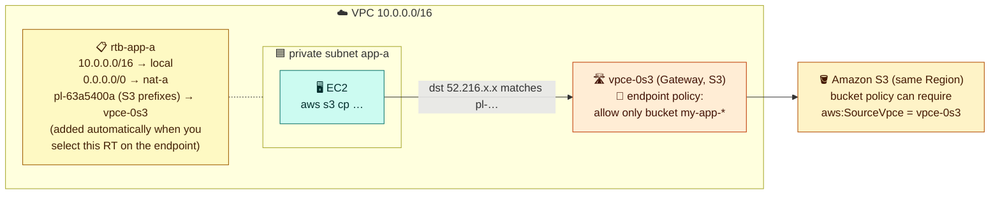
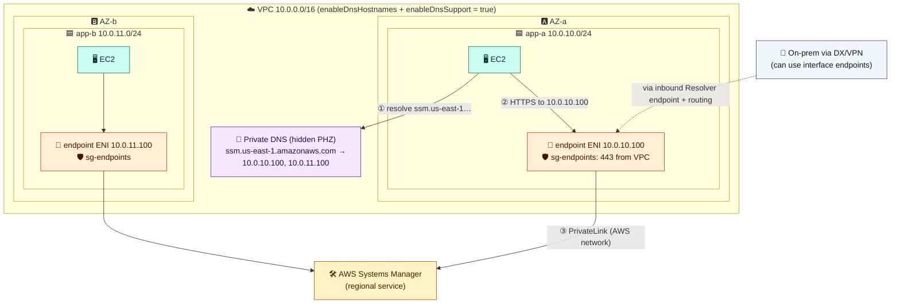
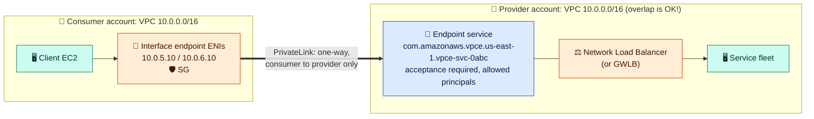
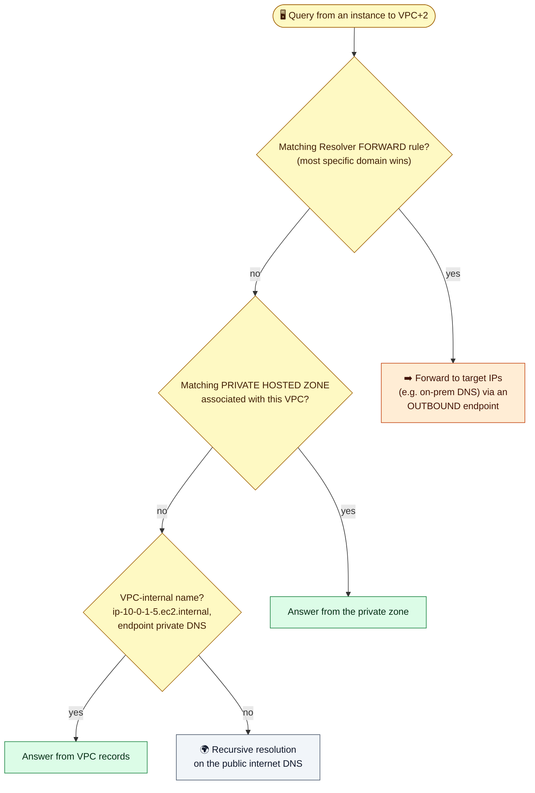
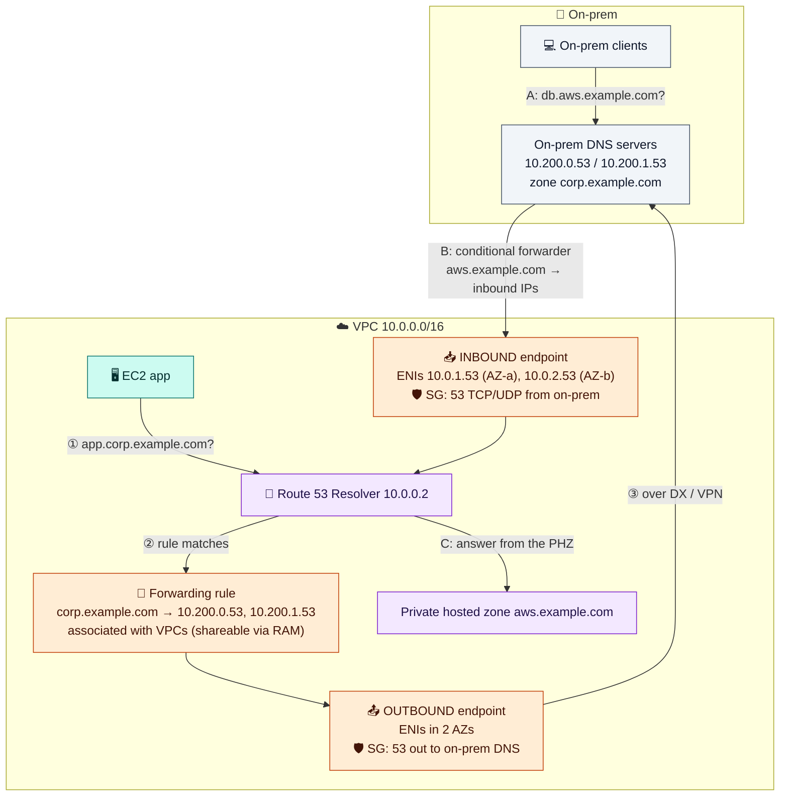

# Module 06 — Private Access & DNS: Endpoints, PrivateLink, Route 53 Resolver

> Reach AWS services and other teams' services without the internet or NAT, and understand how name resolution works inside a VPC and to and from on-prem.

---

## 1. VPC endpoints

| | **Gateway endpoint** | **Interface endpoint** (PrivateLink) | **GWLB endpoint** |
|---|---|---|---|
| Services | **S3, DynamoDB only** | Most AWS services, SaaS, your own services | Your firewall fleet behind a GWLB |
| Mechanism | **Route table** entry `pl-… → vpce-…` | **ENI** with a private IP in each chosen subnet, plus **private DNS** | Route table target, GENEVE to appliances |
| Security group | ❌ (use the endpoint policy) | ✅ | ❌ |
| Usable from on-prem / peered VPCs | ❌ | ✅ | via routing |
| Cost | **Free** | Per AZ-hour + per GB | Per hour + per GB |

### Gateway endpoint: routing-based



DNS doesn't change: the S3 hostname still resolves to public S3 IPs. The **route** is what changes, because the prefix-list route beats `0/0 → nat`. Lock buckets to your VPC with `aws:SourceVpce` conditions in the bucket policy.

### Interface endpoint: ENI + DNS based



- Pick **one subnet per AZ**. Private DNS makes the **normal service hostname** resolve to the endpoint's IPs, so you need **no code changes**.
- Requires `enableDnsSupport` and `enableDnsHostnames`, plus an endpoint SG allowing **443 from your clients**.
- **Common sets:** SSM without NAT = `ssm`, `ssmmessages`, `ec2messages`. ECR without NAT = `ecr.api`, `ecr.dkr` **+ the S3 gateway endpoint**.
- In multi-VPC estates, centralize endpoints in a shared-services VPC to save per-AZ-hour charges.

### PrivateLink for your own services



Use it to expose **one service** to other VPCs or accounts. It's **one-way** (consumer → provider) and **overlapping CIDRs don't matter**. Compare that with peering, which exposes whole networks.

---

## 2. DNS inside a VPC

- The **Route 53 Resolver** answers at **VPC base + 2** (e.g. `10.0.0.2`) and at `169.254.169.253`. It needs `enableDnsSupport`.
- It resolves public DNS, EC2 names (`ip-10-0-1-5.ec2.internal`), **private hosted zones** associated with the VPC, and endpoint private DNS.
- Public EC2 hostnames are **split-horizon**: they resolve to the private IP inside the VPC and the public IP outside (needs `enableDnsHostnames`).
- Limit: 1,024 packets/s per ENI to the Resolver. Cache in chatty apps. DNS traffic **isn't** filtered by SGs and doesn't appear in Flow Logs (use Resolver query logs).



### Hybrid DNS



- On-prem **can't** query `.2` over VPN/Direct Connect. Give it a **Resolver inbound endpoint**.
- AWS → on-prem lookups need an **outbound endpoint + forwarding rule** (`corp.example.com → on-prem DNS`). Rules can be shared across accounts with RAM.
- **DHCP option sets** are immutable: to change one, create a new set and associate it. If you point instances at your own DNS servers, those servers must forward AWS names to `.2`, or private zones and endpoints break.

---

## 3. Hands-on: gateway endpoint, then remove the NAT

```bash
aws ec2 describe-route-tables --route-table-ids $RT_PRIV --query 'RouteTables[0].Routes'   # before
S3_EP=$(aws ec2 create-vpc-endpoint --vpc-id $VPC_ID --vpc-endpoint-type Gateway \
  --service-name com.amazonaws.$AWS_REGION.s3 --route-table-ids $RT_PRIV \
  --query VpcEndpoint.VpcEndpointId --output text); save S3_EP
aws ec2 describe-route-tables --route-table-ids $RT_PRIV --query 'RouteTables[0].Routes'   # after: pl-… -> vpce-…

# Remove internet egress: S3 keeps working privately, the internet doesn't
aws ec2 delete-route --route-table-id $RT_PRIV --destination-cidr-block 0.0.0.0/0
aws ec2-instance-connect ssh --instance-id $APP_ID --connection-type eice
  curl -m 5 -s https://checkip.amazonaws.com || echo "internet: blocked"
  curl -m 5 -s -o /dev/null -w "S3 HTTP %{http_code}\n" https://s3.us-east-1.amazonaws.com/   # use your Region
  exit

# Stop paying for the NAT gateway
aws ec2 delete-nat-gateway --nat-gateway-id $NAT_ID
until [ "$(aws ec2 describe-nat-gateways --nat-gateway-ids $NAT_ID --query 'NatGateways[0].State' --output text)" = "deleted" ]; do sleep 15; done
aws ec2 release-address --allocation-id $NAT_EIP
```

Any HTTP status from S3 (200, 307, or 403) proves the private path works.

---

## Check yourself

<details><summary>Gateway vs interface endpoint: how does each steer traffic?</summary>Gateway: a route table entry (prefix list → vpce). Interface: an ENI with a private IP, plus private DNS for the service name.</details>
<details><summary>On-prem needs private S3 access over Direct Connect. Which endpoint?</summary>An S3 interface endpoint. Gateway endpoints only work from inside the VPC.</details>
<details><summary>Can on-prem servers use 10.0.0.2 for DNS over a VPN?</summary>No. Use a Resolver inbound endpoint.</details>

---
**Previous:** [Module 05](05-ec2-networking-and-load-balancers.md) · **Next:** [Module 07 — Connecting Networks](07-connecting-networks.md)
