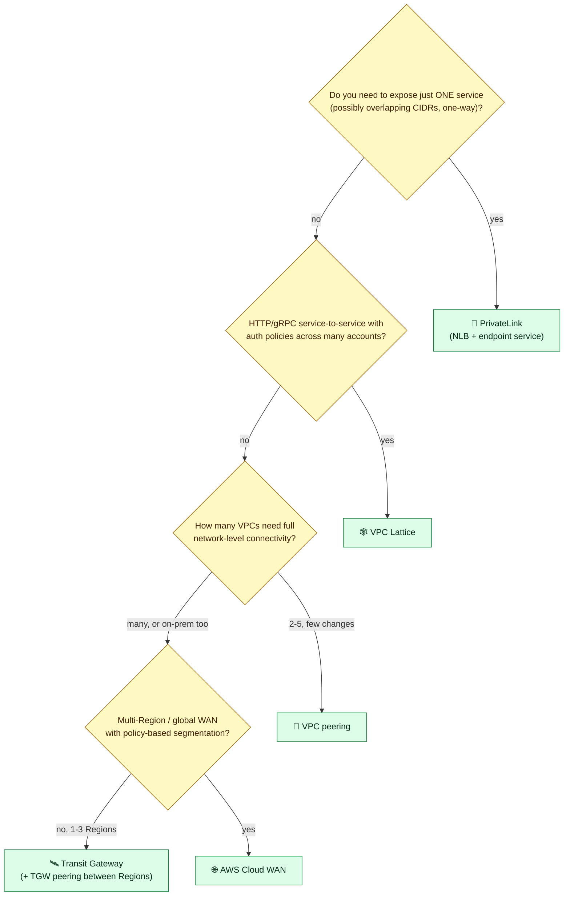
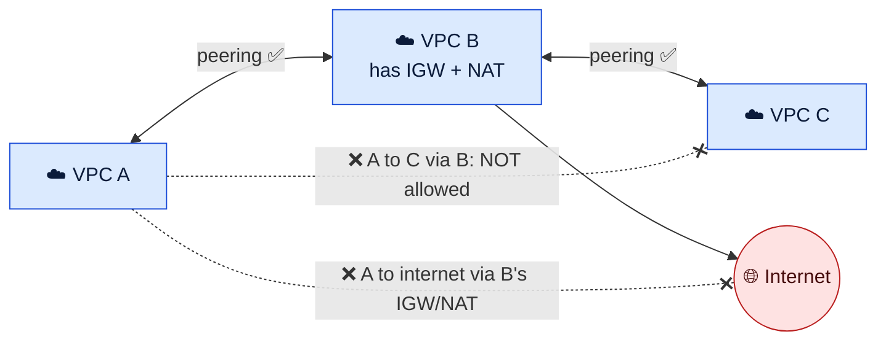
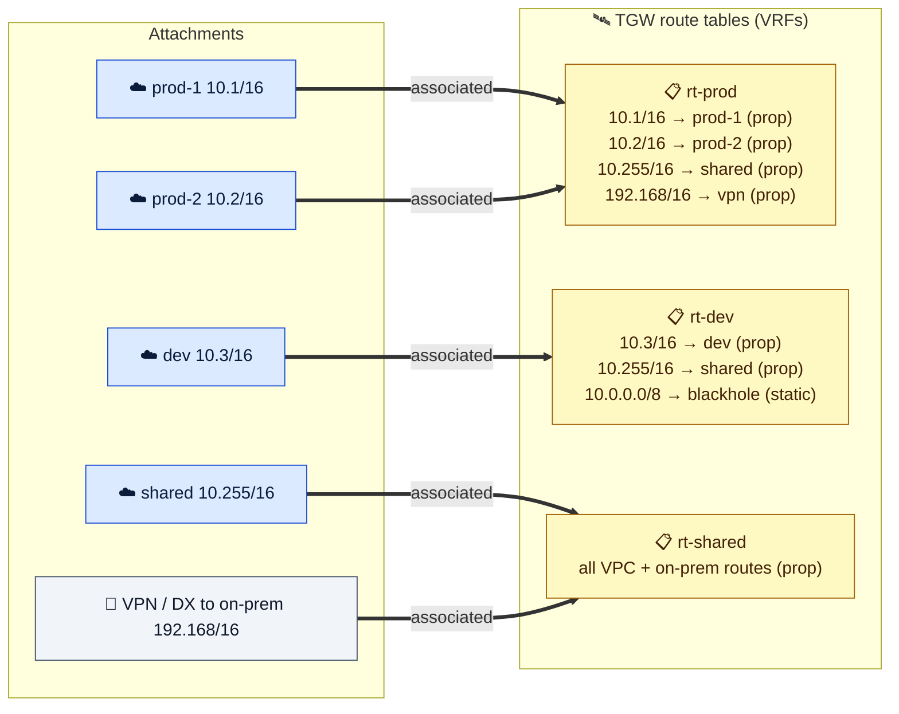
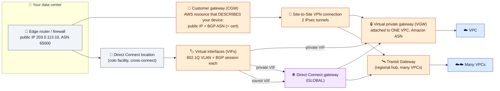
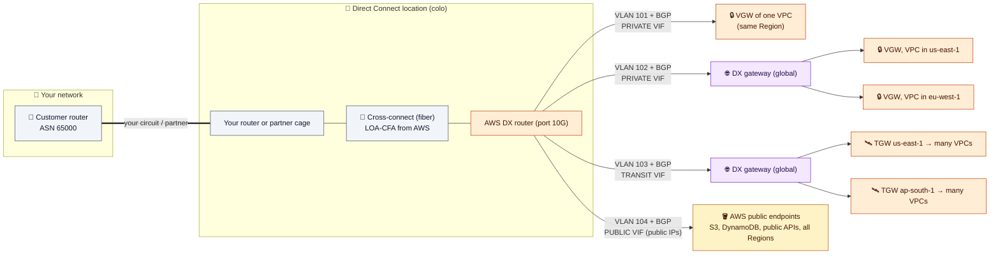

# Module 07 — Connecting Networks: Peering, Transit Gateway, VPN, Direct Connect

> Connect VPCs to each other and to your data centers, and pick the right option for the job.

---

## 1. Choosing



| Option | Use when | Key limits |
|---|---|---|
| **VPC peering** | A few VPCs, high volume, lowest cost | Non-transitive. No overlapping CIDRs. Routes needed **on both sides** |
| **Transit Gateway** | Many VPCs and/or on-prem, with segmentation | Per attachment-hour + per GB. Static routes in the VPCs |
| **PrivateLink** | Expose **one service** across accounts (overlap OK) | One-way. Provider needs an NLB/GWLB (Module 06) |
| **Site-to-Site VPN** | Fast, encrypted link to an office or DC | 2 tunnels. 1.25 Gbps per tunnel (5 Gbps on TGW). MTU ~1446 |
| **Direct Connect** | Steady high bandwidth, predictable latency | Weeks to provision. **Not encrypted by default** |
| **Client VPN** | People into the VPC | Managed OpenVPN. Needs authorization rules + routes |
| **VPC Lattice / Cloud WAN** | Service-to-service networking with auth / a global managed WAN | Newer, higher-level options |

---

## 2. VPC peering



- 1:1, same or different account and Region. Traffic stays on the AWS backbone. No hourly charge.
- **No edge-to-edge routing:** A can't use B's IGW, NAT, VPN, Direct Connect, or gateway endpoints.
- Add routes in **both** VPCs' subnet route tables (`peer CIDR → pcx-…`) and allow the peer's CIDR (or, in the same Region, its SG) in your SGs.
- Full mesh grows as N×(N−1)/2. Past a handful of VPCs, switch to Transit Gateway.

## 3. Transit Gateway: a regional hub router with VRFs

| Concept | Meaning | Network analogy |
|---|---|---|
| **Attachment** | A VPC, VPN, Direct Connect gateway, TGW peering, or Connect (GRE/BGP) | Interface |
| **TGW route table** | A routing table inside the TGW | VRF |
| **Association** | Each attachment uses **exactly one** TGW route table for traffic **coming from** it | Interface → VRF binding |
| **Propagation** | An attachment **installs its routes** into one or more TGW route tables | Route leaking |



- A VPC attachment uses **one subnet per AZ** (use small dedicated `/28`s). An AZ without an attachment subnet can't reach the TGW.
- TGW **never** updates VPC route tables. Add `10.0.0.0/8 → tgw-…` yourself.
- For A to reach B, **A's associated table** needs a route to B and **B's associated table** needs a route back.
- Enable **appliance mode** on the attachment of a central inspection VPC, so both directions of a flow use the same firewall.
- Share a TGW across accounts with AWS RAM. Peer TGWs across Regions (static routes only).

---

## 4. Hybrid connectivity



### Site-to-Site VPN
- A **customer gateway** resource describes your device (public IP + BGP ASN). AWS gives you **two tunnels** in different AZs: configure **both**, and prefer BGP.
- It terminates on a **VGW** (one VPC, which can propagate routes into VPC route tables) or a **Transit Gateway** (many VPCs, ECMP across tunnels, 5 Gbps tunnels, accelerated VPN).

### Direct Connect



| VIF | Goes to | Use |
|---|---|---|
| **Private VIF** | A VGW, or a Direct Connect gateway → VGWs in any Region | VPC private IPs |
| **Transit VIF** | Direct Connect gateway → Transit Gateways in any Region | Many VPCs |
| **Public VIF** | AWS public endpoints (public IPs) | S3/public APIs over DX |

- The **Direct Connect gateway is global**, but it doesn't route between its own associations (it's not a VPC-to-VPC path).
- DX is **unencrypted**: use **MACsec** or run **IPsec VPN over DX**. For resilience, use two locations, or DX plus a VPN backup.

### Route preference (AWS → on-prem)
1. **Longest prefix** wins, even across DX and VPN.
2. For the same prefix: static route in the VPC route table > propagated. Then **Direct Connect > VPN static > VPN BGP**.
3. Influence on-prem → AWS with your own BGP settings. Influence AWS → on-prem with AS-path prepending or the DX local-preference communities (`7224:7100` / `7200` / `7300`).

---

## 5. Hands-on: VPC peering

```bash
VPC2=$(aws ec2 create-vpc --cidr-block 10.1.0.0/16 --query Vpc.VpcId --output text); save VPC2
SUB2=$(aws ec2 create-subnet --vpc-id $VPC2 --cidr-block 10.1.0.0/24 --availability-zone $AZ1 --query Subnet.SubnetId --output text); save SUB2
SG_PEER=$(aws ec2 create-security-group --vpc-id $VPC2 --group-name lab-sg-peer --description peer --query GroupId --output text); save SG_PEER
aws ec2 authorize-security-group-ingress --group-id $SG_PEER --ip-permissions 'IpProtocol=icmp,FromPort=-1,ToPort=-1,IpRanges=[{CidrIp=10.0.0.0/16}]'
PEER_ID=$(aws ec2 run-instances --image-id $AMI_ID --instance-type t3.micro --subnet-id $SUB2 --security-group-ids $SG_PEER \
  --metadata-options HttpTokens=required --query 'Instances[0].InstanceId' --output text); save PEER_ID
aws ec2 wait instance-running --instance-ids $PEER_ID
PEER_IP=$(aws ec2 describe-instances --instance-ids $PEER_ID --query 'Reservations[0].Instances[0].PrivateIpAddress' --output text); save PEER_IP

PCX=$(aws ec2 create-vpc-peering-connection --vpc-id $VPC_ID --peer-vpc-id $VPC2 --query VpcPeeringConnection.VpcPeeringConnectionId --output text); save PCX
aws ec2 accept-vpc-peering-connection --vpc-peering-connection-id $PCX >/dev/null

# Route on ONE side only: ping fails (no return route)
aws ec2 create-route --route-table-id $RT_PRIV --destination-cidr-block 10.1.0.0/16 --vpc-peering-connection-id $PCX
# Return route (vpc2's subnet uses vpc2's MAIN table): ping works
VPC2_MAIN_RT=$(aws ec2 describe-route-tables --filters Name=vpc-id,Values=$VPC2 Name=association.main,Values=true --query 'RouteTables[0].RouteTableId' --output text); save VPC2_MAIN_RT
aws ec2 create-route --route-table-id $VPC2_MAIN_RT --destination-cidr-block 10.0.0.0/16 --vpc-peering-connection-id $PCX

echo "peer IP: $PEER_IP"
aws ec2-instance-connect ssh --instance-id $APP_ID --connection-type eice
  ping -c 3 <peer IP>
  exit
```

Try the ping between the two `create-route` commands to watch it fail, then succeed.

---

## Check yourself

<details><summary>A peers with B, and B peers with C. Can A reach C?</summary>No. Peering is non-transitive.</details>
<details><summary>TGW association vs propagation?</summary>Association: the single table used for traffic from that attachment. Propagation: which tables learn the attachment's routes.</details>
<details><summary>DX and VPN both advertise 192.168.0.0/16. Which does AWS use?</summary>Direct Connect.</details>
<details><summary>Is Direct Connect encrypted?</summary>No. Use MACsec or a VPN over DX.</details>

---
**Previous:** [Module 06](06-private-access-and-dns.md) · **Next:** [Module 08 — Operate & Review](08-operate-and-review.md)
