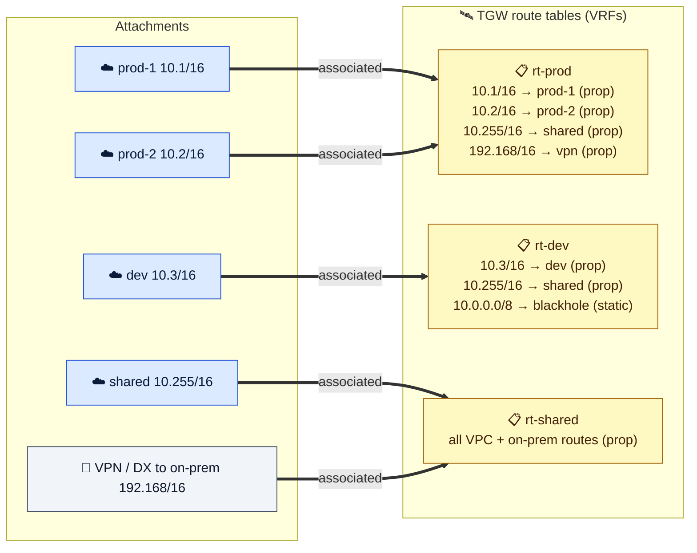
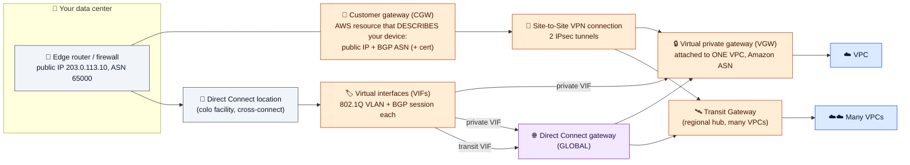

# Module 07 — Connecting Networks: Peering, Transit Gateway, VPN, Direct Connect

← [All tutorials](../README.md) · **Networking tutorial**, module 7 of 8

Sooner or later your VPC must talk to other networks: a second VPC for shared services, another team's account, your office, or a data center. This module covers the four main tools, from simplest to most powerful. Throughout, remember Module 02: **traffic only flows where route tables send it, and only if security groups allow it.** Every connection below needs routes on **both** sides.

| You need to connect… | Use | One-line summary |
|---|---|---|
| Two or three VPCs | **VPC peering** | A private link between exactly two VPCs. Free to create |
| Many VPCs, and/or on-prem, with separation (prod vs dev) | **Transit Gateway** | A central router that all networks plug into |
| One **service** to another VPC or account (even with overlapping IP ranges) | **PrivateLink** | Publish a service behind a Network Load Balancer, and consumers reach it through an interface endpoint |
| Your office or data center, quickly | **Site-to-Site VPN** | Encrypted tunnels over the internet |
| Your data center, with high and steady traffic | **Direct Connect** | A private fiber connection to AWS |
| Individual people (laptops) | **Client VPN** | Managed OpenVPN-style remote access |

---

## 1. VPC peering

A **peering connection** links two VPCs (same or different account, same or different Region) so their servers can talk using private IPs, as if they were one network. The traffic stays on AWS's network.

**Setting it up takes three steps:**
1. One VPC **requests** a peering with the other, and the other side **accepts** it.
2. Add a **route on both sides**: VPC A's route tables send B's range to the peering (`10.1.0.0/16 → pcx-…`), and B's send A's range back (`10.0.0.0/16 → pcx-…`).
3. **Allow the traffic in security groups.** Within the same Region, you can even reference the other VPC's security groups.

**Rules to remember:**
- **IP ranges must not overlap.**
- **Peering isn't transitive.** If A peers with B, and B peers with C, A **can't** reach C through B. You'd need A↔C directly.
- **A can't use B's gateways.** It can't reach the internet through B's NAT or internet gateway, or B's office VPN.
- Ten VPCs that all need to talk to each other would need 45 peerings, each with routes on both sides. That's when you switch to Transit Gateway.

---

## 2. Transit Gateway: a central router

A **Transit Gateway (TGW)** is a regional router managed by AWS. Instead of linking VPCs pairwise, every network **plugs into** the TGW once:

- An **attachment** is one plug: a VPC, a VPN connection, a Direct Connect gateway, or another Transit Gateway in another Region.
- A **TGW route table** is a separate routing table **inside** the TGW. Having several lets you keep groups of networks apart, for example prod and dev.
- **Association:** each attachment is associated with **exactly one** TGW route table. That's the table the TGW uses to route traffic **coming from** that attachment.
- **Propagation:** an attachment can **publish its routes** (a VPC publishes its address range, a VPN publishes the office's routes) into one or more TGW route tables. Those tables then know how to reach it.



**How to read it:**
- Production VPCs use `rt-prod`. It knows routes to the other prod VPCs, shared services, and the office, so prod can reach all of those.
- The dev VPC uses `rt-dev`. It only knows dev and shared services, plus a **blackhole** route that explicitly drops traffic to the rest of `10.0.0.0/8`. **Dev can't reach prod.**
- Shared services and the office use `rt-shared`, which knows every network, so they can reach everyone.
- For two networks to talk, **each side's table must have a route to the other**. Association decides which table *I use*. Propagation decides which tables *know about me*.

Two practical details:
- **Inside each VPC you still need routes** pointing at the TGW (`10.0.0.0/8 → tgw-…`). The TGW **doesn't** update VPC route tables for you.
- When you attach a VPC, you pick **one subnet per AZ**, and the TGW places a network interface there. Small dedicated `/28` subnets are common. Servers in an AZ without an attachment subnet can't use the TGW.

The TGW costs per attachment per hour plus per GB processed, so very high-volume pairs of VPCs are sometimes peered directly as well.

---

## 3. Connecting your office or data center



**How to read it:** your router connects either through **VPN tunnels** over the internet, or through a **Direct Connect** fiber line at a colocation facility. Both arrive at a **virtual private gateway** (for one VPC) or a **Transit Gateway** (for many VPCs). The **Direct Connect gateway** in the middle is global, so one physical line can reach VPCs in any Region.

### Site-to-Site VPN
- Create a **customer gateway**. Despite the name, it's just a record describing **your** router: its public IP and BGP number.
- Create a **VPN connection** to a **virtual private gateway** (attached to one VPC) or to a **Transit Gateway**. AWS gives you **two tunnels**, ending in different AZs. **Configure both**, because AWS maintenance takes one down at a time. AWS also provides a ready-made configuration file for common router brands.
- Use **BGP** (dynamic routing) so routes are exchanged automatically. On a virtual private gateway, turn on **route propagation** in your VPC route tables, and the office's routes appear there by themselves.
- About 1.25 Gbps per tunnel, or up to 5 Gbps with "large bandwidth" tunnels on Transit Gateway. Setup takes minutes.

### Direct Connect
- A **dedicated physical connection** (1–400 Gbps, or smaller "hosted" connections through partners) from your router to AWS at a **Direct Connect location**. Provisioning takes days to weeks.
- Each connection carries **virtual interfaces** (VLANs, each with its own BGP session): **private** (to your VPCs), **transit** (to Transit Gateways), or **public** (to AWS public services like S3).
- It's **not encrypted** by default. Add MACsec, or run a VPN over it, if you need encryption.
- A common design is Direct Connect as the primary path with a VPN as the backup. For the same destination prefix, AWS prefers Direct Connect over VPN automatically. But the **most specific prefix always wins**, so advertise the same prefixes over both paths.

### Client VPN
A managed remote-access VPN for **people**. Users run a VPN client on their laptops, authenticate (certificates, Active Directory, or single sign-on), and get access to the VPC ranges you authorize.

### PrivateLink
To share **one service** rather than a whole network, put it behind a **Network Load Balancer** and publish it as an **endpoint service**. Other accounts create an **interface endpoint** to it (Module 06). It works even if both sides use the same IP ranges, and the consumer can't reach anything else in your VPC.

---

## 4. Try it: peer two VPCs

Create a second small VPC with one server, then peer it with `lab-vpc`:

```bash
VPC2=$(aws ec2 create-vpc --cidr-block 10.1.0.0/16 --query Vpc.VpcId --output text); save VPC2
SUB2=$(aws ec2 create-subnet --vpc-id $VPC2 --cidr-block 10.1.0.0/24 --availability-zone $AZ1 --query Subnet.SubnetId --output text); save SUB2
SG_PEER=$(aws ec2 create-security-group --vpc-id $VPC2 --group-name lab-sg-peer --description peer --query GroupId --output text); save SG_PEER
aws ec2 authorize-security-group-ingress --group-id $SG_PEER --ip-permissions 'IpProtocol=icmp,FromPort=-1,ToPort=-1,IpRanges=[{CidrIp=10.0.0.0/16}]'
PEER_ID=$(aws ec2 run-instances --image-id $AMI_ID --instance-type t3.micro --subnet-id $SUB2 --security-group-ids $SG_PEER \
  --metadata-options HttpTokens=required --query 'Instances[0].InstanceId' --output text); save PEER_ID
aws ec2 wait instance-running --instance-ids $PEER_ID
PEER_IP=$(aws ec2 describe-instances --instance-ids $PEER_ID --query 'Reservations[0].Instances[0].PrivateIpAddress' --output text); save PEER_IP

PCX=$(aws ec2 create-vpc-peering-connection --vpc-id $VPC_ID --peer-vpc-id $VPC2 \
  --query VpcPeeringConnection.VpcPeeringConnectionId --output text); save PCX
aws ec2 accept-vpc-peering-connection --vpc-peering-connection-id $PCX >/dev/null
echo "peer server: $PEER_IP"
```

**Route on one side only, then test.** The ping fails, because the peer VPC has no route back:

```bash
aws ec2 create-route --route-table-id $RT_PRIV --destination-cidr-block 10.1.0.0/16 --vpc-peering-connection-id $PCX
aws ec2-instance-connect ssh --instance-id $APP_ID --connection-type eice
  ping -c 3 -W 2 <peer server IP>     # 100% packet loss
  exit
```

**Add the return route, then test again.** The second VPC's subnet uses its main route table:

```bash
VPC2_MAIN_RT=$(aws ec2 describe-route-tables --filters Name=vpc-id,Values=$VPC2 Name=association.main,Values=true \
  --query 'RouteTables[0].RouteTableId' --output text); save VPC2_MAIN_RT
aws ec2 create-route --route-table-id $VPC2_MAIN_RT --destination-cidr-block 10.0.0.0/16 --vpc-peering-connection-id $PCX
aws ec2-instance-connect ssh --instance-id $APP_ID --connection-type eice
  ping -c 3 <peer server IP>          # replies
  exit
```

That's the most common real-world peering mistake, reproduced: a route on only one side.

---

## Check yourself

<details><summary>A peers with B, and B peers with C. Can A reach C?</summary>No. Peering isn't transitive. Peer A with C directly, or use a Transit Gateway.</details>
<details><summary>In a Transit Gateway, what's the difference between association and propagation?</summary>Association: the one TGW route table an attachment's traffic is routed with. Propagation: the TGW route tables that learn the attachment's routes.</details>
<details><summary>You attached a VPC to a Transit Gateway and propagated its routes, but there's still no traffic. What did you forget?</summary>Routes in the VPC's own route tables pointing to the TGW. Also check the other side's TGW table and the security groups.</details>
<details><summary>Is Direct Connect encrypted?</summary>Not by default. Use MACsec or a VPN over it.</details>

---
**Previous:** [Module 06](06-private-access-and-dns.md) · **Next:** [Module 08 — Troubleshooting, Costs & Cleanup](08-troubleshooting-costs-and-cleanup.md)
