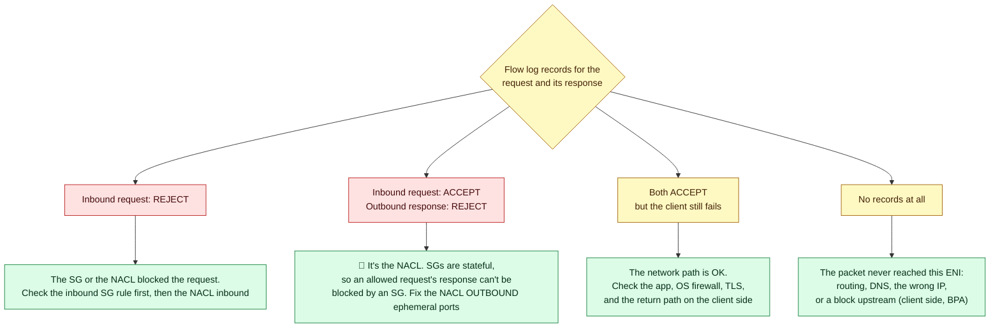
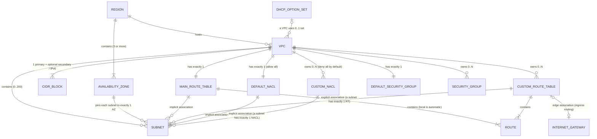
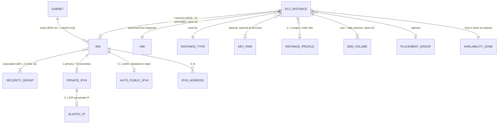

# Module 08 — Operate & Review: Troubleshooting, Costs, Big Picture

> Debug connectivity systematically, avoid the cost traps, see everything in one picture, and answer the five course questions in seconds.

---

## 1. Troubleshooting in 8 checks

1. **DNS:** does the name resolve to the IP you expect? (`dig`)
2. **Listener:** is the service listening on that port, bound to `0.0.0.0`? (`ss -lntp`)
3. **Route out:** does the **source subnet's** route table have an active route to the destination?
4. **Route back:** does the return path exist (destination subnet's table, TGW tables, peer VPC, on-prem)?
5. **Security groups:** is the source SG's outbound rule *and* the destination SG's inbound rule in place?
6. **NACLs:** are both directions allowed, **including ephemeral ports 1024–65535**?
7. **Internet path:** public IP/EIP, IGW attached, NAT available and in a public subnet, Block Public Access off?
8. **MTU:** small requests work but large transfers hang over VPN/TGW? Allow ICMP type 3 code 4 or clamp the MSS.

| Tool | Answers |
|---|---|
| **Reachability Analyzer** | "Is there a path A → B, and which component blocks it?" (configuration analysis, no packets sent) |
| **VPC Flow Logs** | Who talked to whom, `ACCEPT`/`REJECT` (per ENI, 1–10 minute aggregation) |
| **Network Access Analyzer** | "Which paths *shouldn't* exist?" (e.g. internet → DB subnet) |
| **Traffic Mirroring** | Full packet copies (VXLAN) to an IDS or Wireshark |
| **Resolver query logs** | DNS queries (not visible in Flow Logs) |

### Reading Flow Logs: SG or NACL?



### Inspect any instance's network path

```bash
I=i-0123456789abcdef0
aws ec2 describe-instances --instance-ids $I --query 'Reservations[0].Instances[0].{AZ:Placement.AvailabilityZone,VPC:VpcId,Subnet:SubnetId,PrivateIP:PrivateIpAddress,PublicIP:PublicIpAddress,SGs:SecurityGroups[].GroupId}'
SUBNET=$(aws ec2 describe-instances --instance-ids $I --query 'Reservations[0].Instances[0].SubnetId' --output text)
VPC=$(aws ec2 describe-subnets --subnet-ids $SUBNET --query 'Subnets[0].VpcId' --output text)
RT=$(aws ec2 describe-route-tables --filters Name=association.subnet-id,Values=$SUBNET --query 'RouteTables[0].RouteTableId' --output text)
[ "$RT" = "None" ] && RT=$(aws ec2 describe-route-tables --filters Name=vpc-id,Values=$VPC Name=association.main,Values=true --query 'RouteTables[0].RouteTableId' --output text)
aws ec2 describe-route-tables --route-table-ids $RT --output table --query \
  'RouteTables[0].Routes[].[DestinationCidrBlock||DestinationPrefixListId, GatewayId||NatGatewayId||TransitGatewayId||VpcPeeringConnectionId||NetworkInterfaceId, State]'
aws ec2 describe-network-acls --filters Name=association.subnet-id,Values=$SUBNET --query 'NetworkAcls[0].Entries' --output table
```

---

## 2. Hands-on: break it, diagnose it, then clean up

**Turn on Flow Logs:**

```bash
cat > /tmp/fl-trust.json <<'EOF'
{"Version":"2012-10-17","Statement":[{"Effect":"Allow","Principal":{"Service":"vpc-flow-logs.amazonaws.com"},"Action":"sts:AssumeRole"}]}
EOF
cat > /tmp/fl-policy.json <<'EOF'
{"Version":"2012-10-17","Statement":[{"Effect":"Allow","Action":["logs:CreateLogGroup","logs:CreateLogStream","logs:PutLogEvents","logs:DescribeLogGroups","logs:DescribeLogStreams"],"Resource":"*"}]}
EOF
aws iam create-role --role-name lab-flowlogs-role --assume-role-policy-document file:///tmp/fl-trust.json >/dev/null
aws iam put-role-policy --role-name lab-flowlogs-role --policy-name flowlogs --policy-document file:///tmp/fl-policy.json
FL_ROLE=$(aws iam get-role --role-name lab-flowlogs-role --query Role.Arn --output text); save FL_ROLE
aws logs create-log-group --log-group-name /lab/vpc-flow-logs
sleep 10
FL_ID=$(aws ec2 create-flow-logs --resource-type VPC --resource-ids $VPC_ID --traffic-type ALL \
  --log-destination-type cloud-watch-logs --log-group-name /lab/vpc-flow-logs \
  --deliver-logs-permission-arn $FL_ROLE --max-aggregation-interval 60 --query 'FlowLogIds[0]' --output text); save FL_ID
```

**Break it with a NACL that has no outbound rules, diagnose it, then fix it:**

```bash
ACL_ID=$(aws ec2 create-network-acl --vpc-id $VPC_ID --query NetworkAcl.NetworkAclId --output text); save ACL_ID
aws ec2 create-network-acl-entry --network-acl-id $ACL_ID --ingress --rule-number 100 --protocol tcp --port-range From=80,To=80 --cidr-block 0.0.0.0/0 --rule-action allow
DEFAULT_ACL=$(aws ec2 describe-network-acls --filters Name=vpc-id,Values=$VPC_ID Name=default,Values=true --query 'NetworkAcls[0].NetworkAclId' --output text); save DEFAULT_ACL
swap_acl() { local a=$(aws ec2 describe-network-acls --filters Name=association.subnet-id,Values=$PUB_A \
  --query "NetworkAcls[0].Associations[?SubnetId=='$PUB_A'].NetworkAclAssociationId" --output text)
  aws ec2 replace-network-acl-association --association-id $a --network-acl-id $1 >/dev/null; }
swap_acl $ACL_ID
curl -m 5 http://$WEB_IP || echo "FAILS: the request gets in, the reply can't get out"
sleep 120; aws logs tail /lab/vpc-flow-logs --since 10m --format short | grep "$MY_IP" | grep " 80 " | head
#   -> inbound to :80 ACCEPT, outbound reply REJECT = the NACL fingerprint
aws ec2 create-network-acl-entry --network-acl-id $ACL_ID --egress --rule-number 100 --protocol tcp --port-range From=1024,To=65535 --cidr-block 0.0.0.0/0 --rule-action allow
curl -m 5 http://$WEB_IP && swap_acl $DEFAULT_ACL
```

**Reachability Analyzer: find a missing SG rule without sending traffic:**

```bash
aws ec2 revoke-security-group-ingress --group-id $SG_APP --protocol tcp --port 8080 --source-group $SG_WEB
NIP=$(aws ec2 create-network-insights-path --source $WEB_ID --destination $APP_ID --protocol tcp --destination-port 8080 \
  --query NetworkInsightsPath.NetworkInsightsPathId --output text); save NIP
NIA=$(aws ec2 start-network-insights-analysis --network-insights-path-id $NIP --query NetworkInsightsAnalysis.NetworkInsightsAnalysisId --output text)
sleep 30; aws ec2 describe-network-insights-analyses --network-insights-analysis-ids $NIA \
  --query 'NetworkInsightsAnalyses[0].{Found:NetworkPathFound,Why:Explanations[].ExplanationCode}'
aws ec2 authorize-security-group-ingress --group-id $SG_APP --protocol tcp --port 8080 --source-group $SG_WEB
```

**Cleanup: run all of it.** The order follows the dependencies.

```bash
source ~/aws-lab.env 2>/dev/null
aws ec2 terminate-instances --instance-ids $WEB_ID $APP_ID $PEER_ID >/dev/null
aws ec2 wait instance-terminated --instance-ids $WEB_ID $APP_ID $PEER_ID
aws ec2 delete-instance-connect-endpoint --instance-connect-endpoint-id $EICE_ID >/dev/null
while aws ec2 describe-instance-connect-endpoints --instance-connect-endpoint-ids $EICE_ID \
      --query 'InstanceConnectEndpoints[?State!=`delete-complete`]' --output text 2>/dev/null | grep -q .; do sleep 10; done
aws ec2 delete-flow-logs --flow-log-ids $FL_ID >/dev/null
aws logs delete-log-group --log-group-name /lab/vpc-flow-logs
aws iam delete-role-policy --role-name lab-flowlogs-role --policy-name flowlogs
aws iam delete-role --role-name lab-flowlogs-role
for a in $(aws ec2 describe-network-insights-analyses --network-insights-path-id $NIP --query 'NetworkInsightsAnalyses[].NetworkInsightsAnalysisId' --output text); do
  aws ec2 delete-network-insights-analysis --network-insights-analysis-id $a >/dev/null; done
aws ec2 delete-network-insights-path --network-insights-path-id $NIP >/dev/null
aws ec2 delete-vpc-endpoints --vpc-endpoint-ids $S3_EP >/dev/null
aws ec2 delete-nat-gateway --nat-gateway-id $NAT_ID >/dev/null 2>&1          # in case Module 06 was skipped
until [ "$(aws ec2 describe-nat-gateways --nat-gateway-ids $NAT_ID --query 'NatGateways[0].State' --output text 2>/dev/null)" != "deleting" ]; do sleep 15; done
aws ec2 release-address --allocation-id $NAT_EIP 2>/dev/null
aws ec2 delete-vpc-peering-connection --vpc-peering-connection-id $PCX >/dev/null
aws ec2 detach-internet-gateway --internet-gateway-id $IGW_ID --vpc-id $VPC_ID
aws ec2 delete-internet-gateway --internet-gateway-id $IGW_ID
for s in $PUB_A $PUB_B $APP_A $APP_B $DATA_A $DATA_B $SUB2; do aws ec2 delete-subnet --subnet-id $s; done
aws ec2 delete-route-table --route-table-id $RT_PUB
aws ec2 delete-route-table --route-table-id $RT_PRIV
aws ec2 delete-network-acl --network-acl-id $ACL_ID
for g in $SG_APP $SG_WEB $SG_EICE $SG_PEER; do aws ec2 delete-security-group --group-id $g; done   # referencing SG (app) first
aws ec2 delete-vpc --vpc-id $VPC_ID
aws ec2 delete-vpc --vpc-id $VPC2
aws ec2 delete-key-pair --key-name lab-key
rm -f ~/lab-key.pem ~/aws-lab.env /tmp/web.sh /tmp/app.sh /tmp/fl-*.json
aws ec2 describe-addresses --query 'Addresses[].PublicIp'                                  # should be empty
aws ec2 describe-nat-gateways --filter Name=state,Values=available,pending --query 'NatGateways[].NatGatewayId'   # should be empty
```

---

## 3. Cost traps

| Trap | Fix |
|---|---|
| NAT per-GB charges, especially for S3/ECR traffic | S3 gateway endpoint (free) + interface endpoints for heavy services |
| AZ-b instances using AZ-a's NAT | NAT per AZ, or a Regional NAT gateway |
| Every public IPv4, including **idle EIPs** | Private subnets + load balancers. Release unused EIPs. Consider IPv6 |
| Chatty services across AZs (~$0.01/GB each way) | Keep hot paths AZ-local where it's safe |
| Instances talking to each other via public IPs | Always use private IPs inside AWS |
| Interface endpoints in every VPC × AZ | Centralize them in a shared-services VPC |
| High-volume VPC pairs through TGW | Add direct peering for those pairs |

---

## 4. The big picture

```mermaid
%%{init: {"flowchart": {"wrappingWidth": 400}}}%%
flowchart TB
    classDef pub fill:#dcfce7,stroke:#15803d,color:#052e16
    classDef priv fill:#dbeafe,stroke:#1d4ed8,color:#0b1b3a
    classDef gw fill:#ffedd5,stroke:#c2410c,color:#431407
    classDef ext fill:#f1f5f9,stroke:#475569,color:#0f172a
    classDef compute fill:#ccfbf1,stroke:#0f766e,color:#042f2e
    classDef db fill:#e0e7ff,stroke:#4338ca,color:#1e1b4b
    classDef global fill:#f3e8ff,stroke:#7e22ce,color:#1f1147
    classDef svc fill:#fef3c7,stroke:#b45309,color:#451a03

    USERS["👥 Users"]:::ext
    R53["🧭 Route 53 (global DNS)<br/>example.com → CloudFront edge IP"]:::global
    CF["🌍 CloudFront edge locations (global)"]:::global
    REMOTE["💻 Remote workers"]:::ext

    subgraph SAAS["🏬 SaaS provider VPC (another account)"]
        SNLB["⚖️ Network Load Balancer<br/>= VPC endpoint service"]:::gw
        SAPP["🖥️ Application services"]:::compute
        SNLB --> SAPP
    end

    subgraph REGION["🗺️ Region"]
        subgraph SVCS["AWS regional services (public endpoints)"]
            SNS["📣 SNS"]:::svc
            SES["✉️ SES"]:::svc
            SQS["📨 SQS"]:::svc
            CW["📈 CloudWatch"]:::svc
            S3["🪣 S3"]:::svc
            DDB["🗃️ DynamoDB"]:::svc
        end

        subgraph VPC["☁️ VPC 10.10.0.0/16"]
            IGW["🚪 Internet gateway"]:::gw
            IEP["🔌 Interface endpoints (PrivateLink ENIs + SG)<br/>sns, email-smtp, sqs, monitoring"]:::gw
            GEP["🛣️ Gateway endpoints (route table entries)<br/>s3, dynamodb"]:::gw
            PLE["🔗 Interface endpoint to the SaaS service"]:::gw
            CVPN["💻 Client VPN endpoint"]:::gw
            VGW["🔒 Virtual private gateway"]:::gw
            subgraph AZA["🅰️ Availability Zone A"]
                subgraph PUBA["🟩 public 10.10.0.0/24"]
                    ELBA["⚖️ ALB node"]:::gw
                end
                subgraph APPA["🟦 private 10.10.2.0/24"]
                    EC2A["🖥️ EC2 web/app<br/>🔌 ENI, private IP"]:::compute
                end
                subgraph DBA["🟦 private 10.10.11.0/24"]
                    RDSA["🗄️ DB primary (M)"]:::db
                end
            end
            subgraph AZB["🅱️ Availability Zone B"]
                subgraph PUBB["🟩 public 10.10.1.0/24"]
                    NATB["🔁 NAT GW + Elastic IP"]:::gw
                end
                subgraph APPB["🟦 private 10.10.3.0/24"]
                    EC2B["🖥️ EC2 web/app<br/>🔌 ENI, private IP"]:::compute
                end
                subgraph DBB["🟦 private 10.10.12.0/24"]
                    RDSB["🗄️ DB standby (S)<br/>⇠ replication from M"]:::db
                end
            end
        end

        PCX["🔀 VPC peering"]:::gw
        subgraph PEER["☁️ Peer VPC"]
            PEC2["🖥️ EC2"]:::compute
        end
        TGW["🛰️ Transit Gateway (regional hub)"]:::gw
        subgraph SPOKES["☁️ Other VPCs"]
            SP1["☁️ VPC x"]:::priv
            SP2["☁️ VPC y"]:::priv
        end
    end

    DX["🔌 Direct Connect location<br/>(private fiber, BGP)"]:::gw
    VPN["🔐 IPsec Site-to-Site VPN<br/>2 tunnels over the internet"]:::gw
    subgraph CORP["🏢 Corporate data center"]
        DXR["🧭 Router (DX)"]:::ext
        CGW["🧭 Router = customer gateway"]:::ext
        SRV["🗄️ Servers / DBs"]:::ext
    end

    USERS -.->|"① DNS: example.com?"| R53
    USERS -->|"② HTTPS"| CF
    CF --> IGW
    IGW --> ELBA
    ELBA --> EC2A
    EC2A -->|"SQL"| RDSA
    IGW <--> NATB
    NATB <-->|"egress"| EC2B
    EC2B -->|"SQL"| RDSB
    EC2A --> IEP
    IEP --> SNS
    IEP --> SES
    IEP --> SQS
    IEP --> CW
    EC2A --> GEP
    GEP --> S3
    GEP --> DDB
    EC2A --> PLE
    PLE -->|"PrivateLink"| SNLB
    VPC <--> PCX
    PCX <--> PEER
    VPC <--> TGW
    TGW <--> SPOKES
    TGW <--> CORP
    VGW <==> DX
    DX <==> DXR
    VGW <--> VPN
    VPN <--> CGW
    REMOTE -->|"TLS"| CVPN

    linkStyle 2,3,4,5 stroke:#dc2626,stroke-width:2px
    linkStyle 7,8 stroke:#16a34a,stroke-width:2px
    linkStyle 10,11,12,13,14,15,16,17,18,19 stroke:#7c3aed,stroke-width:2px
    linkStyle 20,21,22,23,24 stroke:#2563eb,stroke-width:2px
    linkStyle 25,26,27,28,29 stroke:#ea580c,stroke-width:2px
```



🔴 inbound web traffic · 🟢 egress via NAT · 🟣 private access to AWS services · 🔵 VPC-to-VPC · 🟠 hybrid / on-prem

### What attaches to what





---

## 5. Decision cheat sheet

| I need… | Use |
|---|---|
| A public web app with private servers | Internet-facing **ALB** in public subnets, targets in private subnets |
| Fixed **inbound** IPs for partners | **NLB** with Elastic IPs |
| Fixed **outbound** IPs | **NAT gateway** Elastic IPs |
| Private servers that can reach the internet | **NAT gateway per AZ** / Regional NAT gateway |
| IPv6 outbound only | **Egress-only IGW** |
| S3 / DynamoDB without NAT | **Gateway endpoint** (free) |
| Other AWS APIs without NAT | **Interface endpoints** |
| Shell access to private instances | **SSM Session Manager** / **EC2 Instance Connect Endpoint** |
| AWS credentials on EC2 | **IAM role** + IMDSv2 |
| Connect 2–3 VPCs | **VPC peering** |
| Many VPCs + on-prem, segmented | **Transit Gateway** |
| One service to another account (overlap OK) | **PrivateLink** |
| An office/DC link now / at high, steady volume | **Site-to-Site VPN** / **Direct Connect** + VPN backup |
| Remote developers into the VPC | **Client VPN** |
| Internal DNS / hybrid DNS | **Private hosted zone** / **Resolver endpoints** |
| Block one IP | **NACL deny** or **WAF** (SGs can't deny) |
| Central firewalling | **AWS Network Firewall** / **GWLB** |
| No internet exposure, account-wide | **VPC Block Public Access** |

---

## 6. The five questions: quick answers

**1. Is the route table assigned to EC2, the subnet, or the VPC? What's its role, and how is it populated?**
It's **owned by the VPC** and **associated with subnets**: exactly one per subnet, and the main table if you don't choose. It can optionally be edge-associated with an IGW/VGW, and is **never associated with EC2**. It's the VPC router's forwarding table for traffic leaving that subnet. It's populated by the automatic **local** route, your **static** routes, **VGW propagation** (VPN/DX BGP), **gateway endpoints**, and **VPC Route Server**. → [Module 02](02-vpc-subnets-and-route-tables.md#3-route-tables)

**2. What does a VPC contain, and what can you attach to it?**
Built in: the router, main route table, default NACL, default SG, DHCP options, and DNS resolver. You create subnets, route tables, NACLs, SGs, and flow logs. You attach an IGW, egress-only IGW, VGW, TGW, peering connections, and endpoints. Instances, NAT gateways, load balancers, endpoint ENIs, and RDS go **in subnets**. → [Module 02](02-vpc-subnets-and-route-tables.md#1-the-vpc)

**3. What does a subnet do, and is it required?**
It's an AZ-pinned IP range that holds ENIs, with **one route table** (deciding public/private) and **one NACL**. A VPC can exist without subnets, but **every EC2 instance requires one**. → [Module 02](02-vpc-subnets-and-route-tables.md#2-subnets)

**4. What must you assign when launching EC2?**
**AMI, instance type, subnet** (which fixes the VPC and AZ), and **security group(s)**, plus an auto-assigned private IP and a root volume. Optional: public IP, key pair, IAM role, user data, IMDS settings, extra ENIs. → [Module 05](05-ec2-networking-and-load-balancers.md#1-what-you-assign-at-launch-course-question-4)

**5. What's a security group? Can you skip it? Where does it attach?**
It's a stateful, allow-only firewall, **owned by the VPC** and **attached to ENIs** (so to instances, **not subnets**). You **can't** skip it: the default SG is applied if you don't choose one. → [Module 04](04-security-groups-and-nacls.md#3-security-groups-what-you-must-know)

---
**Previous:** [Module 07](07-connecting-networks.md) · **Back to:** [All tutorials](../README.md) · **Next tutorial:** [Amazon ECS](../ecs/01-ecs-fundamentals.md)
