# Module 08 — Troubleshooting, Costs, the Full Picture & Cleanup

← [All tutorials](../README.md) · **Networking tutorial**, module 8 of 8

You've built a complete network. This last module gives you a routine for debugging "it can't connect", shows the tools AWS provides, lists the network costs that surprise people, puts everything into one reference picture, and cleans up the lab.

---

## 1. A routine for "A can't connect to B"

Work through these in order. Most problems are found by step 5.

| # | Check | How |
|---|---|---|
| 1 | **Does the name resolve to the right IP?** | `dig name` or `getent hosts name` on A |
| 2 | **Is B listening on that port, on all interfaces?** | `ss -lntp` on B. A service bound to `127.0.0.1` is unreachable from outside |
| 3 | **Does A's subnet route table have a route to B?** And is it `active`, not `blackhole`? | Module 02 |
| 4 | **Does the way back exist?** B's subnet route table (plus, if used, the peer VPC's tables, TGW tables, office routes) must route to A | Modules 02 and 07 |
| 5 | **Security groups:** does A's allow the traffic **out**, and B's allow it **in** (by IP range or SG reference)? | Module 03 |
| 6 | **Network ACLs:** both subnets, both directions, **including return ports 1024–65535** | Module 03 |
| 7 | **Internet path:** public IP present? Internet gateway attached? NAT gateway available and in a public subnet? | Module 02 |
| 8 | **Small requests work, big transfers hang** (over VPN or Transit Gateway)? | Packet-size (MTU) problem: allow ICMP "fragmentation needed", or lower the MTU |

### The tools

| Tool | What it answers | Notes |
|---|---|---|
| **Reachability Analyzer** | "Is there a path from A to B on this port? If not, **which component blocks it**?" | Analyzes the configuration (routes, SGs, NACLs, gateways) without sending traffic. Small charge per analysis |
| **VPC Flow Logs** | "What traffic actually happened, and was it accepted or rejected?" | Logs per network interface, to CloudWatch Logs or S3, aggregated per 1–10 minutes |
| **Network Access Analyzer** | "Which paths exist that **shouldn't**?" (for example, internet → database subnets) | Good for security reviews |
| **Traffic Mirroring** | Full packet copies for deep inspection | The AWS equivalent of a SPAN port |

### Reading a flow log record

```text
version account      interface-id          srcaddr       dstaddr     srcport dstport proto packets bytes start      end        action
2       111122223333 eni-0a1b2c3d4e5f60718 198.51.100.7  10.0.0.25   51515   80      6     5       320   1759480000 1759480060 ACCEPT
2       111122223333 eni-0a1b2c3d4e5f60718 10.0.0.25     198.51.100.7 80     51515   6     4       880   1759480000 1759480060 REJECT
```

The request came **in** to port 80 and was **accepted**. The reply going **out** to port 51515 was **rejected**. A security group can't do that: it would have allowed the reply automatically. So **this pattern always means a network ACL is missing its return-port rule.** If you see no records at all for a connection, the packets never reached that interface. That points to routing, DNS, or a block on the sender's side.

---

## 2. Try it: break the network, diagnose it, fix it

**2.1 Turn on Flow Logs** for the VPC (they need an IAM role to write to CloudWatch Logs):

```bash
cat > /tmp/fl-trust.json <<'EOF'
{"Version":"2012-10-17","Statement":[{"Effect":"Allow","Principal":{"Service":"vpc-flow-logs.amazonaws.com"},"Action":"sts:AssumeRole"}]}
EOF
cat > /tmp/fl-policy.json <<'EOF'
{"Version":"2012-10-17","Statement":[{"Effect":"Allow","Action":["logs:CreateLogGroup","logs:CreateLogStream","logs:PutLogEvents","logs:DescribeLogGroups","logs:DescribeLogStreams"],"Resource":"*"}]}
EOF
aws iam create-role --role-name lab-flowlogs-role --assume-role-policy-document file:///tmp/fl-trust.json >/dev/null
aws iam put-role-policy --role-name lab-flowlogs-role --policy-name flowlogs --policy-document file:///tmp/fl-policy.json
FL_ROLE=$(aws iam get-role --role-name lab-flowlogs-role --query Role.Arn --output text); save FL_ROLE
aws logs create-log-group --log-group-name /lab/vpc-flow-logs
sleep 10
FL_ID=$(aws ec2 create-flow-logs --resource-type VPC --resource-ids $VPC_ID --traffic-type ALL \
  --log-destination-type cloud-watch-logs --log-group-name /lab/vpc-flow-logs \
  --deliver-logs-permission-arn $FL_ROLE --max-aggregation-interval 60 --query 'FlowLogIds[0]' --output text); save FL_ID
```

**2.2 Break it.** Give `public-a` a network ACL that allows HTTP in but forgets the return ports:

```bash
ACL_ID=$(aws ec2 create-network-acl --vpc-id $VPC_ID --query NetworkAcl.NetworkAclId --output text); save ACL_ID
aws ec2 create-network-acl-entry --network-acl-id $ACL_ID --ingress --rule-number 100 --protocol tcp \
  --port-range From=80,To=80 --cidr-block 0.0.0.0/0 --rule-action allow
DEFAULT_ACL=$(aws ec2 describe-network-acls --filters Name=vpc-id,Values=$VPC_ID Name=default,Values=true --query 'NetworkAcls[0].NetworkAclId' --output text); save DEFAULT_ACL
swap_acl() { local a=$(aws ec2 describe-network-acls --filters Name=association.subnet-id,Values=$PUB_A \
  --query "NetworkAcls[0].Associations[?SubnetId=='$PUB_A'].NetworkAclAssociationId" --output text)
  aws ec2 replace-network-acl-association --association-id $a --network-acl-id $1 >/dev/null; }
swap_acl $ACL_ID
curl -m 5 http://$WEB_IP || echo "FAILED: the request gets in, the reply can't get out"
```

**2.3 Diagnose it** with Flow Logs (give them about two minutes to arrive):

```bash
sleep 120
aws logs tail /lab/vpc-flow-logs --since 10m --format short | grep "$MY_IP" | grep " 80 " | head
#   inbound to port 80: ACCEPT    reply from port 80: REJECT    -> the network ACL fingerprint
```

**2.4 Fix it,** then put the default network ACL back:

```bash
aws ec2 create-network-acl-entry --network-acl-id $ACL_ID --egress --rule-number 100 --protocol tcp \
  --port-range From=1024,To=65535 --cidr-block 0.0.0.0/0 --rule-action allow
curl -m 5 http://$WEB_IP && swap_acl $DEFAULT_ACL
```

**2.5 Let Reachability Analyzer find a missing security group rule:**

```bash
aws ec2 revoke-security-group-ingress --group-id $SG_APP --protocol tcp --port 8080 --source-group $SG_WEB
NIP=$(aws ec2 create-network-insights-path --source $WEB_ID --destination $APP_ID --protocol tcp --destination-port 8080 \
  --query NetworkInsightsPath.NetworkInsightsPathId --output text); save NIP
NIA=$(aws ec2 start-network-insights-analysis --network-insights-path-id $NIP --query NetworkInsightsAnalysis.NetworkInsightsAnalysisId --output text)
sleep 30
aws ec2 describe-network-insights-analyses --network-insights-analysis-ids $NIA \
  --query 'NetworkInsightsAnalyses[0].{PathFound:NetworkPathFound,Why:Explanations[].ExplanationCode}'
#   PathFound: false, and an explanation naming the security group on app-1
aws ec2 authorize-security-group-ingress --group-id $SG_APP --protocol tcp --port 8080 --source-group $SG_WEB
```

---

## 3. Network costs that surprise people

| Trap | Why it costs | Fix |
|---|---|---|
| **NAT gateway data** | Hourly fee **plus** a per-GB processing fee on everything through it | S3/DynamoDB via the free **gateway endpoint**. Interface endpoints for heavy AWS API traffic |
| **Traffic between AZs** | About $0.01/GB **in each direction** | Use a NAT gateway per AZ. Keep chatty services in the same AZ where safe |
| **Public IPv4 addresses** | About $0.005/hour each, **including idle Elastic IPs** | Private subnets behind load balancers. Release unused Elastic IPs |
| **Servers talking via public IPs** | Charged as if it crossed AZs, even inside the same AZ | Always use private IPs or private DNS names inside AWS |
| **Interface endpoints everywhere** | Hourly per endpoint per AZ, multiplied across many VPCs | Share them from a central VPC |
| **Forgotten lab resources** | NAT gateways and load balancers bill hourly | Budgets with alerts, and cleanup scripts like the one below |

---

## 4. The full picture

Everything from this tutorial, and the topics it introduced, in one reference diagram:

```mermaid
%%{init: {"flowchart": {"wrappingWidth": 400}}}%%
flowchart TB
    classDef pub fill:#dcfce7,stroke:#15803d,color:#052e16
    classDef priv fill:#dbeafe,stroke:#1d4ed8,color:#0b1b3a
    classDef gw fill:#ffedd5,stroke:#c2410c,color:#431407
    classDef ext fill:#f1f5f9,stroke:#475569,color:#0f172a
    classDef compute fill:#ccfbf1,stroke:#0f766e,color:#042f2e
    classDef db fill:#e0e7ff,stroke:#4338ca,color:#1e1b4b
    classDef global fill:#f3e8ff,stroke:#7e22ce,color:#1f1147
    classDef svc fill:#fef3c7,stroke:#b45309,color:#451a03

    USERS["👥 Users"]:::ext
    R53["🧭 Route 53 (global DNS)<br/>example.com → CloudFront edge IP"]:::global
    CF["🌍 CloudFront edge locations (global)"]:::global
    REMOTE["💻 Remote workers"]:::ext

    subgraph SAAS["🏬 SaaS provider VPC (another account)"]
        SNLB["⚖️ Network Load Balancer<br/>= VPC endpoint service"]:::gw
        SAPP["🖥️ Application services"]:::compute
        SNLB --> SAPP
    end

    subgraph REGION["🗺️ Region"]
        subgraph SVCS["AWS regional services (public endpoints)"]
            SNS["📣 SNS"]:::svc
            SES["✉️ SES"]:::svc
            SQS["📨 SQS"]:::svc
            CW["📈 CloudWatch"]:::svc
            S3["🪣 S3"]:::svc
            DDB["🗃️ DynamoDB"]:::svc
        end

        subgraph VPC["☁️ VPC 10.10.0.0/16"]
            IGW["🚪 Internet gateway"]:::gw
            IEP["🔌 Interface endpoints (PrivateLink ENIs + SG)<br/>sns, email-smtp, sqs, monitoring"]:::gw
            GEP["🛣️ Gateway endpoints (route table entries)<br/>s3, dynamodb"]:::gw
            PLE["🔗 Interface endpoint to the SaaS service"]:::gw
            CVPN["💻 Client VPN endpoint"]:::gw
            VGW["🔒 Virtual private gateway"]:::gw
            subgraph AZA["🅰️ Availability Zone A"]
                subgraph PUBA["🟩 public 10.10.0.0/24"]
                    ELBA["⚖️ ALB node"]:::gw
                end
                subgraph APPA["🟦 private 10.10.2.0/24"]
                    EC2A["🖥️ EC2 web/app<br/>🔌 ENI, private IP"]:::compute
                end
                subgraph DBA["🟦 private 10.10.11.0/24"]
                    RDSA["🗄️ DB primary (M)"]:::db
                end
            end
            subgraph AZB["🅱️ Availability Zone B"]
                subgraph PUBB["🟩 public 10.10.1.0/24"]
                    NATB["🔁 NAT GW + Elastic IP"]:::gw
                end
                subgraph APPB["🟦 private 10.10.3.0/24"]
                    EC2B["🖥️ EC2 web/app<br/>🔌 ENI, private IP"]:::compute
                end
                subgraph DBB["🟦 private 10.10.12.0/24"]
                    RDSB["🗄️ DB standby (S)<br/>⇠ replication from M"]:::db
                end
            end
        end

        PCX["🔀 VPC peering"]:::gw
        subgraph PEER["☁️ Peer VPC"]
            PEC2["🖥️ EC2"]:::compute
        end
        TGW["🛰️ Transit Gateway (regional hub)"]:::gw
        subgraph SPOKES["☁️ Other VPCs"]
            SP1["☁️ VPC x"]:::priv
            SP2["☁️ VPC y"]:::priv
        end
    end

    DX["🔌 Direct Connect location<br/>(private fiber, BGP)"]:::gw
    VPN["🔐 IPsec Site-to-Site VPN<br/>2 tunnels over the internet"]:::gw
    subgraph CORP["🏢 Corporate data center"]
        DXR["🧭 Router (DX)"]:::ext
        CGW["🧭 Router = customer gateway"]:::ext
        SRV["🗄️ Servers / DBs"]:::ext
    end

    USERS -.->|"① DNS: example.com?"| R53
    USERS -->|"② HTTPS"| CF
    CF --> IGW
    IGW --> ELBA
    ELBA --> EC2A
    EC2A -->|"SQL"| RDSA
    IGW <--> NATB
    NATB <-->|"egress"| EC2B
    EC2B -->|"SQL"| RDSB
    EC2A --> IEP
    IEP --> SNS
    IEP --> SES
    IEP --> SQS
    IEP --> CW
    EC2A --> GEP
    GEP --> S3
    GEP --> DDB
    EC2A --> PLE
    PLE -->|"PrivateLink"| SNLB
    VPC <--> PCX
    PCX <--> PEER
    VPC <--> TGW
    TGW <--> SPOKES
    TGW <--> CORP
    VGW <==> DX
    DX <==> DXR
    VGW <--> VPN
    VPN <--> CGW
    REMOTE -->|"TLS"| CVPN

    linkStyle 2,3,4,5 stroke:#dc2626,stroke-width:2px
    linkStyle 7,8 stroke:#16a34a,stroke-width:2px
    linkStyle 10,11,12,13,14,15,16,17,18,19 stroke:#7c3aed,stroke-width:2px
    linkStyle 20,21,22,23,24 stroke:#2563eb,stroke-width:2px
    linkStyle 25,26,27,28,29 stroke:#ea580c,stroke-width:2px
```



**How to read it**, by arrow color:
- **🔴 Customers:** DNS (Route 53) → CloudFront edge → internet gateway → load balancer nodes in public subnets → app servers in private subnets → database (Modules 02, 05).
- **🟢 Outbound:** an app server in AZ B reaches the internet through the NAT gateway in its own AZ (Module 02).
- **🟣 AWS services privately:** interface endpoints (SNS, SES, SQS, CloudWatch), gateway endpoints (S3, DynamoDB), and PrivateLink to a partner's service (Modules 06, 07).
- **🔵 Other VPCs:** a direct peering, and a Transit Gateway hub for many VPCs and the data center (Module 07).
- **🟠 Hybrid:** Direct Connect plus an IPsec VPN backup to the corporate data center, and Client VPN for remote workers (Module 07).

---

## 5. Cleanup: run all of it

The order follows the dependencies. You can't delete a subnet while something still has a network interface in it, or a VPC while anything remains inside.

```bash
source ~/aws-lab.env 2>/dev/null

# Servers and the Instance Connect Endpoint
aws ec2 terminate-instances --instance-ids $WEB_ID $APP_ID $APP2_ID $PEER_ID >/dev/null
aws ec2 wait instance-terminated --instance-ids $WEB_ID $APP_ID $APP2_ID $PEER_ID
aws ec2 delete-instance-connect-endpoint --instance-connect-endpoint-id $EICE_ID >/dev/null
while aws ec2 describe-instance-connect-endpoints --instance-connect-endpoint-ids $EICE_ID \
      --query 'InstanceConnectEndpoints[?State!=`delete-complete`]' --output text 2>/dev/null | grep -q .; do sleep 10; done

# Load balancer
aws elbv2 delete-listener --listener-arn $LISTENER_ARN
aws elbv2 delete-load-balancer --load-balancer-arn $ALB_ARN
aws elbv2 wait load-balancers-deleted --load-balancer-arns $ALB_ARN
aws elbv2 delete-target-group --target-group-arn $TG_ARN

# Flow logs, Reachability Analyzer, private DNS zone
aws ec2 delete-flow-logs --flow-log-ids $FL_ID >/dev/null
aws logs delete-log-group --log-group-name /lab/vpc-flow-logs
aws iam delete-role-policy --role-name lab-flowlogs-role --policy-name flowlogs
aws iam delete-role --role-name lab-flowlogs-role
for a in $(aws ec2 describe-network-insights-analyses --network-insights-path-id $NIP --query 'NetworkInsightsAnalyses[].NetworkInsightsAnalysisId' --output text); do
  aws ec2 delete-network-insights-analysis --network-insights-analysis-id $a >/dev/null; done
aws ec2 delete-network-insights-path --network-insights-path-id $NIP >/dev/null
aws route53 change-resource-record-sets --hosted-zone-id $ZONE_ID --change-batch "{\"Changes\":[{\"Action\":\"DELETE\",
  \"ResourceRecordSet\":{\"Name\":\"app.lab.internal\",\"Type\":\"A\",\"TTL\":60,\"ResourceRecords\":[{\"Value\":\"$APP_PRIV\"}]}}]}" >/dev/null
aws route53 delete-hosted-zone --id $ZONE_ID >/dev/null

# Endpoint, NAT (in case Module 06 was skipped), peering, internet gateway
aws ec2 delete-vpc-endpoints --vpc-endpoint-ids $S3_EP >/dev/null
aws ec2 delete-nat-gateway --nat-gateway-id $NAT_ID >/dev/null 2>&1
until [ "$(aws ec2 describe-nat-gateways --nat-gateway-ids $NAT_ID --query 'NatGateways[0].State' --output text 2>/dev/null)" != "deleting" ]; do sleep 15; done
aws ec2 release-address --allocation-id $NAT_EIP 2>/dev/null
aws ec2 delete-vpc-peering-connection --vpc-peering-connection-id $PCX >/dev/null
aws ec2 detach-internet-gateway --internet-gateway-id $IGW_ID --vpc-id $VPC_ID
aws ec2 delete-internet-gateway --internet-gateway-id $IGW_ID

# Subnets (load balancer network interfaces can take a minute to disappear), route tables, ACL, security groups, VPCs
sleep 60
for s in $PUB_A $PUB_B $APP_A $APP_B $DATA_A $DATA_B $SUB2; do aws ec2 delete-subnet --subnet-id $s; done
aws ec2 delete-route-table --route-table-id $RT_PUB
aws ec2 delete-route-table --route-table-id $RT_PRIV
aws ec2 delete-network-acl --network-acl-id $ACL_ID
for g in $SG_APP $SG_WEB $SG_EICE $SG_ALB $SG_PEER; do aws ec2 delete-security-group --group-id $g; done   # sg-app first: it references the others
aws ec2 delete-vpc --vpc-id $VPC_ID
aws ec2 delete-vpc --vpc-id $VPC2

aws ec2 delete-key-pair --key-name lab-key
rm -f ~/lab-key.pem ~/aws-lab.env /tmp/web.sh /tmp/app.sh /tmp/app2.sh /tmp/fl-*.json

# Verify that nothing billable is left
aws ec2 describe-addresses --query 'Addresses[].PublicIp'
aws ec2 describe-nat-gateways --filter Name=state,Values=available,pending --query 'NatGateways[].NatGatewayId'
aws elbv2 describe-load-balancers --query 'LoadBalancers[].LoadBalancerName'
```

---

## Check yourself

<details><summary>Flow logs show the request ACCEPTed and the reply REJECTed. What's wrong?</summary>A network ACL is missing its return-port rule (1024–65535). Security groups never block replies to traffic they allowed.</details>
<details><summary>Which tool names the exact component blocking a path, without sending traffic?</summary>Reachability Analyzer.</details>
<details><summary>Your NAT gateway bill is huge, and most traffic goes to S3. What's the fix?</summary>Add an S3 gateway endpoint to the private route tables. It's free and takes S3 traffic off the NAT gateway.</details>

---
**Previous:** [Module 07](07-connecting-networks.md) · **Next tutorial:** [Storage & Databases](../storage/01-storage-basics-and-s3.md)
