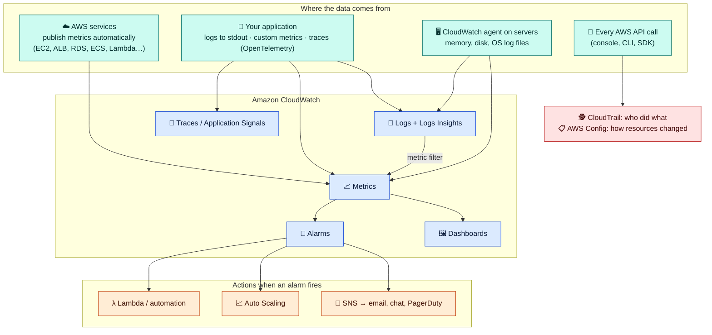

# Module 01 — Observability Basics & CloudWatch Metrics

← [All tutorials](../README.md) · **Observability tutorial**, module 1 of 3

Once an application runs in production, you need answers to four questions quickly:

| Question | Answered by | AWS service | Module |
|---|---|---|---|
| **Is it healthy? How loaded is it?** | **Metrics**: numbers over time (CPU %, requests/s, errors) | CloudWatch Metrics, dashboards | 01 |
| **What exactly happened?** | **Logs**: text records from your app and AWS services | CloudWatch Logs, Logs Insights | 02 |
| **Tell me when something's wrong** | **Alarms** on metrics | CloudWatch Alarms → SNS notifications | 02 |
| **Which part of a request is slow?** | **Traces**: one request followed across services | X-Ray / OpenTelemetry, Application Signals | 03 |
| **Who changed what?** | **Audit logs** of API calls | CloudTrail, AWS Config | 03 |

How the pieces connect:



**How to read it:** AWS services send **metrics** on their own. Your application and the CloudWatch agent add **logs**, **custom metrics**, and **traces**. **Alarms** watch metrics and trigger **actions**. A log pattern can be turned into a metric (a *metric filter*) so you can alarm on it too. Separately, **every API call** to AWS is recorded by **CloudTrail**.

---

## 1. What a metric is

A **metric** is a series of numbers over time. In CloudWatch, a metric is identified by three things:

| Part | Meaning | Example |
|---|---|---|
| **Namespace** | The source: `AWS/<service>` for AWS services, any name for your own | `AWS/ApplicationELB` |
| **Metric name** | What's measured | `TargetResponseTime` |
| **Dimensions** | Name/value pairs saying **which** resource | `LoadBalancer=app/shop-alb/50dc6c495c0c9188` |

When you read a metric, you choose how to summarize the raw data points:
- **Period**: the size of each time bucket, e.g. 60 seconds.
- **Statistic**: how points in a bucket are combined. `Average`, `Sum`, `Minimum`, `Maximum`, `SampleCount`, or a **percentile** such as `p99` ("99% of requests were faster than this").

For latency, look at **p99** or p95, not the average. An average can look fine while 1 request in 100 takes 10 seconds.

Facts that matter in practice:
- Most AWS services publish **1-minute** data. **EC2 publishes 5-minute** data unless you enable *detailed monitoring*.
- **EC2 has no memory or disk-space metrics.** AWS can't see inside your OS, so install the **CloudWatch agent** for those.
- Data is kept **15 months**. Older data is kept at coarser periods.
- Custom metrics can be **high-resolution** (1 second).

## 2. Reading metrics: a query, field by field

`get-metric-data` is the flexible way to read metrics. Here's a query asking for an ALB's p99 latency and its 5xx error rate:

```json
[
  {
    "Id": "latency",
    "MetricStat": {
      "Metric": {
        "Namespace": "AWS/ApplicationELB",
        "MetricName": "TargetResponseTime",
        "Dimensions": [{ "Name": "LoadBalancer", "Value": "app/shop-alb/50dc6c495c0c9188" }]
      },
      "Period": 60,
      "Stat": "p99"
    }
  },
  {
    "Id": "errors",
    "MetricStat": {
      "Metric": { "Namespace": "AWS/ApplicationELB", "MetricName": "HTTPCode_Target_5XX_Count",
                  "Dimensions": [{ "Name": "LoadBalancer", "Value": "app/shop-alb/50dc6c495c0c9188" }] },
      "Period": 60, "Stat": "Sum"
    },
    "ReturnData": false
  },
  {
    "Id": "requests",
    "MetricStat": {
      "Metric": { "Namespace": "AWS/ApplicationELB", "MetricName": "RequestCount",
                  "Dimensions": [{ "Name": "LoadBalancer", "Value": "app/shop-alb/50dc6c495c0c9188" }] },
      "Period": 60, "Stat": "Sum"
    },
    "ReturnData": false
  },
  {
    "Id": "error_rate",
    "Expression": "100 * errors / requests",
    "Label": "5xx error rate (%)"
  }
]
```

| Field | Meaning |
|---|---|
| `Id` | A name for this line of the query, so other lines can refer to it (lowercase start) |
| `MetricStat.Metric` | **Which** metric: namespace + name + dimensions. All three must match exactly |
| `Period` | Bucket size in seconds |
| `Stat` | How to combine points per bucket: `p99` for latency, `Sum` for counts |
| `ReturnData: false` | Fetch it, but don't return it: it's only an input for the expression |
| `Expression` | **Metric math**: compute a new series from others. Here, errors as a percentage of requests, which is more meaningful than a raw count |
| `Label` | The name shown in results and on graphs |

The same JSON structure is what dashboards and alarms use under the hood.

### Metrics worth watching

| Service | Metrics |
|---|---|
| Application Load Balancer | `RequestCount`, `TargetResponseTime` (p99), `HTTPCode_Target_5XX_Count`, `UnHealthyHostCount` |
| EC2 / ECS | `CPUUtilization`, memory (agent or Container Insights), `StatusCheckFailed` |
| RDS / Aurora | `CPUUtilization`, `FreeStorageSpace`, `DatabaseConnections`, `FreeableMemory`, `ReplicaLag` |
| Lambda | `Errors`, `Throttles`, `Duration` (p99), `ConcurrentExecutions` |
| SQS | `ApproximateAgeOfOldestMessage` (are consumers keeping up?) |
| NAT gateway | `ErrorPortAllocation`, `BytesOutToDestination` (cost!) |

---

## 3. Publishing your own metrics

**From code or the CLI** with `PutMetricData`:

```bash
aws cloudwatch put-metric-data --namespace Shop --metric-name OrdersPlaced --unit Count --value 3 \
  --dimensions Environment=prod,Channel=web
```

**From logs, with no API calls:** write a log line in the **Embedded Metric Format (EMF)**, and CloudWatch extracts the metrics automatically. You get the log line *and* the metric in one write:

```json
{
  "_aws": {
    "Timestamp": 1759480000000,
    "CloudWatchMetrics": [{
      "Namespace": "Shop",
      "Dimensions": [["Environment", "Channel"]],
      "Metrics": [{ "Name": "OrdersPlaced", "Unit": "Count" }, { "Name": "CheckoutLatency", "Unit": "Milliseconds" }]
    }]
  },
  "Environment": "prod",
  "Channel": "web",
  "OrdersPlaced": 1,
  "CheckoutLatency": 182,
  "orderId": "o-88213"
}
```

- `_aws.CloudWatchMetrics` declares which fields are metrics (`OrdersPlaced`, `CheckoutLatency`) and which are dimensions (`Environment`, `Channel`).
- The values sit at the top level of the JSON. Extra fields like `orderId` stay searchable in the log, but **don't become metrics**.

**Watch the number of dimension combinations.** Every unique combination of dimension values is a separate, billed metric. `Environment` × `Channel` is fine. Putting a `userId` or `orderId` in a dimension creates millions of metrics.

**Dashboards** put graphs of any of these on one screen. Build one per service with the "golden signals": traffic, errors, latency, saturation (CPU/memory).

---

## 4. Try it: publish a custom metric and read it with metric math

```bash
# Publish 5 minutes of fake traffic: requests and errors, once per minute
for i in 1 2 3 4 5; do
  aws cloudwatch put-metric-data --namespace Lab --metric-name Requests --unit Count --value $((RANDOM % 50 + 100))
  aws cloudwatch put-metric-data --namespace Lab --metric-name Errors   --unit Count --value $((RANDOM % 8))
  sleep 60
done

cat > /tmp/query.json <<'EOF'
[
  {"Id":"req","MetricStat":{"Metric":{"Namespace":"Lab","MetricName":"Requests"},"Period":60,"Stat":"Sum"},"ReturnData":false},
  {"Id":"err","MetricStat":{"Metric":{"Namespace":"Lab","MetricName":"Errors"},"Period":60,"Stat":"Sum"},"ReturnData":false},
  {"Id":"error_rate","Expression":"100 * err / req","Label":"error rate %"}
]
EOF
END=$(date -u +%Y-%m-%dT%H:%M:%SZ)
START=$(date -u -v-15M +%Y-%m-%dT%H:%M:%SZ 2>/dev/null || date -u -d '-15 min' +%Y-%m-%dT%H:%M:%SZ)
aws cloudwatch get-metric-data --metric-data-queries file:///tmp/query.json --start-time $START --end-time $END \
  --query 'MetricDataResults[0].{label:Label,times:Timestamps,values:Values}'
rm -f /tmp/query.json
```

Custom metrics can't be deleted, and there's nothing to clean up. A metric with no new data stops appearing in listings after two weeks and expires after 15 months. You're billed only for the hours you actually send data (here, a fraction of a cent).

---

## Check yourself

<details><summary>Which three things identify a CloudWatch metric?</summary>Namespace, metric name, and dimensions.</details>
<details><summary>Why use p99 rather than Average for latency?</summary>An average hides slow outliers. p99 shows how slow the slowest 1% of requests are.</details>
<details><summary>You can't find memory usage for an EC2 instance. Why?</summary>EC2 doesn't publish it, because AWS can't see inside the OS. Install the CloudWatch agent.</details>
<details><summary>What does `ReturnData: false` do in a metric query?</summary>The series is fetched for use in an expression, but not returned.</details>

---
**Next:** [Module 02 — Logs & Alarms](02-logs-and-alarms.md)
