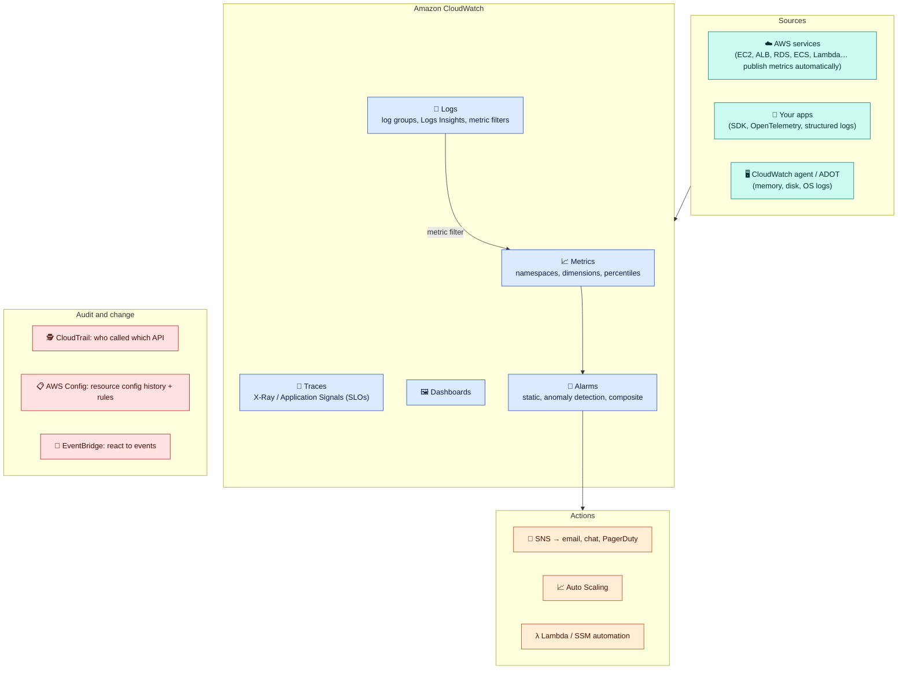

# Module 01 — The Observability Map & CloudWatch Metrics

← [All tutorials](../README.md) · **Observability** (short tutorial), module 1 of 3

> How to see what your AWS workloads are doing: metrics, logs, traces, alarms, and audit trails, which AWS service covers each, and the settings that keep costs sane.

*About a 20-minute read across 3 short modules, plus a 10-minute lab in Module 02.*

---

## 1. The map

| Question | Tool |
|---|---|
| Is it healthy and how loaded is it? | **CloudWatch Metrics** + **Alarms** + **Dashboards** |
| What exactly happened in my app? | **CloudWatch Logs** + **Logs Insights** |
| Which service in the request chain is slow or failing? | **X-Ray / Application Signals** (OpenTelemetry) |
| Who changed or deleted something? | **CloudTrail** |
| What did this resource look like last week? Is it compliant? | **AWS Config** |
| Does the site work from the user's point of view? | **CloudWatch Synthetics** (canaries), **RUM** |
| What does the network say? | VPC Flow Logs, Internet Monitor, Network Monitor ([Networking module 08](../networking/08-operate-and-review.md)) |

---

## 2. Metrics

- A metric = **namespace** (`AWS/EC2`) + **name** (`CPUUtilization`) + **dimensions** (`InstanceId=i-…`). Retrieve it with a **statistic** (Average, Sum, Max, **p99**) over a **period**.
- **Resolution:** standard 1-minute (many services). **EC2 basic monitoring is 5-minute**, so enable detailed monitoring for 1-minute. Custom metrics can be **high-resolution (1 s)**.
- **Retention:** 15 months, with older data rolled up to coarser periods.
- **Custom metrics:** `PutMetricData`, or better, the **Embedded Metric Format** (JSON logs that become metrics with no API calls). Watch **cardinality**: every unique dimension combination is a billed metric.
- **EC2 has no memory or disk-usage metrics by default.** Install the **CloudWatch agent**.

| Service | Metrics worth alarming on |
|---|---|
| ALB | `HTTPCode_Target_5XX_Count`, `TargetResponseTime` (p99), `UnHealthyHostCount` |
| EC2 / ECS | `CPUUtilization`, memory (agent / Container Insights), `StatusCheckFailed` |
| RDS / Aurora | `CPUUtilization`, `FreeStorageSpace`, `DatabaseConnections`, `ReplicaLag`, `FreeableMemory` |
| Lambda | `Errors`, `Throttles`, `Duration` (p99), `ConcurrentExecutions` |
| SQS | `ApproximateAgeOfOldestMessage`, `ApproximateNumberOfMessagesVisible` |
| NAT gateway | `ErrorPortAllocation`, `PacketsDropCount` |
| DynamoDB | `ThrottledRequests`, `SystemErrors` |

---
**Next:** [Module 02 — Logs, Alarms & Lab](02-logs-and-alarms.md)
