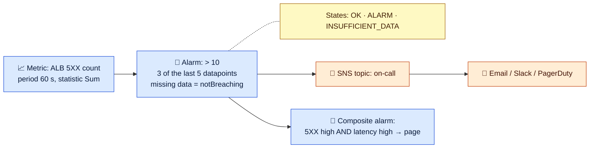

# Module 02 — Logs, Alarms & Lab

← [All tutorials](../README.md) · **Observability** (short tutorial), module 2 of 3

---

## 1. Logs

- **Log group** (per app/service, with **retention**) → **log streams** (per instance/task) → events.
- **Logs Insights** is a query language over your logs:

```sql
fields @timestamp, @message
| filter @message like /ERROR/
| stats count(*) as errors by bin(5m)
| sort errors desc
```

```sql
-- p95 latency from structured JSON logs
filter ispresent(latency_ms)
| stats pct(latency_ms, 95) as p95, count(*) as requests by route
| sort p95 desc
```

- **Metric filters** turn log patterns into metrics (e.g. count "ERROR"), and you can alarm on those.
- **Subscription filters** stream logs to Lambda, Firehose, or OpenSearch. **Live Tail** follows logs in real time.
- **Cost control:** set **retention** on every group (the default is never-expire), use the **Infrequent Access** log class for rarely queried logs, log **structured JSON**, and avoid debug-level logs in production.

## 2. Alarms



- **M of N datapoints** avoids flapping. Choose deliberately how **missing data** is treated.
- **Anomaly detection** alarms learn the normal band (good for traffic-shaped metrics). **Composite alarms** cut noise by combining conditions.
- Actions: SNS notifications, **Auto Scaling**, EC2 actions (recover/reboot), Systems Manager incidents.

## 3. Mini lab: logs → metric filter → alarm

```bash
LG=/lab/observability
aws logs create-log-group --log-group-name $LG
aws logs put-retention-policy --log-group-name $LG --retention-in-days 1
aws logs create-log-stream --log-group-name $LG --log-stream-name app-1

# Metric filter: count lines that contain ERROR
aws logs put-metric-filter --log-group-name $LG --filter-name errors --filter-pattern ERROR \
  --metric-transformations metricName=AppErrors,metricNamespace=Lab,metricValue=1,defaultValue=0

# Alarm: >= 3 errors within 1 minute
aws cloudwatch put-metric-alarm --alarm-name lab-app-errors --namespace Lab --metric-name AppErrors \
  --statistic Sum --period 60 --evaluation-periods 1 --threshold 3 --comparison-operator GreaterThanOrEqualToThreshold \
  --treat-missing-data notBreaching

# Emit some log events (timestamps in ms)
NOW=$(($(date +%s)*1000))
aws logs put-log-events --log-group-name $LG --log-stream-name app-1 --log-events \
  "[{\"timestamp\":$NOW,\"message\":\"INFO started\"},
    {\"timestamp\":$((NOW+1)),\"message\":\"ERROR db timeout\"},
    {\"timestamp\":$((NOW+2)),\"message\":\"ERROR db timeout\"},
    {\"timestamp\":$((NOW+3)),\"message\":\"ERROR db timeout\"}]" >/dev/null

# Query with Logs Insights
QID=$(aws logs start-query --log-group-name $LG --start-time $(($(date +%s)-900)) --end-time $(($(date +%s)+60)) \
  --query-string 'filter @message like /ERROR/ | stats count(*) as errors' --query queryId --output text)
sleep 5; aws logs get-query-results --query-id $QID --query 'results'

# Within ~1–3 minutes the alarm goes to ALARM
for i in $(seq 1 8); do aws cloudwatch describe-alarms --alarm-names lab-app-errors --query 'MetricAlarms[0].StateValue' --output text; sleep 30; done

# Cleanup
aws cloudwatch delete-alarms --alarm-names lab-app-errors
aws logs delete-log-group --log-group-name $LG
```

---
**Previous:** [Module 01](01-overview-and-metrics.md) · **Next:** [Module 03 — Traces & Audit: X-Ray, CloudTrail, Config](03-traces-and-audit.md)
