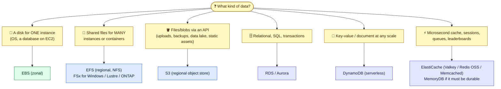

# Module 01 — Choosing the Right Store

← [All tutorials](../README.md) · **Storage & Databases** (short tutorial), module 1 of 3

> Which AWS storage service to use for which data, how each one is scoped (AZ vs Region), how it connects to your VPC, and the settings that matter.

*About a 25-minute read across 3 short modules, plus a 10-minute S3 lab in Module 02.*

---

## 1. Pick the right store

| Service | Scope | Access | Lives in your VPC? | Durability / HA | Pay for |
|---|---|---|---|---|---|
| **EBS** | **AZ** | Block device, one instance (io2 multi-attach is the exception) | Attached to an instance | Replicated within the AZ. **Snapshots** to S3 (regional) | Provisioned GB (+ IOPS/throughput) |
| **EFS** | Region (multi-AZ) or One Zone | NFS v4.1, thousands of clients | **Mount target ENI per AZ** | Multi-AZ | GB stored (+ throughput) |
| **S3** | Region | HTTPS API (GET/PUT) | No, reached via a **gateway/interface endpoint** or the internet | 11 nines durability, multi-AZ | GB stored + requests + egress |
| **RDS / Aurora** | Region, instances in AZs | SQL (5432/3306…) | **Yes**, a DB subnet group | Multi-AZ standby / Aurora 6 copies across 3 AZs | Instance-hours + storage + I/O |
| **ElastiCache** | Region, nodes in AZs | Redis/Valkey/Memcached protocol (6379/11211) | **Yes**, a subnet group | Replicas + Multi-AZ failover (Valkey/Redis) | Node-hours or serverless usage |
| **DynamoDB** | Region (global tables: multi-Region) | HTTPS API | No, reached via a **gateway endpoint** | Multi-AZ, PITR | On-demand requests or provisioned capacity + GB |

---
**Next:** [Module 02 — Block, File & Object: EBS, EFS, S3](02-ebs-efs-s3.md)
