# Module 01 — Storage Basics & Amazon S3

← [All tutorials](../README.md) · **Storage tutorial**, module 1 of 3

An application stores many kinds of data: the server's own disk, files users upload, orders in a database, sessions in a fast cache. AWS has a different service for each kind, and they differ in **how you access them** (a disk, a network file share, an API, a database protocol) and **where they live** (one Availability Zone or a whole Region). This tutorial explains the main ones, using the `shop` web application as the example:

- **01:** choosing the right store, and **Amazon S3** for files and objects
- **02:** disks for servers: **EBS** (block storage) and **EFS** (shared file system)
- **03:** databases and caches: **RDS/Aurora**, **ElastiCache**, **DynamoDB**

---

## 1. Which store for which data

| `shop` needs to store… | Kind of storage | Service | How the app accesses it |
|---|---|---|---|
| The server's operating system and local working files | **Block** (a disk) | **EBS** | As a disk device on **one** EC2 instance |
| Uploaded files that **several servers** must read and write as normal files | **File** (shared folder) | **EFS** | Mounted over the network (NFS), like a network drive |
| Product images, invoices, backups, logs, static website files | **Object** | **S3** | HTTPS API (`PUT`/`GET` an object by its key) |
| Orders, customers, payments: related data and transactions | **Relational database** | **RDS / Aurora** | SQL over the network (PostgreSQL, MySQL…) |
| Shopping carts, sessions, very high-volume key lookups | **Key-value / document** | **DynamoDB** | HTTPS API |
| Cached pages and query results, rate limits, leaderboards | **In-memory** | **ElastiCache** (Valkey / Redis OSS / Memcached) | Redis or Memcached protocol |

Here's where each one lives relative to your network ([Networking tutorial](../networking/01-regions-azs-and-vpcs.md)):

```mermaid
%%{init: {"flowchart": {"wrappingWidth": 300}}}%%
flowchart TB
    classDef compute fill:#ccfbf1,stroke:#0f766e,color:#042f2e
    classDef zonal fill:#dcfce7,stroke:#15803d,color:#052e16
    classDef db fill:#e0e7ff,stroke:#4338ca,color:#1e1b4b
    classDef regional fill:#dbeafe,stroke:#1d4ed8,color:#0b1b3a
    classDef gw fill:#ffedd5,stroke:#c2410c,color:#431407

    subgraph VPC["☁️ VPC"]
        subgraph AZA["🅰️ AZ a"]
            EBSA["💽 EBS volume<br/>zonal: attaches to ONE instance in this AZ"]:::zonal
            subgraph APPA["🟦 app subnet a"]
                EC2A["🖥️ EC2 instance / 🧩 container"]:::compute
                MTA["📁 EFS mount target<br/>(network interface, NFS port 2049)"]:::zonal
            end
            subgraph DATAA["🟦 data subnet a"]
                RDSA["🗄️ RDS / Aurora primary (writer)"]:::db
                ECA["⚡ ElastiCache primary node"]:::db
            end
        end
        subgraph AZB["🅱️ AZ b"]
            EBSB["💽 EBS volume"]:::zonal
            subgraph APPB["🟦 app subnet b"]
                EC2B["🖥️ EC2 instance / 🧩 container"]:::compute
                MTB["📁 EFS mount target"]:::zonal
            end
            subgraph DATAB["🟦 data subnet b"]
                RDSB["🗄️ Standby / reader<br/>(copy of the primary)"]:::db
                ECB["⚡ ElastiCache replica"]:::db
            end
        end
        GWE["🛣️ Gateway endpoints<br/>(free private route to S3 and DynamoDB)"]:::gw
    end
    EFS["📁 EFS file system<br/>regional: data stored across AZs"]:::regional
    S3["🪣 S3 bucket<br/>regional, HTTPS API"]:::regional
    DDB["🗃️ DynamoDB table<br/>regional, HTTPS API"]:::regional
    SNAP["📸 EBS snapshots<br/>regional backups of volumes"]:::regional

    EC2A --- EBSA
    EC2B --- EBSB
    EC2A --> MTA
    EC2B --> MTB
    MTA --> EFS
    MTB --> EFS
    EC2A -->|"SQL 5432"| RDSA
    EC2A -->|"6379"| ECA
    EC2B -->|"reads"| RDSB
    EC2B --> ECB
    EC2A --> GWE
    EC2B --> GWE
    GWE --> S3
    GWE --> DDB
    EBSA -.->|"snapshot"| SNAP
```



**How to read it:**
- **EBS** is attached to **one** instance, and **in its AZ only**. It's a disk, not a network share. Its backups (**snapshots**) are regional, so you can restore them in any AZ.
- **EFS** is a regional file system. Servers in every AZ mount it through a **mount target** (a network interface) in their own AZ's subnet.
- **RDS/Aurora** and **ElastiCache** run **inside your VPC**, in subnets you choose, protected by security groups. Their copy in a second AZ takes over if the first AZ fails.
- **S3** and **DynamoDB** are regional services reached by **API**. From private subnets, use the free **gateway endpoints** ([Networking 06](../networking/06-private-access-and-dns.md)).

---

## 2. Amazon S3: storing objects

### The concepts

- A **bucket** is a container for objects. Its name is **globally unique** (across all AWS accounts), and its data lives in **one Region** you choose.
- An **object** is a file plus metadata, up to 5 TB, identified by its **key**: the full "path", like `uploads/2025/10/logo.png`.
- **There are no real folders.** `uploads/2025/` is just a shared **prefix** of keys, and the console shows prefixes as folders.
- You work with objects through an HTTPS **API**: `PutObject`, `GetObject`, `ListObjectsV2`, `DeleteObject`. The CLI (`aws s3 cp`, `aws s3 ls`) and every SDK use that API.
- Data is stored redundantly across AZs and designed for **99.999999999% durability**. After a successful write, every following read returns the new data.

### Security defaults (new buckets)

- **Block Public Access is on.** Nothing in the bucket can be made public by accident.
- **Encryption at rest is on** (SSE-S3). For stricter key control, use your own KMS key (SSE-KMS).
- **Object ownership: bucket owner enforced.** Old-style per-object ACLs are disabled, and access is controlled only with IAM policies and the **bucket policy** ([how to read and write them: IAM 03](../iam/03-policies-in-detail.md)).
- To give someone **temporary** access to one private object, such as a download link in an email, create a **presigned URL**. It carries a signature and expires.

### Storage classes: pay for how often you read

| Class | For data that is… | Notes |
|---|---|---|
| **S3 Standard** | Read often | The default |
| **S3 Intelligent-Tiering** | Read unpredictably | Moves objects between tiers automatically. **A good default when unsure** |
| **Standard-IA / One Zone-IA** | Rarely read, but needed quickly | Cheaper storage, plus a fee per read. One Zone keeps a single AZ copy |
| **Glacier Instant / Flexible / Deep Archive** | Archives | Cheapest storage. Retrieval takes milliseconds (Instant) up to hours (Deep Archive) |

A **lifecycle rule** moves objects between classes, or deletes them, by age: "move `logs/` to Glacier after 30 days, delete after 1 year".

### Other features you'll use

- **Versioning** keeps every version of every object, so an overwrite or delete can be undone. Pair it with a lifecycle rule that expires old versions.
- **Event notifications** run something when objects change, e.g. "a new image in `uploads/` → invoke a Lambda function that creates a thumbnail".
- **Replication** copies objects to another bucket, in another Region (disaster recovery) or another account.
- **Static website hosting** works, but in production, put **CloudFront** (AWS's CDN) in front of a private bucket.

---

## 3. Try it: versioning, lifecycle, presigned URLs

```bash
BUCKET=lab-storage-$(aws sts get-caller-identity --query Account --output text)-$RANDOM
REGION=${AWS_REGION:-$(aws configure get region)}
aws s3 mb s3://$BUCKET --region $REGION
aws s3api put-bucket-versioning --bucket $BUCKET --versioning-configuration Status=Enabled

# Upload two versions of the same key
echo "v1" > /tmp/hello.txt && aws s3 cp /tmp/hello.txt s3://$BUCKET/uploads/hello.txt
echo "v2" > /tmp/hello.txt && aws s3 cp /tmp/hello.txt s3://$BUCKET/uploads/hello.txt
aws s3api list-object-versions --bucket $BUCKET --prefix uploads/ --query 'Versions[].[Key,VersionId,IsLatest]' --output table

# A lifecycle rule: Intelligent-Tiering after 30 days, old versions deleted after 7 days
aws s3api put-bucket-lifecycle-configuration --bucket $BUCKET --lifecycle-configuration '{"Rules":[{"ID":"tiering","Status":"Enabled","Filter":{},
  "Transitions":[{"Days":30,"StorageClass":"INTELLIGENT_TIERING"}],"NoncurrentVersionExpiration":{"NoncurrentDays":7}}]}'

# The bucket is private: a plain request is refused...
curl -s -o /dev/null -w "without signature: HTTP %{http_code}\n" https://$BUCKET.s3.$REGION.amazonaws.com/uploads/hello.txt   # 403
# ...but a presigned URL works for 5 minutes
curl -s "$(aws s3 presign s3://$BUCKET/uploads/hello.txt --expires-in 300)"                                                   # v2
```

Clean up. A versioned bucket must have **every version** deleted before the bucket itself can be removed:

```bash
aws s3api delete-objects --bucket $BUCKET --delete "$(aws s3api list-object-versions --bucket $BUCKET \
  --query '{Objects: Versions[].{Key:Key,VersionId:VersionId}}' --output json)" >/dev/null
aws s3 rb s3://$BUCKET && rm -f /tmp/hello.txt
```

---

## Check yourself

<details><summary>Is `uploads/2025/` a folder in S3?</summary>No. It's a prefix shared by object keys. S3 has no real folders.</details>
<details><summary>How do you let a customer download one private file for 10 minutes?</summary>A presigned URL with a 10-minute expiry.</details>
<details><summary>You don't know how often objects will be read. Which storage class?</summary>S3 Intelligent-Tiering.</details>
<details><summary>Private servers move terabytes to S3 through a NAT gateway. What's cheaper?</summary>An S3 gateway endpoint: free, and the traffic never touches the NAT.</details>

---
**Next:** [Module 02 — Disks for Servers: EBS & EFS](02-ebs-and-efs.md)
