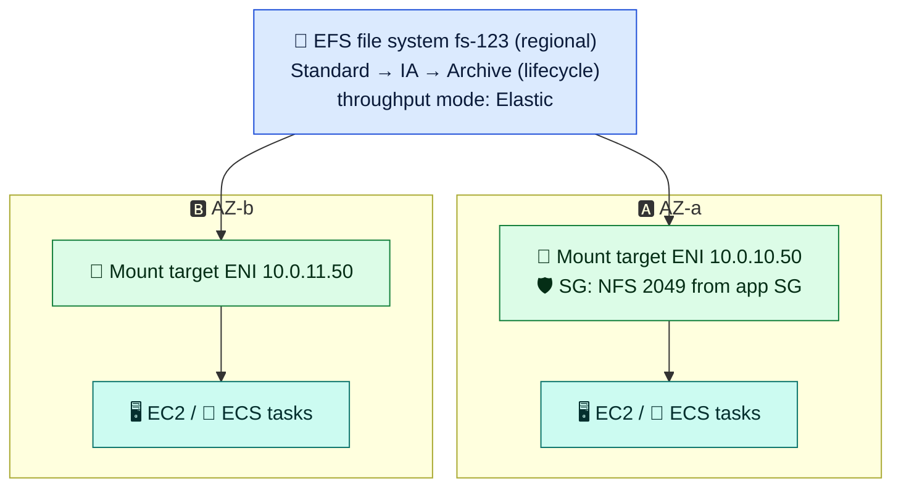

# Module 02 — Block, File & Object: EBS, EFS, S3

← [All tutorials](../README.md) · **Storage & Databases** (short tutorial), module 2 of 3

---

## 1. EBS: block storage for EC2 (and ECS tasks)

- **Zonal:** a volume attaches only to instances **in the same AZ**. To move it, snapshot it and restore in another AZ or Region.
- **Types:** **gp3** (default, baseline 3,000 IOPS / 125 MB/s, tunable independently of size), **io2 Block Express** (high IOPS, low latency, critical databases), **st1/sc1** (HDD throughput / cold).
- **Snapshots:** incremental, stored regionally. Automate them with **Data Lifecycle Manager** or **AWS Backup**.
- **Encryption** (KMS) at rest and in transit. Turn on **encryption by default** per Region.
- You can resize or change the type **online** (Elastic Volumes), then grow the filesystem.
- Instance store = ephemeral NVMe on the host. It's lost on stop, so it's not EBS.

## 2. EFS: shared file system



- Create **one mount target per AZ**, so clients mount through their own AZ's target (`fs-123.efs.REGION.amazonaws.com` resolves per AZ).
- **Access points** enforce a root directory and POSIX user per application. Combine them with IAM authorization.
- Great for shared content, CMS uploads, and ML datasets. **Not** for databases or very latency-sensitive workloads (use EBS).

## 3. S3: object storage

- Store **objects** (up to 5 TB) in **buckets** (globally unique names, regional data). There's **strong read-after-write consistency**.
- **Security defaults:** Block Public Access **on**, SSE-S3 encryption **on**, ACLs disabled (bucket owner enforced). Grant access with IAM + **bucket policies**. Share temporarily with **presigned URLs**.
- **Storage classes:** Standard → **Intelligent-Tiering** (auto, a good default for unknown patterns) → Standard-IA / One Zone-IA → **Glacier** Instant / Flexible / Deep Archive. **Lifecycle rules** move or expire objects. **S3 Express One Zone** gives single-digit-millisecond access.
- **Versioning** (undo deletes/overwrites), **Object Lock** (WORM), **replication** (CRR/SRR), **event notifications** (to Lambda/SQS/EventBridge).
- From private subnets: the **gateway endpoint** (free, Networking module 06). Avoid pulling S3 through a NAT gateway.

## 4. Mini lab: S3 versioning, lifecycle, presigned URL

```bash
BUCKET=lab-storage-$(aws sts get-caller-identity --query Account --output text)-$RANDOM
aws s3 mb s3://$BUCKET
aws s3api put-bucket-versioning --bucket $BUCKET --versioning-configuration Status=Enabled

echo "v1" > /tmp/hello.txt && aws s3 cp /tmp/hello.txt s3://$BUCKET/hello.txt
echo "v2" > /tmp/hello.txt && aws s3 cp /tmp/hello.txt s3://$BUCKET/hello.txt
aws s3api list-object-versions --bucket $BUCKET --prefix hello.txt --query 'Versions[].[VersionId,IsLatest]' --output table

# Lifecycle: move to Intelligent-Tiering after 30 days, delete old versions after 7 days
aws s3api put-bucket-lifecycle-configuration --bucket $BUCKET --lifecycle-configuration '{"Rules":[{"ID":"tiering","Status":"Enabled","Filter":{},
  "Transitions":[{"Days":30,"StorageClass":"INTELLIGENT_TIERING"}],"NoncurrentVersionExpiration":{"NoncurrentDays":7}}]}'

# Presigned URL: temporary public access to a private object (5 minutes)
URL=$(aws s3 presign s3://$BUCKET/hello.txt --expires-in 300); curl -s "$URL"          # -> v2
REGION=${AWS_REGION:-$(aws configure get region)}
curl -s -o /dev/null -w "direct access without signature: %{http_code}\n" https://$BUCKET.s3.$REGION.amazonaws.com/hello.txt   # 403

# Cleanup: delete all versions, then the bucket
aws s3api delete-objects --bucket $BUCKET --delete "$(aws s3api list-object-versions --bucket $BUCKET \
  --query '{Objects: Versions[].{Key:Key,VersionId:VersionId}}' --output json)" >/dev/null
aws s3 rb s3://$BUCKET && rm -f /tmp/hello.txt
```

---
**Previous:** [Module 01](01-choosing-storage.md) · **Next:** [Module 03 — Databases & Caches: RDS/Aurora, ElastiCache, DynamoDB](03-databases-and-caches.md)
