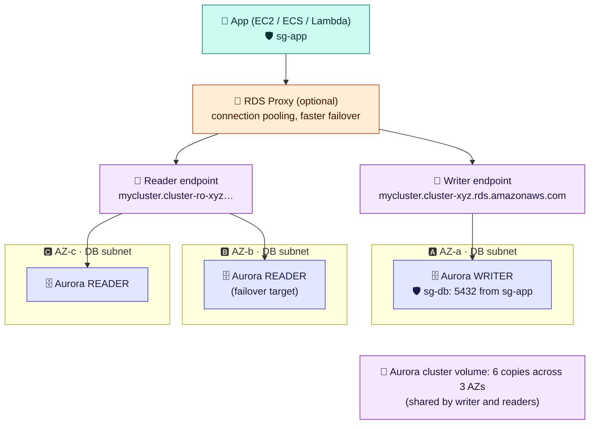

# Module 03 — Databases & Caches: RDS/Aurora, ElastiCache, DynamoDB

← [All tutorials](../README.md) · **Storage & Databases** (short tutorial), module 3 of 3

---

## 1. RDS & Aurora: managed relational databases

| Feature | RDS (MySQL, PostgreSQL, MariaDB, Oracle, SQL Server, Db2) | Aurora (MySQL / PostgreSQL compatible) |
|---|---|---|
| HA | **Multi-AZ**: synchronous standby, automatic failover (DNS flips, ~1–2 minutes). Or a Multi-AZ *cluster* with 2 readable standbys | Readers in other AZs are failover targets (typically < 30 s). Shared storage |
| Read scaling | Up to 15 read replicas (async) | Up to 15 readers on the same storage. Low replica lag |
| Serverless | — | **Aurora Serverless v2** (scales in fine-grained ACUs) |
| Global | Cross-Region read replicas | **Aurora Global Database** (~1 s replication) |

**Always:** use a **DB subnet group** of private subnets in 2+ AZs; SG `sg-db` allows the port **from `sg-app` only**; store credentials in **Secrets Manager** (managed rotation) or use **IAM auth**; turn on automated backups (point-in-time restore), deletion protection, Performance Insights / Database Insights. Connect through **endpoints, never instance IPs**.

## 2. ElastiCache (and MemoryDB)

- Managed in-memory engines: **Valkey** (open-source Redis fork, AWS's recommended default), **Redis OSS**, **Memcached**. Choose **serverless** (no sizing) or node-based clusters.
- Valkey/Redis: **cluster mode** (sharding) + **replicas** + **Multi-AZ automatic failover**. Memcached: simple, multi-threaded, no replication.
- VPC-only: a subnet group plus SG port **6379** from the app SG. Enable in-transit TLS and AUTH/RBAC.
- Patterns: **cache-aside** (read the cache, on a miss read the DB and populate with a TTL), session store, rate limiting, leaderboards (sorted sets), pub/sub.
- Needs **durability** (cache as the primary database)? Use **MemoryDB** (Multi-AZ transaction log).

## 3. DynamoDB in one paragraph

A serverless key-value/document database with single-digit-millisecond latency at any scale. You design around **access patterns**: a **partition key** (+ optional sort key) and **GSIs** for other queries. Use **on-demand** capacity (pay per request) or provisioned capacity with auto scaling. **TTL**, **Streams** (change data capture to Lambda), **PITR** backups, and **global tables** (multi-Region active-active). Reach it privately via the free **gateway endpoint**.

---

## Check yourself

Ten containers in two AZs need the same files. EBS or EFS?
EFS. EBS is one AZ, one instance.

How do private instances reach S3 without NAT costs?
An S3 gateway endpoint (free) on their route tables.

RDS Multi-AZ vs a read replica?
Multi-AZ is a synchronous standby for HA (not readable in the classic form). A read replica is asynchronous, readable, and used for read scaling.

When should you use MemoryDB instead of ElastiCache?
When the in-memory store is your primary database and must not lose data.

---
**Previous:** [Module 02](02-ebs-efs-s3.md) · **Back to:** [All tutorials](../README.md)
