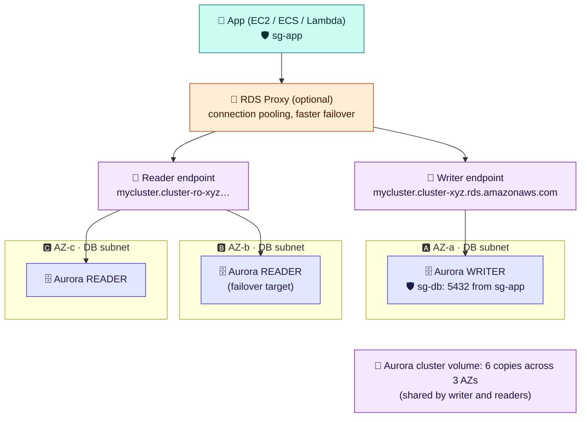

# Module 03 — Databases & Caches: RDS/Aurora, ElastiCache, DynamoDB

← [All tutorials](../README.md) · **Storage tutorial**, module 3 of 3

You could install PostgreSQL or Redis on an EC2 instance yourself. Then you'd also own the patching, backups, replication, failover, and disk management. AWS's **managed databases** do that work for you: you choose the engine and size, and connect. This module covers the three you'll meet most: **RDS/Aurora** (relational), **ElastiCache** (in-memory cache), and **DynamoDB** (key-value at any scale).

---

## 1. RDS and Aurora: managed relational databases

**Amazon RDS** runs a relational database engine for you: **PostgreSQL, MySQL, MariaDB, Oracle, SQL Server, or Db2**. **Amazon Aurora** is AWS's own engine, compatible with PostgreSQL and MySQL, with a storage layer designed for faster failover and replication. Either way, your application connects with the normal database driver and SQL. Only the hostname changes.

### What you create, and what each piece means

```bash
aws rds create-db-subnet-group --db-subnet-group-name shop-db-subnets \
  --db-subnet-group-description "data subnets" --subnet-ids subnet-dataA subnet-dataB

aws rds create-db-instance --db-instance-identifier shop-db \
  --engine postgres --engine-version 16.4 --db-instance-class db.t4g.medium \
  --allocated-storage 50 --storage-type gp3 --storage-encrypted \
  --master-username shop_admin --manage-master-user-password \
  --db-subnet-group-name shop-db-subnets --vpc-security-group-ids sg-db --no-publicly-accessible \
  --multi-az --backup-retention-period 7 --deletion-protection
```

| Option | Meaning |
|---|---|
| **DB subnet group** | The subnets (in **2+ AZs**) the database may use: your private **data** subnets ([Networking 02](../networking/02-subnets-routing-and-internet-access.md)) |
| `--engine`, `--engine-version` | Which database software and version. AWS applies minor patches in a weekly **maintenance window** |
| `--db-instance-class` | The size (CPU and memory) of the server running the database |
| `--allocated-storage`, `--storage-type`, `--storage-encrypted` | Disk size and type (EBS underneath, Module 02), encrypted with KMS |
| `--manage-master-user-password` | AWS generates the admin password and stores it in **Secrets Manager**, rotating it automatically. Your app reads it from there |
| `--vpc-security-group-ids sg-db`, `--no-publicly-accessible` | The firewall: `sg-db` allows the database port (5432) **only from the app's security group** ([Networking 03](../networking/03-security-groups-and-nacls.md)). No public address |
| **`--multi-az`** | Keeps a **synchronous standby copy** in another AZ. If the primary fails, RDS switches to the standby automatically, usually within one to two minutes |
| `--backup-retention-period 7` | Daily automated backups plus transaction logs, so you can **restore to any second** of the last 7 days |
| `--deletion-protection` | The database can't be deleted until this is turned off |

Your app connects to the **endpoint**, a DNS name like `shop-db.abc123.eu-central-1.rds.amazonaws.com:5432`, **never to an IP**. During a failover, the name starts pointing to the new primary.

### High availability vs read scaling

| Feature | What it does | Can your app read from it? |
|---|---|---|
| **Multi-AZ standby** | A synchronous copy in another AZ for **automatic failover** | No (it's a hot spare) |
| **Read replica** | An **asynchronous** copy for **spreading read traffic**, even in another Region | Yes, through its own endpoint |
| **Multi-AZ DB cluster** (RDS option) | A primary plus **two readable** standbys | Yes |

### Aurora



**How to read it:** in Aurora, the **writer** and the **readers** are compute nodes in different AZs, and they all use **one shared cluster volume** that keeps six copies of your data across three AZs. Because the data is already everywhere, a reader can become the writer in typically **under 30 seconds**, and replicas lag only milliseconds behind. The app uses two DNS names: the **writer endpoint** for writes, and the **reader endpoint**, which spreads reads across all readers. **RDS Proxy** (optional) pools database connections. It helps a lot with Lambda functions or many containers that each open connections.

Other Aurora options: **Serverless v2** scales capacity up and down in small steps with load, which is great for spiky or dev workloads. **Global Database** replicates to other Regions with about one second of lag.

**Rule of thumb:** use RDS for standard needs, licensed engines (Oracle, SQL Server), or the lowest cost. Use Aurora for demanding PostgreSQL/MySQL workloads that need fast failover, many readers, or serverless scaling.

---

## 2. ElastiCache: an in-memory cache

Reading from memory takes **microseconds**. A database query takes milliseconds. **ElastiCache** runs an in-memory data store for you: **Valkey** (the open-source continuation of Redis, AWS's recommended default), **Redis OSS**, or **Memcached**.

The most common pattern is **cache-aside**:

```python
def get_product(product_id):
    cached = cache.get(f"product:{product_id}")
    if cached:                                   # 1. try the cache first
        return json.loads(cached)
    product = db.query("SELECT * FROM products WHERE id = %s", product_id)   # 2. on a miss, ask the database
    cache.set(f"product:{product_id}", json.dumps(product), ex=300)         # 3. store it for 5 minutes (TTL)
    return product
```

Every value gets a **TTL** (time to live), so stale data expires by itself. Other common uses: **user sessions**, **rate limiting** (counters that expire), **leaderboards** (Redis/Valkey sorted sets), and queues and pub/sub.

What to know:
- It runs **inside your VPC** (a cache subnet group plus a security group allowing **6379** from the app). It's never exposed to the internet. Turn on encryption in transit and authentication.
- **Serverless** (no sizing, scales automatically) or **node-based** clusters. Valkey/Redis supports **replicas** with **automatic Multi-AZ failover**, and **cluster mode** to split data across shards.
- **A cache isn't a database.** Data in memory can be lost, so the source of truth stays in RDS or DynamoDB. If you need Redis-compatible storage that **is** durable, use **Amazon MemoryDB**.

---

## 3. DynamoDB: key-value at any scale

**DynamoDB** is a serverless database. There are no servers or sizes. You create a **table**, then read and write **items** through an API, with single-digit-millisecond latency at any scale. It's regional and replicated across AZs automatically.

The concepts:
- An **item** is a record: a set of attributes (like a JSON object), up to 400 KB.
- Every item has a **primary key**:
  - a **partition key** (required), e.g. `userId`. It decides where the item is stored and is how you look it up;
  - an optional **sort key**, e.g. `productId`. Items with the same partition key are stored together, sorted by it, so you can **query** "all items of user 42".
- **You design the table around your queries.** DynamoDB has no joins and no free-form `WHERE`. Ask yourself first: "What exactly will I look up?" For other lookups, add a **global secondary index (GSI)**, which is the same data under a different key.
- **Capacity:** **on-demand** (pay per request, nothing to plan: start here) or **provisioned** (set reads and writes per second, with auto scaling, cheaper at steady load).
- Useful features: **TTL** (items expire automatically), **Streams** (react to every change, e.g. with Lambda), **point-in-time recovery**, and **global tables** (multi-Region, every Region writable).

**Example: shopping carts.** Partition key `userId`, sort key `productId`. "Add to cart" is a `PutItem`, "show the cart" is one `Query` on `userId`, and a TTL removes abandoned carts after 30 days.

| Choose… | When |
|---|---|
| **RDS / Aurora** | Relational data, transactions across tables, ad-hoc SQL and reporting |
| **DynamoDB** | Known access patterns, huge or unpredictable scale, serverless apps, simple key lookups |
| **ElastiCache** | Speeding up reads in front of either, sessions, counters (not as the source of truth) |

---

## 4. Try it: a DynamoDB shopping cart (pay per request, costs fractions of a cent)

```bash
aws dynamodb create-table --table-name lab-carts \
  --attribute-definitions AttributeName=userId,AttributeType=S AttributeName=productId,AttributeType=S \
  --key-schema AttributeName=userId,KeyType=HASH AttributeName=productId,KeyType=RANGE \
  --billing-mode PAY_PER_REQUEST >/dev/null
aws dynamodb wait table-exists --table-name lab-carts

# Add items to two users' carts
put() { aws dynamodb put-item --table-name lab-carts --item \
  "{\"userId\":{\"S\":\"$1\"},\"productId\":{\"S\":\"$2\"},\"qty\":{\"N\":\"$3\"}}"; }
put user-42 book-17 1;  put user-42 mug-03 2;  put user-77 book-17 5

# "Show the cart of user-42": ONE query on the partition key
aws dynamodb query --table-name lab-carts --key-condition-expression "userId = :u" \
  --expression-attribute-values '{":u":{"S":"user-42"}}' --query 'Items[].[productId.S,qty.N]' --output table

# Exactly one item, by its full key
aws dynamodb get-item --table-name lab-carts --key '{"userId":{"S":"user-42"},"productId":{"S":"mug-03"}}' --query 'Item.qty.N'

# Note what you CAN'T do efficiently: "which users have book-17?" There's no key for that.
# It would need a scan (reads the whole table) or a GSI with productId as its key.

aws dynamodb delete-table --table-name lab-carts >/dev/null
```

---

## Check yourself

<details><summary>Multi-AZ standby or read replica: which one helps when an AZ fails, and which helps with heavy read traffic?</summary>The Multi-AZ standby, with automatic failover, for AZ failure. Read replicas, which are readable through their own endpoints, for read traffic.</details>
<details><summary>Why connect to the RDS endpoint name instead of its IP?</summary>The endpoint name follows the primary during a failover. The IP doesn't.</details>
<details><summary>Should a cache be your only copy of shopping cart data?</summary>No. A cache can lose data. Keep the source of truth in a database (or use MemoryDB, which is durable).</details>
<details><summary>In DynamoDB, what decides how you can query a table?</summary>The primary key (partition key + sort key) and any secondary indexes. Design them from your access patterns.</details>

---
**Previous:** [Module 02](02-ebs-and-efs.md) · **Next tutorial:** [Amazon ECS](../ecs/01-what-ecs-is-and-your-first-task.md)
